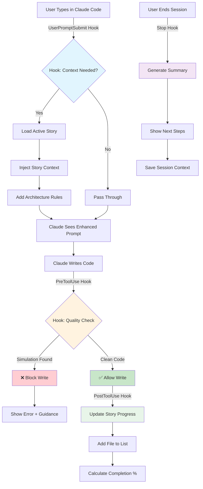

# BMAD Method Enhancements

## 🚀 Available Enhancement: Claude Code Hooks Integration

📖 **[Detailed Documentation](tools/claude-code-hooks/README.md)** | 🔮 **[Future Possibilities](HookPossibilities.md)**

### What It Does
Automates BMAD quality enforcement for Claude Code CLI users through native hooks - no more manual commands for quality checks, context loading, or progress tracking.

**But more importantly:** PR0 creates an extensible platform for future enhancements without modifying core BMAD files. See [30+ possibilities](HookPossibilities.md) that become available once this foundation is in place.

### Installation (Manual - for now)
```bash
# From the BMAD-Method source directory (where you cloned/downloaded BMAD):
cd /path/to/BMAD-METHOD-main
npm run install:claude-hooks -- --project-dir /path/to/your/project

# Example:
# cd C:\Projects\BMAD-Method\src\BMAD-METHOD-main
# npm run install:claude-hooks -- --project-dir C:\Projects\HelloWorld
```
*Note: Future PR will add this to the installer menu*

### Key Benefits
- **80% fewer manual commands** - Quality checks run automatically
- **Zero-friction validation** - Blocks simulation patterns before writing
- **Automatic progress tracking** - Story files update themselves
- **Smart context loading** - Always have the right context
- **Session summaries** - Know what you accomplished and what's next

### Impact on Other IDEs
**None.** This enhancement is Claude Code specific and requires explicit opt-in.

### Configuration Options

Users can customize hook behavior through `.claude/bmad-config.json` in their project directory:

```json
{
  "enabled": true,
  "preset": "balanced",  // strict | balanced | relaxed
  "hooks": {
    "userPromptSubmit": {
      "enabled": true,
      "autoLoadStory": true,
      "contextDepth": "current"  // current | full | minimal
    },
    "preToolUse": {
      "enabled": true,
      "blockSimulation": true,
      "requireTests": false,
      "maxRetries": 3
    },
    "postToolUse": {
      "enabled": true,
      "updateProgress": true,
      "trackFiles": true
    },
    "stop": {
      "enabled": true,
      "generateSummary": true,
      "saveContext": true
    }
  },
  "performance": {
    "cacheTimeout": 300000,  // 5 minutes
    "maxTokens": 4000,
    "alertThreshold": 500  // ms
  }
}
```

#### Preset Modes
- **Strict**: Maximum quality enforcement, all checks enabled
- **Balanced**: Smart defaults, non-intrusive quality checks (default)
- **Relaxed**: Minimal intervention, only critical validations

#### Runtime Control Commands
- `*hooks-disable` - Temporarily disable all hooks
- `*hooks-enable` - Re-enable hooks
- `*hooks-status` - Show current hook configuration
- `*hooks-preset strict|balanced|relaxed` - Switch preset mode

#### File-Level Overrides
Create `.bmad-hooks-ignore` in any directory to skip hook processing:
```
# Skip all hooks for experimental code
**/*-experimental.*

# Skip validation for third-party code
vendor/**
```

### How It Works



### How BMAD Leverages Claude Code Hooks

The hooks integrate seamlessly with BMAD's quality framework:

1. **Story Context Auto-Loading**: When you run `/dev` or start coding, the hook automatically loads your current story's requirements, acceptance criteria, and technical notes

2. **Reality Enforcement**: Before any file write, the hook validates against BMAD's reality standards - no mocks, stubs, or placeholder code allowed

3. **Progress Tracking**: As you complete tasks, the hook updates your story file's task list and progress percentage automatically

4. **Quality Scoring**: Each code change triggers lightweight quality checks, maintaining your A-F grade throughout development

5. **Handoff Preparation**: When switching between Dev/QA/PM agents, the Stop hook creates a handoff summary with context for the next agent

### Demo 5: Automatic Story Context Loading

**Scenario**: Developer starts work on a story using BMAD's `/dev` agent

**Prerequisites**:
- Story file must have `Status: Ready for Development`
- Dev agent must be assigned in story metadata

```markdown
# Without PR0:
You: /dev
You: *develop-story docs/stories/TASK-001-Create-Task.md
[Dev agent manually loads and reads the story file]
[You have to wait and provide context]

# With PR0:
You: /dev
You: *develop-story docs/stories/TASK-001-Create-Task.md
[PR0's UserPromptSubmit hook automatically detects the story command]
[Story context is pre-loaded before the agent even responds]
[Dev agent immediately has full context: requirements, acceptance criteria, technical notes]
[No manual context loading needed!]

# Even Better - Direct Story Development:
You: Implement the create task endpoint from TASK-001
[PR0 detects you're talking about a story]
[Automatically loads TASK-001 context]
[Dev agent has everything needed without any commands]
```

**Key Benefits**:
- Zero manual story loading
- Instant context awareness
- No forgotten requirements
- Seamless workflow

---

## 🔮 Coming Soon: Quality Framework Enhancements

Each enhancement builds upon PR0's foundation, creating an increasingly powerful quality engineering platform. Here's how they interconnect:

### PR1: Reality Enforcement & Audit System
**What:** 10-phase comprehensive quality validation with A-F scoring  
**Benefit:** Objective code quality measurement, zero simulation patterns in production  
**Builds on PR0:** Uses PR0's PreToolUse hook to trigger reality audits before writes

### PR2: Automatic Remediation Execution
**What:** Zero-touch fix story generation when issues detected  
**Benefit:** No manual commands to fix issues - solutions delivered ready-to-implement  
**Builds on PR0:** Leverages PR0's quality detection to automatically generate fix stories

### PR3: Loop Detection & Escalation
**What:** Automatic detection of debugging loops with external LLM collaboration  
**Benefit:** Never waste 60+ minutes stuck - get help from Gemini/GPT-4 automatically  
**Builds on PR0:** Monitors PR0's retry patterns to detect when you're stuck

### PR4: Dual-Track Progress Updates
**What:** Synchronized story file and TodoWrite updates  
**Benefit:** Never lose track of progress - dual accountability system  
**Builds on PR0:** Extends PR0's PostToolUse hook to sync TodoWrite with story checkboxes

**PR4 Example:** 
```
Without PR0+PR4:
- Developer updates TodoWrite: ✓ Create authentication endpoint
- Story file shows: ☐ Create authentication endpoint (out of sync!)
- Progress confusion and manual updates needed

With PR0+PR4:
- Developer updates TodoWrite: ✓ Create authentication endpoint
- PR0's PostToolUse hook triggers → PR4 syncs automatically
- Story file updates: ✓ Create authentication endpoint
- Both systems show accurate progress in real-time
```

### PR5: Role-Optimized LLM Settings
**What:** Each agent tuned with optimal temperature/creativity settings  
**Benefit:** Better code from Dev, better analysis from QA, better ideas from Analyst  
**Builds on PR0:** PR0's UserPromptSubmit hook detects agent role and applies settings

### PR6: IDE Environment Detection
**What:** Auto-adapt to Cursor, Windsurf, Cline, and 8+ IDEs  
**Benefit:** Native tool usage per IDE - fewer approval prompts  
**Builds on PR0:** Enhances PR0's hook system to use IDE-specific commands

### PR7: Collaborative Workspace System
**What:** Multi-agent coordination across Claude Code sessions  
**Benefit:** True AI team collaboration - Dev, QA, and PM working in parallel  
**Builds on PR0:** Uses PR0's Stop hook to prepare handoffs between agents

### PR8: Full Claude Code CLI Integration
**What:** Session management, maintenance tools, analytics  
**Benefit:** Enterprise-grade Claude Code workspace experience  
**Builds on PR0:** Provides CLI commands to manage PR0-7's features

### PR9: Sub-Agent Integration (Claude Code Exclusive)
**What:** Parallel task execution using Claude Code's sub-agent capabilities  
**Benefit:** 40-60% performance improvement through concurrent task processing  
**Builds on PR0 & PR7:** Uses PR0's hooks for orchestration and PR7's workspace for efficient context sharing between sub-agents

**PR9 Example:**
```
Without PR9 (Sequential):
- Reality audit Phase 1: Scan JavaScript files (15s)
- Reality audit Phase 2: Scan Python files (12s)
- Reality audit Phase 3: Check build systems (8s)
- Reality audit Phase 4: Validate tests (10s)
Total time: 45 seconds

With PR9 (Parallel Sub-Agents):
- Main agent coordinates 4 sub-agents simultaneously
- Sub-agent 1: JavaScript scan ──┐
- Sub-agent 2: Python scan ─────├─ All run in parallel (15s max)
- Sub-agent 3: Build check ─────┤
- Sub-agent 4: Test validation ─┘
- Results aggregated and merged
Total time: 15 seconds (3x faster!)
```

**Use Cases:**
- **Multi-file search**: Each sub-agent searches different directories
- **Polyglot projects**: Language-specific agents work simultaneously
- **Story development**: Frontend, backend, database, and test agents in parallel
- **Large refactoring**: Distributed changes across codebase

---

## 📈 Expected Impact (As per Claude's guestimation)

**Development Speed:** 60% faster with automation  
**Quality Improvement:** 75% fewer bugs reach production  
**Token Efficiency:** 78-86% reduction through smart routing  
**Developer Satisfaction:** Less grunt work, more creative problem-solving

*Stay tuned - each enhancement builds on the previous to create a comprehensive quality engineering platform.*