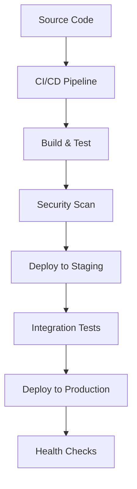
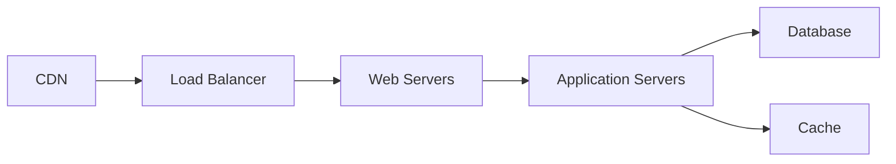

# Deployment Documentation Template

## Document Information
**Application:** [Application Name]  
**Version:** [Version Number]  
**Technology Stack:** [Primary Technologies]  
**Target Environment:** [Deployment Environment]  
**Last Updated:** [Date]  
**Document Owner:** [Team/Individual]  

## Table of Contents
1. [Overview](#overview)
2. [Prerequisites](#prerequisites)
3. [Architecture](#architecture)
4. [CI/CD Pipeline](#cicd-pipeline)
5. [Infrastructure as Code](#infrastructure-as-code)
6. [Deployment Procedures](#deployment-procedures)
7. [Configuration Management](#configuration-management)
8. [Monitoring & Observability](#monitoring--observability)
9. [Security Considerations](#security-considerations)
10. [Disaster Recovery](#disaster-recovery)
11. [Troubleshooting](#troubleshooting)
12. [Appendices](#appendices)

## Overview

### Application Summary
- **Purpose:** [Brief description of application purpose]
- **Technology Stack:** [Detailed technology breakdown]
- **Deployment Model:** [Deployment strategy and approach]
- **Scaling Requirements:** [Performance and scaling needs]

### Deployment Architecture


### Environment Overview
| Environment | Purpose | URL | Infrastructure |
|-------------|---------|-----|----------------|
| Development | Development testing | [dev-url] | [dev-infrastructure] |
| Staging | Pre-production validation | [staging-url] | [staging-infrastructure] |
| Production | Live application | [prod-url] | [prod-infrastructure] |

## Prerequisites

### Required Tools
- [ ] [Tool 1] - Version [X.X.X] or higher
- [ ] [Tool 2] - Version [X.X.X] or higher
- [ ] [Tool 3] - Version [X.X.X] or higher

### Access Requirements
- [ ] [Cloud Platform] account with [specific permissions]
- [ ] [Repository] access with [permission level]
- [ ] [Database] access with [connection details]
- [ ] [Monitoring Tool] access with [dashboard permissions]

### Environment Setup
```bash
# Example setup commands
[setup-command-1]
[setup-command-2]
[setup-command-3]
```

## Architecture

### Infrastructure Components


### Component Details
| Component | Technology | Purpose | Scaling |
|-----------|------------|---------|---------|
| [Component 1] | [Technology] | [Purpose] | [Scaling strategy] |
| [Component 2] | [Technology] | [Purpose] | [Scaling strategy] |

### Network Architecture
- **VPC Configuration:** [VPC details]
- **Subnets:** [Subnet configuration]
- **Security Groups:** [Security group rules]
- **Load Balancing:** [Load balancer configuration]

## CI/CD Pipeline

### Pipeline Overview
```yaml
# Example GitHub Actions Workflow
name: Deploy [Application Name]
on:
  push:
    branches: [main]
  pull_request:
    branches: [main]

jobs:
  build:
    runs-on: ubuntu-latest
    steps:
      - uses: actions/checkout@v3
      - name: Setup [Technology]
        uses: [setup-action]
        with:
          [technology-version]: '[version]'
      
      - name: Install Dependencies
        run: [install-command]
      
      - name: Run Tests
        run: [test-command]
      
      - name: Security Scan
        run: [security-scan-command]
      
      - name: Build Application
        run: [build-command]
      
      - name: Deploy to Staging
        if: github.ref == 'refs/heads/main'
        run: [deploy-staging-command]
      
      - name: Integration Tests
        run: [integration-test-command]
      
      - name: Deploy to Production
        if: github.ref == 'refs/heads/main'
        run: [deploy-production-command]
```

### Pipeline Stages
1. **Source Control:** [Source control integration details]
2. **Build:** [Build process and artifacts]
3. **Test:** [Testing strategy and coverage]
4. **Security:** [Security scanning and validation]
5. **Deploy:** [Deployment strategy and rollback]

### Quality Gates
- [ ] Unit tests pass (minimum 80% coverage)
- [ ] Integration tests pass
- [ ] Security scan passes (no high/critical vulnerabilities)
- [ ] Performance tests meet SLA requirements
- [ ] Manual approval for production deployment

## Infrastructure as Code

### Terraform Configuration
```hcl
# Example Terraform configuration
terraform {
  required_version = ">= 1.0"
  required_providers {
    [provider] = {
      source  = "[provider-source]"
      version = "~> [version]"
    }
  }
}

provider "[provider]" {
  region = var.region
}

resource "[resource-type]" "[resource-name]" {
  [configuration-parameters]
}
```

### Infrastructure Components
- **Compute Resources:** [Compute configuration]
- **Storage:** [Storage configuration]
- **Networking:** [Network configuration]
- **Security:** [Security configuration]

### Environment Variables
```bash
# Production Environment Variables
export DATABASE_URL="[database-connection-string]"
export API_KEY="[api-key-reference]"
export ENVIRONMENT="production"
```

## Deployment Procedures

### Pre-Deployment Checklist
- [ ] Verify all prerequisites are met
- [ ] Confirm infrastructure is provisioned
- [ ] Validate configuration parameters
- [ ] Ensure backup procedures are in place
- [ ] Notify stakeholders of deployment window

### Deployment Steps

#### Automated Deployment
1. **Trigger Pipeline:** [Pipeline trigger instructions]
2. **Monitor Progress:** [Monitoring instructions]
3. **Validate Deployment:** [Validation procedures]

#### Manual Deployment (Emergency)
```bash
# Emergency deployment commands
[emergency-deploy-command-1]
[emergency-deploy-command-2]
[emergency-deploy-command-3]
```

### Post-Deployment Validation
- [ ] Application health checks pass
- [ ] Database connectivity verified
- [ ] External service integrations working
- [ ] Performance metrics within acceptable range
- [ ] Security configurations validated

## Configuration Management

### Environment-Specific Configurations
| Setting | Development | Staging | Production |
|---------|-------------|---------|------------|
| [Setting 1] | [dev-value] | [staging-value] | [prod-value] |
| [Setting 2] | [dev-value] | [staging-value] | [prod-value] |

### Secrets Management
- **Secret Store:** [Secret management solution]
- **Access Control:** [Access control policies]
- **Rotation Policy:** [Secret rotation procedures]

### Feature Flags
```json
{
  "feature-flags": {
    "[feature-1]": {
      "enabled": true,
      "environments": ["staging", "production"]
    },
    "[feature-2]": {
      "enabled": false,
      "environments": ["development"]
    }
  }
}
```

## Monitoring & Observability

### Application Monitoring
- **Health Endpoints:** [Health check URLs]
- **Metrics Collection:** [Metrics configuration]
- **Log Aggregation:** [Logging setup]
- **Alerting Rules:** [Alert configuration]

### Infrastructure Monitoring
- **Resource Utilization:** [Resource monitoring]
- **Network Performance:** [Network monitoring]
- **Security Events:** [Security monitoring]

### Dashboards
| Dashboard | Purpose | URL |
|-----------|---------|-----|
| [Dashboard 1] | [Purpose] | [URL] |
| [Dashboard 2] | [Purpose] | [URL] |

### Alert Configuration
```yaml
# Example alert configuration
alerts:
  - name: "High CPU Usage"
    condition: "cpu_usage > 80%"
    duration: "5m"
    severity: "warning"
    
  - name: "Application Down"
    condition: "http_status != 200"
    duration: "1m"
    severity: "critical"
```

## Security Considerations

### Security Controls
- [ ] Authentication and authorization implemented
- [ ] Data encryption in transit and at rest
- [ ] Network security groups configured
- [ ] Security scanning integrated in CI/CD
- [ ] Vulnerability management process in place

### Compliance Requirements
- **[Compliance Standard 1]:** [Implementation details]
- **[Compliance Standard 2]:** [Implementation details]

### Security Monitoring
- **SIEM Integration:** [SIEM configuration]
- **Vulnerability Scanning:** [Scanning schedule]
- **Penetration Testing:** [Testing schedule]

## Disaster Recovery

### Backup Strategy
- **Database Backups:** [Backup schedule and retention]
- **Application Backups:** [Backup procedures]
- **Configuration Backups:** [Configuration backup]

### Recovery Procedures
```bash
# Database recovery example
[database-recovery-command-1]
[database-recovery-command-2]
```

### Recovery Time Objectives
| Component | RTO | RPO | Recovery Procedure |
|-----------|-----|-----|-------------------|
| [Component 1] | [RTO] | [RPO] | [Procedure] |
| [Component 2] | [RTO] | [RPO] | [Procedure] |

### Rollback Procedures
1. **Identify Issue:** [Issue identification steps]
2. **Stop Traffic:** [Traffic stopping procedures]
3. **Rollback Application:** [Application rollback steps]
4. **Validate Rollback:** [Validation procedures]
5. **Resume Traffic:** [Traffic resumption steps]

## Troubleshooting

### Common Issues
| Issue | Symptoms | Resolution |
|-------|----------|------------|
| [Issue 1] | [Symptoms] | [Resolution steps] |
| [Issue 2] | [Symptoms] | [Resolution steps] |

### Diagnostic Commands
```bash
# Application diagnostics
[diagnostic-command-1]
[diagnostic-command-2]

# Infrastructure diagnostics
[infrastructure-diagnostic-1]
[infrastructure-diagnostic-2]
```

### Log Locations
- **Application Logs:** [Log location and format]
- **System Logs:** [System log location]
- **Security Logs:** [Security log location]

### Emergency Contacts
| Role | Name | Contact | Escalation |
|------|------|---------|------------|
| [Role 1] | [Name] | [Contact] | [Escalation procedure] |
| [Role 2] | [Name] | [Contact] | [Escalation procedure] |

## Appendices

### Appendix A: Configuration Files
[Include relevant configuration file examples]

### Appendix B: Scripts
[Include deployment and maintenance scripts]

### Appendix C: Architecture Diagrams
[Include detailed architecture diagrams]

### Appendix D: Change Log
| Date | Version | Changes | Author |
|------|---------|---------|--------|
| [Date] | [Version] | [Changes] | [Author] |

---

**Document Control:**
- **Template Version:** 1.0
- **Last Review:** [Date]
- **Next Review:** [Date]
- **Approved By:** [Approver]
```

Now let me create the quality validation checklist:
