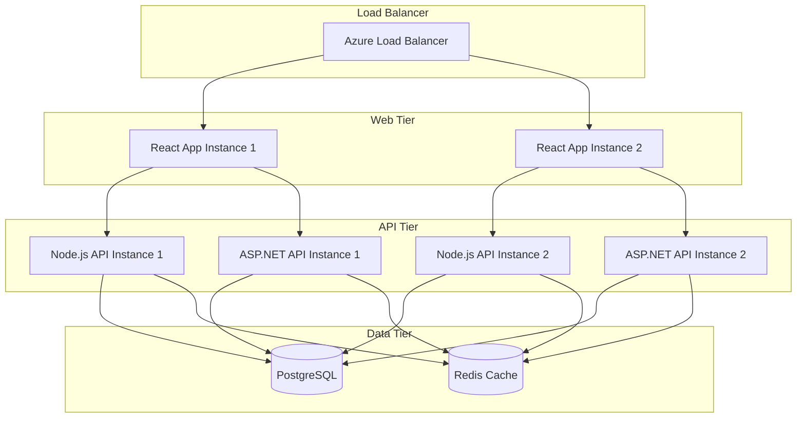

---
template_id: "deployment-guide-comprehensive"
template_name: "Comprehensive Deployment Guide Template"
version: "1.0.0"
category: "persona"
personas: ["devops-documentation-specialist", "cross-platform-integration-specialist"]
technologies: ["docker", "kubernetes", "azure", "aws", "nodejs", "aspnet", "react"]
complexity: "advanced"
estimated_time: "120-180 minutes"
dependencies: ["technical-architecture", "infrastructure-design"]
tags: ["deployment", "devops", "infrastructure", "containerization", "cloud"]
---

# Deployment Guide: {{PROJECT_NAME}}

## Deployment Overview
**Project:** {{PROJECT_NAME}}  
**Environment:** {{TARGET_ENVIRONMENT}}  
**Platform:** {{DEPLOYMENT_PLATFORM}}  
**Technology Stack:** {{TECHNOLOGY_STACK}}  
**Deployment Method:** {{DEPLOYMENT_METHOD}}  
**Last Updated:** {{LAST_UPDATED}}  

### Deployment Summary
{{DEPLOYMENT_SUMMARY_DESCRIPTION}}

### Prerequisites
- {{PREREQUISITE_1}}
- {{PREREQUISITE_2}}
- {{PREREQUISITE_3}}

## Architecture Overview

### Deployment Architecture Diagram


### Component Distribution
- **Frontend:** {{FRONTEND_DEPLOYMENT_DETAILS}}
- **Backend APIs:** {{BACKEND_DEPLOYMENT_DETAILS}}
- **Database:** {{DATABASE_DEPLOYMENT_DETAILS}}
- **Cache:** {{CACHE_DEPLOYMENT_DETAILS}}

## Environment Configuration

### Development Environment
\```yaml
# docker-compose.dev.yml
version: '3.8'
services:
  frontend:
    build:
      context: ./frontend
      dockerfile: Dockerfile.dev
    ports:
      - "3000:3000"
    environment:
      - NODE_ENV=development
      - REACT_APP_API_URL=http://localhost:5000
    volumes:
      - ./frontend:/app
      - /app/node_modules

  nodejs-api:
    build:
      context: ./backend/nodejs
      dockerfile: Dockerfile.dev
    ports:
      - "5000:5000"
    environment:
      - NODE_ENV=development
      - DATABASE_URL={{DEV_DATABASE_URL}}
      - REDIS_URL={{DEV_REDIS_URL}}
    volumes:
      - ./backend/nodejs:/app
      - /app/node_modules

  aspnet-api:
    build:
      context: ./backend/aspnet
      dockerfile: Dockerfile.dev
    ports:
      - "5001:80"
    environment:
      - ASPNETCORE_ENVIRONMENT=Development
      - ConnectionStrings__DefaultConnection={{DEV_DATABASE_URL}}
      - Redis__ConnectionString={{DEV_REDIS_URL}}
    volumes:
      - ./backend/aspnet:/app

  postgres:
    image: postgres:15
    ports:
      - "5432:5432"
    environment:
      - POSTGRES_DB={{DEV_DB_NAME}}
      - POSTGRES_USER={{DEV_DB_USER}}
      - POSTGRES_PASSWORD={{DEV_DB_PASSWORD}}
    volumes:
      - postgres_data:/var/lib/postgresql/data

  redis:
    image: redis:7-alpine
    ports:
      - "6379:6379"

volumes:
  postgres_data:
```

### Production Environment
\```yaml
# docker-compose.prod.yml
version: '3.8'
services:
  frontend:
    build:
      context: ./frontend
      dockerfile: Dockerfile.prod
    ports:
      - "80:80"
    environment:
      - NODE_ENV=production
      - REACT_APP_API_URL={{PROD_API_URL}}

  nodejs-api:
    build:
      context: ./backend/nodejs
      dockerfile: Dockerfile.prod
    ports:
      - "5000:5000"
    environment:
      - NODE_ENV=production
      - DATABASE_URL={{PROD_DATABASE_URL}}
      - REDIS_URL={{PROD_REDIS_URL}}
    deploy:
      replicas: 2
      resources:
        limits:
          memory: 512M
        reservations:
          memory: 256M

  aspnet-api:
    build:
      context: ./backend/aspnet
      dockerfile: Dockerfile.prod
    ports:
      - "5001:80"
    environment:
      - ASPNETCORE_ENVIRONMENT=Production
      - ConnectionStrings__DefaultConnection={{PROD_DATABASE_URL}}
      - Redis__ConnectionString={{PROD_REDIS_URL}}
    deploy:
      replicas: 2
      resources:
        limits:
          memory: 512M
        reservations:
          memory: 256M
```

## Containerization

### Frontend Dockerfile (React)
\```dockerfile
# Dockerfile.prod for React frontend
FROM node:18-alpine as build

WORKDIR /app
COPY package*.json ./
RUN npm ci --only=production

COPY . .
RUN npm run build

FROM nginx:alpine
COPY --from=build /app/build /usr/share/nginx/html
COPY nginx.conf /etc/nginx/nginx.conf

EXPOSE 80
CMD ["nginx", "-g", "daemon off;"]
```

### Backend Dockerfile (Node.js)
\```dockerfile
# Dockerfile.prod for Node.js API
FROM node:18-alpine

WORKDIR /app

# Copy package files
COPY package*.json ./
RUN npm ci --only=production

# Copy source code
COPY . .

# Create non-root user
RUN addgroup -g 1001 -S nodejs
RUN adduser -S nodejs -u 1001
USER nodejs

EXPOSE 5000

CMD ["node", "server.js"]
```

### Backend Dockerfile (ASP.NET)
\```dockerfile
# Dockerfile.prod for ASP.NET API
FROM mcr.microsoft.com/dotnet/aspnet:7.0 AS base
WORKDIR /app
EXPOSE 80

FROM mcr.microsoft.com/dotnet/sdk:7.0 AS build
WORKDIR /src
COPY ["{{PROJECT_NAME}}.csproj", "."]
RUN dotnet restore "{{PROJECT_NAME}}.csproj"
COPY . .
WORKDIR "/src/."
RUN dotnet build "{{PROJECT_NAME}}.csproj" -c Release -o /app/build

FROM build AS publish
RUN dotnet publish "{{PROJECT_NAME}}.csproj" -c Release -o /app/publish

FROM base AS final
WORKDIR /app
COPY --from=publish /app/publish .
ENTRYPOINT ["dotnet", "{{PROJECT_NAME}}.dll"]
```

## Kubernetes Deployment

### Namespace Configuration
\```yaml
# namespace.yaml
apiVersion: v1
kind: Namespace
metadata:
  name: {{PROJECT_NAME}}
  labels:
    name: {{PROJECT_NAME}}
```

### Frontend Deployment
\```yaml
# frontend-deployment.yaml
apiVersion: apps/v1
kind: Deployment
metadata:
  name: frontend
  namespace: {{PROJECT_NAME}}
spec:
  replicas: 2
  selector:
    matchLabels:
      app: frontend
  template:
    metadata:
      labels:
        app: frontend
    spec:
      containers:
      - name: frontend
        image: {{CONTAINER_REGISTRY}}/{{PROJECT_NAME}}-frontend:{{VERSION}}
        ports:
        - containerPort: 80
        env:
        - name: REACT_APP_API_URL
          value: "{{API_URL}}"
        resources:
          requests:
            memory: "128Mi"
            cpu: "100m"
          limits:
            memory: "256Mi"
            cpu: "200m"
---
apiVersion: v1
kind: Service
metadata:
  name: frontend-service
  namespace: {{PROJECT_NAME}}
spec:
  selector:
    app: frontend
  ports:
  - port: 80
    targetPort: 80
  type: LoadBalancer
```

### Backend API Deployments
\```yaml
# nodejs-api-deployment.yaml
apiVersion: apps/v1
kind: Deployment
metadata:
  name: nodejs-api
  namespace: {{PROJECT_NAME}}
spec:
  replicas: 2
  selector:
    matchLabels:
      app: nodejs-api
  template:
    metadata:
      labels:
        app: nodejs-api
    spec:
      containers:
      - name: nodejs-api
        image: {{CONTAINER_REGISTRY}}/{{PROJECT_NAME}}-nodejs-api:{{VERSION}}
        ports:
        - containerPort: 5000
        env:
        - name: NODE_ENV
          value: "production"
        - name: DATABASE_URL
          valueFrom:
            secretKeyRef:
              name: database-secret
              key: connection-string
        - name: REDIS_URL
          valueFrom:
            secretKeyRef:
              name: redis-secret
              key: connection-string
        resources:
          requests:
            memory: "256Mi"
            cpu: "200m"
          limits:
            memory: "512Mi"
            cpu: "500m"
---
apiVersion: v1
kind: Service
metadata:
  name: nodejs-api-service
  namespace: {{PROJECT_NAME}}
spec:
  selector:
    app: nodejs-api
  ports:
  - port: 5000
    targetPort: 5000
```

### Database Configuration
\```yaml
# postgres-deployment.yaml
apiVersion: apps/v1
kind: Deployment
metadata:
  name: postgres
  namespace: {{PROJECT_NAME}}
spec:
  replicas: 1
  selector:
    matchLabels:
      app: postgres
  template:
    metadata:
      labels:
        app: postgres
    spec:
      containers:
      - name: postgres
        image: postgres:15
        ports:
        - containerPort: 5432
        env:
        - name: POSTGRES_DB
          value: "{{DATABASE_NAME}}"
        - name: POSTGRES_USER
          valueFrom:
            secretKeyRef:
              name: database-secret
              key: username
        - name: POSTGRES_PASSWORD
          valueFrom:
            secretKeyRef:
              name: database-secret
              key: password
        volumeMounts:
        - name: postgres-storage
          mountPath: /var/lib/postgresql/data
        resources:
          requests:
            memory: "512Mi"
            cpu: "300m"
          limits:
            memory: "1Gi"
            cpu: "500m"
      volumes:
      - name: postgres-storage
        persistentVolumeClaim:
          claimName: postgres-pvc
---
apiVersion: v1
kind: Service
metadata:
  name: postgres-service
  namespace: {{PROJECT_NAME}}
spec:
  selector:
    app: postgres
  ports:
  - port: 5432
    targetPort: 5432
```

## CI/CD Pipeline

### GitHub Actions Workflow
\```yaml
# .github/workflows/deploy.yml
name: Deploy to Production

on:
  push:
    branches: [main]
  pull_request:
    branches: [main]

jobs:
  test:
    runs-on: ubuntu-latest
    steps:
    - uses: actions/checkout@v3
    
    - name: Setup Node.js
      uses: actions/setup-node@v3
      with:
        node-version: '18'
        cache: 'npm'
    
    - name: Install dependencies
      run: npm ci
    
    - name: Run tests
      run: npm test
    
    - name: Run linting
      run: npm run lint
    
    - name: Security audit
      run: npm audit

  build-and-push:
    needs: test
    runs-on: ubuntu-latest
    if: github.ref == 'refs/heads/main'
    
    steps:
    - uses: actions/checkout@v3
    
    - name: Login to Container Registry
      uses: docker/login-action@v2
      with:
        registry: {{CONTAINER_REGISTRY}}
        username: ${{ secrets.REGISTRY_USERNAME }}
        password: ${{ secrets.REGISTRY_PASSWORD }}
    
    - name: Build and push Frontend
      uses: docker/build-push-action@v4
      with:
        context: ./frontend
        file: ./frontend/Dockerfile.prod
        push: true
        tags: {{CONTAINER_REGISTRY}}/{{PROJECT_NAME}}-frontend:${{ github.sha }}
    
    - name: Build and push Node.js API
      uses: docker/build-push-action@v4
      with:
        context: ./backend/nodejs
        file: ./backend/nodejs/Dockerfile.prod
        push: true
        tags: {{CONTAINER_REGISTRY}}/{{PROJECT_NAME}}-nodejs-api:${{ github.sha }}
    
    - name: Build and push ASP.NET API
      uses: docker/build-push-action@v4
      with:
        context: ./backend/aspnet
        file: ./backend/aspnet/Dockerfile.prod
        push: true
        tags: {{CONTAINER_REGISTRY}}/{{PROJECT_NAME}}-aspnet-api:${{ github.sha }}

  deploy:
    needs: build-and-push
    runs-on: ubuntu-latest
    if: github.ref == 'refs/heads/main'
    
    steps:
    - uses: actions/checkout@v3
    
    - name: Setup kubectl
      uses: azure/setup-kubectl@v3
      with:
        version: 'latest'
    
    - name: Set up Kubeconfig
      run: |
        echo "${{ secrets.KUBE_CONFIG }}" | base64 -d > kubeconfig
        export KUBECONFIG=kubeconfig
    
    - name: Deploy to Kubernetes
      run: |
        sed -i 's/{{VERSION}}/${{ github.sha }}/g' k8s/*.yaml
        kubectl apply -f k8s/
        kubectl rollout status deployment/frontend -n {{PROJECT_NAME}}
        kubectl rollout status deployment/nodejs-api -n {{PROJECT_NAME}}
        kubectl rollout status deployment/aspnet-api -n {{PROJECT_NAME}}
```

## Infrastructure as Code

### Terraform Configuration
```hcl
# main.tf
terraform {
  required_providers {
    azurerm = {
      source  = "hashicorp/azurerm"
      version = "~>3.0"
    }
  }
}

provider "azurerm" {
  features {}
}

resource "azurerm_resource_group" "main" {
  name     = "{{PROJECT_NAME}}-rg"
  location = "{{AZURE_REGION}}"
}

resource "azurerm_kubernetes_cluster" "main" {
  name                = "{{PROJECT_NAME}}-aks"
  location            = azurerm_resource_group.main.location
  resource_group_name = azurerm_resource_group.main.name
  dns_prefix          = "{{PROJECT_NAME}}-aks"

  default_node_pool {
    name       = "default"
    node_count = {{NODE_COUNT}}
    vm_size    = "{{VM_SIZE}}"
  }

  identity {
    type = "SystemAssigned"
  }

  tags = {
    Environment = "{{ENVIRONMENT}}"
    Project     = "{{PROJECT_NAME}}"
  }
}

resource "azurerm_postgresql_server" "main" {
  name                = "{{PROJECT_NAME}}-postgres"
  location            = azurerm_resource_group.main.location
  resource_group_name = azurerm_resource_group.main.name

  administrator_login          = "{{DB_ADMIN_USER}}"
  administrator_login_password = "{{DB_ADMIN_PASSWORD}}"

  sku_name   = "{{POSTGRES_SKU}}"
  version    = "{{POSTGRES_VERSION}}"
  storage_mb = {{POSTGRES_STORAGE_MB}}

  backup_retention_days        = {{BACKUP_RETENTION_DAYS}}
  geo_redundant_backup_enabled = {{GEO_REDUNDANT_BACKUP}}
  auto_grow_enabled            = true

  public_network_access_enabled    = false
  ssl_enforcement_enabled          = true
  ssl_minimal_tls_version_enforced = "TLS1_2"
}

resource "azurerm_redis_cache" "main" {
  name                = "{{PROJECT_NAME}}-redis"
  location            = azurerm_resource_group.main.location
  resource_group_name = azurerm_resource_group.main.name
  capacity            = {{REDIS_CAPACITY}}
  family              = "{{REDIS_FAMILY}}"
  sku_name            = "{{REDIS_SKU}}"
  enable_non_ssl_port = false
  minimum_tls_version = "1.2"

  redis_configuration {
    enable_authentication = true
  }
}
```

## Monitoring and Observability

### Application Insights Configuration
\```yaml
# monitoring-deployment.yaml
apiVersion: apps/v1
kind: Deployment
metadata:
  name: monitoring-agent
  namespace: {{PROJECT_NAME}}
spec:
  replicas: 1
  selector:
    matchLabels:
      app: monitoring-agent
  template:
    metadata:
      labels:
        app: monitoring-agent
    spec:
      containers:
      - name: prometheus
        image: prom/prometheus:latest
        ports:
        - containerPort: 9090
        volumeMounts:
        - name: prometheus-config
          mountPath: /etc/prometheus
      - name: grafana
        image: grafana/grafana:latest
        ports:
        - containerPort: 3000
        env:
        - name: GF_SECURITY_ADMIN_PASSWORD
          valueFrom:
            secretKeyRef:
              name: monitoring-secret
              key: grafana-password
      volumes:
      - name: prometheus-config
        configMap:
          name: prometheus-config
```

### Logging Configuration
\```yaml
# logging-config.yaml
apiVersion: v1
kind: ConfigMap
metadata:
  name: fluent-bit-config
  namespace: {{PROJECT_NAME}}
data:
  fluent-bit.conf: |
    [SERVICE]
        Flush         1
        Log_Level     info
        Daemon        off
        Parsers_File  parsers.conf
        HTTP_Server   On
        HTTP_Listen   0.0.0.0
        HTTP_Port     2020

    [INPUT]
        Name              tail
        Path              /var/log/containers/*.log
        Parser            docker
        Tag               kube.*
        Refresh_Interval  5
        Mem_Buf_Limit     50MB
        Skip_Long_Lines   On

    [FILTER]
        Name                kubernetes
        Match               kube.*
        Kube_URL            https://kubernetes.default.svc:443
        Kube_CA_File        /var/run/secrets/kubernetes.io/serviceaccount/ca.crt
        Kube_Token_File     /var/run/secrets/kubernetes.io/serviceaccount/token
        Kube_Tag_Prefix     kube.var.log.containers.
        Merge_Log           On
        Keep_Log            Off

    [OUTPUT]
        Name  azure
        Match *
        Customer_ID {{LOG_ANALYTICS_WORKSPACE_ID}}
        Shared_Key  {{LOG_ANALYTICS_SHARED_KEY}}
        Log_Type    {{PROJECT_NAME}}_logs
```

## Security Configuration

### Network Policies
\```yaml
# network-policy.yaml
apiVersion: networking.k8s.io/v1
kind: NetworkPolicy
metadata:
  name: {{PROJECT_NAME}}-network-policy
  namespace: {{PROJECT_NAME}}
spec:
  podSelector: {}
  policyTypes:
  - Ingress
  - Egress
  ingress:
  - from:
    - namespaceSelector:
        matchLabels:
          name: {{PROJECT_NAME}}
    ports:
    - protocol: TCP
      port: 80
    - protocol: TCP
      port: 5000
    - protocol: TCP
      port: 5001
  egress:
  - to:
    - namespaceSelector:
        matchLabels:
          name: {{PROJECT_NAME}}
    ports:
    - protocol: TCP
      port: 5432
    - protocol: TCP
      port: 6379
  - to: []
    ports:
    - protocol: TCP
      port: 443
    - protocol: TCP
      port: 53
    - protocol: UDP
      port: 53
```

### Secret Management
\```yaml
# secrets.yaml
apiVersion: v1
kind: Secret
metadata:
  name: database-secret
  namespace: {{PROJECT_NAME}}
type: Opaque
data:
  connection-string: {{BASE64_ENCODED_DB_CONNECTION}}
  username: {{BASE64_ENCODED_DB_USERNAME}}
  password: {{BASE64_ENCODED_DB_PASSWORD}}
---
apiVersion: v1
kind: Secret
metadata:
  name: redis-secret
  namespace: {{PROJECT_NAME}}
type: Opaque
data:
  connection-string: {{BASE64_ENCODED_REDIS_CONNECTION}}
---
apiVersion: v1
kind: Secret
metadata:
  name: api-keys
  namespace: {{PROJECT_NAME}}
type: Opaque
data:
  jwt-secret: {{BASE64_ENCODED_JWT_SECRET}}
  api-key: {{BASE64_ENCODED_API_KEY}}
```

## Backup and Disaster Recovery

### Database Backup Strategy
\```bash
#!/bin/bash
# backup-database.sh

# Configuration
BACKUP_DIR="/backups"
DB_HOST="{{DATABASE_HOST}}"
DB_NAME="{{DATABASE_NAME}}"
DB_USER="{{DATABASE_USER}}"
RETENTION_DAYS=30

# Create backup directory
mkdir -p $BACKUP_DIR

# Generate backup filename with timestamp
BACKUP_FILE="$BACKUP_DIR/${DB_NAME}_$(date +%Y%m%d_%H%M%S).sql"

# Create database backup
pg_dump -h $DB_HOST -U $DB_USER -d $DB_NAME > $BACKUP_FILE

# Compress backup
gzip $BACKUP_FILE

# Upload to cloud storage
az storage blob upload \
  --account-name {{STORAGE_ACCOUNT}} \
  --container-name backups \
  --name "database/$(basename $BACKUP_FILE.gz)" \
  --file "$BACKUP_FILE.gz"

# Clean up old local backups
find $BACKUP_DIR -name "*.sql.gz" -mtime +$RETENTION_DAYS -delete

echo "Backup completed: $BACKUP_FILE.gz"
```

### Disaster Recovery Plan
1. **RTO (Recovery Time Objective):** {{RTO_TARGET}}
2. **RPO (Recovery Point Objective):** {{RPO_TARGET}}
3. **Backup Frequency:** {{BACKUP_FREQUENCY}}
4. **Recovery Procedures:** {{RECOVERY_PROCEDURES}}

## Performance Optimization

### Resource Limits and Requests
\```yaml
# resource-optimization.yaml
apiVersion: v1
kind: LimitRange
metadata:
  name: {{PROJECT_NAME}}-limits
  namespace: {{PROJECT_NAME}}
spec:
  limits:
  - default:
      memory: "512Mi"
      cpu: "500m"
    defaultRequest:
      memory: "256Mi"
      cpu: "200m"
    type: Container
```

### Horizontal Pod Autoscaler
\```yaml
# hpa.yaml
apiVersion: autoscaling/v2
kind: HorizontalPodAutoscaler
metadata:
  name: frontend-hpa
  namespace: {{PROJECT_NAME}}
spec:
  scaleTargetRef:
    apiVersion: apps/v1
    kind: Deployment
    name: frontend
  minReplicas: 2
  maxReplicas: 10
  metrics:
  - type: Resource
    resource:
      name: cpu
      target:
        type: Utilization
        averageUtilization: 70
  - type: Resource
    resource:
      name: memory
      target:
        type: Utilization
        averageUtilization: 80
```

## Troubleshooting

### Common Issues and Solutions

#### Issue: Pod Startup Failures
**Symptoms:** Pods stuck in `CrashLoopBackOff` or `ImagePullBackOff`
**Solutions:**
1. Check image availability: `kubectl describe pod <pod-name>`
2. Verify resource limits: `kubectl get events`
3. Check logs: `kubectl logs <pod-name>`

#### Issue: Database Connection Failures
**Symptoms:** API services unable to connect to database
**Solutions:**
1. Verify database service: `kubectl get svc postgres-service`
2. Check network policies: `kubectl get networkpolicy`
3. Validate secrets: `kubectl get secret database-secret -o yaml`

#### Issue: High Memory Usage
**Symptoms:** Pods being killed due to OOMKilled
**Solutions:**
1. Increase memory limits in deployment
2. Optimize application memory usage
3. Implement memory profiling

### Debugging Commands
\```bash
# Check pod status
kubectl get pods -n {{PROJECT_NAME}}

# View pod logs
kubectl logs -f <pod-name> -n {{PROJECT_NAME}}

# Describe pod for events
kubectl describe pod <pod-name> -n {{PROJECT_NAME}}

# Execute into pod for debugging
kubectl exec -it <pod-name> -n {{PROJECT_NAME}} -- /bin/bash

# Check resource usage
kubectl top pods -n {{PROJECT_NAME}}

# View service endpoints
kubectl get endpoints -n {{PROJECT_NAME}}
```

## Rollback Procedures

### Automated Rollback
\```bash
#!/bin/bash
# rollback.sh

NAMESPACE="{{PROJECT_NAME}}"
DEPLOYMENT_NAME="$1"
REVISION="$2"

if [ -z "$DEPLOYMENT_NAME" ] || [ -z "$REVISION" ]; then
    echo "Usage: $0 <deployment-name> <revision>"
    exit 1
fi

echo "Rolling back $DEPLOYMENT_NAME to revision $REVISION..."

kubectl rollout undo deployment/$DEPLOYMENT_NAME --to-revision=$REVISION -n $NAMESPACE

echo "Waiting for rollback to complete..."
kubectl rollout status deployment/$DEPLOYMENT_NAME -n $NAMESPACE

echo "Rollback completed successfully"
```

### Manual Rollback Steps
1. **Identify target revision:** `kubectl rollout history deployment/<name>`
2. **Execute rollback:** `kubectl rollout undo deployment/<name> --to-revision=<number>`
3. **Verify rollback:** `kubectl rollout status deployment/<name>`
4. **Validate functionality:** Run health checks and integration tests

## Maintenance Procedures

### Regular Maintenance Tasks
1. **Weekly:**
   - Review resource usage and scaling metrics
   - Check backup integrity
   - Update security patches

2. **Monthly:**
   - Review and rotate secrets
   - Analyze performance metrics
   - Update dependencies

3. **Quarterly:**
   - Disaster recovery testing
   - Security audit
   - Capacity planning review

### Maintenance Windows
- **Scheduled Maintenance:** {{MAINTENANCE_SCHEDULE}}
- **Emergency Maintenance:** {{EMERGENCY_PROCEDURES}}
- **Communication Plan:** {{MAINTENANCE_COMMUNICATION}}

---

## Template Usage Notes

### Variable Substitution Guide
Replace all `{{VARIABLE_NAME}}` placeholders with environment-specific information.

### Customization Options
- Adapt cloud provider configurations (Azure/AWS/GCP)
- Modify container orchestration platform (Kubernetes/Docker Swarm)
- Customize monitoring and logging solutions
- Adjust security policies based on compliance requirements

### Quality Validation Checklist
- [ ] All deployment configurations are tested
- [ ] Security policies are implemented and validated
- [ ] Monitoring and alerting are configured
- [ ] Backup and disaster recovery procedures are tested
- [ ] Performance optimization is implemented
- [ ] Troubleshooting procedures are documented
- [ ] Rollback procedures are tested and validated

### Integration Points
- **BMAD Personas:** DevOps Documentation Specialist, Cross-Platform Integration Specialist
- **Follow-up Templates:** Monitoring Template, Security Template
- **Quality Standards:** BMAD Method deployment quality framework

---
**Template Version:** 1.0.0  
**Last Updated:** {{CURRENT_DATE}}  
**Template Owner:** BMAD Method Team
