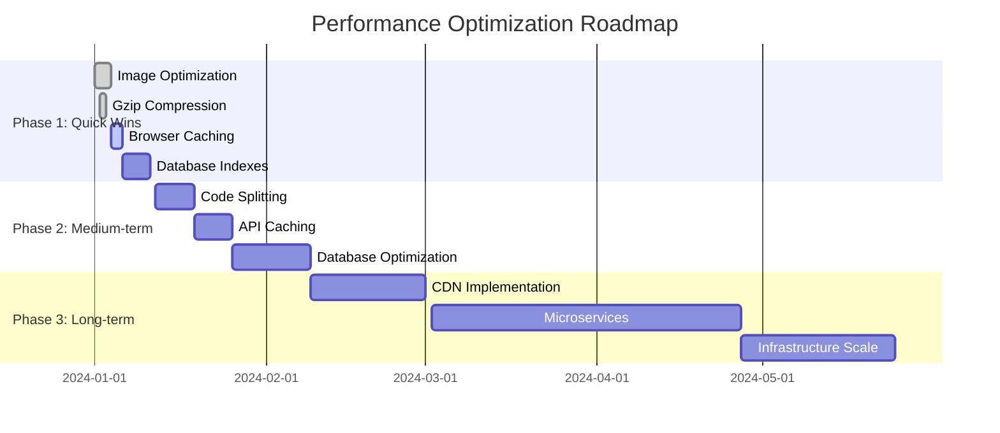

# Performance Optimization Template

## Document Information
**Template Type:** Performance Optimization Plan  
**Version:** 1.0  
**Last Updated:** [Date]  
**Created By:** Performance Optimization Specialist  
**Review Status:** [Draft/Review/Approved]

## Executive Summary

### Performance Overview
- **Current Performance Status:** [Baseline metrics summary]
- **Key Performance Issues:** [Top 3-5 critical issues]
- **Optimization Potential:** [Expected improvement percentages]
- **Implementation Timeline:** [Estimated duration]
- **Resource Requirements:** [Team, tools, infrastructure needs]

### Business Impact
- **User Experience Impact:** [How performance affects users]
- **Business Metrics Impact:** [Revenue, conversion, retention effects]
- **Cost Implications:** [Infrastructure, development costs]
- **Competitive Advantage:** [Performance vs competitors]

## Current Performance Analysis

### Performance Metrics Baseline
\```yaml
frontend_performance:
  core_web_vitals:
    largest_contentful_paint: "[X]ms (target: <2500ms)"
    first_input_delay: "[X]ms (target: <100ms)"
    cumulative_layout_shift: "[X] (target: <0.1)"
  
  page_load_metrics:
    time_to_interactive: "[X]ms"
    first_contentful_paint: "[X]ms"
    total_blocking_time: "[X]ms"
  
  bundle_analysis:
    javascript_bundle_size: "[X]KB"
    css_bundle_size: "[X]KB"
    total_assets_size: "[X]MB"

backend_performance:
  api_response_times:
    p50_response_time: "[X]ms"
    p95_response_time: "[X]ms"
    p99_response_time: "[X]ms"
  
  throughput_metrics:
    requests_per_second: "[X] RPS"
    concurrent_users: "[X] users"
    error_rate: "[X]%"
  
  resource_utilization:
    cpu_usage: "[X]%"
    memory_usage: "[X]%"
    disk_io: "[X] IOPS"

database_performance:
  query_performance:
    average_query_time: "[X]ms"
    slow_queries_count: "[X] queries"
    index_efficiency: "[X]%"
  
  connection_metrics:
    active_connections: "[X] connections"
    connection_pool_usage: "[X]%"
    deadlock_frequency: "[X] per hour"
```

### Technology Stack Analysis

#### Frontend Performance (React/TypeScript)
\```typescript
// Current performance characteristics
interface FrontendPerformanceIssues {
  component_rendering: {
    unnecessary_rerenders: string[];
    large_component_trees: string[];
    expensive_calculations: string[];
  };
  bundle_optimization: {
    unused_code: number; // KB
    missing_code_splitting: string[];
    unoptimized_assets: string[];
  };
  network_performance: {
    excessive_api_calls: number;
    missing_caching: string[];
    unoptimized_images: number;
  };
}

const currentIssues: FrontendPerformanceIssues = {
  component_rendering: {
    unnecessary_rerenders: ["UserList", "Dashboard", "ProductGrid"],
    large_component_trees: ["MainLayout (depth: 12)", "ProductCatalog (depth: 15)"],
    expensive_calculations: ["calculateTotalPrice", "filterProducts", "sortResults"]
  },
  bundle_optimization: {
    unused_code: 245, // KB of unused code
    missing_code_splitting: ["AdminPanel", "ReportsModule", "SettingsPage"],
    unoptimized_assets: ["hero-image.png (2.3MB)", "product-gallery (15 images)"]
  },
  network_performance: {
    excessive_api_calls: 23, // calls per page load
    missing_caching: ["user-preferences", "product-catalog", "static-content"],
    unoptimized_images: 45 // unoptimized images
  }
};
```

#### Backend Performance (Node.js/Python/.NET)
```python
# Backend performance analysis
backend_performance_issues = {
    "node_js": {
        "event_loop_blocking": [
            "synchronous file operations",
            "CPU-intensive calculations",
            "blocking database queries"
        ],
        "memory_leaks": [
            "unclosed database connections",
            "event listener accumulation",
            "large object retention"
        ],
        "inefficient_patterns": [
            "N+1 query patterns",
            "missing connection pooling",
            "synchronous API calls"
        ]
    },
    "python": {
        "gil_contention": [
            "CPU-bound tasks in main thread",
            "inefficient threading usage",
            "blocking I/O operations"
        ],
        "memory_optimization": [
            "large object creation",
            "inefficient data structures",
            "missing generator usage"
        ],
        "async_optimization": [
            "missing asyncio usage",
            "blocking database calls",
            "synchronous HTTP requests"
        ]
    },
    "dotnet": {
        "gc_pressure": [
            "excessive object allocation",
            "large object heap usage",
            "missing object pooling"
        ],
        "async_patterns": [
            "sync over async patterns",
            "missing ConfigureAwait(false)",
            "thread pool starvation"
        ],
        "jit_optimization": [
            "cold start performance",
            "missing ReadyToRun",
            "inefficient LINQ usage"
        ]
    }
}
```

## Performance Bottleneck Analysis

### Critical Performance Issues
\```yaml
critical_issues:
  - issue_id: "PERF-001"
    component: "User Authentication API"
    severity: "Critical"
    impact: "95th percentile response time: 3.2s (target: <1s)"
    root_cause: "N+1 query pattern in user role fetching"
    affected_users: "100% of authenticated users"
    business_impact: "15% increase in bounce rate"
    
  - issue_id: "PERF-002"
    component: "Product Search Frontend"
    severity: "High"
    impact: "Search results take 4.5s to render"
    root_cause: "Synchronous filtering of 10,000+ products"
    affected_users: "80% of site visitors"
    business_impact: "12% decrease in search conversion"
    
  - issue_id: "PERF-003"
    component: "Database Connection Pool"
    severity: "High"
    impact: "Connection pool exhaustion during peak hours"
    root_cause: "Insufficient pool size and connection leaks"
    affected_users: "All users during peak traffic"
    business_impact: "Service unavailability for 5-10 minutes daily"
```

### Performance Impact Matrix
| Component | Current Performance | Target Performance | Improvement Potential | Implementation Effort |
|-----------|-------------------|-------------------|---------------------|---------------------|
| API Response Time | 2.1s (P95) | <1s | 52% improvement | Medium |
| Page Load Time | 4.2s | <2s | 52% improvement | High |
| Database Queries | 850ms avg | <200ms | 76% improvement | Medium |
| Bundle Size | 2.3MB | <1MB | 57% reduction | Low |
| Memory Usage | 85% avg | <60% | 29% reduction | Medium |

## Optimization Strategy

### Phase 1: Quick Wins (1-2 weeks)
\```yaml
quick_wins:
  frontend:
    - enable_gzip_compression:
        impact: "30-70% bundle size reduction"
        effort: "Low"
        timeline: "1 day"
    
    - optimize_images:
        impact: "40-60% image size reduction"
        effort: "Low"
        timeline: "2-3 days"
    
    - implement_browser_caching:
        impact: "50-80% repeat visit improvement"
        effort: "Low"
        timeline: "1 day"
  
  backend:
    - database_index_optimization:
        impact: "30-50% query performance improvement"
        effort: "Medium"
        timeline: "3-5 days"
    
    - connection_pool_tuning:
        impact: "Eliminate connection exhaustion"
        effort: "Low"
        timeline: "1 day"
    
    - enable_response_caching:
        impact: "60-80% API response improvement"
        effort: "Medium"
        timeline: "2-3 days"
```

### Phase 2: Medium-term Optimizations (2-4 weeks)
\```typescript
// Code splitting implementation
const optimizeCodeSplitting = () => {
  return {
    route_based_splitting: {
      implementation: "React.lazy() for route components",
      impact: "40-60% initial bundle reduction",
      timeline: "1 week"
    },
    feature_based_splitting: {
      implementation: "Dynamic imports for heavy features",
      impact: "20-30% bundle optimization",
      timeline: "1-2 weeks"
    },
    vendor_splitting: {
      implementation: "Separate vendor bundles",
      impact: "Better caching strategy",
      timeline: "2-3 days"
    }
  };
};

// Database optimization
const optimizeDatabase = () => {
  return {
    query_optimization: {
      eliminate_n_plus_one: "Implement eager loading",
      add_missing_indexes: "Create composite indexes",
      optimize_joins: "Reduce unnecessary table joins"
    },
    caching_layer: {
      redis_implementation: "Cache frequently accessed data",
      query_result_caching: "Cache expensive query results",
      session_caching: "Optimize session storage"
    }
  };
};
```

### Phase 3: Long-term Optimizations (1-3 months)
\```yaml
long_term_optimizations:
  architecture_improvements:
    - microservices_migration:
        impact: "Improved scalability and performance isolation"
        effort: "High"
        timeline: "2-3 months"
    
    - cdn_implementation:
        impact: "Global performance improvement"
        effort: "Medium"
        timeline: "2-4 weeks"
    
    - caching_infrastructure:
        impact: "Significant performance gains"
        effort: "High"
        timeline: "1-2 months"
  
  technology_upgrades:
    - framework_optimization:
        impact: "Latest performance improvements"
        effort: "Medium"
        timeline: "3-4 weeks"
    
    - database_optimization:
        impact: "Query performance improvements"
        effort: "High"
        timeline: "1-2 months"
```

## Implementation Plan

### Optimization Roadmap


### Resource Allocation
\```yaml
team_requirements:
  frontend_developer: "2 developers, 40% allocation"
  backend_developer: "2 developers, 60% allocation"
  devops_engineer: "1 engineer, 30% allocation"
  performance_specialist: "1 specialist, 80% allocation"
  qa_engineer: "1 engineer, 20% allocation"

infrastructure_requirements:
  monitoring_tools: "APM solution, profiling tools"
  testing_environment: "Load testing infrastructure"
  caching_infrastructure: "Redis cluster setup"
  cdn_service: "Global CDN implementation"
```

## Performance Monitoring Strategy

### Key Performance Indicators (KPIs)
\```yaml
frontend_kpis:
  core_web_vitals:
    - largest_contentful_paint: "target: <2.5s"
    - first_input_delay: "target: <100ms"
    - cumulative_layout_shift: "target: <0.1"
  
  user_experience:
    - time_to_interactive: "target: <3s"
    - first_contentful_paint: "target: <1.5s"
    - speed_index: "target: <3s"

backend_kpis:
  response_times:
    - p50_response_time: "target: <500ms"
    - p95_response_time: "target: <1s"
    - p99_response_time: "target: <2s"
  
  throughput:
    - requests_per_second: "target: >1000 RPS"
    - concurrent_users: "target: >500 users"
    - error_rate: "target: <0.1%"

infrastructure_kpis:
  resource_utilization:
    - cpu_usage: "target: <70%"
    - memory_usage: "target: <80%"
    - disk_io: "target: <80%"
  
  availability:
    - uptime: "target: >99.9%"
    - mttr: "target: <5 minutes"
    - mtbf: "target: >720 hours"
```

### Monitoring Implementation
\```javascript
// Performance monitoring setup
const monitoringConfig = {
  realUserMonitoring: {
    provider: "Google Analytics, New Relic",
    metrics: ["Core Web Vitals", "User Timing", "Navigation Timing"],
    sampling: "100% for critical pages, 10% for others"
  },
  
  syntheticMonitoring: {
    provider: "Pingdom, Lighthouse CI",
    frequency: "Every 5 minutes",
    locations: ["US East", "US West", "Europe", "Asia"],
    alerts: "Response time > 2s, Availability < 99%"
  },
  
  applicationMonitoring: {
    provider: "Application Insights, DataDog",
    metrics: ["Response Time", "Throughput", "Error Rate", "Resource Usage"],
    alerts: "P95 > 1s, Error Rate > 1%, CPU > 80%"
  }
};
```

## Testing Strategy

### Performance Testing Plan
\```yaml
load_testing:
  baseline_test:
    users: 100
    duration: "10 minutes"
    ramp_up: "2 minutes"
    success_criteria: "P95 < 2s, Error Rate < 1%"
  
  stress_test:
    users: 500
    duration: "15 minutes"
    ramp_up: "5 minutes"
    success_criteria: "System remains stable, graceful degradation"
  
  spike_test:
    users: "100 to 1000 in 1 minute"
    duration: "10 minutes"
    success_criteria: "Recovery within 2 minutes"
  
  endurance_test:
    users: 200
    duration: "2 hours"
    success_criteria: "No memory leaks, stable performance"
```

### Performance Validation
\```typescript
// Performance test scenarios
interface PerformanceTestScenario {
  name: string;
  userLoad: number;
  duration: string;
  successCriteria: {
    responseTime: string;
    errorRate: string;
    throughput: string;
  };
}

const testScenarios: PerformanceTestScenario[] = [
  {
    name: "User Authentication Flow",
    userLoad: 100,
    duration: "5 minutes",
    successCriteria: {
      responseTime: "P95 < 1s",
      errorRate: "< 0.1%",
      throughput: "> 50 RPS"
    }
  },
  {
    name: "Product Search and Browse",
    userLoad: 200,
    duration: "10 minutes",
    successCriteria: {
      responseTime: "P95 < 2s",
      errorRate: "< 0.5%",
      throughput: "> 100 RPS"
    }
  },
  {
    name: "Checkout Process",
    userLoad: 50,
    duration: "15 minutes",
    successCriteria: {
      responseTime: "P95 < 3s",
      errorRate: "< 0.01%",
      throughput: "> 10 RPS"
    }
  }
];
```

## Success Metrics and ROI

### Performance Improvement Targets
\```yaml
improvement_targets:
  user_experience:
    page_load_time: "50% reduction (4.2s  2.1s)"
    api_response_time: "60% reduction (2.1s  0.8s)"
    core_web_vitals: "All metrics in 'Good' range"
  
  business_metrics:
    bounce_rate: "20% reduction"
    conversion_rate: "15% increase"
    user_satisfaction: "25% improvement"
    support_tickets: "30% reduction"
  
  technical_metrics:
    server_response_time: "65% improvement"
    resource_utilization: "40% reduction"
    error_rate: "80% reduction"
    system_availability: "99.9% uptime"
```

### Return on Investment (ROI)
\```yaml
roi_analysis:
  implementation_costs:
    development_effort: "$50,000 (400 hours)"
    infrastructure_upgrades: "$15,000"
    monitoring_tools: "$10,000/year"
    total_investment: "$75,000"
  
  expected_benefits:
    increased_conversion: "$200,000/year (2% improvement)"
    reduced_infrastructure: "$30,000/year (30% efficiency)"
    decreased_support_costs: "$20,000/year"
    total_annual_benefit: "$250,000"
  
  roi_calculation:
    payback_period: "3.6 months"
    annual_roi: "233%"
    three_year_roi: "900%"
```

## Risk Assessment and Mitigation

### Implementation Risks
\```yaml
risks:
  technical_risks:
    - risk: "Performance regression during optimization"
      probability: "Medium"
      impact: "High"
      mitigation: "Comprehensive testing, gradual rollout"
    
    - risk: "Compatibility issues with existing systems"
      probability: "Low"
      impact: "Medium"
      mitigation: "Thorough compatibility testing"
    
    - risk: "Resource constraints during implementation"
      probability: "Medium"
      impact: "Medium"
      mitigation: "Phased implementation, resource planning"
  
  business_risks:
    - risk: "User experience disruption during deployment"
      probability: "Low"
      impact: "High"
      mitigation: "Blue-green deployment, rollback plan"
    
    - risk: "Extended implementation timeline"
      probability: "Medium"
      impact: "Medium"
      mitigation: "Agile methodology, regular checkpoints"
```

### Rollback Strategy
\```yaml
rollback_plan:
  monitoring_triggers:
    - error_rate_increase: "> 2x baseline"
    - response_time_degradation: "> 50% increase"
    - user_complaints: "> 10 complaints/hour"
  
  rollback_procedures:
    - immediate_rollback: "< 5 minutes for critical issues"
    - feature_flags: "Instant disable of new optimizations"
    - database_rollback: "Point-in-time recovery available"
    - communication_plan: "Stakeholder notification within 15 minutes"
```

## Conclusion and Next Steps

### Summary
This performance optimization plan provides a comprehensive approach to improving application performance across all technology stacks. The phased implementation approach ensures minimal risk while delivering measurable improvements in user experience and business metrics.

### Immediate Actions Required
1. **Stakeholder Approval:** Secure approval for optimization plan and resource allocation
2. **Team Assembly:** Assign dedicated team members for implementation
3. **Environment Setup:** Prepare monitoring and testing infrastructure
4. **Phase 1 Kickoff:** Begin quick wins implementation immediately

### Success Criteria
- [ ] All performance targets achieved within timeline
- [ ] User experience metrics improved by target percentages
- [ ] Business metrics show positive impact
- [ ] System reliability and availability maintained
- [ ] ROI targets met or exceeded

### Long-term Performance Strategy
- Establish ongoing performance monitoring and optimization processes
- Implement performance budgets and governance
- Create performance-focused development culture
- Plan regular performance reviews and improvements

---

**Document Owner:** Performance Optimization Specialist  
**Stakeholders:** Development Team, DevOps, Product Management, Business Leadership  
**Review Schedule:** Weekly during implementation, monthly post-implementation  
**Next Review Date:** [Date]
