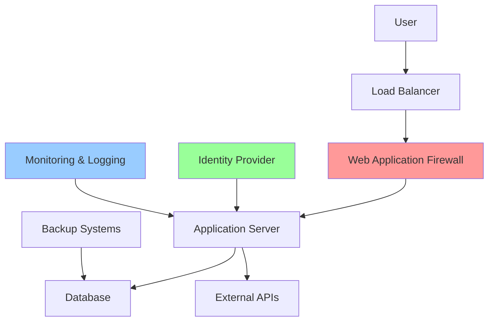
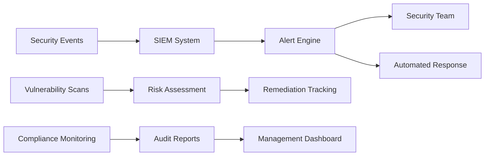

# Security Optimization Template

## Document Information
**Template Name:** Security Optimization Template  
**Version:** 1.0  
**Created By:** Security Integration Specialist  
**Last Updated:** [Current Date]  
**Document Type:** Security Assessment and Remediation Plan  

## Project Overview

### Project Information
- **Project Name:** [Project Name]
- **Security Assessment Date:** [Date]
- **Assessment Scope:** [Frontend/Backend/Full Stack/Infrastructure]
- **Technology Stack:** [React, TypeScript, Node.js, Python, .NET, etc.]
- **Compliance Requirements:** [GDPR, SOC2, HIPAA, PCI-DSS, etc.]

### Security Objectives
- **Primary Security Goals:** [List main security objectives]
- **Compliance Targets:** [Specific compliance requirements]
- **Risk Tolerance:** [High/Medium/Low risk tolerance]
- **Security Budget:** [Available resources for security improvements]

## Current Security Posture Assessment

### Security Architecture Review


### Current Security Controls
| Security Domain | Current State | Effectiveness | Priority |
|----------------|---------------|---------------|----------|
| Authentication | [Description] | [High/Medium/Low] | [P1/P2/P3] |
| Authorization | [Description] | [High/Medium/Low] | [P1/P2/P3] |
| Data Protection | [Description] | [High/Medium/Low] | [P1/P2/P3] |
| Network Security | [Description] | [High/Medium/Low] | [P1/P2/P3] |
| Application Security | [Description] | [High/Medium/Low] | [P1/P2/P3] |
| Infrastructure Security | [Description] | [High/Medium/Low] | [P1/P2/P3] |

## Vulnerability Assessment Results

### Critical Vulnerabilities
| Vulnerability ID | Description | CVSS Score | Affected Components | Business Impact |
|-----------------|-------------|------------|-------------------|-----------------|
| VULN-001 | [Vulnerability Description] | [Score] | [Components] | [Impact] |
| VULN-002 | [Vulnerability Description] | [Score] | [Components] | [Impact] |

### High Priority Vulnerabilities
| Vulnerability ID | Description | CVSS Score | Affected Components | Remediation Effort |
|-----------------|-------------|------------|-------------------|-------------------|
| VULN-003 | [Vulnerability Description] | [Score] | [Components] | [Effort] |
| VULN-004 | [Vulnerability Description] | [Score] | [Components] | [Effort] |

### Medium Priority Vulnerabilities
| Vulnerability ID | Description | CVSS Score | Affected Components | Remediation Timeline |
|-----------------|-------------|------------|-------------------|---------------------|
| VULN-005 | [Vulnerability Description] | [Score] | [Components] | [Timeline] |
| VULN-006 | [Vulnerability Description] | [Score] | [Components] | [Timeline] |

## Technology-Specific Security Analysis

### Frontend Security (React/TypeScript)
```typescript
// Current Security Implementation Assessment
interface SecurityAssessment {
  xssProtection: {
    status: 'Implemented' | 'Partial' | 'Missing';
    details: string;
    recommendations: string[];
  };
  
  authenticationSecurity: {
    tokenStorage: 'Secure' | 'Insecure';
    sessionManagement: 'Implemented' | 'Missing';
    recommendations: string[];
  };
  
  dataProtection: {
    encryptionInTransit: boolean;
    sensitiveDataHandling: 'Secure' | 'Needs Improvement';
    recommendations: string[];
  };
}

// Example Security Improvements
const securityImprovements = {
  // XSS Prevention Enhancement
  implementCSP: `
    // Content Security Policy Configuration
    const cspConfig = {
      directives: {
        defaultSrc: ["'self'"],
        scriptSrc: ["'self'", "'unsafe-inline'"],
        styleSrc: ["'self'", "'unsafe-inline'"],
        imgSrc: ["'self'", "data:", "https:"],
        connectSrc: ["'self'", "https://api.example.com"]
      }
    };
  `,
  
  // Secure Authentication Implementation
  secureAuth: `
    const useSecureAuth = () => {
      const [authState, setAuthState] = useState({
        isAuthenticated: false,
        user: null
      });

      const login = async (credentials) => {
        try {
          const response = await fetch('/api/auth/login', {
            method: 'POST',
            headers: { 'Content-Type': 'application/json' },
            body: JSON.stringify(credentials),
            credentials: 'include' // Use httpOnly cookies
          });

          if (response.ok) {
            const userData = await response.json();
            setAuthState({ isAuthenticated: true, user: userData });
          }
        } catch (error) {
          console.error('Authentication error:', error);
        }
      };

      return { authState, login };
    };
  `
};
```

### Backend Security (Node.js/Python/.NET)
```javascript
// Backend Security Assessment
const backendSecurityStatus = {
  inputValidation: {
    sqlInjectionPrevention: 'Implemented', // Partial/Missing
    nosqlInjectionPrevention: 'Missing',
    commandInjectionPrevention: 'Implemented',
    recommendations: [
      'Implement parameterized queries for all database operations',
      'Add input validation middleware for all API endpoints',
      'Implement rate limiting to prevent abuse'
    ]
  },
  
  authenticationSecurity: {
    passwordHashing: 'Secure', // bcrypt with salt rounds >= 12
    jwtImplementation: 'Needs Improvement',
    sessionManagement: 'Implemented',
    recommendations: [
      'Implement JWT refresh token rotation',
      'Add multi-factor authentication support',
      'Implement account lockout mechanisms'
    ]
  },
  
  securityHeaders: {
    helmetImplementation: 'Partial',
    corsConfiguration: 'Implemented',
    rateLimiting: 'Missing',
    recommendations: [
      'Implement comprehensive Helmet.js configuration',
      'Add rate limiting middleware',
      'Configure security headers for all responses'
    ]
  }
};

// Security Improvement Implementation
const securityEnhancements = {
  // Comprehensive Input Validation
  inputValidation: `
    const { body, validationResult } = require('express-validator');
    
    const validateUserInput = [
      body('email').isEmail().normalizeEmail(),
      body('password').isLength({ min: 8 }).matches(/^(?=.*[a-z])(?=.*[A-Z])(?=.*\d)(?=.*[@$!%*?&])/),
      body('name').trim().isLength({ min: 2, max: 50 }).escape(),
    ];
    
    const handleValidationErrors = (req, res, next) => {
      const errors = validationResult(req);
      if (!errors.isEmpty()) {
        return res.status(400).json({ errors: errors.array() });
      }
      next();
    };
  `,
  
  // Enhanced Security Middleware
  securityMiddleware: `
    const helmet = require('helmet');
    const rateLimit = require('express-rate-limit');
    
    // Comprehensive security headers
    app.use(helmet({
      contentSecurityPolicy: {
        directives: {
          defaultSrc: ["'self'"],
          scriptSrc: ["'self'"],
          styleSrc: ["'self'", "'unsafe-inline'"],
          imgSrc: ["'self'", "data:", "https:"],
        },
      },
      hsts: {
        maxAge: 31536000,
        includeSubDomains: true,
        preload: true
      }
    }));
    
    // Rate limiting
    const limiter = rateLimit({
      windowMs: 15 * 60 * 1000, // 15 minutes
      max: 100, // limit each IP to 100 requests per windowMs
      message: 'Too many requests from this IP'
    });
    
    app.use('/api/', limiter);
  `
};
```

### Database Security
```sql
-- Database Security Assessment
-- Current Security Configuration Review
SELECT 
  @@version as database_version,
  @@sql_mode as sql_mode,
  @@local_infile as local_infile_status,
  @@secure_file_priv as secure_file_privileges;

-- User Access Review
SELECT 
  user,
  host,
  authentication_string,
  password_expired,
  account_locked,
  password_lifetime
FROM mysql.user;

-- Privilege Audit
SHOW GRANTS FOR 'app_user'@'localhost';

-- Security Recommendations Implementation
-- 1. Create dedicated application user with minimal privileges
CREATE USER 'app_readonly'@'localhost' IDENTIFIED BY 'strong_password_here';
GRANT SELECT ON application_db.* TO 'app_readonly'@'localhost';

CREATE USER 'app_readwrite'@'localhost' IDENTIFIED BY 'strong_password_here';
GRANT SELECT, INSERT, UPDATE ON application_db.* TO 'app_readwrite'@'localhost';

-- 2. Enable SSL/TLS encryption
ALTER USER 'app_user'@'localhost' REQUIRE SSL;

-- 3. Implement audit logging
INSTALL PLUGIN audit_log SONAME 'audit_log.so';
SET GLOBAL audit_log_policy = ALL;
SET GLOBAL audit_log_format = JSON;
```

## Security Remediation Roadmap

### Phase 1: Critical Security Fixes (Week 1-2)
| Priority | Task | Owner | Timeline | Success Criteria |
|----------|------|-------|----------|------------------|
| P1 | Fix SQL injection vulnerabilities | Backend Team | Week 1 | All database queries use parameterized statements |
| P1 | Implement secure authentication | Full Stack Team | Week 1-2 | JWT tokens stored in httpOnly cookies |
| P1 | Add input validation middleware | Backend Team | Week 1 | All API endpoints validate input |

### Phase 2: High Priority Security Enhancements (Week 3-4)
| Priority | Task | Owner | Timeline | Success Criteria |
|----------|------|-------|----------|------------------|
| P2 | Implement comprehensive CSP | Frontend Team | Week 3 | CSP headers block XSS attempts |
| P2 | Add rate limiting | Backend Team | Week 3 | API endpoints protected from abuse |
| P2 | Enhance security headers | DevOps Team | Week 3-4 | All security headers properly configured |

### Phase 3: Medium Priority Security Improvements (Week 5-8)
| Priority | Task | Owner | Timeline | Success Criteria |
|----------|------|-------|----------|------------------|
| P3 | Implement security monitoring | DevOps Team | Week 5-6 | Security events logged and monitored |
| P3 | Add automated security testing | QA Team | Week 6-7 | Security tests in CI/CD pipeline |
| P3 | Enhance data encryption | Backend Team | Week 7-8 | Sensitive data encrypted at rest |

## Security Implementation Guidelines

### Secure Coding Standards
1. **Input Validation**
   - Validate all user inputs on both client and server side
   - Use whitelist validation approach
   - Implement proper error handling without information disclosure

2. **Authentication & Authorization**
   - Implement multi-factor authentication where possible
   - Use secure session management practices
   - Implement proper role-based access control

3. **Data Protection**
   - Encrypt sensitive data at rest and in transit
   - Implement proper key management practices
   - Use secure communication protocols (HTTPS, TLS 1.3)

### Security Testing Strategy
1. **Static Application Security Testing (SAST)**
   - Integrate security scanning in CI/CD pipeline
   - Use tools like SonarQube, Checkmarx, or Semgrep
   - Regular dependency vulnerability scanning

2. **Dynamic Application Security Testing (DAST)**
   - Automated penetration testing
   - API security testing
   - Runtime security monitoring

3. **Interactive Application Security Testing (IAST)**
   - Real-time vulnerability detection
   - Runtime application self-protection (RASP)
   - Continuous security monitoring

## Compliance Requirements

### GDPR Compliance Checklist
- [ ] Data protection impact assessment completed
- [ ] Privacy by design principles implemented
- [ ] Data subject rights mechanisms in place
- [ ] Consent management system implemented
- [ ] Data breach notification procedures established

### SOC 2 Compliance Checklist
- [ ] Security controls documented and implemented
- [ ] Access controls and user management procedures
- [ ] System monitoring and logging implemented
- [ ] Incident response procedures documented
- [ ] Regular security assessments conducted

## Security Monitoring and Alerting

### Security Metrics Dashboard


### Key Security Indicators (KSIs)
1. **Vulnerability Metrics**
   - Number of critical vulnerabilities
   - Mean time to remediation
   - Vulnerability trend analysis

2. **Security Incident Metrics**
   - Number of security incidents
   - Incident response time
   - Impact assessment metrics

3. **Compliance Metrics**
   - Compliance score percentage
   - Control effectiveness ratings
   - Audit finding trends

## Risk Assessment Matrix

### Risk Calculation
**Risk Score = Likelihood  Impact  Exposure**

| Risk Level | Score Range | Response Required |
|------------|-------------|-------------------|
| Critical | 81-100 | Immediate action required |
| High | 61-80 | Action required within 24 hours |
| Medium | 41-60 | Action required within 1 week |
| Low | 21-40 | Action required within 1 month |
| Minimal | 1-20 | Monitor and review quarterly |

### Current Risk Profile
| Risk Category | Current Score | Target Score | Gap Analysis |
|---------------|---------------|--------------|--------------|
| Data Breach | [Score] | [Target] | [Gap] |
| System Compromise | [Score] | [Target] | [Gap] |
| Compliance Violation | [Score] | [Target] | [Gap] |
| Service Disruption | [Score] | [Target] | [Gap] |

## Success Metrics and KPIs

### Security Improvement Metrics
1. **Vulnerability Reduction**
   - Target: 90% reduction in critical vulnerabilities
   - Measurement: Monthly vulnerability scans
   - Timeline: 3 months

2. **Security Incident Reduction**
   - Target: 75% reduction in security incidents
   - Measurement: Incident tracking system
   - Timeline: 6 months

3. **Compliance Achievement**
   - Target: 100% compliance with required standards
   - Measurement: Compliance audit results
   - Timeline: 6 months

### Security Process Metrics
1. **Security Testing Coverage**
   - Target: 95% of code covered by security tests
   - Measurement: Code coverage reports
   - Timeline: 2 months

2. **Security Training Completion**
   - Target: 100% of team members trained
   - Measurement: Training completion tracking
   - Timeline: 1 month

## Budget and Resource Planning

### Security Investment Breakdown
| Category | Budget Allocation | Justification |
|----------|------------------|---------------|
| Security Tools | [Amount] | [Justification] |
| Training & Certification | [Amount] | [Justification] |
| External Security Services | [Amount] | [Justification] |
| Infrastructure Security | [Amount] | [Justification] |
| Compliance & Audit | [Amount] | [Justification] |

### Resource Requirements
| Role | Time Allocation | Responsibilities |
|------|----------------|------------------|
| Security Specialist | [Hours/Week] | [Responsibilities] |
| Backend Developer | [Hours/Week] | [Responsibilities] |
| Frontend Developer | [Hours/Week] | [Responsibilities] |
| DevOps Engineer | [Hours/Week] | [Responsibilities] |
| QA Engineer | [Hours/Week] | [Responsibilities] |

## Continuous Improvement Plan

### Security Review Cycle
1. **Weekly Security Reviews**
   - Vulnerability scan results review
   - Security incident analysis
   - Threat intelligence updates

2. **Monthly Security Assessments**
   - Security control effectiveness review
   - Risk assessment updates
   - Compliance status review

3. **Quarterly Security Audits**
   - Comprehensive security posture assessment
   - Third-party security assessment
   - Security strategy review and updates

### Security Training Program
1. **Initial Security Training**
   - Secure coding practices
   - Security awareness training
   - Incident response procedures

2. **Ongoing Security Education**
   - Monthly security updates
   - Threat landscape briefings
   - Security best practices workshops

## Approval and Sign-off

### Document Review
| Role | Name | Date | Signature |
|------|------|------|-----------|
| Security Specialist | [Name] | [Date] | [Signature] |
| Technical Architect | [Name] | [Date] | [Signature] |
| Project Manager | [Name] | [Date] | [Signature] |
| Security Manager | [Name] | [Date] | [Signature] |

### Implementation Authorization
- [ ] Security remediation plan approved
- [ ] Budget allocation confirmed
- [ ] Resource assignments finalized
- [ ] Timeline and milestones agreed upon
- [ ] Success criteria and metrics defined

---

**Document Control:**
- **Template Version:** 1.0
- **Last Updated:** [Date]
- **Next Review Date:** [Date]
- **Document Owner:** Security Integration Specialist
