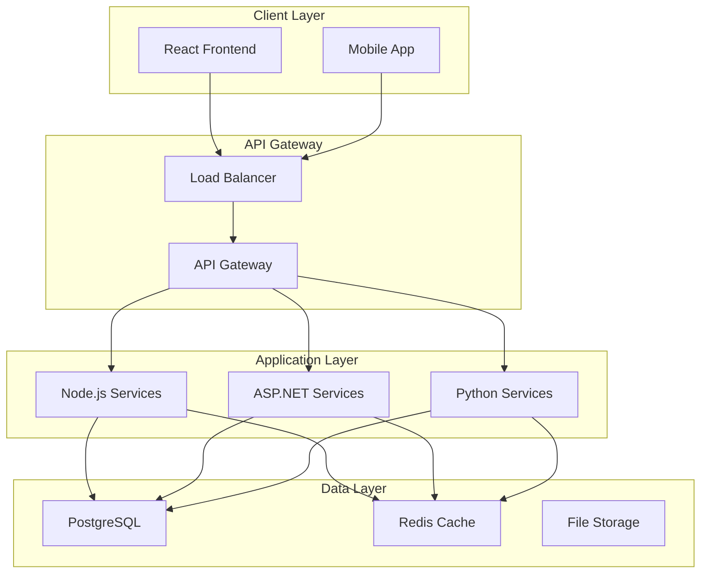
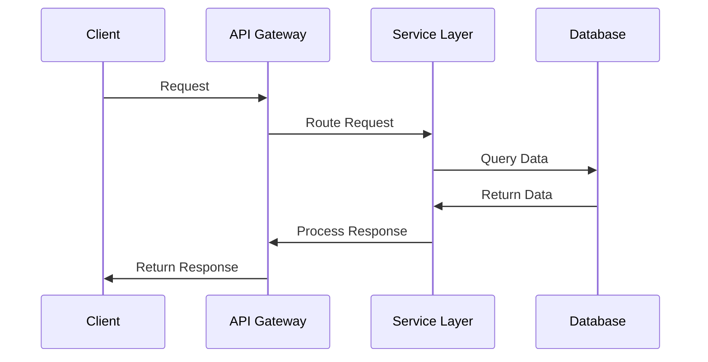
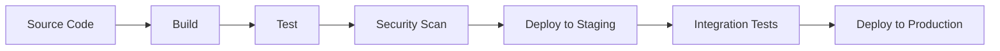

---
template_id: "technical-architecture-comprehensive"
template_name: "Comprehensive Technical Architecture Template"
version: "1.0.0"
category: "core"
personas: ["architect", "technical-documentation-architect", "cross-platform-integration-specialist"]
technologies: ["react", "typescript", "nodejs", "aspnet", "python", "postgresql", "redis"]
complexity: "advanced"
estimated_time: "90-120 minutes"
dependencies: ["project-brief", "requirements-analysis"]
tags: ["architecture", "system-design", "technical-specification", "cross-platform"]
---

# Technical Architecture: {{PROJECT_NAME}}

## Architecture Overview
**System Name:** {{SYSTEM_NAME}}  
**Architecture Type:** {{ARCHITECTURE_TYPE}}  
**Technology Stack:** {{TECHNOLOGY_STACK}}  
**Deployment Model:** {{DEPLOYMENT_MODEL}}  
**Last Updated:** {{LAST_UPDATED}}  
**Architect:** {{ARCHITECT_NAME}}  

### Executive Summary
{{ARCHITECTURE_EXECUTIVE_SUMMARY}}

### Architecture Principles
1. **{{PRINCIPLE_1}}:** {{PRINCIPLE_1_DESCRIPTION}}
2. **{{PRINCIPLE_2}}:** {{PRINCIPLE_2_DESCRIPTION}}
3. **{{PRINCIPLE_3}}:** {{PRINCIPLE_3_DESCRIPTION}}

## System Context

### Business Context
{{BUSINESS_CONTEXT_DESCRIPTION}}

### Technical Context
{{TECHNICAL_CONTEXT_DESCRIPTION}}

### Integration Context
{{INTEGRATION_CONTEXT_DESCRIPTION}}

## Architecture Decisions

### Key Architectural Decisions
| Decision | Rationale | Alternatives Considered | Impact |
|----------|-----------|------------------------|--------|
| {{DECISION_1}} | {{RATIONALE_1}} | {{ALTERNATIVES_1}} | {{IMPACT_1}} |
| {{DECISION_2}} | {{RATIONALE_2}} | {{ALTERNATIVES_2}} | {{IMPACT_2}} |
| {{DECISION_3}} | {{RATIONALE_3}} | {{ALTERNATIVES_3}} | {{IMPACT_3}} |

### Technology Selection
- **Frontend Framework:** {{FRONTEND_FRAMEWORK}} - {{FRONTEND_RATIONALE}}
- **Backend Framework:** {{BACKEND_FRAMEWORK}} - {{BACKEND_RATIONALE}}
- **Database:** {{DATABASE_CHOICE}} - {{DATABASE_RATIONALE}}
- **Caching:** {{CACHING_SOLUTION}} - {{CACHING_RATIONALE}}
- **Message Queue:** {{MESSAGE_QUEUE}} - {{MESSAGE_QUEUE_RATIONALE}}

## System Architecture

### High-Level Architecture Diagram

### Component Architecture

#### Frontend Components (React/TypeScript)
- **{{FRONTEND_COMPONENT_1}}:** {{COMPONENT_1_DESCRIPTION}}
- **{{FRONTEND_COMPONENT_2}}:** {{COMPONENT_2_DESCRIPTION}}
- **{{FRONTEND_COMPONENT_3}}:** {{COMPONENT_3_DESCRIPTION}}

#### Backend Services
- **{{BACKEND_SERVICE_1}}:** {{SERVICE_1_DESCRIPTION}}
- **{{BACKEND_SERVICE_2}}:** {{SERVICE_2_DESCRIPTION}}
- **{{BACKEND_SERVICE_3}}:** {{SERVICE_3_DESCRIPTION}}

#### Data Components
- **{{DATA_COMPONENT_1}}:** {{DATA_COMPONENT_1_DESCRIPTION}}
- **{{DATA_COMPONENT_2}}:** {{DATA_COMPONENT_2_DESCRIPTION}}

## Cross-Platform Integration

### API Design
- **API Style:** {{API_STYLE}} (REST/GraphQL/gRPC)
- **Authentication:** {{AUTHENTICATION_METHOD}}
- **Authorization:** {{AUTHORIZATION_METHOD}}
- **Rate Limiting:** {{RATE_LIMITING_STRATEGY}}

### Data Flow Architecture

### Integration Patterns
1. **{{INTEGRATION_PATTERN_1}}:** {{PATTERN_1_DESCRIPTION}}
2. **{{INTEGRATION_PATTERN_2}}:** {{PATTERN_2_DESCRIPTION}}
3. **{{INTEGRATION_PATTERN_3}}:** {{PATTERN_3_DESCRIPTION}}

## Technology Stack Details

### Frontend Stack (React/TypeScript)
- **Framework:** React {{REACT_VERSION}}
- **Language:** TypeScript {{TYPESCRIPT_VERSION}}
- **Build Tool:** {{BUILD_TOOL}}
- **State Management:** {{STATE_MANAGEMENT}}
- **UI Library:** {{UI_LIBRARY}}
- **Testing:** {{FRONTEND_TESTING_TOOLS}}

### Backend Stack (Node.js/ASP.NET/Python)
- **Node.js Services:** {{NODEJS_DETAILS}}
- **ASP.NET Services:** {{ASPNET_DETAILS}}
- **Python Services:** {{PYTHON_DETAILS}}
- **API Framework:** {{API_FRAMEWORK}}
- **ORM/Data Access:** {{ORM_DETAILS}}

### Database Architecture
- **Primary Database:** {{PRIMARY_DATABASE}}
- **Caching Layer:** {{CACHING_LAYER}}
- **Search Engine:** {{SEARCH_ENGINE}}
- **Message Queue:** {{MESSAGE_QUEUE_DETAILS}}

### Infrastructure
- **Cloud Provider:** {{CLOUD_PROVIDER}}
- **Containerization:** {{CONTAINERIZATION}}
- **Orchestration:** {{ORCHESTRATION}}
- **Monitoring:** {{MONITORING_TOOLS}}

## Security Architecture

### Security Principles
1. **{{SECURITY_PRINCIPLE_1}}:** {{SECURITY_DESCRIPTION_1}}
2. **{{SECURITY_PRINCIPLE_2}}:** {{SECURITY_DESCRIPTION_2}}
3. **{{SECURITY_PRINCIPLE_3}}:** {{SECURITY_DESCRIPTION_3}}

### Authentication & Authorization
- **Authentication Method:** {{AUTH_METHOD}}
- **Token Management:** {{TOKEN_MANAGEMENT}}
- **Session Management:** {{SESSION_MANAGEMENT}}
- **Role-Based Access:** {{RBAC_DETAILS}}

### Data Security
- **Encryption at Rest:** {{ENCRYPTION_REST}}
- **Encryption in Transit:** {{ENCRYPTION_TRANSIT}}
- **Data Classification:** {{DATA_CLASSIFICATION}}
- **Privacy Compliance:** {{PRIVACY_COMPLIANCE}}

## Performance Architecture

### Performance Requirements
- **Response Time:** {{RESPONSE_TIME_REQUIREMENTS}}
- **Throughput:** {{THROUGHPUT_REQUIREMENTS}}
- **Concurrent Users:** {{CONCURRENT_USER_REQUIREMENTS}}
- **Availability:** {{AVAILABILITY_REQUIREMENTS}}

### Performance Strategies
- **Caching Strategy:** {{CACHING_STRATEGY}}
- **Load Balancing:** {{LOAD_BALANCING_STRATEGY}}
- **Database Optimization:** {{DATABASE_OPTIMIZATION}}
- **CDN Strategy:** {{CDN_STRATEGY}}

### Scalability Plan
- **Horizontal Scaling:** {{HORIZONTAL_SCALING_PLAN}}
- **Vertical Scaling:** {{VERTICAL_SCALING_PLAN}}
- **Auto-scaling:** {{AUTO_SCALING_CONFIGURATION}}

## Deployment Architecture

### Environment Strategy
- **Development:** {{DEV_ENVIRONMENT_DETAILS}}
- **Testing:** {{TEST_ENVIRONMENT_DETAILS}}
- **Staging:** {{STAGING_ENVIRONMENT_DETAILS}}
- **Production:** {{PROD_ENVIRONMENT_DETAILS}}

### CI/CD Pipeline

### Infrastructure as Code
- **IaC Tool:** {{IAC_TOOL}}
- **Configuration Management:** {{CONFIG_MANAGEMENT}}
- **Secret Management:** {{SECRET_MANAGEMENT}}

## Monitoring and Observability

### Monitoring Strategy
- **Application Monitoring:** {{APP_MONITORING}}
- **Infrastructure Monitoring:** {{INFRA_MONITORING}}
- **Log Management:** {{LOG_MANAGEMENT}}
- **Error Tracking:** {{ERROR_TRACKING}}

### Observability Tools
- **Metrics:** {{METRICS_TOOLS}}
- **Tracing:** {{TRACING_TOOLS}}
- **Alerting:** {{ALERTING_TOOLS}}

## Risk Assessment

### Technical Risks
| Risk | Probability | Impact | Mitigation Strategy |
|------|-------------|--------|-------------------|
| {{TECH_RISK_1}} | {{PROBABILITY_1}} | {{IMPACT_1}} | {{MITIGATION_1}} |
| {{TECH_RISK_2}} | {{PROBABILITY_2}} | {{IMPACT_2}} | {{MITIGATION_2}} |

### Architectural Risks
| Risk | Probability | Impact | Mitigation Strategy |
|------|-------------|--------|-------------------|
| {{ARCH_RISK_1}} | {{PROBABILITY_1}} | {{IMPACT_1}} | {{MITIGATION_1}} |
| {{ARCH_RISK_2}} | {{PROBABILITY_2}} | {{IMPACT_2}} | {{MITIGATION_2}} |

## Quality Attributes

### Quality Requirements
- **Reliability:** {{RELIABILITY_REQUIREMENTS}}
- **Performance:** {{PERFORMANCE_REQUIREMENTS}}
- **Security:** {{SECURITY_REQUIREMENTS}}
- **Maintainability:** {{MAINTAINABILITY_REQUIREMENTS}}
- **Usability:** {{USABILITY_REQUIREMENTS}}

### Quality Assurance
- **Code Quality:** {{CODE_QUALITY_STANDARDS}}
- **Testing Strategy:** {{TESTING_STRATEGY}}
- **Review Process:** {{REVIEW_PROCESS}}

## Migration Strategy

### Migration Approach
{{MIGRATION_APPROACH_DESCRIPTION}}

### Migration Phases
1. **Phase 1:** {{MIGRATION_PHASE_1}}
2. **Phase 2:** {{MIGRATION_PHASE_2}}
3. **Phase 3:** {{MIGRATION_PHASE_3}}

### Rollback Plan
{{ROLLBACK_PLAN_DESCRIPTION}}

## Documentation and Training

### Technical Documentation
- **API Documentation:** {{API_DOCS_LOCATION}}
- **Database Schema:** {{DB_SCHEMA_LOCATION}}
- **Deployment Guides:** {{DEPLOYMENT_DOCS_LOCATION}}

### Training Requirements
- **Development Team:** {{DEV_TRAINING_REQUIREMENTS}}
- **Operations Team:** {{OPS_TRAINING_REQUIREMENTS}}
- **End Users:** {{USER_TRAINING_REQUIREMENTS}}

## Appendices

### Appendix A: Detailed Component Specifications
{{DETAILED_COMPONENT_SPECS}}

### Appendix B: API Specifications
{{API_SPECIFICATIONS}}

### Appendix C: Database Schema
{{DATABASE_SCHEMA}}

### Appendix D: Configuration Examples
{{CONFIGURATION_EXAMPLES}}

---

## Template Usage Notes

### Variable Substitution Guide
Replace all `{{VARIABLE_NAME}}` placeholders with project-specific information.

### Customization Options
- Adapt technology stack sections to match project requirements
- Add additional architecture views as needed
- Include project-specific architectural patterns
- Expand security sections based on compliance requirements

### Quality Validation Checklist
- [ ] All architectural decisions are documented with rationale
- [ ] Technology choices align with project requirements
- [ ] Security considerations are comprehensive
- [ ] Performance requirements are clearly defined
- [ ] Integration patterns are well-documented
- [ ] Deployment strategy is feasible and tested
- [ ] Risk assessment covers all major architectural risks
- [ ] Quality attributes are measurable and testable

### Integration Points
- **BMAD Personas:** Architect, Technical Documentation Architect, Cross-Platform Integration Specialist
- **Follow-up Templates:** API Documentation Template, Deployment Template
- **Quality Standards:** BMAD Method architecture quality framework

---
**Template Version:** 1.0.0  
**Last Updated:** {{CURRENT_DATE}}  
**Template Owner:** BMAD Method Team
