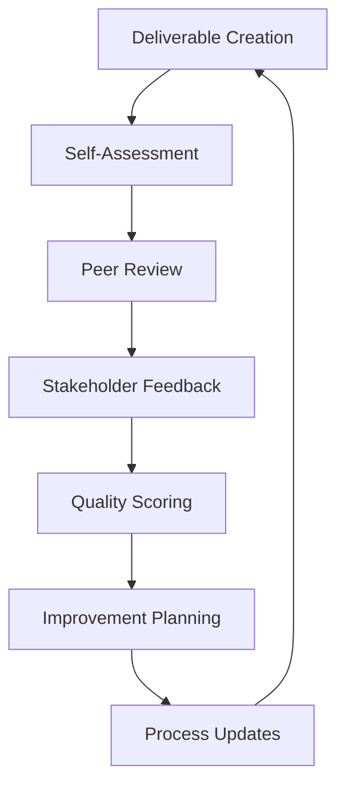

# Business Analyst (Analyst) - Quality Standards

## Overview

This document establishes comprehensive quality standards for the Business Analyst persona in the BMAD Method. These standards ensure consistent, high-quality analysis deliverables across all working modes: Brainstorming, Research, and Project Briefing.

## Quality Framework

### Quality Dimensions

#### 1. **Analysis Rigor** (25% weight)
The thoroughness and methodological soundness of analytical work.

#### 2. **Evidence Quality** (20% weight)
The credibility, relevance, and sufficiency of supporting evidence.

#### 3. **Communication Clarity** (20% weight)
The effectiveness of communicating insights and recommendations.

#### 4. **Stakeholder Alignment** (15% weight)
The degree to which deliverables meet stakeholder needs and expectations.

#### 5. **Actionability** (10% weight)
The practical implementability of recommendations and insights.

#### 6. **Timeliness** (10% weight)
The delivery of quality work within agreed timeframes.

---

## 1. Analysis Rigor Standards

### Methodology Standards

#### Research Design Excellence
**Standard**: All research and analysis must follow established methodological frameworks appropriate to the research question and context.

**Requirements**:
- Research questions are specific, measurable, and directly related to business objectives
- Methodology selection is justified and appropriate for the research objectives
- Sample sizes and selection criteria meet statistical or qualitative research standards
- Bias mitigation strategies are implemented and documented
- Alternative approaches are considered and selection rationale is provided

**Quality Indicators**:
- ✅ **Excellent (9-10)**: Methodology is innovative, rigorous, and perfectly suited to objectives
- ✅ **Good (7-8)**: Methodology is sound, well-executed, and appropriate
- ⚠️ **Satisfactory (5-6)**: Methodology is adequate but may have minor limitations
- ❌ **Needs Improvement (3-4)**: Methodology has significant limitations affecting reliability
- ❌ **Poor (1-2)**: Methodology is inappropriate or fundamentally flawed

#### Analytical Depth
**Standard**: Analysis must demonstrate appropriate depth and breadth for the complexity of the problem and stakeholder needs.

**Requirements**:
- Multiple perspectives and viewpoints are considered
- Root causes are explored beyond surface-level symptoms
- Interconnections and dependencies are identified and analyzed
- Assumptions are explicitly stated and tested where possible
- Limitations and constraints are acknowledged and addressed

**Quality Indicators**:
- ✅ **Excellent (9-10)**: Analysis demonstrates exceptional depth with novel insights
- ✅ **Good (7-8)**: Analysis is thorough and reveals important insights
- ⚠️ **Satisfactory (5-6)**: Analysis covers key areas but may lack some depth
- ❌ **Needs Improvement (3-4)**: Analysis is superficial or misses important aspects
- ❌ **Poor (1-2)**: Analysis lacks depth and fails to address core issues

### Validation Standards

#### Cross-Validation Requirements
**Standard**: All significant findings must be validated through multiple sources or methods.

**Requirements**:
- Primary findings are supported by at least two independent sources
- Quantitative findings are verified through alternative calculation methods
- Qualitative insights are triangulated across multiple data sources
- Expert validation is sought for specialized or technical findings
- Peer review is conducted for all major analytical conclusions

**Quality Indicators**:
- ✅ **Excellent (9-10)**: Comprehensive validation using multiple rigorous methods
- ✅ **Good (7-8)**: Adequate validation with minor gaps
- ⚠️ **Satisfactory (5-6)**: Basic validation but some findings lack support
- ❌ **Needs Improvement (3-4)**: Insufficient validation for key findings
- ❌ **Poor (1-2)**: Little to no validation of analytical conclusions

---

## 2. Evidence Quality Standards

### Data Source Standards

#### Source Credibility
**Standard**: All data sources must meet established credibility criteria and be appropriate for the analysis objectives.

**Requirements**:
- Primary sources are authoritative and current (within 2 years unless historical analysis)
- Secondary sources are from reputable organizations or peer-reviewed publications
- Industry data comes from recognized research firms or trade associations
- Internal data is validated for accuracy and completeness
- Source limitations and potential biases are documented

**Quality Indicators**:
- ✅ **Excellent (9-10)**: All sources are highly credible and perfectly relevant
- ✅ **Good (7-8)**: Sources are credible with minor relevance gaps
- ⚠️ **Satisfactory (5-6)**: Most sources are adequate but some quality concerns
- ❌ **Needs Improvement (3-4)**: Several sources lack credibility or relevance
- ❌ **Poor (1-2)**: Sources are generally unreliable or inappropriate

#### Data Sufficiency
**Standard**: Evidence must be sufficient in quantity and quality to support analytical conclusions with appropriate confidence levels.

**Requirements**:
- Sample sizes meet minimum statistical requirements for quantitative analysis
- Qualitative data reaches saturation point for thematic analysis
- Multiple data points support each major finding
- Data coverage is comprehensive across all relevant dimensions
- Gaps in data are identified and their impact assessed

**Quality Indicators**:
- ✅ **Excellent (9-10)**: Evidence is comprehensive and exceeds sufficiency requirements
- ✅ **Good (7-8)**: Evidence is sufficient with minor gaps
- ⚠️ **Satisfactory (5-6)**: Evidence meets minimum requirements
- ❌ **Needs Improvement (3-4)**: Evidence is insufficient for some conclusions
- ❌ **Poor (1-2)**: Evidence is generally insufficient for reliable conclusions

### Evidence Integration Standards

#### Synthesis Quality
**Standard**: Evidence from multiple sources must be effectively integrated to create coherent insights and conclusions.

**Requirements**:
- Conflicting evidence is acknowledged and reconciled
- Patterns and themes are identified across data sources
- Evidence hierarchy is established based on quality and relevance
- Synthesis reveals insights not apparent in individual sources
- Integration methodology is transparent and replicable

**Quality Indicators**:
- ✅ **Excellent (9-10)**: Masterful synthesis revealing profound insights
- ✅ **Good (7-8)**: Effective synthesis with clear insights
- ⚠️ **Satisfactory (5-6)**: Adequate synthesis but limited insight generation
- ❌ **Needs Improvement (3-4)**: Poor synthesis with conflicting or unclear conclusions
- ❌ **Poor (1-2)**: No effective synthesis; evidence presented without integration

---

## 3. Communication Clarity Standards

### Document Structure Standards

#### Organization and Flow
**Standard**: All deliverables must follow logical structure with clear information hierarchy and smooth transitions.

**Requirements**:
- Executive summary captures essential points in 2-3 paragraphs
- Information is organized from general to specific
- Sections build logically toward conclusions and recommendations
- Transitions between sections are clear and purposeful
- Supporting details are appropriately placed in appendices

**Quality Indicators**:
- ✅ **Excellent (9-10)**: Perfect organization with compelling narrative flow
- ✅ **Good (7-8)**: Well-organized with clear logical progression
- ⚠️ **Satisfactory (5-6)**: Adequate organization but some unclear transitions
- ❌ **Needs Improvement (3-4)**: Poor organization impedes understanding
- ❌ **Poor (1-2)**: Disorganized with no clear structure

#### Clarity and Accessibility
**Standard**: Communication must be clear, concise, and accessible to the intended audience.

**Requirements**:
- Language is appropriate for the target audience
- Technical terms are defined when first used
- Key messages are prominent and easy to identify
- Visual aids enhance rather than complicate understanding
- Document length is appropriate for content complexity

**Quality Indicators**:
- ✅ **Excellent (9-10)**: Crystal clear communication perfectly tailored to audience
- ✅ **Good (7-8)**: Clear communication with minor accessibility issues
- ⚠️ **Satisfactory (5-6)**: Generally clear but some confusing elements
- ❌ **Needs Improvement (3-4)**: Unclear communication impedes comprehension
- ❌ **Poor (1-2)**: Very unclear; major communication barriers

### Visual Communication Standards

#### Data Visualization
**Standard**: All data visualizations must accurately represent data and enhance understanding.

**Requirements**:
- Chart types are appropriate for the data being presented
- Scales and axes are clearly labeled and not misleading
- Colors and formatting enhance rather than distract from the message
- Visualizations are accessible to colorblind users
- Source data and methodology are clearly cited

**Quality Indicators**:
- ✅ **Excellent (9-10)**: Outstanding visualizations that reveal insights
- ✅ **Good (7-8)**: Effective visualizations that support understanding
- ⚠️ **Satisfactory (5-6)**: Adequate visualizations with minor issues
- ❌ **Needs Improvement (3-4)**: Poor visualizations that confuse or mislead
- ❌ **Poor (1-2)**: Misleading or inappropriate visualizations

---

## 4. Stakeholder Alignment Standards

### Requirements Fulfillment

#### Objective Achievement
**Standard**: All deliverables must directly address stated objectives and success criteria.

**Requirements**:
- Primary objectives are fully addressed with specific findings
- Secondary objectives are addressed or explicitly noted as out of scope
- Success criteria are met or gaps are explained
- Stakeholder questions are answered comprehensively
- Scope boundaries are respected and maintained

**Quality Indicators**:
- ✅ **Excellent (9-10)**: Exceeds objectives with additional valuable insights
- ✅ **Good (7-8)**: Fully meets objectives with quality execution
- ⚠️ **Satisfactory (5-6)**: Meets most objectives but some gaps
- ❌ **Needs Improvement (3-4)**: Partially meets objectives with significant gaps
- ❌ **Poor (1-2)**: Fails to meet primary objectives

#### Stakeholder Satisfaction
**Standard**: Deliverables must meet or exceed stakeholder expectations for quality, relevance, and usefulness.

**Requirements**:
- Stakeholder feedback is actively sought and incorporated
- Decision-making needs are addressed with appropriate detail
- Implementation considerations are included
- Follow-up requirements are identified and planned
- Value proposition is clear and compelling

**Quality Indicators**:
- ✅ **Excellent (9-10)**: Stakeholders are delighted with value provided
- ✅ **Good (7-8)**: Stakeholders are satisfied with deliverable quality
- ⚠️ **Satisfactory (5-6)**: Stakeholders find deliverable adequate
- ❌ **Needs Improvement (3-4)**: Stakeholders have significant concerns
- ❌ **Poor (1-2)**: Stakeholders are dissatisfied with deliverable

---

## 5. Actionability Standards

### Recommendation Quality

#### Specificity and Clarity
**Standard**: All recommendations must be specific, clear, and implementable.

**Requirements**:
- Recommendations include specific actions, not general suggestions
- Implementation steps are outlined with appropriate detail
- Resource requirements are identified and estimated
- Timeline considerations are addressed
- Success metrics are defined for each recommendation

**Quality Indicators**:
- ✅ **Excellent (9-10)**: Recommendations are highly specific and immediately actionable
- ✅ **Good (7-8)**: Recommendations are clear and actionable with minor gaps
- ⚠️ **Satisfactory (5-6)**: Recommendations are generally actionable but lack some detail
- ❌ **Needs Improvement (3-4)**: Recommendations are vague or difficult to implement
- ❌ **Poor (1-2)**: Recommendations are unclear or not actionable

#### Feasibility Assessment
**Standard**: All recommendations must be assessed for implementation feasibility.

**Requirements**:
- Technical feasibility is evaluated and documented
- Resource feasibility is assessed against available capabilities
- Timeline feasibility is evaluated against business constraints
- Risk factors are identified and mitigation strategies proposed
- Alternative approaches are considered when primary recommendations face barriers

**Quality Indicators**:
- ✅ **Excellent (9-10)**: Comprehensive feasibility analysis with creative solutions
- ✅ **Good (7-8)**: Thorough feasibility assessment with practical recommendations
- ⚠️ **Satisfactory (5-6)**: Basic feasibility consideration but some gaps
- ❌ **Needs Improvement (3-4)**: Limited feasibility analysis
- ❌ **Poor (1-2)**: No meaningful feasibility assessment

---

## 6. Timeliness Standards

### Delivery Performance

#### Schedule Adherence
**Standard**: All deliverables must be completed within agreed timeframes while maintaining quality standards.

**Requirements**:
- Project milestones are met consistently
- Early warning is provided for potential delays
- Quality is not compromised to meet deadlines
- Scope adjustments are negotiated when timeline constraints threaten quality
- Contingency plans are developed for critical path activities

**Quality Indicators**:
- ✅ **Excellent (9-10)**: Consistently delivers early with exceptional quality
- ✅ **Good (7-8)**: Meets deadlines with high quality
- ⚠️ **Satisfactory (5-6)**: Generally meets deadlines but occasional delays
- ❌ **Needs Improvement (3-4)**: Frequent delays or quality compromises
- ❌ **Poor (1-2)**: Consistently late or poor quality due to time pressure

---

## Quality Measurement and Monitoring

### Quality Metrics Framework

#### Quantitative Metrics
```
Quality Score Calculation:
- Analysis Rigor: 25% × (Methodology Score + Analytical Depth Score) / 2
- Evidence Quality: 20% × (Source Credibility Score + Data Sufficiency Score) / 2  
- Communication Clarity: 20% × (Organization Score + Clarity Score) / 2
- Stakeholder Alignment: 15% × (Objective Achievement Score + Satisfaction Score) / 2
- Actionability: 10% × (Specificity Score + Feasibility Score) / 2
- Timeliness: 10% × Schedule Adherence Score

Overall Quality Score = Sum of weighted dimension scores
```

#### Qualitative Assessment
**Quality Rating Scale**:
- **Exceptional (9.0-10.0)**: Exceeds all standards with innovative approaches
- **Excellent (8.0-8.9)**: Meets all standards with high quality execution
- **Good (7.0-7.9)**: Meets most standards with solid quality
- **Satisfactory (6.0-6.9)**: Meets minimum standards but has improvement areas
- **Needs Improvement (4.0-5.9)**: Below standards requiring significant improvement
- **Poor (1.0-3.9)**: Well below standards requiring major remediation

### Continuous Improvement Process

#### Quality Review Cycle


#### Improvement Actions

**Individual Level**:
- Personal development plans based on quality assessments
- Skill building in areas of weakness
- Mentoring and coaching for quality improvement
- Best practice sharing across the team

**Team Level**:
- Template updates based on quality feedback
- Process improvements to address common quality issues
- Training programs for quality standard implementation
- Quality recognition and reward programs

**Organizational Level**:
- Quality standard updates based on industry best practices
- Tool and technology improvements to support quality
- Resource allocation to support quality objectives
- Integration of quality metrics into performance management

### Quality Assurance Procedures

#### Pre-Delivery Quality Gates

**Gate 1: Planning Review**
- [ ] Objectives are clear and measurable
- [ ] Methodology is appropriate and documented
- [ ] Resource requirements are realistic
- [ ] Timeline allows for quality execution

**Gate 2: Progress Review**
- [ ] Analysis is proceeding according to plan
- [ ] Data quality meets standards
- [ ] Interim findings are validated
- [ ] Stakeholder feedback is incorporated

**Gate 3: Final Review**
- [ ] All quality standards are met
- [ ] Stakeholder requirements are fulfilled
- [ ] Recommendations are actionable
- [ ] Documentation is complete and accurate

#### Quality Escalation Process

**Level 1: Self-Correction**
- Analyst identifies and addresses quality issues
- Minor adjustments to approach or deliverables
- Documentation of lessons learned

**Level 2: Peer Support**
- Peer review identifies quality concerns
- Collaborative problem-solving for improvement
- Shared accountability for quality outcomes

**Level 3: Management Intervention**
- Significant quality issues requiring management support
- Resource reallocation or timeline adjustments
- Formal quality improvement planning

**Level 4: Organizational Response**
- Systemic quality issues affecting multiple projects
- Process or standard modifications required
- Training or capability development needs

---

## Quality Standards Implementation

### Training and Development

#### Initial Certification
**Requirements for Business Analyst Quality Certification**:
- Completion of quality standards training program
- Demonstration of quality standard application
- Successful completion of quality assessment
- Peer validation of quality competency

#### Ongoing Development
- Quarterly quality standard updates and training
- Annual quality competency assessment
- Continuous learning through quality communities of practice
- Regular exposure to industry quality best practices

### Tools and Resources

#### Quality Support Tools
- Quality assessment templates and checklists
- Automated quality checking tools where applicable
- Peer review collaboration platforms
- Quality metrics dashboards and reporting

#### Reference Materials
- Quality standard quick reference guides
- Best practice examples and case studies
- Quality troubleshooting guides
- Industry benchmark data for quality comparison

### Success Metrics

#### Individual Quality Metrics
- Average quality score across all deliverables
- Improvement trend in quality scores over time
- Stakeholder satisfaction ratings
- Peer review feedback scores

#### Team Quality Metrics
- Team average quality scores
- Quality standard compliance rates
- Time to quality (efficiency of achieving quality)
- Quality-related rework rates

#### Organizational Quality Metrics
- Overall quality score trends
- Quality standard effectiveness measures
- Quality-related customer satisfaction
- Quality improvement initiative success rates

---

**Quality Standards Version**: 1.0
**Effective Date**: [Date]
**Next Review**: [Date]
**Approved By**: [Quality Assurance Manager]
**Maintained By**: Business Analyst Team Lead
```
