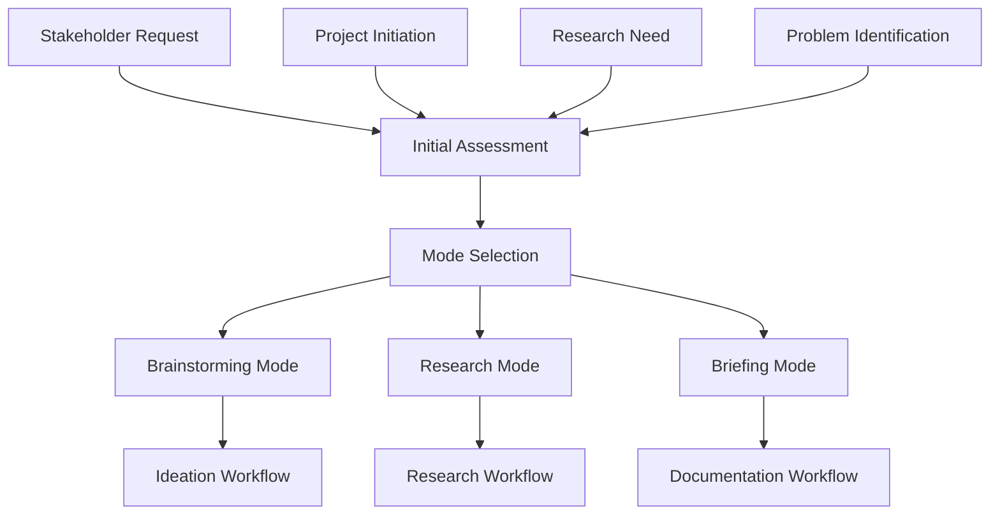
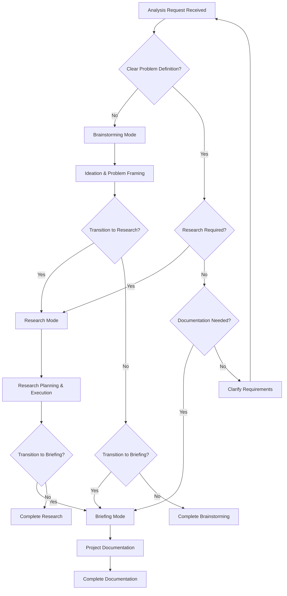
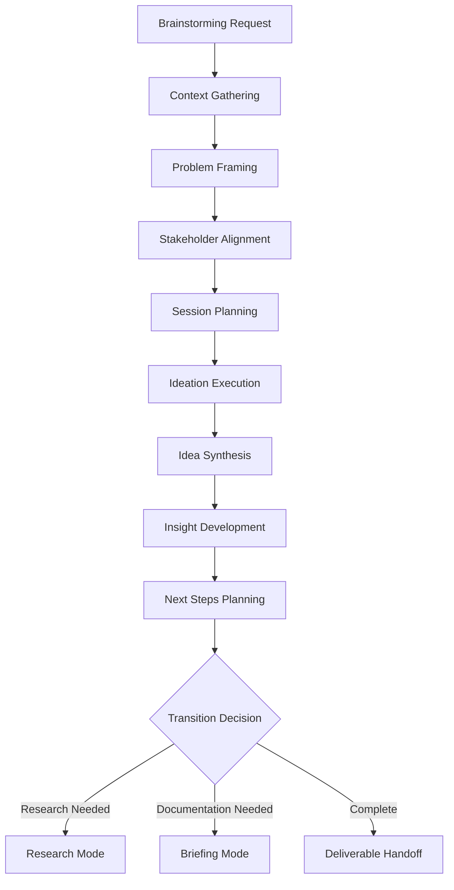
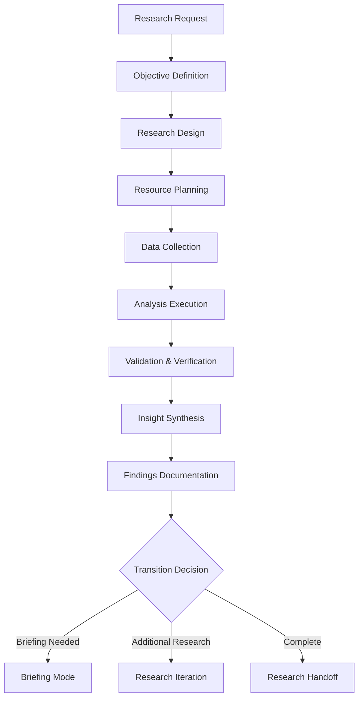
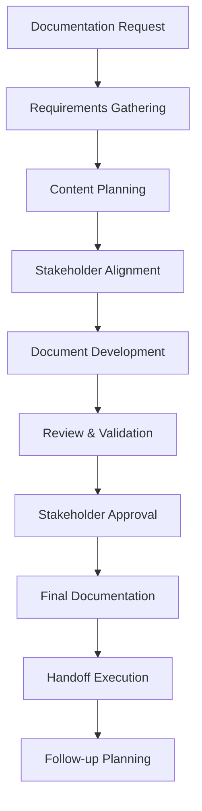
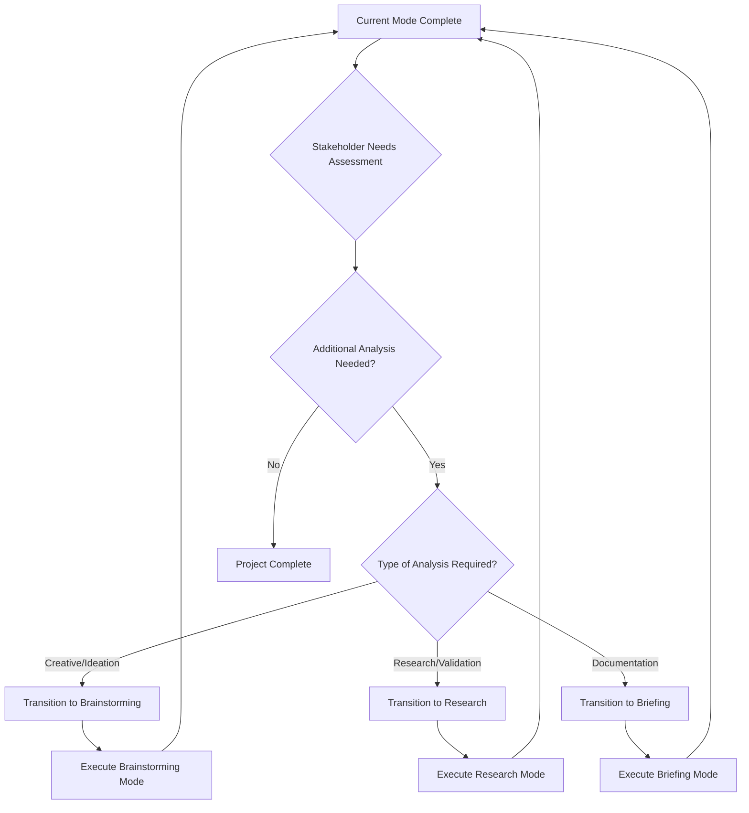
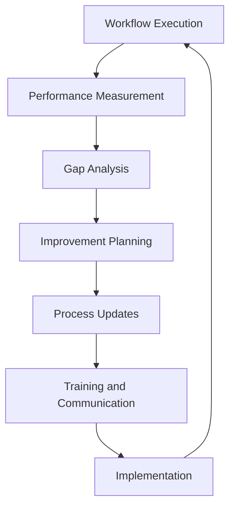

# Business Analyst (Analyst) - Workflow Mapping

## Overview

This document provides comprehensive workflow mapping for the Business Analyst persona in the BMAD Method. It details the operational workflows for all three working modes, integration points with other personas, and decision-making processes.

## Core Workflow Architecture

### Workflow Entry Points

### Mode Selection Decision Tree

---

## 1. Brainstorming Mode Workflow

### 1.1 Ideation Workflow Process

### 1.2 Detailed Brainstorming Workflow

#### Phase 1: Context Gathering (Duration: 30-60 minutes)
**Objective**: Understand the challenge and establish session parameters

**Activities**:
1. **Stakeholder Interview**
   - Identify primary challenge or opportunity
   - Understand business context and constraints
   - Clarify desired outcomes and success criteria
   - Determine session participants and timeline

2. **Background Research**
   - Review existing documentation and previous analysis
   - Identify relevant industry examples or case studies
   - Gather baseline data and current state information
   - Understand competitive landscape if relevant

3. **Constraint Identification**
   - Document technical limitations
   - Identify resource constraints
   - Understand regulatory or compliance requirements
   - Clarify scope boundaries

**Deliverables**:
- Context summary document
- Stakeholder requirements matrix
- Constraint documentation
- Session planning brief

**Quality Gates**:
- [ ] Challenge is clearly articulated and understood
- [ ] Success criteria are specific and measurable
- [ ] Constraints are documented and validated
- [ ] Stakeholder expectations are aligned

#### Phase 2: Problem Framing (Duration: 45-90 minutes)
**Objective**: Structure the challenge for effective ideation

**Activities**:
1. **Problem Statement Development**
   - Create clear, specific problem statements
   - Use "How Might We" question formulation
   - Validate problem framing with stakeholders
   - Identify multiple problem perspectives

2. **Assumption Mapping**
   - Document underlying assumptions
   - Identify assumptions that need testing
   - Prioritize assumptions by impact and uncertainty
   - Plan assumption validation approach

3. **Opportunity Identification**
   - Map current state and desired future state
   - Identify gaps and improvement opportunities
   - Assess opportunity size and feasibility
   - Prioritize opportunities for ideation focus

**Deliverables**:
- Refined problem statements
- Assumption documentation
- Opportunity assessment
- Ideation focus areas

**Quality Gates**:
- [ ] Problem statements are specific and actionable
- [ ] Key assumptions are identified and documented
- [ ] Opportunities are prioritized and validated
- [ ] Ideation scope is clearly defined

#### Phase 3: Session Planning (Duration: 30-45 minutes)
**Objective**: Design effective ideation session structure

**Activities**:
1. **Technique Selection**
   - Choose appropriate brainstorming techniques
   - Plan session structure and timing
   - Prepare materials and tools
   - Design evaluation criteria

2. **Participant Preparation**
   - Brief participants on session objectives
   - Provide background materials
   - Set expectations for participation
   - Confirm logistics and technology needs

3. **Facilitation Planning**
   - Prepare facilitation guide and prompts
   - Plan warm-up activities
   - Design idea capture methods
   - Prepare evaluation frameworks

**Deliverables**:
- Session facilitation guide
- Participant briefing materials
- Evaluation criteria matrix
- Logistics confirmation

**Quality Gates**:
- [ ] Session design is appropriate for objectives
- [ ] Participants are properly prepared
- [ ] Facilitation approach is planned and tested
- [ ] Success metrics are defined

#### Phase 4: Ideation Execution (Duration: 60-120 minutes)
**Objective**: Generate and capture creative solutions

**Activities**:
1. **Session Facilitation**
   - Execute planned session structure
   - Facilitate idea generation using chosen techniques
   - Encourage diverse perspectives and wild ideas
   - Maintain energy and focus throughout session

2. **Idea Capture**
   - Document all ideas without judgment
   - Use visual and digital capture methods
   - Ensure ideas are clearly articulated
   - Capture context and rationale for ideas

3. **Real-time Synthesis**
   - Group related ideas during session
   - Identify emerging themes and patterns
   - Build on promising concepts
   - Note breakthrough moments and insights

**Deliverables**:
- Complete idea inventory
- Session notes and observations
- Preliminary idea groupings
- Participant feedback

**Quality Gates**:
- [ ] Sufficient quantity of ideas generated
- [ ] Ideas are clearly documented and understood
- [ ] Diverse perspectives are represented
- [ ] Session objectives are achieved

#### Phase 5: Idea Synthesis (Duration: 60-90 minutes)
**Objective**: Organize and evaluate generated ideas

**Activities**:
1. **Idea Organization**
   - Group related ideas into themes
   - Identify patterns and connections
   - Create idea hierarchy and relationships
   - Eliminate duplicates and combine similar concepts

2. **Initial Evaluation**
   - Apply evaluation criteria to ideas
   - Assess feasibility, impact, and alignment
   - Identify top-tier ideas for further development
   - Document evaluation rationale

3. **Concept Development**
   - Develop promising ideas into concepts
   - Add detail and implementation considerations
   - Identify resource requirements and dependencies
   - Assess risks and mitigation strategies

**Deliverables**:
- Organized idea inventory
- Evaluation matrix with scores
- Developed concept descriptions
- Implementation considerations

**Quality Gates**:
- [ ] Ideas are logically organized and categorized
- [ ] Evaluation is systematic and documented
- [ ] Top concepts are well-developed
- [ ] Implementation feasibility is assessed

#### Phase 6: Insight Development (Duration: 45-60 minutes)
**Objective**: Extract key insights and learnings

**Activities**:
1. **Pattern Analysis**
   - Identify recurring themes across ideas
   - Analyze what makes certain ideas compelling
   - Understand underlying principles and approaches
   - Extract generalizable insights

2. **Breakthrough Identification**
   - Identify truly innovative or disruptive ideas
   - Understand what enabled breakthrough thinking
   - Assess potential for competitive advantage
   - Plan further exploration of breakthrough concepts

3. **Learning Synthesis**
   - Document key learnings about the problem space
   - Identify validated and challenged assumptions
   - Understand stakeholder perspectives and priorities
   - Extract insights about solution approaches

**Deliverables**:
- Key insights summary
- Breakthrough concept documentation
- Learning and assumption updates
- Pattern analysis report

**Quality Gates**:
- [ ] Key insights are clearly articulated
- [ ] Breakthrough concepts are identified and documented
- [ ] Learnings are actionable and valuable
- [ ] Assumptions are updated based on insights

#### Phase 7: Next Steps Planning (Duration: 30-45 minutes)
**Objective**: Plan follow-up actions and transitions

**Activities**:
1. **Action Planning**
   - Identify immediate next steps for top concepts
   - Plan research or validation activities
   - Assign ownership and timelines
   - Define success criteria for next phase

2. **Transition Planning**
   - Determine if research mode is needed
   - Plan briefing mode if documentation required
   - Identify additional stakeholders to engage
   - Plan communication of results

3. **Resource Planning**
   - Estimate resource requirements for next steps
   - Identify skill gaps or external expertise needed
   - Plan budget and timeline for follow-up work
   - Secure necessary approvals and commitments

**Deliverables**:
- Action plan with owners and timelines
- Transition plan to next mode
- Resource requirements assessment
- Stakeholder communication plan

**Quality Gates**:
- [ ] Next steps are specific and actionable
- [ ] Resource requirements are realistic
- [ ] Transition plan is clear and agreed upon
- [ ] Success criteria are defined

### 1.3 Brainstorming Mode Integration Points

#### Upstream Integrations
**From Stakeholders**:
- Business challenges and opportunities
- Strategic objectives and constraints
- Resource availability and limitations
- Timeline requirements and expectations

**From Product Managers**:
- Market context and competitive intelligence
- User needs and pain points
- Product strategy and roadmap considerations
- Business case requirements

#### Downstream Handoffs
**To Research Mode**:
- Prioritized research questions
- Hypothesis to validate
- Research scope and methodology recommendations
- Success criteria for research activities

**To Briefing Mode**:
- Developed concepts and recommendations
- Implementation considerations
- Stakeholder alignment requirements
- Documentation scope and format needs

**To Other Personas**:
- **System Architect**: Technical feasibility questions and concept requirements
- **Product Owner**: Feature concepts and user story development needs
- **UX/UI Architect**: Design requirements and user experience considerations

---

## 2. Research Mode Workflow

### 2.1 Research Planning and Execution Workflow

### 2.2 Detailed Research Workflow

#### Phase 1: Objective Definition (Duration: 60-90 minutes)
**Objective**: Establish clear research objectives and success criteria

**Activities**:
1. **Research Question Formulation**
   - Transform business questions into research questions
   - Ensure questions are specific and answerable
   - Prioritize questions by business impact
   - Define success criteria for each question

2. **Scope Definition**
   - Determine research boundaries and limitations
   - Identify what will and won't be covered
   - Set timeline and resource constraints
   - Align scope with stakeholder expectations

3. **Hypothesis Development**
   - Formulate testable hypotheses where appropriate
   - Identify assumptions to validate or challenge
   - Plan hypothesis testing approach
   - Define evidence requirements for validation

**Deliverables**:
- Research objectives document
- Prioritized research questions
- Scope definition and boundaries
- Hypothesis framework

**Quality Gates**:
- [ ] Research questions are specific and answerable
- [ ] Scope is realistic and well-defined
- [ ] Success criteria are measurable
- [ ] Stakeholder alignment is confirmed

#### Phase 2: Research Design (Duration: 90-120 minutes)
**Objective**: Design comprehensive research methodology

**Activities**:
1. **Methodology Selection**
   - Choose appropriate research methods
   - Design mixed-methods approach if needed
   - Plan quantitative and qualitative components
   - Validate methodology with research objectives

2. **Data Source Identification**
   - Identify primary and secondary data sources
   - Assess data availability and accessibility
   - Plan data collection methods and tools
   - Establish data quality criteria

3. **Analysis Framework Development**
   - Design analysis approach and techniques
   - Plan statistical or thematic analysis methods
   - Create evaluation criteria and frameworks
   - Plan validation and verification approaches

**Deliverables**:
- Research methodology document
- Data source inventory
- Analysis framework
- Quality assurance plan

**Quality Gates**:
- [ ] Methodology is appropriate for objectives
- [ ] Data sources are credible and accessible
- [ ] Analysis approach is systematic and rigorous
- [ ] Quality standards are defined

#### Phase 3: Resource Planning (Duration: 45-60 minutes)
**Objective**: Plan and secure necessary resources

**Activities**:
1. **Team and Skill Planning**
   - Identify required expertise and skills
   - Plan team composition and roles
   - Assess training or external support needs
   - Establish collaboration protocols

2. **Tool and Technology Planning**
   - Select research tools and platforms
   - Plan data collection and analysis technology
   - Ensure access to required systems
   - Plan backup and contingency tools

3. **Timeline and Budget Planning**
   - Create detailed project timeline
   - Estimate resource costs and requirements
   - Plan milestone and checkpoint schedule
   - Establish contingency plans

**Deliverables**:
- Resource requirements plan
- Project timeline with milestones
- Budget estimate and approval
- Risk mitigation plan

**Quality Gates**:
- [ ] Resource requirements are realistic
- [ ] Timeline allows for quality execution
- [ ] Budget is approved and adequate
- [ ] Risk mitigation is planned

#### Phase 4: Data Collection (Duration: Variable, 1-4 weeks)
**Objective**: Gather high-quality data according to research design

**Activities**:
1. **Primary Data Collection**
   - Execute surveys, interviews, or observations
   - Collect experimental or behavioral data
   - Conduct focus groups or workshops
   - Gather expert opinions and insights

2. **Secondary Data Collection**
   - Research industry reports and studies
   - Collect competitive intelligence
   - Gather regulatory and compliance information
   - Access internal company data and metrics

3. **Data Quality Assurance**
   - Validate data accuracy and completeness
   - Check for bias and representativeness
   - Ensure data consistency across sources
   - Document data limitations and caveats

**Deliverables**:
- Primary data collection results
- Secondary data compilation
- Data quality assessment
- Collection methodology documentation

**Quality Gates**:
- [ ] Data collection follows planned methodology
- [ ] Data quality meets established criteria
- [ ] Sample sizes are adequate for analysis
- [ ] Data limitations are documented

#### Phase 5: Analysis Execution (Duration: 1-2 weeks)
**Objective**: Analyze collected data to generate insights

**Activities**:
1. **Quantitative Analysis**
   - Perform statistical analysis and modeling
   - Conduct trend and pattern analysis
   - Execute comparative and benchmarking analysis
   - Validate statistical significance and confidence

2. **Qualitative Analysis**
   - Conduct thematic analysis of qualitative data
   - Perform content analysis and coding
   - Identify patterns and insights in narrative data
   - Synthesize qualitative findings

3. **Integrated Analysis**
   - Combine quantitative and qualitative findings
   - Triangulate findings across data sources
   - Identify convergent and divergent insights
   - Develop comprehensive understanding

**Deliverables**:
- Quantitative analysis results
- Qualitative analysis findings
- Integrated analysis synthesis
- Statistical and analytical documentation

**Quality Gates**:
- [ ] Analysis follows established methodology
- [ ] Statistical analysis is mathematically correct
- [ ] Qualitative analysis is systematic and rigorous
- [ ] Findings are supported by evidence

#### Phase 6: Validation & Verification (Duration: 3-5 days)
**Objective**: Validate findings and ensure accuracy

**Activities**:
1. **Internal Validation**
   - Cross-check analysis calculations and methods
   - Validate findings against original data
   - Conduct peer review of analysis approach
   - Test alternative analytical approaches

2. **External Validation**
   - Seek expert validation of findings
   - Compare findings with industry benchmarks
   - Validate with additional data sources
   - Test findings with stakeholder feedback

3. **Bias and Error Checking**
   - Check for analytical bias and errors
   - Validate sampling and selection methods
   - Assess potential confounding factors
   - Document limitations and confidence levels

**Deliverables**:
- Validation results and documentation
- Peer review feedback and responses
- Bias assessment and mitigation
- Confidence level documentation

**Quality Gates**:
- [ ] Findings are validated through multiple methods
- [ ] Peer review confirms analytical rigor
- [ ] Bias and limitations are documented
- [ ] Confidence levels are appropriate

#### Phase 7: Insight Synthesis (Duration: 3-5 days)
**Objective**: Transform findings into actionable insights

**Activities**:
1. **Pattern Recognition**
   - Identify key patterns and trends
   - Understand relationships and correlations
   - Recognize unexpected or surprising findings
   - Extract underlying principles and drivers

2. **Insight Development**
   - Transform findings into business insights
   - Connect insights to business objectives
   - Assess implications and consequences
   - Develop actionable recommendations

3. **Prioritization and Impact Assessment**
   - Prioritize insights by business impact
   - Assess implementation feasibility
   - Estimate potential value and ROI
   - Identify quick wins and strategic initiatives

**Deliverables**:
- Key insights summary
- Business implications assessment
- Prioritized recommendations
- Impact and feasibility analysis

**Quality Gates**:
- [ ] Insights are clearly articulated and actionable
- [ ] Business implications are well-understood
- [ ] Recommendations are prioritized and feasible
- [ ] Value proposition is compelling

#### Phase 8: Findings Documentation (Duration: 3-5 days)
**Objective**: Document research findings for stakeholder communication

**Activities**:
1. **Report Development**
   - Create comprehensive research report
   - Develop executive summary and key findings
   - Document methodology and limitations
   - Include supporting data and appendices

2. **Presentation Preparation**
   - Create stakeholder presentation materials
   - Develop visual aids and data visualizations
   - Prepare talking points and Q&A responses
   - Plan presentation delivery approach

3. **Handoff Documentation**
   - Prepare transition materials for next phase
   - Document follow-up research needs
   - Create implementation planning materials
   - Develop stakeholder communication plan

**Deliverables**:
- Comprehensive research report
- Executive summary and presentation
- Handoff documentation package
- Communication and implementation plan

**Quality Gates**:
- [ ] Documentation is comprehensive and clear
- [ ] Findings are accurately represented
- [ ] Recommendations are actionable
- [ ] Handoff materials are complete

### 2.3 Research Mode Integration Points

#### Upstream Integrations
**From Brainstorming Mode**:
- Research questions and hypotheses
- Prioritized investigation areas
- Stakeholder requirements and constraints
- Success criteria and timeline expectations

**From Stakeholders**:
- Business intelligence requirements
- Decision-making timelines and criteria
- Resource availability and constraints
- Competitive intelligence needs

#### Downstream Handoffs
**To Briefing Mode**:
- Research findings and insights
- Validated recommendations
- Implementation considerations
- Stakeholder communication requirements

**To Other Personas**:
- **Product Manager**: Market research and competitive analysis
- **System Architect**: Technical feasibility research and requirements
- **Product Owner**: User research and requirement validation
- **UX/UI Architect**: User experience research and design insights

---

## 3. Briefing Mode Workflow

### 3.1 Project Documentation Workflow

### 3.2 Detailed Briefing Workflow

#### Phase 1: Requirements Gathering (Duration: 60-90 minutes)
**Objective**: Understand documentation requirements and stakeholder needs

**Activities**:
1. **Stakeholder Needs Assessment**
   - Identify primary and secondary stakeholders
   - Understand decision-making requirements
   - Assess information needs and preferences
   - Determine success criteria for documentation

2. **Content Requirements Definition**
   - Define required document sections and content
   - Identify supporting materials and appendices
   - Determine level of detail and technical depth
   - Plan visual aids and data presentations

3. **Format and Delivery Planning**
   - Select appropriate document templates
   - Plan presentation and communication formats
   - Determine review and approval processes
   - Schedule delivery timeline and milestones

**Deliverables**:
- Stakeholder requirements matrix
- Content outline and specifications
- Format and delivery plan
- Review and approval timeline

**Quality Gates**:
- [ ] Stakeholder needs are clearly understood
- [ ] Content requirements are specific and complete
- [ ] Format and delivery approach is agreed upon
- [ ] Timeline is realistic and achievable

#### Phase 2: Content Planning (Duration: 45-60 minutes)
**Objective**: Plan document structure and content organization

**Activities**:
1. **Information Architecture**
   - Organize content into logical sections
   - Plan information hierarchy and flow
   - Design navigation and cross-references
   - Plan executive summary and key messages

2. **Content Sourcing**
   - Identify sources for each content section
   - Plan data collection and validation
   - Organize existing research and analysis
   - Plan new content development needs

3. **Quality Planning**
   - Define quality standards and criteria
   - Plan review and validation processes
   - Identify subject matter experts for review
   - Plan fact-checking and accuracy validation

**Deliverables**:
- Document structure and outline
- Content sourcing plan
- Quality assurance plan
- Review process design

**Quality Gates**:
- [ ] Document structure is logical and comprehensive
- [ ] Content sources are identified and accessible
- [ ] Quality standards are defined and achievable
- [ ] Review process is planned and agreed upon

#### Phase 3: Stakeholder Alignment (Duration: 30-45 minutes)
**Objective**: Ensure stakeholder alignment on approach and expectations

**Activities**:
1. **Expectation Alignment**
   - Review document outline with stakeholders
   - Confirm content scope and depth
   - Align on timeline and delivery milestones
   - Address concerns and questions

2. **Review Process Confirmation**
   - Confirm review participants and roles
   - Establish review criteria and standards
   - Plan feedback collection and incorporation
   - Set approval authority and process

3. **Communication Planning**
   - Plan stakeholder communication during development
   - Establish progress reporting approach
   - Plan issue escalation and resolution
   - Confirm final presentation and handoff approach

**Deliverables**:
- Stakeholder alignment confirmation
- Review process agreement
- Communication plan
- Issue escalation procedures

**Quality Gates**:
- [ ] Stakeholder expectations are aligned
- [ ] Review process is agreed upon by all parties
- [ ] Communication plan is clear and accepted
- [ ] Success criteria are confirmed

#### Phase 4: Document Development (Duration: 1-2 weeks)
**Objective**: Create comprehensive project documentation

**Activities**:
1. **Content Creation**
   - Develop each document section systematically
   - Integrate research findings and analysis
   - Create supporting visual aids and charts
   - Ensure consistency in style and messaging

2. **Quality Assurance**
   - Conduct ongoing quality checks during development
   - Validate facts and figures against sources
   - Ensure compliance with standards and templates
   - Check for completeness and accuracy

3. **Integration and Synthesis**
   - Integrate content across all sections
   - Ensure logical flow and coherence
   - Develop executive summary and key messages
   - Create comprehensive appendices and references

**Deliverables**:
- Complete document draft
- Supporting materials and appendices
- Quality assurance documentation
- Integration and synthesis notes

**Quality Gates**:
- [ ] All required content sections are complete
- [ ] Quality standards are met throughout
- [ ] Document is coherent and well-integrated
- [ ] Supporting materials are comprehensive

#### Phase 5: Review & Validation (Duration: 3-5 days)
**Objective**: Validate document quality and accuracy through systematic review

**Activities**:
1. **Internal Review**
   - Conduct comprehensive self-review
   - Perform peer review with team members
   - Validate against quality standards
   - Check for completeness and accuracy

2. **Expert Review**
   - Engage subject matter experts for validation
   - Validate technical accuracy and feasibility
   - Confirm industry best practices alignment
   - Assess recommendation viability

3. **Stakeholder Review**
   - Distribute document for stakeholder review
   - Collect and consolidate feedback
   - Facilitate review meetings and discussions
   - Plan revision approach based on feedback

**Deliverables**:
- Internal review results and feedback
- Expert validation and recommendations
- Stakeholder feedback compilation
- Revision plan and priorities

**Quality Gates**:
- [ ] Internal review confirms quality standards
- [ ] Expert validation confirms accuracy
- [ ] Stakeholder feedback is comprehensive
- [ ] Revision plan addresses all concerns

#### Phase 6: Stakeholder Approval (Duration: 2-3 days)
**Objective**: Secure formal stakeholder approval for final documentation

**Activities**:
1. **Revision Implementation**
   - Implement approved revisions and changes
   - Validate revision quality and accuracy
   - Update supporting materials as needed
   - Confirm all feedback has been addressed

2. **Final Review**
   - Conduct final quality check
   - Validate all revisions are complete
   - Confirm document meets all requirements
   - Prepare for approval presentation

3. **Approval Process**
   - Present final document to approval authorities
   - Address any final questions or concerns
   - Secure formal approval and sign-off
   - Document approval decisions and rationale

**Deliverables**:
- Revised final document
- Final quality validation
- Approval presentation materials
- Formal approval documentation

**Quality Gates**:
- [ ] All revisions are implemented and validated
- [ ] Final document meets all requirements
- [ ] Approval authorities are satisfied
- [ ] Formal approval is documented

#### Phase 7: Final Documentation (Duration: 1-2 days)
**Objective**: Finalize documentation for distribution and implementation

**Activities**:
1. **Document Finalization**
   - Apply final formatting and branding
   - Create distribution-ready versions
   - Prepare executive summary and abstracts
   - Finalize appendices and supporting materials

2. **Distribution Preparation**
   - Prepare documents for various distribution channels
   - Create presentation materials for different audiences
   - Plan communication and rollout approach
   - Prepare handoff materials for implementation teams

3. **Archive and Documentation**
   - Archive working documents and source materials
   - Document lessons learned and process improvements
   - Create reference materials for future projects
   - Update templates and standards based on experience

**Deliverables**:
- Final approved documentation
- Distribution-ready materials
- Presentation and communication materials
- Archive and reference documentation

**Quality Gates**:
- [ ] Final documents are professionally formatted
- [ ] Distribution materials are complete and accurate
- [ ] Archive documentation is comprehensive
- [ ] Lessons learned are captured

#### Phase 8: Handoff Execution (Duration: 1-2 days)
**Objective**: Execute formal handoff to implementation teams

**Activities**:
1. **Handoff Meetings**
   - Conduct handoff meetings with receiving teams
   - Present key findings and recommendations
   - Transfer knowledge and context
   - Address questions and clarifications

2. **Implementation Support**
   - Provide implementation guidance and support
   - Clarify requirements and specifications
   - Support initial implementation planning
   - Establish ongoing support protocols

3. **Transition Documentation**
   - Document handoff decisions and agreements
   - Create implementation tracking mechanisms
   - Establish success metrics and monitoring
   - Plan follow-up and support activities

**Deliverables**:
- Handoff meeting documentation
- Implementation support materials
- Transition agreements and protocols
- Success metrics and monitoring plan

**Quality Gates**:
- [ ] Handoff meetings are successful and complete
- [ ] Receiving teams understand requirements
- [ ] Implementation support is established
- [ ] Success metrics are agreed upon

#### Phase 9: Follow-up Planning (Duration: 30-45 minutes)
**Objective**: Plan ongoing support and success monitoring

**Activities**:
1. **Success Monitoring Planning**
   - Define success metrics and measurement approach
   - Plan monitoring schedule and reporting
   - Establish review and adjustment processes
   - Plan stakeholder communication of progress

2. **Ongoing Support Planning**
   - Define ongoing support requirements
   - Plan resource allocation for support activities
   - Establish escalation and issue resolution processes
   - Plan knowledge transfer and training needs

3. **Continuous Improvement Planning**
   - Plan lessons learned capture and application
   - Identify process improvement opportunities
   - Plan template and standard updates
   - Schedule retrospective and improvement activities

**Deliverables**:
- Success monitoring plan
- Ongoing support plan
- Continuous improvement plan
- Retrospective schedule

**Quality Gates**:
- [ ] Success monitoring approach is comprehensive
- [ ] Ongoing support is planned and resourced
- [ ] Improvement opportunities are identified
- [ ] Follow-up activities are scheduled

### 3.3 Briefing Mode Integration Points

#### Upstream Integrations
**From Research Mode**:
- Research findings and insights
- Validated data and analysis
- Recommendations and implications
- Supporting evidence and documentation

**From Brainstorming Mode**:
- Developed concepts and ideas
- Stakeholder requirements and preferences
- Implementation considerations
- Success criteria and metrics

#### Downstream Handoffs
**To Implementation Teams**:
- **Product Manager**: Strategic direction and market requirements
- **System Architect**: Technical requirements and architecture specifications
- **Product Owner**: Detailed user stories and acceptance criteria
- **Development Teams**: Implementation specifications and success criteria

**To Stakeholders**:
- Executive summaries and strategic recommendations
- Implementation roadmaps and resource requirements
- Success metrics and monitoring plans
- Communication and change management plans

---

## Cross-Mode Integration Workflows

### Mode Transition Decision Framework

### Integration Quality Gates

#### Brainstorming to Research Transition
**Prerequisites**:
- [ ] Clear research questions identified
- [ ] Research scope and objectives defined
- [ ] Stakeholder approval for research phase
- [ ] Resource availability confirmed

**Handoff Package**:
- Prioritized research questions
- Hypothesis and assumptions to test
- Success criteria and timeline
- Stakeholder requirements and constraints

#### Research to Briefing Transition
**Prerequisites**:
- [ ] Research findings validated and confirmed
- [ ] Insights and recommendations developed
- [ ] Stakeholder review and feedback incorporated
- [ ] Documentation requirements defined

**Handoff Package**:
- Comprehensive research findings
- Validated insights and recommendations
- Supporting data and evidence
- Implementation considerations

#### Brainstorming to Briefing Transition
**Prerequisites**:
- [ ] Concepts sufficiently developed
- [ ] Stakeholder alignment achieved
- [ ] Implementation approach defined
- [ ] Documentation scope agreed upon

**Handoff Package**:
- Developed concepts and recommendations
- Stakeholder requirements and feedback
- Implementation considerations
- Success criteria and metrics

---

## Workflow Optimization and Continuous Improvement

### Performance Metrics

#### Efficiency Metrics
- **Time to Insight**: Average time from request to actionable insights
- **Mode Transition Efficiency**: Time and effort required for mode transitions
- **Resource Utilization**: Efficiency of resource allocation across modes
- **Stakeholder Satisfaction**: Satisfaction with workflow execution and outcomes

#### Quality Metrics
- **Deliverable Quality Scores**: Quality assessment across all deliverables
- **Stakeholder Alignment**: Degree of alignment with stakeholder needs
- **Implementation Success**: Success rate of implemented recommendations
- **Knowledge Transfer Effectiveness**: Success of handoffs to other personas

### Continuous Improvement Process

#### Improvement Activities
1. **Regular Workflow Reviews**
   - Monthly workflow performance assessment
   - Quarterly stakeholder feedback collection
   - Annual comprehensive workflow audit
   - Continuous monitoring of key metrics

2. **Process Optimization**
   - Streamline handoff procedures
   - Improve template and tool effectiveness
   - Enhance quality assurance processes
   - Optimize resource allocation and utilization

3. **Capability Development**
   - Skill development for workflow execution
   - Training on new tools and techniques
   - Cross-training for mode flexibility
   - Leadership development for complex projects

4. **Technology Enhancement**
   - Workflow automation opportunities
   - Tool integration and optimization
   - Data and analytics platform improvements
   - Collaboration technology enhancements

---

**Workflow Mapping Version**: 1.0
**Last Updated**: [
