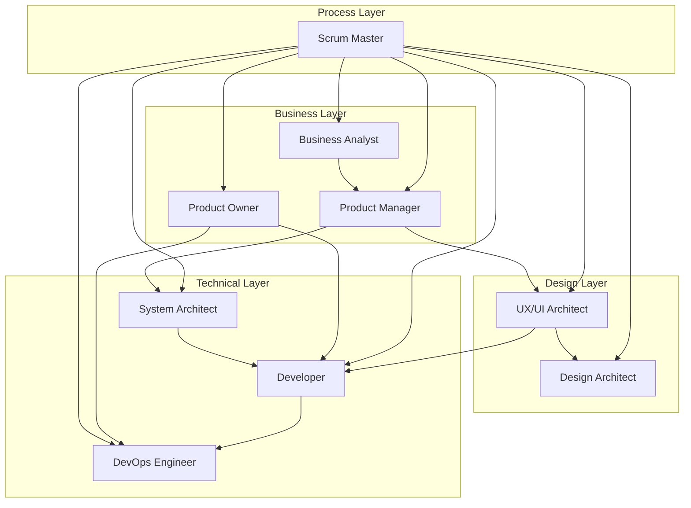
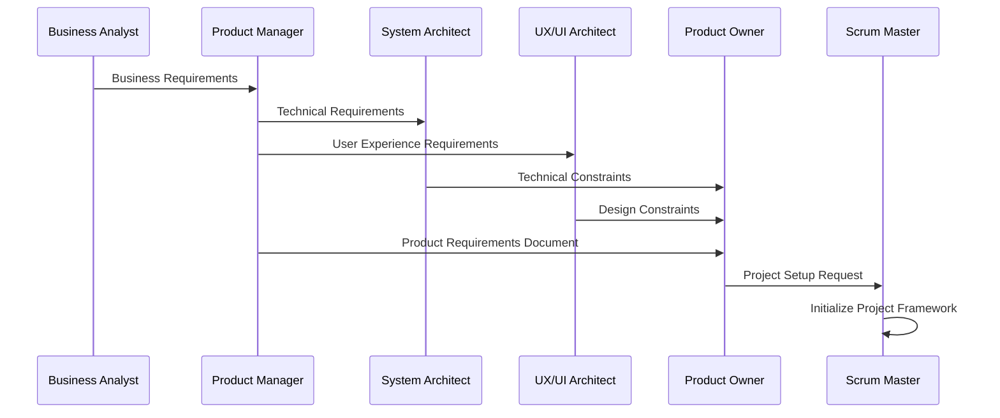
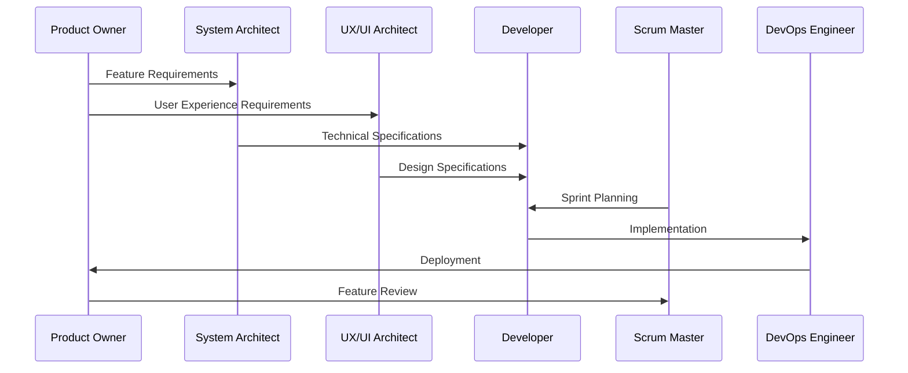
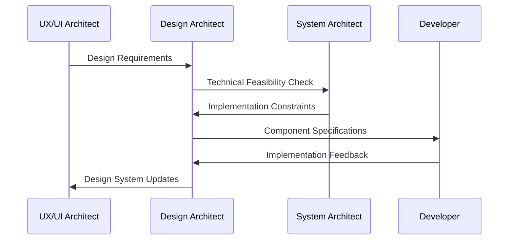
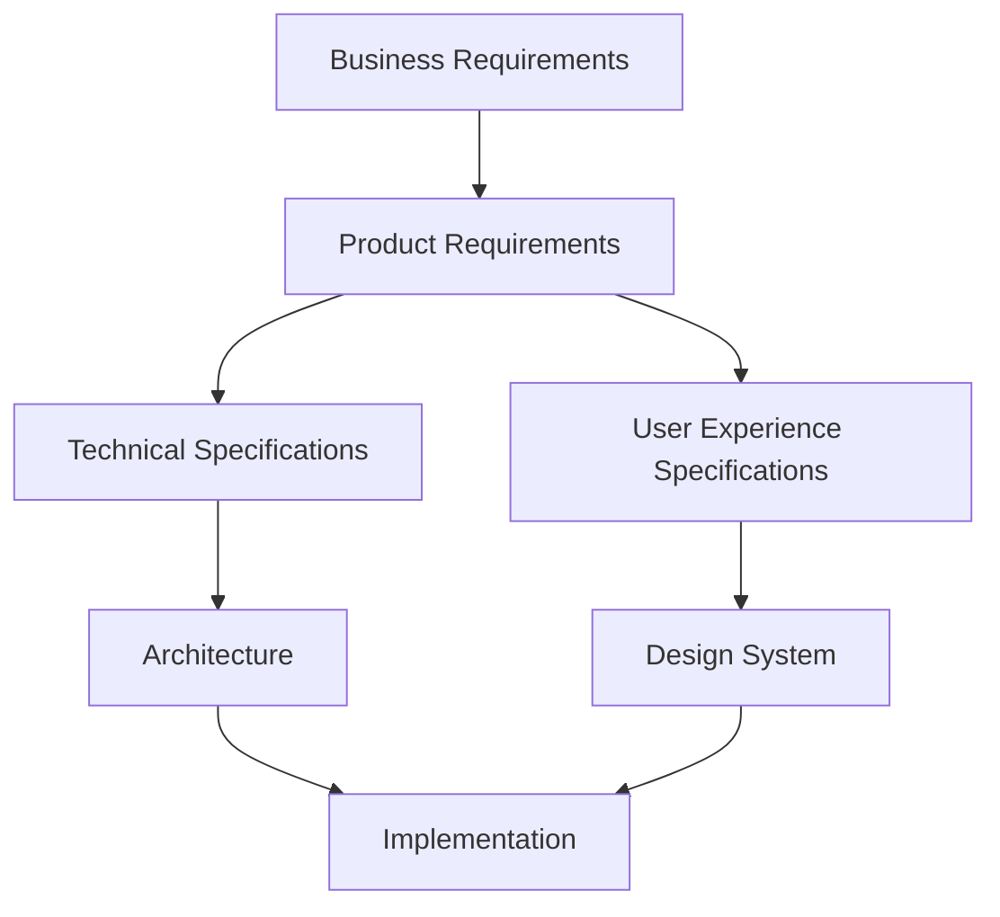
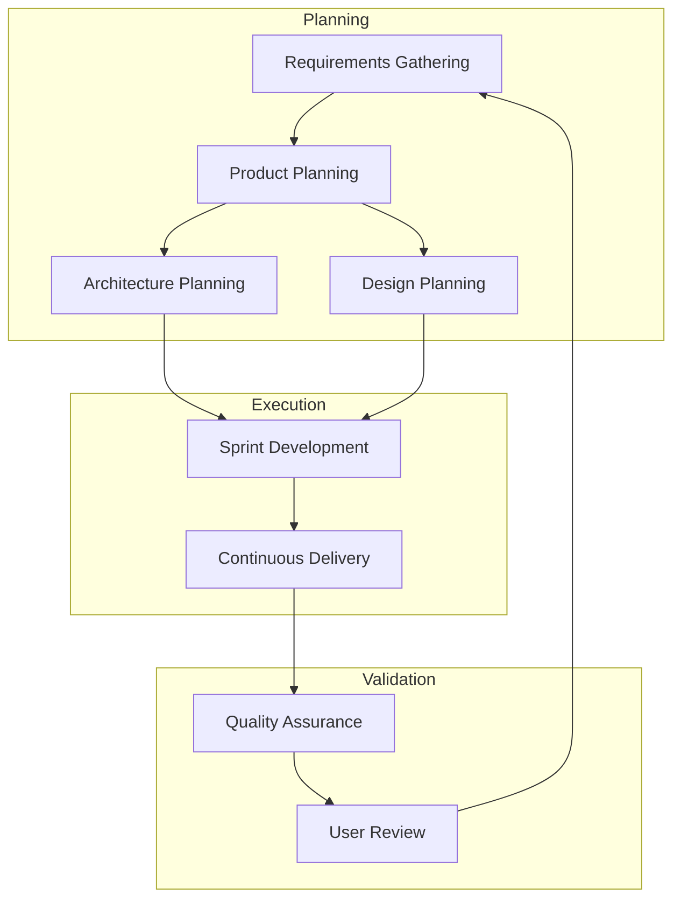
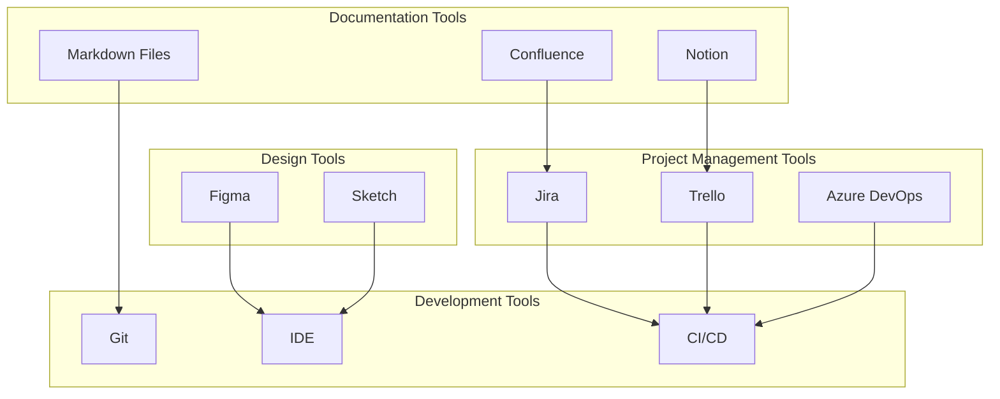

# BMAD Method: Comprehensive Integration Guide

## Overview

This comprehensive integration guide provides a holistic view of how all BMAD Method personas, processes, and artifacts work together to create a seamless software development lifecycle. It serves as the central reference point for understanding cross-persona interactions, workflow integrations, and system-wide processes.

## Table of Contents

1. [Integration Architecture](#integration-architecture)
2. [Cross-Persona Workflows](#cross-persona-workflows)
3. [Handoff Procedures](#handoff-procedures)
4. [Integration Points](#integration-points)
5. [Communication Protocols](#communication-protocols)
6. [Quality Assurance](#quality-assurance)
7. [Troubleshooting](#troubleshooting)
8. [Continuous Improvement](#continuous-improvement)

## Integration Architecture

The BMAD Method integration architecture defines how all components of the system work together to deliver value.

### Core Integration Principles

1. **Seamless Information Flow**: Information flows smoothly between personas without loss or distortion
2. **Clear Handoff Procedures**: Well-defined handoff points with validation criteria
3. **Shared Understanding**: Common vocabulary and conceptual framework across all personas
4. **Feedback Loops**: Continuous feedback mechanisms at all integration points
5. **Quality Gates**: Defined quality criteria at each transition point
6. **Traceability**: End-to-end traceability from business requirements to implementation

## Cross-Persona Workflows

The BMAD Method defines several cross-persona workflows that span multiple roles and responsibilities.

### Project Initiation Workflow

### Feature Development Workflow

### Design System Evolution Workflow

## Handoff Procedures

Effective handoffs are critical to the BMAD Method's success. Each handoff follows a structured process to ensure information integrity and shared understanding.

### Standard Handoff Procedure

1. **Preparation**: Sending persona prepares deliverables according to established templates
2. **Validation**: Sending persona validates deliverables against quality checklists
3. **Notification**: Receiving persona is notified of pending handoff
4. **Review**: Receiving persona reviews deliverables and provides feedback
5. **Clarification**: Both personas address questions and clarify expectations
6. **Acceptance**: Receiving persona formally accepts the handoff
7. **Documentation**: Handoff is documented for traceability

### Key Handoff Points

| From | To | Deliverables | Quality Criteria | Tools |
|------|----|--------------|--------------------|-------|
| Business Analyst | Product Manager | Market Research, User Insights, Business Requirements | Completeness, Clarity, Actionability | Research Documentation, Requirement Templates |
| Product Manager | System Architect | Product Requirements, Technical Constraints | Feasibility, Clarity, Completeness | PRD Template, Technical Specification Template |
| Product Manager | UX/UI Architect | User Experience Requirements, User Journeys | Usability, Consistency, Completeness | UX Specification Template, User Journey Maps |
| System Architect | Developer | Technical Architecture, Component Specifications | Implementability, Clarity, Completeness | Architecture Documentation, Component Templates |
| UX/UI Architect | Developer | Design Specifications, Component Designs | Implementability, Consistency, Completeness | Design System, Component Specifications |
| Product Owner | Developer | User Stories, Acceptance Criteria | Clarity, Testability, Value | User Story Templates, Acceptance Criteria Checklists |
| Developer | DevOps Engineer | Implementation Code, Deployment Requirements | Quality, Security, Performance | Code Repository, Deployment Documentation |

## Integration Points

The BMAD Method defines specific integration points where personas, processes, and artifacts connect.

### Business-Technical Integration

### Process Integration

### Tool Integration

## Communication Protocols

Effective communication is essential for successful integration. The BMAD Method defines specific communication protocols for different scenarios.

### Cross-Persona Communication

| Scenario | Communication Method | Frequency | Participants | Artifacts |
|----------|----------------------|-----------|--------------|-----------|
| Requirements Clarification | Synchronous Meeting | As Needed | BA, PM, PO | Meeting Notes, Updated Requirements |
| Technical Feasibility | Synchronous Meeting | As Needed | PM, ARCH, UX | Technical Assessment, Updated Requirements |
| Design Review | Synchronous Meeting | Weekly | UX, DA, ARCH, DEV | Design Feedback, Action Items |
| Sprint Planning | Synchronous Meeting | Bi-weekly | PO, DEV, SM | Sprint Plan, User Stories |
| Daily Standup | Synchronous Meeting | Daily | DEV, SM, PO | Impediment Log, Status Update |
| Sprint Review | Synchronous Meeting | Bi-weekly | All Personas | Demo, Feedback, Action Items |
| Sprint Retrospective | Synchronous Meeting | Bi-weekly | All Personas | Improvement Actions, Process Updates |

### Documentation Standards

All integration documentation follows these standards:

1. **Consistent Terminology**: Use defined glossary terms across all documentation
2. **Clear Structure**: Follow established document templates and structures
3. **Version Control**: Maintain proper versioning for all documentation
4. **Accessibility**: Ensure documentation is accessible to all team members
5. **Searchability**: Use proper tagging and organization for easy discovery
6. **Conciseness**: Keep documentation clear and to the point
7. **Visual Clarity**: Use diagrams and visual aids to enhance understanding

## Quality Assurance

Quality assurance spans all integration points to ensure consistent quality throughout the BMAD Method.

### Cross-Cutting Quality Dimensions

1. **Functional Quality**: Correctness, completeness, and consistency of functionality
2. **Technical Quality**: Code quality, architecture quality, and technical debt management
3. **User Experience Quality**: Usability, accessibility, and visual design quality
4. **Process Quality**: Efficiency, effectiveness, and continuous improvement of processes
5. **Documentation Quality**: Clarity, completeness, and usefulness of documentation

### Integration Quality Checks

| Integration Point | Quality Check | Responsible Persona | Validation Method |
|-------------------|---------------|---------------------|-------------------|
| Business to Product | Requirements Quality | Product Manager | Requirements Review |
| Product to Architecture | Technical Feasibility | System Architect | Architecture Review |
| Product to Design | Design Feasibility | UX/UI Architect | Design Review |
| Architecture to Implementation | Technical Alignment | Developer | Code Review |
| Design to Implementation | Design Alignment | Developer | Visual Review |
| Implementation to Deployment | Deployment Readiness | DevOps Engineer | Deployment Checklist |

## Troubleshooting

When integration issues arise, follow these troubleshooting procedures to identify and resolve them efficiently.

### Common Integration Issues

| Issue | Symptoms | Resolution Steps | Preventive Measures |
|-------|----------|------------------|---------------------|
| Requirements Misalignment | Implementation doesn't meet business needs | 1. Identify misalignment 2. Review requirements 3. Clarify with stakeholders 4. Update documentation 5. Adjust implementation | Regular alignment meetings, Clear acceptance criteria, Stakeholder reviews |
| Design-Development Gap | Implementation doesn't match design | 1. Compare design and implementation 2. Identify discrepancies 3. Determine technical constraints 4. Adjust design or implementation 5. Update documentation | Design reviews, Developer involvement in design, Design system usage |
| Architecture Deviation | Implementation doesn't follow architecture | 1. Identify deviation 2. Assess impact 3. Determine root cause 4. Adjust implementation or architecture 5. Update documentation | Architecture reviews, Clear guidelines, Developer training |
| Process Breakdown | Deliverables missed or delayed | 1. Identify process failure 2. Determine root cause 3. Implement immediate fix 4. Adjust process 5. Document lessons learned | Process monitoring, Regular retrospectives, Clear responsibilities |

### Escalation Procedures

When integration issues cannot be resolved at the team level, follow these escalation procedures:

1. **Team-Level Resolution**: Attempt to resolve within the immediate team
2. **Cross-Team Escalation**: Escalate to relevant team leads or personas
3. **Technical Escalation**: Escalate to System Architect for technical issues
4. **Process Escalation**: Escalate to Scrum Master for process issues
5. **Product Escalation**: Escalate to Product Owner for requirement issues
6. **Management Escalation**: Escalate to management for organizational issues

## Continuous Improvement

The BMAD Method integration framework continuously evolves through structured improvement processes.

### Integration Retrospectives

Conduct regular integration retrospectives to identify and address integration challenges:

1. **Collect Feedback**: Gather feedback from all personas on integration points
2. **Identify Patterns**: Look for recurring integration issues or friction points
3. **Prioritize Improvements**: Focus on high-impact integration improvements
4. **Implement Changes**: Make targeted changes to integration processes
5. **Measure Results**: Track the impact of integration improvements
6. **Share Learnings**: Document and share integration best practices

### Integration Metrics

Track these key metrics to measure integration effectiveness:

1. **Handoff Efficiency**: Time from handoff initiation to acceptance
2. **Rework Rate**: Percentage of deliverables requiring rework after handoff
3. **Integration Defects**: Number of issues attributed to integration problems
4. **Cross-Team Satisfaction**: Team satisfaction with integration processes
5. **Documentation Quality**: Rating of integration documentation usefulness
6. **Process Adherence**: Compliance with defined integration procedures

---

This comprehensive integration guide provides a holistic view of how all BMAD Method components work together. By following these integration principles, procedures, and practices, teams can achieve seamless collaboration and deliver high-quality software products efficiently.
