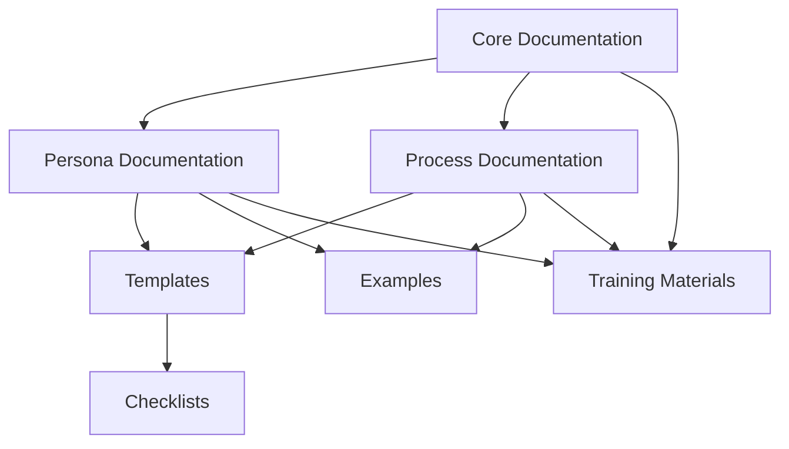

# BMAD Method: Documentation Map

## Overview

This documentation map provides a comprehensive overview of all BMAD Method documentation, showing the relationships between different documents and how they fit into the overall methodology. Use this map to navigate the documentation ecosystem and find the specific guidance you need.

## Documentation Structure

The BMAD Method documentation is organized into several key categories:

```mermaid title="Documentation Structure" type="diagram"
graph TD
    ROOT[BMAD Method Documentation]
    ROOT --> CORE[Core Documentation]
    ROOT --> PERSONA[Persona Documentation]
    ROOT --> PROCESS[Process Documentation]
    ROOT --> TEMPLATE[Templates]
    ROOT --> CHECKLIST[Checklists]
    ROOT --> EXAMPLE[Examples]
    ROOT --> TRAINING[Training Materials]
    
    CORE --> OVERVIEW[Method Overview]
    CORE --> PRINCIPLES[Core Principles]
    CORE --> ARCHITECTURE[System Architecture]
    
    PERSONA --> BA[Business Analyst]
    PERSONA --> PM[Product Manager]
    PERSONA --> ARCH[System Architect]
    PERSONA --> UX[UX/UI Architect]
    PERSONA --> DA[Design Architect]
    PERSONA --> PO[Product Owner]
    PERSONA --> DEV[Developer]
    PERSONA --> SM[Scrum Master]
    PERSONA --> DEVOPS[DevOps Engineer]
    
    PROCESS --> WORKFLOW[Workflows]
    PROCESS --> INTEGRATION[Integration Points]
    PROCESS --> HANDOFF[Handoff Procedures]
    PROCESS --> QA[Quality Assurance]
    
    TEMPLATE --> REQUIREMENT[Requirement Templates]
    TEMPLATE --> DESIGN[Design Templates]
    TEMPLATE --> ARCHITECTURE_TMPL[Architecture Templates]
    TEMPLATE --> STORY[Story Templates]
    
    CHECKLIST --> REQUIREMENT_CL[Requirement Checklists]
    CHECKLIST --> DESIGN_CL[Design Checklists]
    CHECKLIST --> CODE_CL[Code Checklists]
    CHECKLIST --> PROCESS_CL[Process Checklists]
    
    EXAMPLE --> PROJECT[Project Examples]
    EXAMPLE --> COMPONENT[Component Examples]
    EXAMPLE --> WORKFLOW_EX[Workflow Examples]
    
    TRAINING --> QUICKSTART[Quick Start Guides]
    TRAINING --> TUTORIAL[Tutorials]
    TRAINING --> WORKSHOP[Workshop Materials]
```

## Document Relationships

The following diagram shows how different documents relate to each other and support the overall methodology:

## Complete Documentation Inventory

### Core Documentation

| Document | Description | Primary Audience | Related Documents |
|----------|-------------|------------------|-------------------|
| [README.md](../README.md) | Main entry point and overview | All | All documentation |
| [docs/readme.md](../docs/readme.md) | Documentation overview | All | All documentation |
| [bmad-agent/data/bmad-kb.md](../bmad-agent/data/bmad-kb.md) | Knowledge base of core concepts | All | All documentation |
| [docs/workflow-diagram.md](../docs/workflow-diagram.md) | Visual representation of workflows | All | Process documentation |
| [docs/system-architecture/system-overview.md](../docs/system-architecture/system-overview.md) | System architecture overview | Technical roles | Architecture documentation |
| [docs/how-it-works/core-concepts.md](../docs/how-it-works/core-concepts.md) | Core methodology concepts | All | All documentation |

### Persona Documentation

#### Business Analyst

| Document | Description | Primary Audience | Related Documents |
|----------|-------------|------------------|-------------------|
| [bmad-agent/personas/analyst.md](../bmad-agent/personas/analyst.md) | Business Analyst persona definition | Business Analyst | Analyst documentation |
| [docs/analyst-comprehensive-guide.md](../docs/analyst-comprehensive-guide.md) | Comprehensive guide for Business Analysts | Business Analyst | Analyst documentation |
| [docs/analyst-integration-guide.md](../docs/analyst-integration-guide.md) | Integration guide for Business Analysts | Business Analyst, Integration Specialists | Integration documentation |
| [docs/analyst-quickstart.md](../docs/analyst-quickstart.md) | Quick start guide for Business Analysts | Business Analyst | Analyst documentation |
| [docs/analyst-template-guide.md](../docs/analyst-template-guide.md) | Template guide for Business Analysts | Business Analyst | Templates |
| [docs/analyst-quality-standards.md](../docs/analyst-quality-standards.md) | Quality standards for Business Analysts | Business Analyst, QA | Quality documentation |
| [docs/analyst-workflow-mapping.md](../docs/analyst-workflow-mapping.md) | Workflow mapping for Business Analysts | Business Analyst | Process documentation |

#### Product Manager

| Document | Description | Primary Audience | Related Documents |
|----------|-------------|------------------|-------------------|
| [bmad-agent/personas/pm.md](../bmad-agent/personas/pm.md) | Product Manager persona definition | Product Manager | PM documentation |
| [docs/pm-comprehensive-guide.md](../docs/pm-comprehensive-guide.md) | Comprehensive guide for Product Managers | Product Manager | PM documentation |
| [docs/pm-integration-guide.md](../docs/pm-integration-guide.md) | Integration guide for Product Managers | Product Manager, Integration Specialists | Integration documentation |
| [docs/pm-quickstart.md](../docs/pm-quickstart.md) | Quick start guide for Product Managers | Product Manager | PM documentation |
| [docs/pm-task-library.md](../docs/pm-task-library.md) | Task library for Product Managers | Product Manager | PM documentation |

#### System Architect

| Document | Description | Primary Audience | Related Documents |
|----------|-------------|------------------|-------------------|
| [bmad-agent/personas/architect.md](../bmad-agent/personas/architect.md) | System Architect persona definition | System Architect | Architect documentation |
| [docs/architect-comprehensive-guide.md](../docs/architect-comprehensive-guide.md) | Comprehensive guide for System Architects | System Architect | Architect documentation |
| [docs/architect-integration-guide.md](../docs/architect-integration-guide.md) | Integration guide for System Architects | System Architect, Integration Specialists | Integration documentation |
| [docs/architect-quickstart.md](../docs/architect-quickstart.md) | Quick start guide for System Architects | System Architect | Architect documentation |
| [docs/architect-task-library.md](../docs/architect-task-library.md) | Task library for System Architects | System Architect | Architect documentation |
| [docs/architect-template-guide.md](../docs/architect-template-guide.md) | Template guide for System Architects | System Architect | Templates |
| [docs/architect-quality-standards.md](../docs/architect-quality-standards.md) | Quality standards for System Architects | System Architect, QA | Quality documentation |

#### UX/UI Architect

| Document | Description | Primary Audience | Related Documents |
|----------|-------------|------------------|-------------------|
| [bmad-agent/personas/v0-ux-ui-architect.md](../bmad-agent/personas/v0-ux-ui-architect.md) | UX/UI Architect persona definition | UX/UI Architect | UX/UI documentation |
| [bmad-agent/personas/v0-ux-ui-architect.ide.md](../bmad-agent/personas/v0-ux-ui-architect.ide.md) | IDE-specific UX/UI Architect persona | UX/UI Architect | UX/UI documentation |
| [docs/v0-ux-ui-architect-comprehensive-guide.md](../docs/v0-ux-ui-architect-comprehensive-guide.md) | Comprehensive guide for UX/UI Architects | UX/UI Architect | UX/UI documentation |
| [docs/v0-ux-ui-architect-integration-guide.md](../docs/v0-ux-ui-architect-integration-guide.md) | Integration guide for UX/UI Architects | UX/UI Architect, Integration Specialists | Integration documentation |
| [docs/v0-ux-ui-architect-quickstart.md](../docs/v0-ux-ui-architect-quickstart.md) | Quick start guide for UX/UI Architects | UX/UI Architect | UX/UI documentation |
| [docs/v0-ux-ui-architect-quality-assurance.md](../docs/v0-ux-ui-architect-quality-assurance.md) | Quality assurance for UX/UI Architects | UX/UI Architect, QA | Quality documentation |
| [docs/v0-ux-ui-architect-user-guide.md](../docs/v0-ux-ui-architect-user-guide.md) | User guide for UX/UI Architects | UX/UI Architect | UX/UI documentation |

#### Design Architect

| Document | Description | Primary Audience | Related Documents |
|----------|-------------|------------------|-------------------|
| [bmad-agent/personas/design-architect.md](../bmad-agent/personas/design-architect.md) | Design Architect persona definition | Design Architect | Design documentation |
| [docs/design-architect-comprehensive-guide.md](../docs/design-architect-comprehensive-guide.md) | Comprehensive guide for Design Architects | Design Architect | Design documentation |
| [docs/design-architect-integration-guide.md](../docs/design-architect-integration-guide.md) | Integration guide for Design Architects | Design Architect, Integration Specialists | Integration documentation |
| [docs/design-architect-quickstart.md](../docs/design-architect-quickstart.md) | Quick start guide for Design Architects | Design Architect | Design documentation |
| [docs/design-architect-template-guide.md](../docs/design-architect-template-guide.md) | Template guide for Design Architects | Design Architect | Templates |
| [docs/design-architect-quality-standards.md](../docs/design-architect-quality-standards.md) | Quality standards for Design Architects | Design Architect, QA | Quality documentation |
| [docs/design-architect-workflow-mapping.md](../docs/design-architect-workflow-mapping.md) | Workflow mapping for Design Architects | Design Architect | Process documentation |
| [docs/design-architect-success-metrics.md](../docs/design-architect-success-metrics.md) | Success metrics for Design Architects | Design Architect, Management | Metrics documentation |

#### Product Owner

| Document | Description | Primary Audience | Related Documents |
|----------|-------------|------------------|-------------------|
| [bmad-agent/personas/po.md](../bmad-agent/personas/po.md) | Product Owner persona definition | Product Owner | PO documentation |
| [docs/po-comprehensive-guide.md](../docs/po-comprehensive-guide.md) | Comprehensive guide for Product Owners | Product Owner | PO documentation |
| [docs/po-integration-guide.md](../docs/po-integration-guide.md) | Integration guide for Product Owners | Product Owner, Integration Specialists | Integration documentation |
| [docs/po-quickstart.md](../docs/po-quickstart.md) | Quick start guide for Product Owners | Product Owner | PO documentation |
| [docs/po-template-guide.md](../docs/po-template-guide.md) | Template guide for Product Owners | Product Owner | Templates |
| [docs/po-quality-standards.md](../docs/po-quality-standards.md) | Quality standards for Product Owners | Product Owner, QA | Quality documentation |
| [docs/po-workflow-mapping.md](../docs/po-workflow-mapping.md) | Workflow mapping for Product Owners | Product Owner | Process documentation |
| [docs/po-success-metrics.md](../docs/po-success-metrics.md) | Success metrics for Product Owners | Product Owner, Management | Metrics documentation |

#### Developer

| Document | Description | Primary Audience | Related Documents |
|----------|-------------|------------------|-------------------|
| [bmad-agent/personas/dev.ide.md](../bmad-agent/personas/dev.ide.md) | Developer persona definition | Developer | Developer documentation |
| [docs/dev-comprehensive-guide.md](../docs/dev-comprehensive-guide.md) | Comprehensive guide for Developers | Developer | Developer documentation |
| [docs/dev-integration-guide.md](../docs/dev-integration-guide.md) | Integration guide for Developers | Developer, Integration Specialists | Integration documentation |
| [docs/dev-quickstart.md](../docs/dev-quickstart.md) | Quick start guide for Developers | Developer | Developer documentation |
| [docs/dev-template-guide.md](../docs/dev-template-guide.md) | Template guide for Developers | Developer | Templates |
| [docs/dev-quality-standards.md](../docs/dev-quality-standards.md) | Quality standards for Developers | Developer, QA | Quality documentation |
| [docs/dev-workflow-mapping.md](../docs/dev-workflow-mapping.md) | Workflow mapping for Developers | Developer | Process documentation |
| [docs/dev-success-metrics.md](../docs/dev-success-metrics.md) | Success metrics for Developers | Developer, Management | Metrics documentation |

#### Scrum Master

| Document | Description | Primary Audience | Related Documents |
|----------|-------------|------------------|-------------------|
| [bmad-agent/personas/sm.md](../bmad-agent/personas/sm.md) | Scrum Master persona definition | Scrum Master | SM documentation |
| [bmad-agent/personas/sm.ide.md](../bmad-agent/personas/sm.ide.md) | IDE-specific Scrum Master persona | Scrum Master | SM documentation |
| [docs/sm-comprehensive-guide.md](../docs/sm-comprehensive-guide.md) | Comprehensive guide for Scrum Masters | Scrum Master | SM documentation |
| [docs/sm-template-guide.md](../docs/sm-template-guide.md) | Template guide for Scrum Masters | Scrum Master | Templates |
| [docs/sm-quality-standards.md](../docs/sm-quality-standards.md) | Quality standards for Scrum Masters | Scrum Master, QA | Quality documentation |
| [docs/sm-workflow-mapping.md](../docs/sm-workflow-mapping.md) | Workflow mapping for Scrum Masters | Scrum Master | Process documentation |
| [docs/sm-success-metrics.md](../docs/sm-success-metrics.md) | Success metrics for Scrum Masters | Scrum Master, Management | Metrics documentation |

#### DevOps Engineer

| Document | Description | Primary Audience | Related Documents |
|----------|-------------|------------------|-------------------|
| [bmad-agent/personas/devops-pe.ide.md](../bmad-agent/personas/devops-pe.ide.md) | DevOps Engineer persona definition | DevOps Engineer | DevOps documentation |

### Process Documentation

| Document | Description | Primary Audience | Related Documents |
|----------|-------------|------------------|-------------------|
| [docs/workflow-diagram.md](../docs/workflow-diagram.md) | BMAD workflow diagrams | All | All process documentation |
| [docs/how-it-works/integration-points.md](../docs/how-it-works/integration-points.md) | Integration points documentation | All | Integration documentation |
| [docs/system-architecture/integration-architecture.md](../docs/system-architecture/integration-architecture.md) | Integration architecture | Technical roles | Architecture documentation |
| [docs/how-it-works/persona-workflows.md](../docs/how-it-works/persona-workflows.md) | Persona workflow documentation | All | Persona documentation |
| [docs/how-it-works/orchestrator-mechanics.md](../docs/how-it-works/orchestrator-mechanics.md) | Orchestrator mechanics | Technical roles | System documentation |
| [docs/bmad-comprehensive-integration-guide.md](../docs/bmad-comprehensive-integration-guide.md) | Comprehensive integration guide | All | All documentation |

### Templates

| Document | Description | Primary Audience | Related Documents |
|----------|-------------|------------------|-------------------|
| [bmad-agent/templates/architecture-tmpl.md](../bmad-agent/templates/architecture-tmpl.md) | Architecture template | System Architect | Architecture documentation |
| [bmad-agent/templates/front-end-architecture-tmpl.md](../bmad-agent/templates/front-end-architecture-tmpl.md) | Front-end architecture template | UX/UI Architect | UX/UI documentation |
| [bmad-agent/templates/front-end-spec-tmpl.md](../bmad-agent/templates/front-end-spec-tmpl.md) | Front-end specification template | UX/UI Architect | UX/UI documentation |
| [bmad-agent/templates/infrastructure-architecture-tmpl.md](../bmad-agent/templates/infrastructure-architecture-tmpl.md) | Infrastructure architecture template | System Architect | Architecture documentation |
| [bmad-agent/templates/prd-tmpl.md](../bmad-agent/templates/prd-tmpl.md) | Product Requirements Document template | Product Manager | PM documentation |
| [bmad-agent/templates/project-brief-tmpl.md](../bmad-agent/templates/project-brief-tmpl.md) | Project brief template | Business Analyst | Analyst documentation |
| [bmad-agent/templates/story-tmpl.md](../bmad-agent/templates/story-tmpl.md) | User story template | Product Owner | PO documentation |
| [bmad-agent/templates/v0-component-spec-tmpl.md](../bmad-agent/templates/v0-component-spec-tmpl.md) | Component specification template | UX/UI Architect | UX/UI documentation |
| [templates/persona-documentation-template.md](../templates/persona-documentation-template.md) | Persona documentation template | All | Persona documentation |

### Checklists

| Document | Description | Primary Audience | Related Documents |
|----------|-------------|------------------|-------------------|
| [bmad-agent/checklists/architect-checklist.md](../bmad-agent/checklists/architect-checklist.md) | Architect checklist | System Architect | Architecture documentation |
| [bmad-agent/checklists/change-checklist.md](../bmad-agent/checklists/change-checklist.md) | Change management checklist | All | Process documentation |
| [bmad-agent/checklists/frontend-architecture-checklist.md](../bmad-agent/checklists/frontend-architecture-checklist.md) | Frontend architecture checklist | UX/UI Architect | UX/UI documentation |
| [bmad-agent/checklists/infrastructure-checklist.md](../bmad-agent/checklists/infrastructure-checklist.md) | Infrastructure checklist | System Architect | Architecture documentation |
| [bmad-agent/checklists/pm-checklist.md](../bmad-agent/checklists/pm-checklist.md) | Product Manager checklist | Product Manager | PM documentation |
| [bmad-agent/checklists/po-master-checklist.md](../bmad-agent/checklists/po-master-checklist.md) | Product Owner master checklist | Product Owner | PO documentation |
| [bmad-agent/checklists/story-dod-checklist.md](../bmad-agent/checklists/story-dod-checklist.md) | Story Definition of Done checklist | Product Owner, Developer | PO documentation, Developer documentation |
| [bmad-agent/checklists/story-draft-checklist.md](../bmad-agent/checklists/story-draft-checklist.md) | Story draft checklist | Product Owner | PO documentation |
| [bmad-agent/checklists/v0-component-quality-checklist.md](../bmad-agent/checklists/v0-component-quality-checklist.md) | Component quality checklist | UX/UI Architect | UX/UI documentation |

### Examples

| Document | Description | Primary Audience | Related Documents |
|----------|-------------|------------------|-------------------|
| [bmad-agent/examples/v0-example-project.md](../bmad-agent/examples/v0-example-project.md) | Example v0 project | UX/UI Architect | UX/UI documentation |
| [examples/v0-ux-ui-architect-example.md](../examples/v0-ux-ui-architect-example.md) | UX/UI Architect example | UX/UI Architect | UX/UI documentation |
| [examples/dashboard-component-example.md](../examples/dashboard-component-example.md) | Dashboard component example | UX/UI Architect | UX/UI documentation |
| [examples/dashboard-component-code.md](../examples/dashboard-component-code.md) | Dashboard component code example | UX/UI Architect, Developer | UX/UI documentation, Developer documentation |

### Training Materials

| Document | Description | Primary Audience | Related Documents |
|----------|-------------|------------------|-------------------|
| [bmad-agent/docs/training-materials.md](../bmad-agent/docs/training-materials.md) | General training materials | All | All documentation |
| [docs/training/using-v0-ux-ui-architect.md](../docs/training/using-v0-ux-ui-architect.md) | Using the UX/UI Architect | UX/UI Architect | UX/UI documentation |
| [docs/training/ide-specific-guides/claude-code-guide.md](../docs/training/ide-specific-guides/claude-code-guide.md) | Claude Code guide | All | IDE documentation |
| [docs/training/ide-specific-guides/cline-guide.md](../docs/training/ide-specific-guides/cline-guide.md) | Cline guide | All | IDE documentation |
| [docs/training/ide-specific-guides/cursor-ai-guide.md](../docs/training/ide-specific-guides/cursor-ai-guide.md) | Cursor AI guide | All | IDE documentation |
| [docs/training/ide-specific-guides/roocode-guide.md](../docs/training/ide-specific-guides/roocode-guide.md) | Roocode guide | All | IDE documentation |
| [docs/quick-start-guides/ide-environment-quickstart.md](../docs/quick-start-guides/ide-environment-quickstart.md) | IDE environment quickstart | All | IDE documentation |
| [docs/quick-start-guides/web-environment-quickstart.md](../docs/quick-start-guides/web-environment-quickstart.md) | Web environment quickstart | All | Web documentation |
| [docs/quick-start-guides/bmad-method-quickstart.md](../docs/quick-start-guides/bmad-method-quickstart.md) | BMAD Method quickstart | All | All documentation |
| [docs/quick-start-guides/bmad-method-common-use-cases.md](../docs/quick-start-guides/bmad-method-common-use-cases.md) | Common use cases | All | All documentation |

## How to Use This Map

### For New Users

1. Start with the [BMAD Method Quickstart Guide](../docs/quick-start-guides/bmad-method-quickstart.md)
2. Identify your primary persona and read the corresponding quickstart guide
3. Explore the comprehensive guide for your persona
4. Review the integration guide to understand how your role fits into the overall process

### For Experienced Users

1. Use this map to find specific documentation for your current task
2. Reference the templates and checklists relevant to your work
3. Consult the examples for practical implementation guidance
4. Use the integration documentation to coordinate with other personas

### For Administrators and Managers

1. Review the comprehensive integration guide to understand the full methodology
2. Use the documentation map to ensure all team members have access to relevant materials
3. Reference the success metrics documentation to establish performance indicators
4. Consult the quality standards to establish quality assurance processes

## Documentation Maintenance

This documentation map is maintained as part of the BMAD Method documentation enhancement project. Updates to the map should be made whenever new documentation is added or existing documentation is modified.

### Update Process

1. Add new documents to the appropriate section of the map
2. Update document relationships as needed
3. Ensure all links are valid and point to the correct documents
4. Update the document inventory with new or modified documents

### Version History

| Version | Date | Changes | Author |
|---------|------|---------|--------|
| 1.0 | 2023-06-08 | Initial documentation map | Documentation Team |

---

This documentation map provides a comprehensive overview of all BMAD Method documentation. Use it as your guide to navigate the documentation ecosystem and find the specific guidance you need for your role and tasks.
