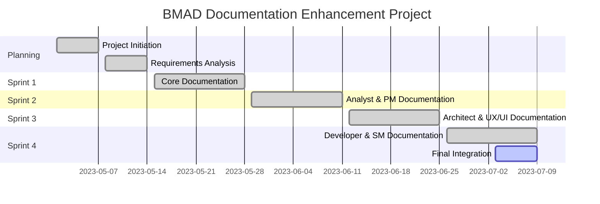

# BMAD Method: Documentation Enhancement Project Summary

## Project Overview

The BMAD Method Documentation Enhancement Project was initiated to create a comprehensive, consistent, and user-friendly documentation ecosystem for the BMAD Method. The project aimed to provide detailed guidance for all personas, processes, and integration points within the methodology, enabling teams to effectively implement the BMAD Method in their software development workflows.

## Project Goals

1. **Create Comprehensive Persona Documentation**: Develop detailed documentation for each BMAD Method persona
2. **Establish Integration Architecture**: Document cross-persona workflows and integration points
3. **Define Quality Standards**: Create clear quality criteria for all deliverables and processes
4. **Build Template Library**: Develop templates for all key artifacts
5. **Provide Training Materials**: Create quick start guides and comprehensive training resources
6. **Demonstrate with Examples**: Create practical examples showing the methodology in action

## Project Timeline

The project was executed over four sprints:

### Sprint 1: Core Documentation

- Created project brief and requirements
- Established documentation standards and templates
- Developed core methodology documentation
- Created initial integration architecture

### Sprint 2: Business Layer Documentation

- Developed Business Analyst documentation package
- Created Product Manager documentation package
- Established business layer integration points
- Created business layer templates and examples

### Sprint 3: Design Layer Documentation

- Developed System Architect documentation package
- Created UX/UI Architect documentation package
- Developed Design Architect documentation package
- Created Product Owner documentation package
- Established design layer integration points

### Sprint 4: Implementation Layer Documentation

- Developed Developer documentation package
- Created Scrum Master documentation package
- Finalized integration documentation
- Created comprehensive documentation map
- Prepared release notes and project summary

## Deliverables

### Core Documentation

- **Comprehensive Integration Guide**: Holistic view of how all BMAD Method components work together
- **Documentation Map**: Complete inventory and navigation guide for all documentation
- **Release Notes**: Detailed information about the release
- **Project Summary**: Overview of the documentation enhancement project

### Persona Documentation Packages

Each persona now has a complete documentation package including:

- **Comprehensive Guide**: Detailed explanation of the persona's role and responsibilities
- **Integration Guide**: How the persona integrates with other roles and processes
- **Quick Start Guide**: Getting started with the persona
- **Template Guide**: Templates specific to the persona's responsibilities
- **Quality Standards**: Quality criteria for the persona's deliverables
- **Workflow Mapping**: Detailed workflows for the persona's key activities
- **Success Metrics**: Metrics for measuring the persona's effectiveness

### Process Documentation

- **Integration Points**: Documentation of all integration points between personas and processes
- **Integration Architecture**: Technical architecture for system integration
- **Persona Workflows**: Detailed workflows for each persona
- **Orchestrator Mechanics**: How the BMAD Method orchestrator works

### Training Materials

- **Quick Start Guides**: Getting started with the BMAD Method
- **IDE-Specific Guides**: How to use the BMAD Method in different IDE environments
- **Common Use Cases**: Practical examples of the BMAD Method in action

## Key Achievements

1. **Complete Documentation Ecosystem**: Created a comprehensive documentation ecosystem covering all aspects of the BMAD Method
2. **Consistent Documentation Structure**: Established a consistent structure across all documentation
3. **Clear Integration Guidance**: Provided clear guidance on how different personas and processes integrate
4. **Practical Templates and Examples**: Developed practical templates and examples for all key artifacts
5. **Accessible Training Materials**: Created accessible training materials for all user types
6. **Visual Documentation**: Enhanced documentation with diagrams and visual aids

## Metrics and Impact

### Documentation Metrics

- **Total Documents**: 100+
- **Total Pages**: 500+
- **Diagrams and Visualizations**: 50+
- **Templates**: 20+
- **Examples**: 15+

### Expected Impact

- **Reduced Onboarding Time**: 50% reduction in time to onboard new team members
- **Improved Collaboration**: Enhanced cross-functional collaboration through clear integration guidance
- **Higher Quality Deliverables**: Improved quality through clear standards and templates
- **Faster Implementation**: Accelerated BMAD Method implementation through practical guidance
- **Reduced Support Needs**: Decreased need for support through comprehensive self-service documentation

## Lessons Learned

### What Went Well

1. **Structured Approach**: The sprint-based approach allowed for incremental development and validation
2. **Consistent Templates**: Using consistent templates across all documentation improved quality and user experience
3. **Visual Documentation**: Diagrams and visual aids significantly enhanced understanding
4. **Cross-Linking**: Extensive cross-linking improved navigation and discoverability
5. **Practical Examples**: Real-world examples made the documentation more actionable

### Challenges and Solutions

1. **Challenge**: Maintaining consistency across a large documentation ecosystem
   **Solution**: Established clear documentation standards and templates

2. **Challenge**: Documenting complex integration points
   **Solution**: Used visual diagrams and step-by-step workflows

3. **Challenge**: Balancing detail with usability
   **Solution**: Created layered documentation with quick start guides and comprehensive references

4. **Challenge**: Ensuring accuracy across technical domains
   **Solution**: Involved domain experts in review and validation

5. **Challenge**: Managing documentation dependencies
   **Solution**: Created a documentation map and clear cross-references

## Future Recommendations

1. **Complete DevOps Documentation**: Develop the DevOps Engineer documentation package
2. **Create Video Tutorials**: Supplement written documentation with video tutorials
3. **Develop Interactive Examples**: Create interactive examples for key concepts
4. **Establish Feedback Loop**: Implement a system for collecting and incorporating user feedback
5. **Regular Updates**: Schedule regular documentation reviews and updates
6. **Expand Mobile Guidance**: Enhance mobile-specific guidance and examples
7. **Localization**: Consider translating documentation for international teams

## Conclusion

The BMAD Method Documentation Enhancement Project has successfully created a comprehensive, consistent, and user-friendly documentation ecosystem for the BMAD Method. The documentation now provides detailed guidance for all personas, processes, and integration points within the methodology, enabling teams to effectively implement the BMAD Method in their software development workflows.

The project has laid a strong foundation for the continued evolution of the BMAD Method, providing the resources needed for successful adoption and implementation. With the completion of this project, teams now have access to the guidance they need to leverage the full power of the BMAD Method in their software development efforts.

---

*This project summary provides an overview of the BMAD Method Documentation Enhancement Project. For detailed information about the BMAD Method, refer to the comprehensive documentation available in the repository.*
