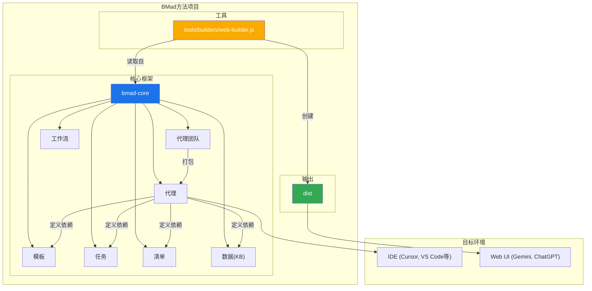
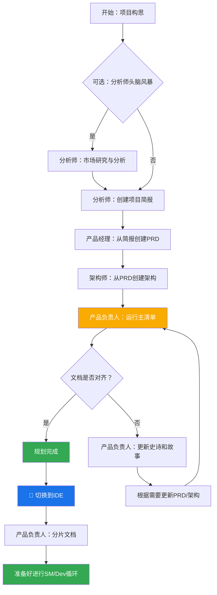
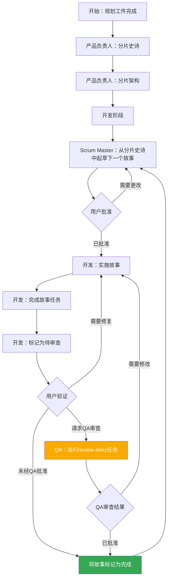

# BMad方法：核心架构

## 1. 概述

BMad方法旨在提供代理模式、任务和模板，以实现可重复的、有帮助的工作流程，无论是用于敏捷的代理开发，还是扩展到截然不同的领域。该项目的核心目的是提供一套结构化但灵活的提示、模板和工作流程，用户可以使用它们来指导AI代理（如Gemini、Claude或ChatGPT）以可预测、高质量的方式执行复杂任务、进行引导式讨论或其他有意义的领域特定流程。

系统的核心模块促进了针对当前现代AI代理工具挑战的完整开发生命周期：

1.  **构思与规划**：头脑风暴、市场研究以及创建项目简报。
2.  **架构与设计**：定义系统架构和UI/UX规范。
3.  **开发执行**：一个循环工作流程，其中Scrum Master (SM)代理起草具有极其具体上下文的故事，而开发人员(Dev)代理一次实现一个。此过程适用于新项目（绿地）和现有项目（棕地）。

## 2. 系统架构图

整个BMad-Method生态系统围绕已安装的`bmad-core`目录设计，该目录充当操作的大脑。`tools`目录提供了为不同环境处理和打包此大脑的方法。

## 3. 核心组件

`bmad-core`目录包含赋予代理能力的所有定义和资源。

### 3.1. 代理 (`bmad-core/agents/`)

-   **目的**：这些是系统的基础构建块。每个markdown文件（例如，`bmad-master.md`、`pm.md`、`dev.md`）定义了单个AI代理的角色、能力和依赖关系。
-   **结构**：代理文件包含一个YAML头，指定其角色、角色、依赖项和启动说明。这些依赖项是代理被允许使用的任务、模板、清单和数据文件的列表。
-   **启动说明**：代理可以包括从`docs/`文件夹加载特定于项目的文档的启动序列，例如编码标准、API规范或项目结构文档。这在激活时提供了即时的项目上下文。
-   **文档集成**：代理可以作为任务、工作流或启动序列的一部分引用和加载项目`docs/`文件夹中的文档。用户还可以将文档直接拖到聊天界面中以提供额外的上下文。
-   **示例**：`bmad-master`代理列出了其依赖项，这告诉构建工具在Web包中包含哪些文件，并告知代理其自身的能力。

### 3.2. 代理团队 (`bmad-core/agent-teams/`)

-   **目的**：团队文件（例如，`team-all.yaml`）定义了为特定目的（如“全栈开发”或“仅后端”）捆绑在一起的代理和工作流的集合。这为Web UI环境创建了一个更大的、预打包的上下文。
-   **结构**：团队文件列出了要包含的代理。它可以使用通配符，例如`"*"`来包含所有代理。这允许创建像`team-all`这样的综合包。

### 3.3. 工作流 (`bmad-core/workflows/`)

-   **目的**：工作流是YAML文件（例如，`greenfield-fullstack.yaml`），它们为特定项目类型定义了规定的步骤序列和代理交互。它们作为用户和`bmad-orchestrator`代理的战略指南。
-   **结构**：工作流为复杂和简单的项目定义了序列，列出了每个步骤中涉及的代理、它们创建的工件以及从一个步骤移动到下一个步骤的条件。它通常包括一个用于可视化的Mermaid图。

### 3.4. 可重用资源 (`templates`, `tasks`, `checklists`, `data`)

-   **目的**：这些文件夹存放由代理根据其依赖关系动态加载的模块化组件。
    -   **`templates/`**：包含常见文档的markdown模板，如PRD、架构规范和用户故事。
    -   **`tasks/`**：定义执行特定、可重复操作（如“shard-doc”或“create-next-story”）的说明。
    -   **`checklists/`**：为产品负责人（`po`）或架构师等代理提供质量保证清单。
    -   **`data/`**：包含核心知识库（`bmad-kb.md`）、技术偏好（`technical-preferences.md`）和其他关键数据文件。

#### 3.4.1. 模板处理系统

BMad的一个关键架构原则是模板是自包含和交互式的——它们嵌入了所需的文档输出和与用户协作所需的LLM指令。这意味着在许多情况下，不需要单独的任务来创建文档，因为模板本身包含了所有的处理逻辑。

BMad框架采用了一个由三个关键组件协调的复杂模板处理系统：

-   **`template-format.md`** (`bmad-core/utils/`)：定义了在所有BMad模板中使用的基础标记语言。该规范建立了变量替换（`{{placeholders}}`）、仅AI处理指令（`[[LLM: instructions]]`）和条件逻辑块的语法规则。模板遵循此格式以确保整个系统的一致处理。

-   **`create-doc.md`** (`bmad-core/tasks/`)：作为协调整个文档生成工作流的编排引擎。此任务协调模板选择，管理用户交互模式（增量与快速生成），强制执行模板格式处理规则，并处理验证。它作为用户和模板系统之间的主要接口。

-   **`advanced-elicitation.md`** (`bmad-core/tasks/`)：提供一个交互式完善层，可以通过`[[LLM: instructions]]`块嵌入到模板中。该组件提供10个结构化的头脑风暴操作、逐节审查功能和迭代改进工作流，以提高内容质量。

该系统保持了清晰的关注点分离：模板标记由AI代理在内部处理，但从不向用户公开，同时通过模板本身内嵌的智能提供复杂的AI处理能力。

#### 3.4.2. 技术偏好系统

BMad通过`bmad-core/data/`中的`technical-preferences.md`文件包含了一个个性化层。该文件作为一个持久的技术配置文件，影响所有项目中的代理行为。

**目的和好处：**

-   **一致性**：确保所有代理引用相同的技术偏好
-   **效率**：无需重复指定首选技术
-   **个性化**：代理提供符合用户偏好的建议
-   **学习**：捕获随着时间演变的经验教训和偏好

**内容结构：**
该文件通常包括首选的技术栈、设计模式、外部服务、编码标准和要避免的反模式。代理在规划和开发过程中自动引用此文件，以提供上下文适当的建议。

**集成点：**

-   模板可以在文档生成期间引用技术偏好
-   代理在适合项目需求时建议首选技术
-   当偏好不适合项目需求时，代理会解释替代方案
-   Web包可以包含偏好内容，以实现跨平台的一致行为

**随时间演变：**
鼓励用户不断用项目中的发现更新此文件，添加积极的偏好和要避免的技术，从而创建一个个性化的知识库，随着时间的推移改善代理的建议。

## 4. 构建与交付过程

该框架专为两个主要环境设计：本地IDE和基于Web的AI聊天界面。`web-builder.js`脚本是支持后者的关键。

### 4.1. Web构建器 (`tools/builders/web-builder.js`)

-   **目的**：这个Node.js脚本负责创建在`dist`中找到的`.txt`包。
-   **过程**：
    1.  **解析依赖**：对于给定的代理或团队，脚本读取其定义文件。
    2.  它递归地查找代理/团队所需的所有依赖资源（任务、模板等）。
    3.  **打包内容**：它读取所有这些文件的内容，并将它们连接成一个大的文本文件，用清晰的分隔符指示每个部分的原始文件路径。
    4.  **输出包**：最终的`.txt`文件保存在`dist`目录中，准备好上传到Web UI。

### 4.2. 特定环境的使用

-   **对于IDE**：用户通过`bmad-core/agents/`中的markdown文件直接与代理交互。IDE集成（对于Cursor、Claude Code等）知道如何调用这些代理。
-   **对于Web UI**：用户从`dist`上传一个预构建的包。这个单一文件为AI提供了整个团队及其所有所需工具和知识的上下文。

## 5. BMad工作流

### 5.1. 规划工作流

在开发开始之前，BMad遵循一个结构化的规划工作流，为成功的项目执行奠定基础：

**关键规划阶段：**

1.  **可选分析**：分析师进行市场研究和竞争分析
2.  **项目简报**：由分析师或用户创建的基础文档
3.  **PRD创建**：产品经理将简报转化为全面的产品需求
4.  **架构设计**：架构师根据PRD创建技术基础
5.  **验证与对齐**：产品负责人确保所有文档一致且完整
6.  **完善**：根据需要更新史诗、故事和文档
7.  **环境转换**：从Web UI到IDE的关键转换，用于开发工作流
8.  **文档准备**：产品负责人为开发消费分片大型文档

**工作流编排**：`bmad-orchestrator`代理使用这些工作流定义来指导用户完成整个过程，确保在规划（Web UI）和开发（IDE）阶段之间进行适当的转换。

### 5.2. 核心开发周期

一旦初始规划和架构阶段完成，项目就进入一个循环的开发工作流，如`bmad-kb.md`中所述。这确保了一个稳定、顺序和质量受控的实施过程。

这个周期持续进行，Scrum Master、开发人员和可选的QA代理协同工作。QA代理通过`review-story`任务提供高级开发人员审查能力，提供代码重构、质量改进和知识转移。这在保持开发速度的同时确保了高代码质量。
