# Design Architect - Workflow Mapping

## Overview

This document maps the comprehensive workflows for the **Design Architect** persona in the BMAD Method. The Design Architect operates in multiple workflow modes to address different aspects of design system creation, maintenance, and governance.

## Workflow Architecture

### Entry Points

The Design Architect workflow can be initiated through several entry points:

1. **Design System Creation**: Starting a new design system from scratch
2. **Design System Enhancement**: Improving existing design systems
3. **Component Development**: Creating new components or patterns
4. **Design Governance**: Establishing or improving design standards
5. **Cross-functional Collaboration**: Working with other personas on design integration
6. **Quality Assurance**: Auditing and improving design consistency

### Workflow Mode Selection

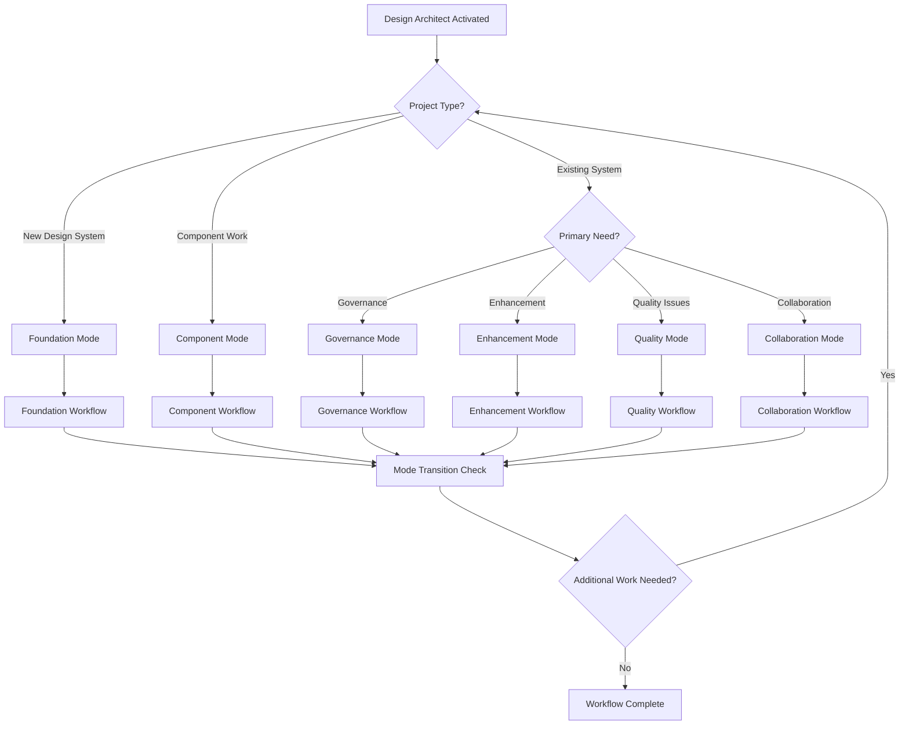

---

## Foundation Mode Workflow

**Purpose**: Creating comprehensive design systems from scratch
**Typical Duration**: 4-12 weeks
**Key Deliverables**: Design system foundation, component library, documentation

### Phase 1: Discovery and Strategy (Week 1-2)

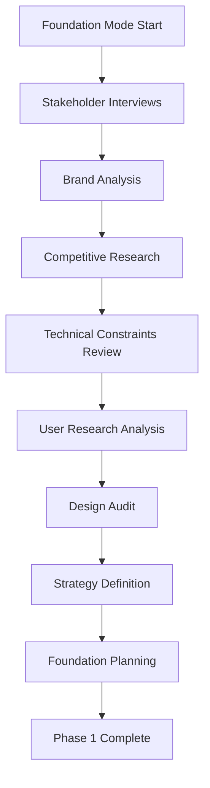

#### Key Activities
1. **Stakeholder Alignment**
   - Conduct stakeholder interviews
   - Define design system vision and goals
   - Establish success metrics
   - Align on scope and timeline

2. **Research and Analysis**
   - Analyze brand guidelines and identity
   - Conduct competitive design system analysis
   - Review technical constraints and requirements
   - Assess existing design assets and patterns

3. **Strategy Development**
   - Define design principles and philosophy
   - Establish design system governance model
   - Create design system roadmap
   - Plan implementation strategy

### Phase 2: Foundation Development (Week 3-6)

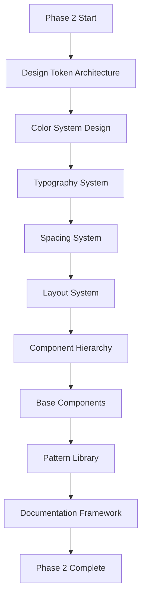

#### Key Activities
1. **Design Token System**
   - Create comprehensive token architecture
   - Define color, typography, spacing, and layout tokens
   - Establish token naming conventions
   - Implement token management workflow

2. **Component Foundation**
   - Design atomic-level components
   - Create molecular-level combinations
   - Develop organism-level assemblies
   - Establish component specifications

3. **Documentation System**
   - Set up documentation platform
   - Create usage guidelines
   - Develop code examples
   - Establish maintenance procedures

### Phase 3: Implementation and Validation (Week 7-10)

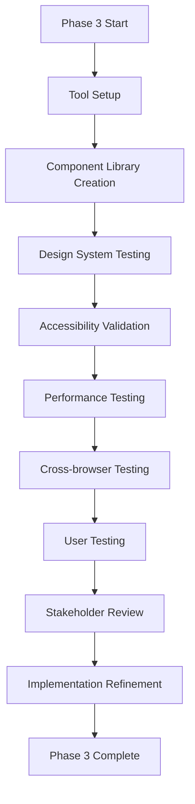

#### Key Activities
1. **Technical Implementation**
   - Set up design tools and libraries
   - Create component library in design tools
   - Implement design tokens in code
   - Establish design-development workflow

2. **Quality Assurance**
   - Conduct comprehensive accessibility testing
   - Perform cross-browser compatibility testing
   - Test responsive behavior across devices
   - Validate performance impact

3. **Validation and Refinement**
   - Conduct user testing with key components
   - Gather stakeholder feedback
   - Refine components based on feedback
   - Optimize implementation

### Phase 4: Launch and Adoption (Week 11-12)

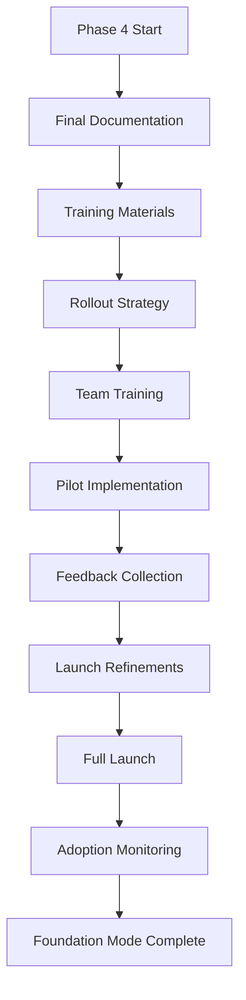

#### Key Activities
1. **Launch Preparation**
   - Finalize all documentation
   - Create training materials and workshops
   - Develop rollout communication plan
   - Prepare support resources

2. **Team Enablement**
   - Conduct design system training sessions
   - Provide hands-on workshops
   - Establish support channels
   - Create adoption incentives

3. **Launch and Monitoring**
   - Execute phased rollout plan
   - Monitor adoption metrics
   - Collect user feedback
   - Provide ongoing support

---

## Component Mode Workflow

**Purpose**: Creating individual components or component families
**Typical Duration**: 1-4 weeks per component
**Key Deliverables**: Component specifications, design files, documentation

### Phase 1: Component Discovery (Days 1-3)

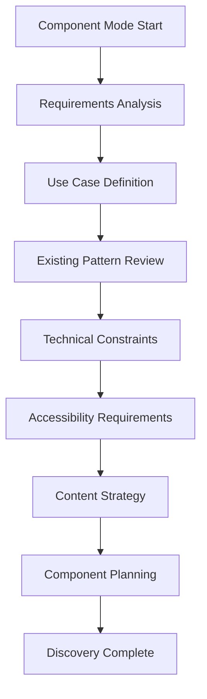

#### Key Activities
1. **Requirements Gathering**
   - Analyze component requirements and use cases
   - Define functional and non-functional requirements
   - Identify target users and contexts
   - Establish success criteria

2. **Research and Analysis**
   - Review existing design patterns and components
   - Analyze competitive implementations
   - Assess technical feasibility and constraints
   - Define accessibility requirements

### Phase 2: Component Design (Days 4-10)

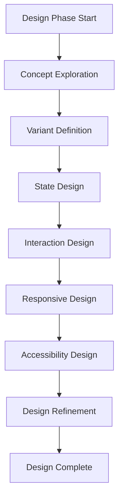

#### Key Activities
1. **Visual Design**
   - Explore multiple design concepts
   - Define component variants and sizes
   - Design all component states
   - Create responsive behavior specifications

2. **Interaction Design**
   - Define user interactions and micro-animations
   - Specify feedback mechanisms
   - Design loading and error states
   - Plan keyboard and touch interactions

### Phase 3: Component Specification (Days 11-15)

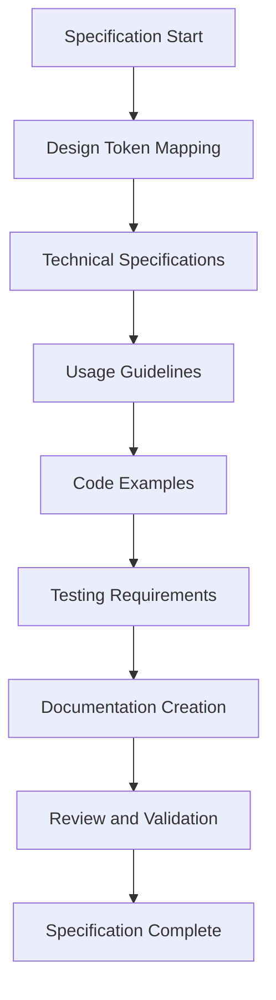

#### Key Activities
1. **Technical Documentation**
   - Map design tokens to component properties
   - Create detailed technical specifications
   - Define API and prop requirements
   - Specify implementation guidelines

2. **Usage Documentation**
   - Create comprehensive usage guidelines
   - Develop code examples and demos
   - Define testing and validation requirements
   - Establish maintenance procedures

### Phase 4: Component Validation (Days 16-20)

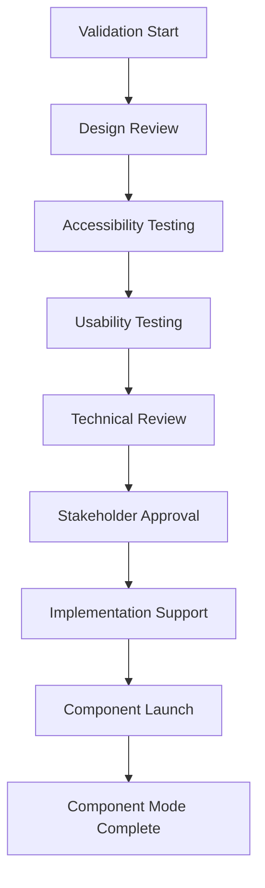

#### Key Activities
1. **Quality Assurance**
   - Conduct comprehensive design review
   - Perform accessibility compliance testing
   - Execute usability testing with target users
   - Validate technical implementation

2. **Launch and Support**
   - Obtain stakeholder approvals
   - Support development implementation
   - Monitor component adoption
   - Provide ongoing maintenance

---

## Governance Mode Workflow

**Purpose**: Establishing and maintaining design system governance
**Typical Duration**: 2-6 weeks
**Key Deliverables**: Governance framework, processes, standards

### Phase 1: Governance Assessment (Week 1)

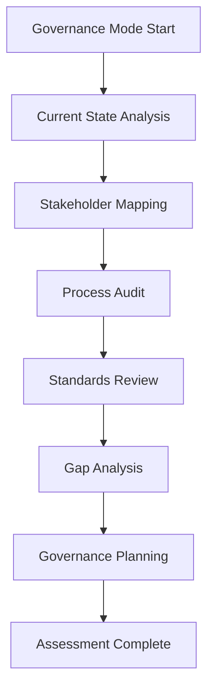

#### Key Activities
1. **Current State Analysis**
   - Audit existing governance structures
   - Map current decision-making processes
   - Identify governance gaps and pain points
   - Assess stakeholder needs and expectations

2. **Planning and Strategy**
   - Define governance objectives and scope
   - Plan governance framework development
   - Establish implementation timeline
   - Identify required resources

### Phase 2: Framework Development (Week 2-3)

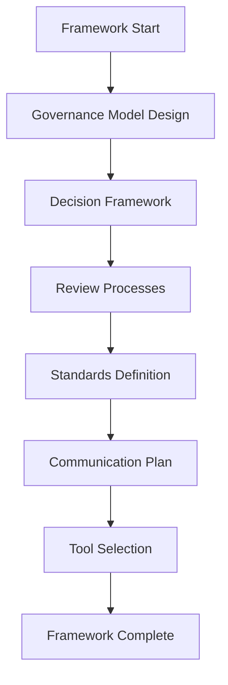

#### Key Activities
1. **Governance Structure**
   - Design governance model and roles
   - Define decision-making frameworks
   - Establish review and approval processes
   - Create escalation procedures

2. **Standards and Processes**
   - Define design standards and guidelines
   - Create quality assurance processes
   - Establish change management procedures
   - Plan communication and training

### Phase 3: Implementation (Week 4-5)

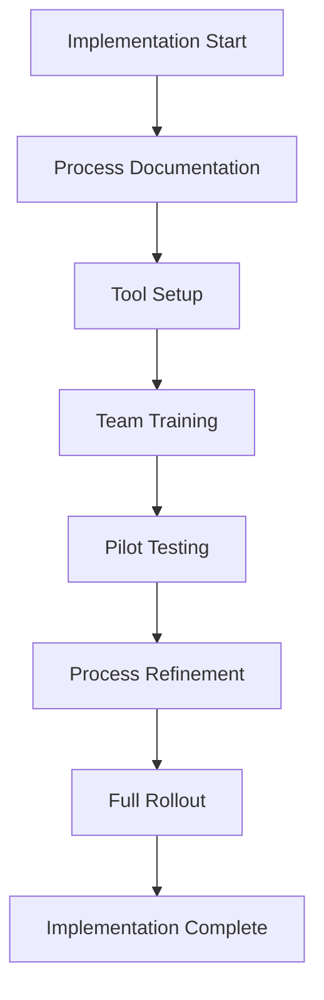

#### Key Activities
1. **Process Implementation**
   - Document all governance processes
   - Set up governance tools and systems
   - Train teams on new processes
   - Conduct pilot testing

2. **Rollout and Optimization**
   - Execute full governance rollout
   - Monitor process effectiveness
   - Collect feedback and refine
   - Establish ongoing maintenance

### Phase 4: Monitoring and Evolution (Week 6)

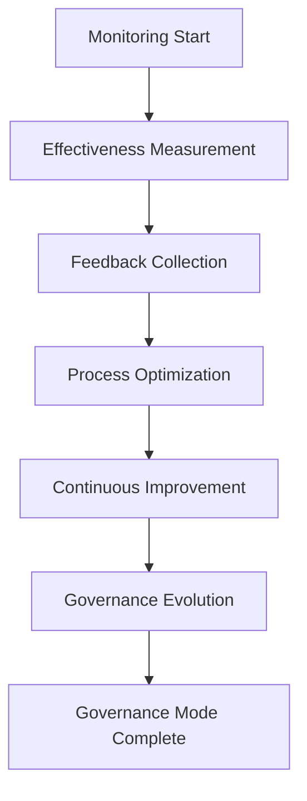

#### Key Activities
1. **Performance Monitoring**
   - Measure governance effectiveness
   - Track compliance and adoption
   - Monitor decision-making efficiency
   - Assess stakeholder satisfaction

2. **Continuous Improvement**
   - Collect ongoing feedback
   - Optimize processes based on learnings
   - Plan governance evolution
   - Establish regular review cycles

---

## Enhancement Mode Workflow

**Purpose**: Improving and evolving existing design systems
**Typical Duration**: 2-8 weeks
**Key Deliverables**: Enhanced components, improved processes, updated documentation

### Phase 1: Enhancement Assessment (Week 1)

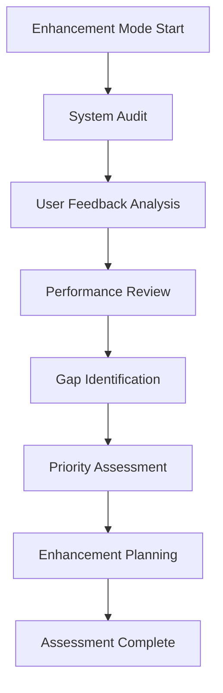

#### Key Activities
1. **Current State Evaluation**
   - Conduct comprehensive design system audit
   - Analyze user feedback and pain points
   - Review system performance and adoption
   - Identify improvement opportunities

2. **Enhancement Planning**
   - Prioritize enhancement opportunities
   - Define enhancement scope and goals
   - Plan implementation approach
   - Establish success metrics

### Phase 2: Enhancement Design (Week 2-4)

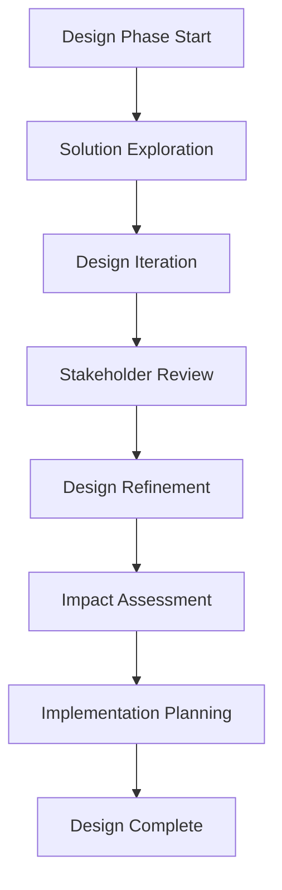

#### Key Activities
1. **Solution Development**
   - Explore multiple enhancement approaches
   - Design improved components and patterns
   - Create enhanced user experiences
   - Develop implementation strategies

2. **Validation and Planning**
   - Validate solutions with stakeholders
   - Assess impact on existing implementations
   - Plan migration and adoption strategies
   - Prepare implementation roadmap

### Phase 3: Enhancement Implementation (Week 5-7)

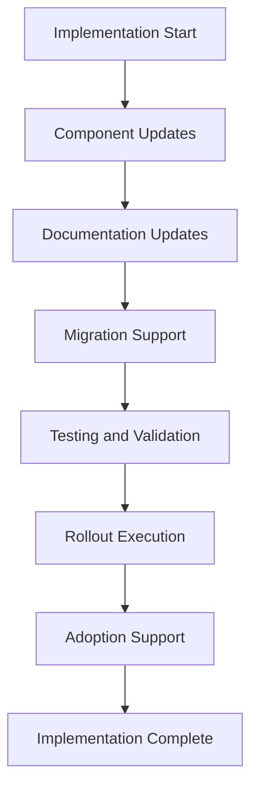

#### Key Activities
1. **System Updates**
   - Implement component enhancements
   - Update documentation and guidelines
   - Provide migration tools and support
   - Conduct thorough testing

2. **Rollout and Support**
   - Execute phased enhancement rollout
   - Support teams in adopting changes
   - Monitor enhancement adoption
   - Provide ongoing assistance

### Phase 4: Enhancement Validation (Week 8)

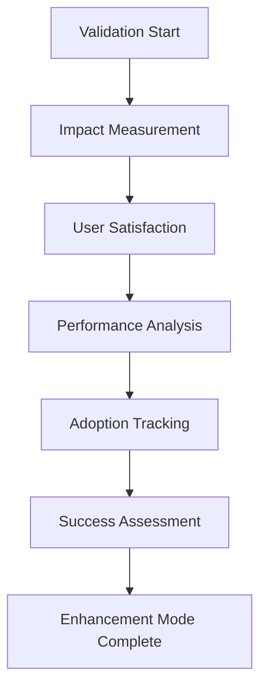

#### Key Activities
1. **Success Measurement**
   - Measure enhancement impact and effectiveness
   - Assess user satisfaction improvements
   - Analyze performance gains
   - Track adoption rates

2. **Continuous Improvement**
   - Collect feedback on enhancements
   - Identify additional improvement opportunities
   - Plan future enhancement cycles
   - Document lessons learned

---

## Quality Mode Workflow

**Purpose**: Auditing and improving design system quality
**Typical Duration**: 1-4 weeks
**Key Deliverables**: Quality audit report, improvement plan, quality standards

### Phase 1: Quality Assessment (Week 1)

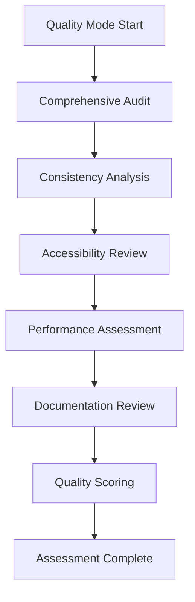

#### Key Activities
1. **Comprehensive Auditing**
   - Conduct design system consistency audit
   - Perform accessibility compliance review
   - Assess performance impact
   - Review documentation quality

2. **Quality Analysis**
   - Score quality across all dimensions
   - Identify critical quality issues
   - Prioritize improvement opportunities
   - Create quality improvement plan

### Phase 2: Quality Improvement (Week 2-3)

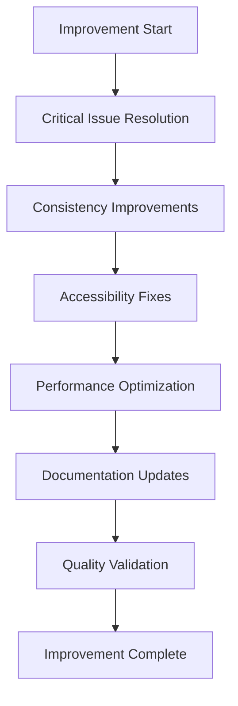

#### Key Activities
1. **Issue Resolution**
   - Address critical quality issues immediately
   - Implement consistency improvements
   - Fix accessibility compliance gaps
   - Optimize performance issues

2. **Quality Enhancement**
   - Update documentation and guidelines
   - Implement quality monitoring tools
   - Establish quality standards
   - Create quality assurance processes

### Phase 3: Quality Monitoring (Week 4)

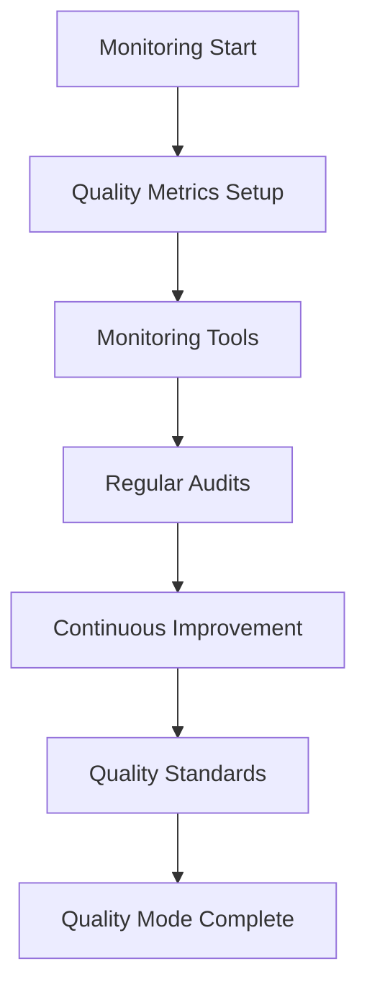

#### Key Activities
1. **Quality Systems**
   - Set up quality monitoring systems
   - Implement automated quality checks
   - Establish regular audit schedules
   - Create quality reporting dashboards

2. **Ongoing Quality**
   - Monitor quality metrics continuously
   - Conduct regular quality reviews
   - Implement continuous improvement
   - Maintain quality standards

---

## Collaboration Mode Workflow

**Purpose**: Working with other personas on design integration
**Typical Duration**: 1-6 weeks
**Key Deliverables**: Integrated solutions, collaboration frameworks, shared documentation

### Phase 1: Collaboration Setup (Week 1)

```mermaid title="Collaboration Mode - Setup Phase" type="diagram"
graph TD
    A["Collaboration Mode Start"] --> B["Stakeholder Identification"]
    B --> C["Collaboration Planning"]
    C --> D["Communication Setup"]
    D --> E["Tool Integration"]
    E --> F["Process Alignment"]
    F --> G["Collaboration Framework"]
    G --> H["Setup Complete"]
```

#### Key Activities
1. **Collaboration Planning**
   - Identify key collaboration stakeholders
   - Define collaboration objectives and scope
   - Plan collaboration approach and timeline
   - Establish communication protocols

2. **Framework Setup**
   - Set up collaboration tools and platforms
   - Align on shared processes and workflows
   - Create collaboration documentation
   - Establish feedback mechanisms

### Phase 2: Collaborative Design (Week 2-4)

```mermaid title="Collaboration Mode - Design Phase" type="diagram"
graph TD
    A["Design Phase Start"] --> B["Cross-functional Workshops"]
    B --> C["Collaborative Ideation"]
    C --> D["Integrated Solution Design"]
    D --> E["Stakeholder Review"]
    E --> F["Design Iteration"]
    F --> G["Solution Validation"]
    G --> H["Design Complete"]
```

#### Key Activities
1. **Collaborative Design Process**
   - Conduct cross-functional design workshops
   - Facilitate collaborative ideation sessions
   - Design integrated solutions
   - Iterate based on multi-stakeholder feedback

2. **Solution Integration**
   - Integrate design with technical requirements
   - Align with business and user needs
   - Validate solutions across disciplines
   - Prepare for implementation

### Phase 3: Implementation Collaboration (Week 5-6)

```mermaid title="Collaboration Mode - Implementation Phase" type="diagram"
graph TD
    A["Implementation Start"] --> B["Handoff Coordination"]
    B --> C["Implementation Support"]
    C --> D["Quality Assurance"]
    D --> E["Testing Collaboration"]
    E --> F["Launch Coordination"]
    F --> G["Success Measurement"]
    G --> H["Collaboration Mode Complete"]
```

#### Key Activities
1. **Implementation Support**
   - Coordinate design-development handoffs
   - Provide ongoing implementation support
   - Collaborate on quality assurance
   - Support testing and validation

2. **Launch and Success**
   - Coordinate collaborative launch activities
   - Measure collaborative success
   - Document collaboration learnings
   - Plan future collaboration

---

## Workflow Integration Points

### Cross-Persona Integration

#### With UX/UI Architect
- **Design Requirements**: Receive user research insights and interaction requirements
- **Component Collaboration**: Collaborate on component design and user experience
- **Usability Validation**: Joint usability testing and validation
- **Design Handoff**: Coordinate design system implementation

#### With System Architect
- **Technical Constraints**: Understand technical limitations and requirements
- **Performance Collaboration**: Collaborate on performance optimization
- **Implementation Planning**: Joint planning of technical implementation
- **Architecture Alignment**: Ensure design system aligns with technical architecture

#### With Product Owner
- **Business Requirements**: Understand business goals and constraints
- **Prioritization**: Collaborate on feature and component prioritization
- **Success Metrics**: Define and track design system success metrics
- **Stakeholder Communication**: Joint stakeholder communication and updates

#### With Developer
- **Implementation Support**: Provide detailed implementation guidance
- **Technical Feasibility**: Collaborate on technical feasibility assessment
- **Code Review**: Participate in design system code reviews
- **Quality Assurance**: Joint quality assurance and testing

#### With Scrum Master
- **Process Integration**: Integrate design workflows with agile processes
- **Sprint Planning**: Participate in sprint planning and estimation
- **Progress Tracking**: Collaborate on progress tracking and reporting
- **Team Coordination**: Coordinate cross-functional team activities

### Workflow Transition Framework

#### Mode Transition Triggers
1. **Scope Change**: When project scope significantly changes
2. **Quality Issues**: When quality problems are identified
3. **Stakeholder Needs**: When new stakeholder requirements emerge
4. **Technical Constraints**: When technical limitations are discovered
5. **Timeline Changes**: When project timeline is modified

#### Transition Process
1. **Current Mode Assessment**: Evaluate current workflow progress
2. **Transition Planning**: Plan transition to new workflow mode
3. **Stakeholder Communication**: Communicate transition to stakeholders
4. **Mode Switch**: Execute transition to new workflow mode
5. **Progress Validation**: Validate progress in new mode

---

## Performance Metrics

### Workflow Efficiency Metrics

#### Time-based Metrics
- **Mode Duration**: Average time spent in each workflow mode
- **Transition Time**: Time required for mode transitions
- **Delivery Time**: Time from start to deliverable completion
- **Iteration Cycles**: Number of iteration cycles per deliverable

#### Quality Metrics
- **First-time Quality**: Percentage of deliverables meeting quality standards initially
- **Rework Rate**: Percentage of deliverables requiring significant rework
- **Stakeholder Satisfaction**: Satisfaction scores from stakeholders
- **Adoption Rate**: Rate of design system adoption across teams

#### Collaboration Metrics
- **Cross-functional Efficiency**: Effectiveness of cross-persona collaboration
- **Communication Quality**: Quality and clarity of cross-functional communication
- **Integration Success**: Success rate of integrated solutions
- **Stakeholder Engagement**: Level of stakeholder engagement and participation

### Continuous Improvement

#### Workflow Optimization
- **Process Refinement**: Regular refinement of workflow processes
- **Tool Optimization**: Optimization of tools and platforms used
- **Skill Development**: Continuous skill development for workflow efficiency
- **Best Practice Integration**: Integration of new best practices

#### Performance Tracking
- **Metric Monitoring**: Regular monitoring of workflow performance metrics
- **Trend Analysis**: Analysis of performance trends over time
- **Benchmark Comparison**: Comparison against industry benchmarks
- **Improvement Planning**: Planning of workflow improvements based on metrics

---

*This workflow mapping provides comprehensive guidance for navigating all aspects of Design Architect work within the BMAD Method. The flexible workflow modes ensure optimal approaches for different project types and requirements while maintaining consistency and quality across all deliverables.*
