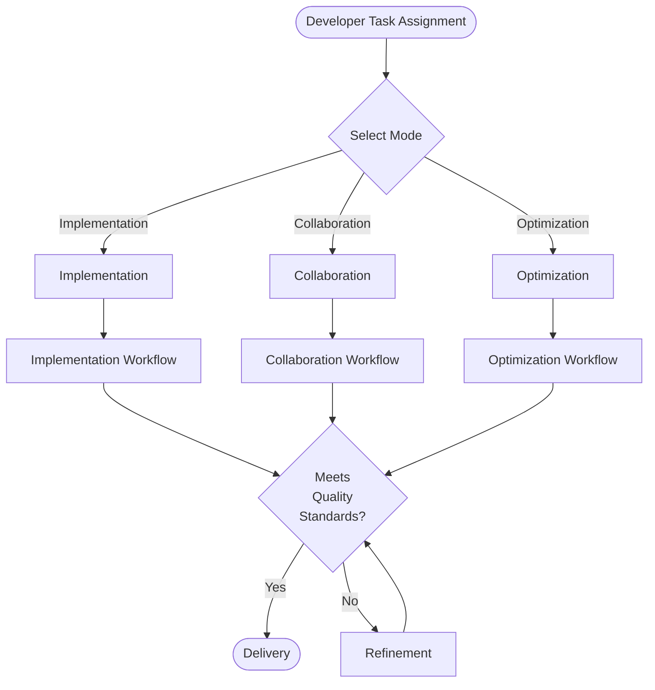
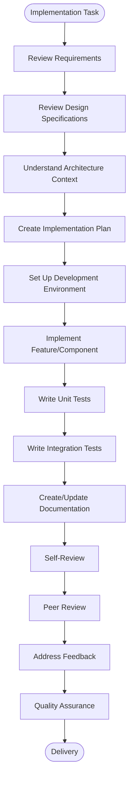
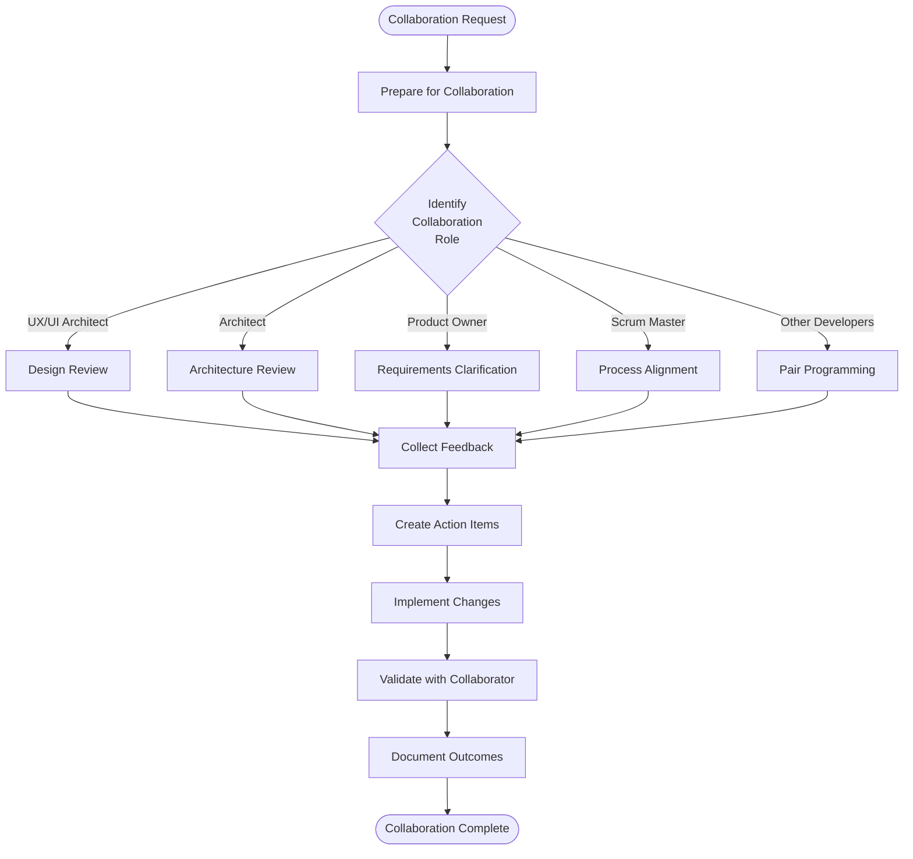
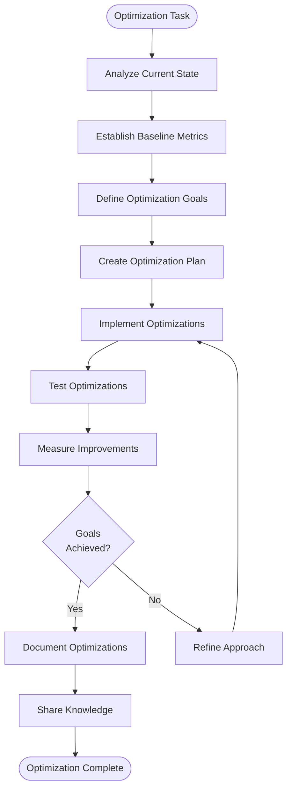
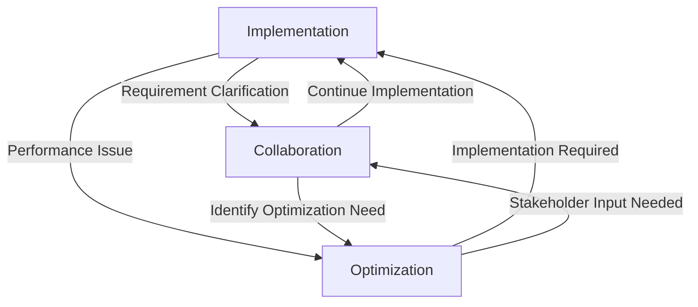

# Developer Workflow Mapping
**BMAD Method Documentation**

## Introduction

This Developer Workflow Mapping document outlines the structured workflows for developers working within the BMAD Method framework. These workflows are designed to maximize productivity, ensure quality, and facilitate collaboration with other roles in the development process.

## Workflow Architecture

The developer workflow in the BMAD Method is organized into three primary modes, each with its own specific workflow:

1. **Implementation Mode** - For building features and components
2. **Collaboration Mode** - For working with other roles and personas
3. **Optimization Mode** - For improving existing code and systems

Each mode has defined entry points, processes, and exit criteria that guide developers through their work.

## Workflow Diagram Overview

## Implementation Mode Workflow

The Implementation Mode workflow guides developers through the process of building new features and components.

### Entry Points

- Feature assignment from Product Owner
- Component specification from UX/UI Architect
- Technical task from Architect
- Bug fix assignment

### Implementation Workflow

### Implementation Phases

#### 1. Preparation Phase
- **Review Requirements**: Thoroughly understand the requirements and acceptance criteria
- **Review Design Specifications**: Analyze UI/UX designs and interaction patterns
- **Understand Architecture Context**: Review system architecture and integration points
- **Create Implementation Plan**: Break down the work into manageable tasks

#### 2. Development Phase
- **Set Up Development Environment**: Configure necessary tools and dependencies
- **Implement Feature/Component**: Write code following quality standards
- **Write Unit Tests**: Create comprehensive unit tests
- **Write Integration Tests**: Ensure proper integration with other components

#### 3. Finalization Phase
- **Create/Update Documentation**: Document code, APIs, and usage examples
- **Self-Review**: Perform quality self-assessment
- **Peer Review**: Submit for peer review and address feedback
- **Quality Assurance**: Verify all quality standards are met

### Exit Criteria
- All acceptance criteria met
- Code passes all automated checks
- Tests achieve required coverage
- Documentation is complete
- Peer review approval obtained

## Collaboration Mode Workflow

The Collaboration Mode workflow guides developers through effective collaboration with other roles in the BMAD Method.

### Entry Points

- Design handoff from UX/UI Architect
- Architecture review with Architect
- Requirements clarification with Product Owner
- Sprint planning with Scrum Master
- Pair programming session

### Collaboration Workflow

### Collaboration Phases

#### 1. Preparation Phase
- **Prepare for Collaboration**: Review relevant materials and prepare questions
- **Identify Collaboration Role**: Determine the specific role you're collaborating with

#### 2. Role-Specific Collaboration
- **Design Review**: Review designs and provide implementation feasibility feedback
- **Architecture Review**: Discuss architectural approaches and technical constraints
- **Requirements Clarification**: Clarify requirements and acceptance criteria
- **Process Alignment**: Align on process expectations and timelines
- **Pair Programming**: Collaborate directly on implementation

#### 3. Integration Phase
- **Collect Feedback**: Document all feedback and decisions
- **Create Action Items**: Convert feedback into actionable tasks
- **Implement Changes**: Make necessary changes based on collaboration
- **Validate with Collaborator**: Confirm changes meet expectations
- **Document Outcomes**: Record decisions and outcomes

### Exit Criteria
- Collaboration objectives achieved
- Action items completed
- Changes validated by collaborator
- Outcomes documented

## Optimization Mode Workflow

The Optimization Mode workflow guides developers through the process of improving existing code and systems.

### Entry Points

- Performance optimization task
- Technical debt reduction initiative
- Refactoring requirement
- Accessibility improvement
- Security enhancement

### Optimization Workflow

### Optimization Phases

#### 1. Assessment Phase
- **Analyze Current State**: Understand the current implementation and issues
- **Establish Baseline Metrics**: Measure current performance or quality metrics
- **Define Optimization Goals**: Set clear, measurable optimization targets
- **Create Optimization Plan**: Plan the approach and techniques to use

#### 2. Implementation Phase
- **Implement Optimizations**: Apply optimization techniques
- **Test Optimizations**: Verify functionality is preserved
- **Measure Improvements**: Quantify the impact of optimizations
- **Evaluate Goals**: Determine if optimization goals were met

#### 3. Knowledge Phase
- **Document Optimizations**: Record techniques used and results achieved
- **Share Knowledge**: Share learnings with the team
- **Refine Approach**: Iterate if goals weren't met

### Exit Criteria
- Optimization goals achieved
- Functionality preserved
- Performance/quality improvements measured
- Optimizations documented
- Knowledge shared with team

## Mode Transitions

Developers may need to transition between modes during their work. The following diagram illustrates the common transition patterns:

### Common Transition Triggers

- **Implementation → Collaboration**: Need for requirement clarification, design feedback, or technical guidance
- **Implementation → Optimization**: Discovery of performance issues or technical debt
- **Collaboration → Implementation**: Continuation of implementation after collaboration
- **Collaboration → Optimization**: Identification of optimization opportunities during collaboration
- **Optimization → Implementation**: Need for new implementation to support optimization
- **Optimization → Collaboration**: Need for stakeholder input on optimization approach

## Integration with Other Personas

The developer workflow integrates with other BMAD Method personas at specific points:

### UX/UI Architect Integration

- **Design Handoff**: Receive component specifications and design assets
- **Implementation Feedback**: Provide feedback on implementation feasibility
- **Design Clarification**: Request clarification on design details
- **Component Showcase**: Demonstrate implemented components

### Architect Integration

- **Architecture Guidance**: Receive technical architecture guidance
- **Technical Decision Making**: Collaborate on technical decisions
- **Code Review**: Receive architecture-focused code reviews
- **Technical Debt Assessment**: Identify and prioritize technical debt

### Product Owner Integration

- **Requirement Clarification**: Clarify feature requirements
- **Acceptance Criteria Validation**: Confirm understanding of acceptance criteria
- **Feature Demonstration**: Showcase implemented features
- **Scope Negotiation**: Discuss technical constraints and scope adjustments

### Scrum Master Integration

- **Sprint Planning**: Participate in sprint planning and estimation
- **Impediment Removal**: Report and resolve development impediments
- **Progress Reporting**: Report on development progress
- **Process Improvement**: Provide feedback on development process

## Performance Metrics

Developer workflow performance is measured using the following metrics:

### Productivity Metrics

- **Cycle Time**: Time from task start to completion
- **Lead Time**: Time from task creation to completion
- **Story Points Velocity**: Story points completed per sprint
- **Code Throughput**: Lines of code or commits per time period

### Quality Metrics

- **Defect Density**: Defects per unit of code
- **Test Coverage**: Percentage of code covered by tests
- **Technical Debt Ratio**: Ratio of technical debt to clean code
- **Code Quality Score**: Composite score from static analysis tools

### Collaboration Metrics

- **Review Efficiency**: Time from review request to completion
- **Feedback Incorporation Rate**: Percentage of feedback incorporated
- **Cross-functional Collaboration**: Number of collaborative sessions
- **Knowledge Sharing**: Number of knowledge sharing activities

## Continuous Improvement Process

The developer workflow is continuously improved through:

1. **Retrospective Analysis**: Regular review of workflow effectiveness
2. **Metric Tracking**: Monitoring of performance metrics over time
3. **Feedback Collection**: Gathering feedback from developers and other roles
4. **Process Experimentation**: Controlled experiments with workflow variations
5. **Best Practice Integration**: Incorporation of industry best practices

## Appendix: Workflow Checklists

### Implementation Mode Checklist

- [ ] Requirements fully understood
- [ ] Design specifications reviewed
- [ ] Architecture context understood
- [ ] Implementation plan created
- [ ] Development environment set up
- [ ] Code implemented following standards
- [ ] Unit tests written and passing
- [ ] Integration tests written and passing
- [ ] Documentation created/updated
- [ ] Self-review completed
- [ ] Peer review completed
- [ ] Quality standards met

### Collaboration Mode Checklist

- [ ] Collaboration objectives defined
- [ ] Relevant materials reviewed
- [ ] Questions prepared
- [ ] Collaboration session conducted
- [ ] Feedback collected and documented
- [ ] Action items created
- [ ] Changes implemented
- [ ] Changes validated with collaborator
- [ ] Outcomes documented

### Optimization Mode Checklist

- [ ] Current state analyzed
- [ ] Baseline metrics established
- [ ] Optimization goals defined
- [ ] Optimization plan created
- [ ] Optimizations implemented
- [ ] Functionality verified
- [ ] Improvements measured
- [ ] Goals evaluated
- [ ] Optimizations documented
- [ ] Knowledge shared with team

---

*Last Updated: June 2025*
