# BMAD Method Documentation Architecture

## Overview

This document defines the comprehensive documentation architecture for the BMAD Method, supporting all personas and providing enhanced guidance for polyglot development scenarios.

## Architecture Principles

### 1. Persona-Centric Organization
- Documentation organized around the 8 core personas
- Clear navigation paths for each role
- Cross-persona integration points clearly defined

### 2. Technology Stack Agnostic
- Support for React, TypeScript, Node.js, ASP.NET, Python
- Platform-neutral guidance with technology-specific examples
- Consistent patterns across all technology stacks

### 3. Hierarchical Structure
- Clear information hierarchy from overview to detailed implementation
- Progressive disclosure of complexity
- Logical grouping of related concepts

### 4. Cross-Reference Integration
- Bidirectional linking between related documents
- Dependency mapping between personas and tasks
- Integration point documentation

## Documentation Structure

```mermaid title="BMAD Documentation Architecture" type="diagram"
graph TD
    ROOT[BMAD Method Documentation Root]
    
    ROOT --> CORE[Core Documentation]
    ROOT --> PERSONAS[Persona Documentation]
    ROOT --> PROCESSES[Process Documentation]
    ROOT --> TEMPLATES[Templates & Standards]
    ROOT --> EXAMPLES[Examples & Patterns]
    ROOT --> TRAINING[Training Materials]
    
    CORE --> OVERVIEW[Method Overview]
    CORE --> PRINCIPLES[Core Principles]
    CORE --> ARCHITECTURE[System Architecture]
    CORE --> INTEGRATION[Integration Guide]
    
    PERSONAS --> TECH_DOC[Technical Documentation Architect]
    PERSONAS --> DEVOPS_DOC[DevOps Documentation Specialist]
    PERSONAS --> INTEGRATION_SPEC[Cross-Platform Integration Specialist]
    PERSONAS --> CODE_REVIEW[Polyglot Code Review Specialist]
    PERSONAS --> PERF_OPT[Performance Optimization Specialist]
    PERSONAS --> SEC_INT[Security Integration Specialist]
    PERSONAS --> ENT_ARCH[Enterprise Architecture Consultant]
    PERSONAS --> TROUBLESHOOT[Advanced Troubleshooting Specialist]
    
    PROCESSES --> WORKFLOWS[Workflow Definitions]
    PROCESSES --> HANDOFFS[Handoff Procedures]
    PROCESSES --> QUALITY[Quality Assurance]
    PROCESSES --> ORCHESTRATION[Orchestrator Integration]
    
    TEMPLATES --> DOC_TEMPLATES[Documentation Templates]
    TEMPLATES --> CODE_TEMPLATES[Code Templates]
    TEMPLATES --> REVIEW_TEMPLATES[Review Templates]
    TEMPLATES --> STANDARDS[Quality Standards]
    
    EXAMPLES --> PROJECT_EXAMPLES[Project Examples]
    EXAMPLES --> INTEGRATION_EXAMPLES[Integration Patterns]
    EXAMPLES --> REVIEW_EXAMPLES[Review Examples]
    EXAMPLES --> TROUBLESHOOTING_EXAMPLES[Troubleshooting Cases]
    
    TRAINING --> QUICKSTARTS[Quick Start Guides]
    TRAINING --> TUTORIALS[Detailed Tutorials]
    TRAINING --> WORKSHOPS[Workshop Materials]
    TRAINING --> ASSESSMENTS[Skill Assessments]
```



## Directory Structure Implementation

```
bmad-method/
 docs/
    documentation-architecture/          # This architecture documentation
    core/                                # Core methodology documentation
       overview/
       principles/
       architecture/
       integration/
    personas/                            # Persona-specific documentation
       technical-documentation-architect/
       devops-documentation-specialist/
       cross-platform-integration-specialist/
       polyglot-code-review-specialist/
       performance-optimization-specialist/
       security-integration-specialist/
       enterprise-architecture-consultant/
       advanced-troubleshooting-specialist/
    processes/                           # Process documentation
       workflows/
       handoffs/
       quality-assurance/
       orchestration/
    templates/                           # All templates and standards
       documentation/
       code/
       review/
       standards/
    examples/                            # Examples and patterns
       projects/
       integrations/
       reviews/
       troubleshooting/
    training/                            # Training materials
       quickstarts/
       tutorials/
       workshops/
       assessments/
    navigation/                          # Navigation and discovery
        index.md
        persona-map.md
        technology-map.md
        workflow-map.md
 bmad-agent/                              # Core BMAD agent files
    personas/                            # Persona definitions
    tasks/                               # Task definitions
    templates/                           # Core templates
    checklists/                          # Quality checklists
    data/                                # Knowledge base
 examples/                                # Implementation examples
     react-typescript/
     nodejs/
     aspnet/
     python/
```

## Navigation System

### Primary Navigation Paths

1. **By Persona**: Users can navigate directly to their role-specific documentation
2. **By Technology**: Users can find guidance specific to their technology stack
3. **By Process**: Users can follow workflow-based navigation
4. **By Task**: Users can find specific task-oriented guidance

### Cross-Reference System

- **Bidirectional Links**: Every document includes links to related documents
- **Dependency Mapping**: Clear indication of prerequisites and dependencies
- **Integration Points**: Explicit documentation of persona collaboration points
- **Technology Mapping**: Clear indication of technology-specific guidance

## Search and Discovery

### Metadata Structure

Each document includes standardized metadata:

\```yaml
---
title: Document Title
persona: [primary-persona, secondary-personas]
technology: [react, typescript, nodejs, aspnet, python]
complexity: [beginner, intermediate, advanced]
type: [guide, template, checklist, example]
dependencies: [list-of-dependencies]
related: [list-of-related-documents]
last_updated: YYYY-MM-DD
version: X.Y.Z
---
```

### Search Capabilities

- **Full-text search** across all documentation
- **Filtered search** by persona, technology, complexity
- **Tag-based discovery** using metadata
- **Workflow-based navigation** following process flows

## Quality Assurance Integration

### Documentation Standards

- **Consistency Validation**: Automated checks for formatting and structure
- **Link Validation**: Automated verification of all internal and external links
- **Metadata Validation**: Verification of required metadata fields
- **Cross-Reference Validation**: Verification of bidirectional links

### Review Process

- **Persona Expert Review**: Each document reviewed by relevant persona experts
- **Technical Accuracy Review**: Technology-specific validation
- **Integration Review**: Validation of cross-persona integration points
- **User Experience Review**: Navigation and usability validation

## Version Control Integration

### Change Management

- **Semantic Versioning**: Major.Minor.Patch versioning for all documents
- **Change Tracking**: Clear documentation of changes and their impact
- **Backward Compatibility**: Maintenance of deprecated content with migration paths
- **Release Notes**: Comprehensive change documentation

### Collaboration Workflow

- **Branch-based Development**: Feature branches for documentation updates
- **Review Process**: Pull request-based review and approval
- **Automated Testing**: CI/CD integration for quality validation
- **Deployment Pipeline**: Automated publication of approved changes

## Implementation Roadmap

### Phase 1: Core Structure (Current)
- [ ] Directory structure implementation
- [ ] Navigation system creation
- [ ] Metadata standards definition
- [ ] Basic search implementation

### Phase 2: Content Migration
- [ ] Existing documentation migration
- [ ] Cross-reference implementation
- [ ] Quality validation integration
- [ ] Search optimization

### Phase 3: Advanced Features
- [ ] Advanced search capabilities
- [ ] Interactive navigation
- [ ] User feedback integration
- [ ] Analytics and usage tracking

## Success Metrics

- **Discovery Time**: < 30 seconds to find relevant documentation
- **Navigation Efficiency**: < 3 clicks to reach target content
- **Cross-Reference Accuracy**: 100% valid links
- **User Satisfaction**: > 90% positive feedback on documentation structure
- **Maintenance Efficiency**: < 2 hours for major documentation updates

---

*This architecture supports the BMAD Method's goal of providing comprehensive, accessible, and maintainable documentation for all personas and technology stacks.*
