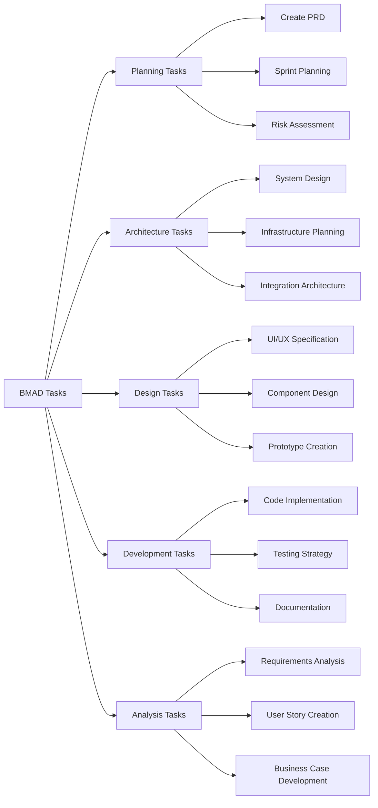

# Core Concepts of the BMAD Method

Understanding these fundamental concepts is essential to leveraging the full power of the BMAD Method.

## The Four Pillars of BMAD

### 1. 🎭 Orchestrator-Driven Coordination

The **Orchestrator** is the central intelligence that manages all interactions:

- **Request Analysis**: Understands user intent and context
- **Persona Selection**: Chooses the right expert for each task
- **Context Management**: Maintains shared knowledge across all personas
- **Quality Assurance**: Ensures deliverables meet standards
- **Workflow Optimization**: Streamlines handoffs and reduces friction

```mermaid title="Orchestrator Decision Flow" type="diagram"
graph TD
    A["User Input"] --> B["Parse Request"]
    B --> C{["Request Type?"]}
    C -->|Planning| D["PM Persona"]
    C -->|Architecture| E["Architect Persona"]
    C -->|Design| F["UX/UI Persona"]
    C -->|Development| G["Developer Persona"]
    C -->|Analysis| H["Analyst Persona"]
    D --> I["Execute Task"]
    E --> I
    F --> I
    G --> I
    H --> I
    I --> J["Update Shared Context"]
    J --> K["Ready for Next Request"]
```

### 2. 👥 Specialized AI Personas

Each persona is a domain expert with:

- **Deep Specialization**: Focused expertise in their field
- **Consistent Behavior**: Reliable, predictable responses
- **Template-Driven Output**: Standardized deliverable formats
- **Context Awareness**: Access to full project history
- **Quality Standards**: Built-in best practices and validation

#### Available Personas:

| Persona | Expertise | Primary Deliverables |
|---------|-----------|---------------------|
| **PM (Patricia)** | Project Management | PRDs, Project Plans, Status Reports |
| **Architect (Alex)** | System Architecture | Architecture Docs, Technical Specs |
| **UX/UI (Veronica/Victor)** | Design & Frontend | Wireframes, Components, Prototypes |
| **Developer (David)** | Implementation | Code, Documentation, Reviews |
| **Analyst (Anna)** | Business Analysis | Requirements, User Stories, Analysis |
| **PO (Oliver)** | Product Strategy | Roadmaps, Feature Specs, Priorities |
| **Scrum Master (Sam)** | Process Management | Sprint Plans, Retrospectives, Metrics |

### 3. 📋 Task-Driven Execution

Every action in BMAD is structured as a **Task**:

- **Clear Objectives**: Each task has specific, measurable outcomes
- **Standardized Process**: Consistent execution methodology
- **Template-Based Output**: Predictable deliverable formats
- **Quality Checkpoints**: Built-in validation and review steps
- **Context Integration**: Results feed back into shared knowledge

#### Task Categories:



### 4. 📄 Template-Driven Standardization

All deliverables follow proven templates:

- **Consistent Structure**: Every document follows the same format
- **Complete Coverage**: Templates ensure nothing is missed
- **Quality Assurance**: Built-in checklists and validation
- **Easy Maintenance**: Standardized formats are easier to update
- **Knowledge Transfer**: Anyone can understand any deliverable

## The BMAD Workflow Cycle

```mermaid title="Complete BMAD Workflow" type="diagram"
graph TD
    A["Project Initiation"] --> B["Requirements Gathering"]
    B --> C["Architecture Planning"]
    C --> D["Design Specification"]
    D --> E["Implementation Planning"]
    E --> F["Development Execution"]
    F --> G["Quality Assurance"]
    G --> H["Deployment Planning"]
    H --> I["Project Delivery"]
    
    I --> J{["More Features?"]}
    J -->|Yes| K["Feature Planning"]
    J -->|No| L["Project Completion"]
    
    K --> C
    
    subgraph "Continuous Activities"
        M["Context Management"]
        N["Quality Monitoring"]
        O["Progress Tracking"]
    end
    
    B -.-> M
    C -.-> M
    D -.-> M
    E -.-> M
    F -.-> M
    G -.-> N
    H -.-> O
```

## Key Principles

### 1. Context is King
- Every persona has access to complete project history
- Decisions are made with full context awareness
- No information silos or communication gaps

### 2. Quality by Design
- Templates ensure consistent, high-quality output
- Built-in checklists prevent common mistakes
- Automated validation catches issues early

### 3. Specialization Over Generalization
- Each persona is deeply expert in their domain
- No single point of failure or knowledge bottleneck
- Optimal solutions from domain experts

### 4. Automation Over Manual Process
- Orchestrator handles coordination automatically
- Reduced human error and oversight
- Faster execution with consistent results

### 5. Flexibility Within Structure
- Templates provide structure while allowing customization
- Personas can adapt to specific project needs
- Framework scales from simple to complex projects

## Benefits in Practice

### For Individual Developers
- **Reduced Cognitive Load**: Focus on your expertise, let BMAD handle coordination
- **Higher Quality Output**: Templates and checklists ensure best practices
- **Faster Delivery**: Automated workflows eliminate delays
- **Continuous Learning**: Access to expert knowledge across all domains

### For Development Teams
- **Consistent Deliverables**: Every team member produces standardized output
- **Improved Collaboration**: Shared context eliminates miscommunication
- **Scalable Process**: Framework works for teams of any size
- **Knowledge Retention**: All decisions and rationale are documented

### For Organizations
- **Predictable Outcomes**: Standardized process produces reliable results
- **Reduced Risk**: Built-in quality assurance prevents costly mistakes
- **Faster Time-to-Market**: Streamlined workflows accelerate delivery
- **Competitive Advantage**: AI-augmented development capabilities

## Getting Started with Core Concepts

1. **Choose Your Environment**: Web-based or IDE-based setup
2. **Select Your First Persona**: Start with PM for planning or UX/UI for prototyping
3. **Execute Your First Task**: Try a simple task like creating a project brief
4. **Review the Output**: See how templates ensure quality and completeness
5. **Iterate and Expand**: Add more personas and tasks as you become comfortable

## Next Steps

- **Deep Dive**: [Orchestrator Mechanics](orchestrator-mechanics.md)
- **Practical Application**: [Workflow Examples](workflow-examples.md)
- **Hands-On Practice**: [Getting Started Guide](getting-started.md)

---

*These core concepts form the foundation of the BMAD Method. Master them, and you'll unlock the full potential of AI-driven development.*
