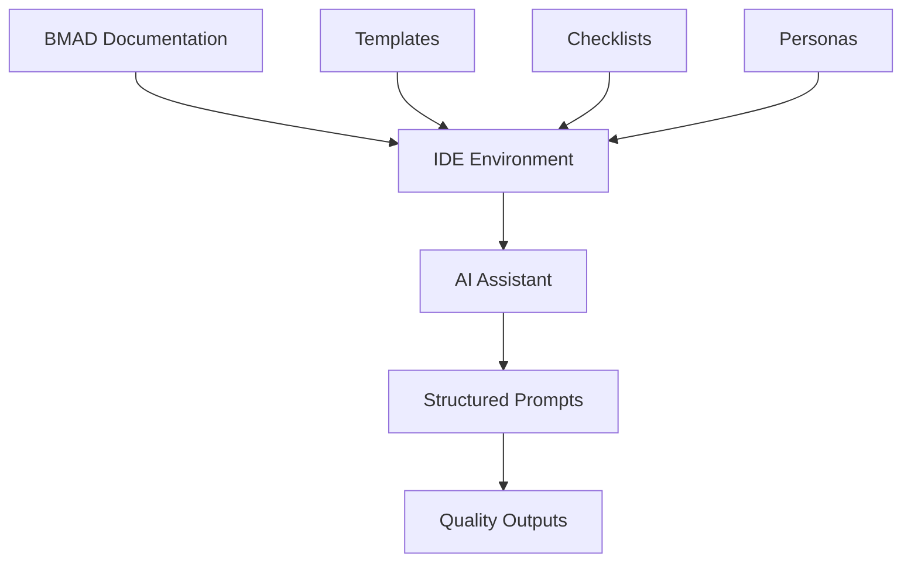

# IDE Setup Guides for BMAD Method

This directory contains comprehensive guides for using the BMAD Method across different Integrated Development Environments (IDEs) and AI-powered coding assistants.

## Overview

The BMAD Method integrates with IDEs through **methodology application** rather than software installation. These guides explain how to effectively use BMAD documentation, personas, and workflows within your preferred development environment.

## Available Setup Guides

### AI-Powered IDEs
- **[Cursor AI Setup](cursor-ai-setup.md)** - Complete methodology integration guide for Cursor AI
- **[Cline Setup](cline-setup.md)** - Terminal-focused BMAD integration for Cline
- **[Claude Code Setup](claude-code-setup.md)** - Code quality focused integration for Claude Code
- **[Roocode Setup](roocode-setup.md)** - Visual development integration for Roocode

### Traditional IDEs with AI Integration
- **[Visual Studio Code Setup](vscode-setup.md)** - VS Code integration with GitHub Copilot and AI extensions
- **[JetBrains IDEs Setup](jetbrains-setup.md)** - Integration for IntelliJ IDEA, WebStorm, PyCharm, and others

## Integration Approach

### Core Principles
The BMAD Method integrates through:

1. **Documentation Loading** - Loading persona and task files into AI assistant context
2. **Prompt Structuring** - Using BMAD patterns to structure AI interactions
3. **Template Application** - Applying BMAD templates as guidance frameworks
4. **Quality Validation** - Following checklists for methodology compliance

### Integration Architecture


## Quick Start Comparison

| IDE | AI Integration | Setup Complexity | Best For |
|-----|----------------|------------------|----------|
| Cursor AI | Native | Low | General development with comprehensive AI assistance |
| Cline | Native | Low | Terminal-heavy workflows and command-line operations |
| Claude Code | Native | Low | Code quality focus and best practices enforcement |
| Roocode | Native | Medium | Visual/UI development and rapid prototyping |
| VS Code | Plugin-based | Medium | Flexible development with extensive customization |
| JetBrains | Plugin-based | High | Enterprise development and advanced tooling |

## General Setup Requirements

### Prerequisites
1. **BMAD Method Repository**
   ```bash
   git clone https://github.com/bmadcode/BMAD-METHOD.git
   ```

2. **Basic Understanding**
   - Familiarity with your chosen IDE
   - Understanding of BMAD Method personas and workflows
   - Basic knowledge of AI-assisted development

### Common Setup Steps
1. **Clone Repository** - Get the BMAD Method documentation
2. **Workspace Setup** - Configure IDE to access BMAD files
3. **Context Preparation** - Load relevant documentation into AI context
4. **Persona Activation** - Test methodology application
5. **Workflow Integration** - Integrate BMAD patterns into your development process

## Methodology Integration Patterns

### 1. Direct Documentation Loading
```
Load [persona-name] from bmad-agent/personas/[persona-file].md
Apply [task-name] from bmad-agent/tasks/[task-file].md
Use [template-name] from bmad-agent/templates/[template-file].md
```

### 2. Structured Prompt Framework
```
Acting as [persona] from BMAD Method:
- Task: [specific task]
- Context: [project context]
- Template: [template reference]
- Quality: [checklist reference]
```

### 3. Workflow Integration
```
Phase 1: Requirements (PM Persona)
Phase 2: Architecture (Architect Persona)
Phase 3: Implementation (Developer Persona)
Phase 4: Quality Assurance (All Personas)
```

## Choosing the Right IDE

### For Beginners
- **Cursor AI**: Easiest methodology integration with excellent AI support
- **Claude Code**: Great for learning BMAD best practices

### For Experienced Developers
- **VS Code**: Maximum flexibility and extensive customization options
- **JetBrains IDEs**: Advanced features and enterprise-grade tooling

### For Specific Use Cases
- **UI/UX Development**: Roocode or Cursor AI with v0 integration
- **Terminal-Heavy Work**: Cline with command-line focus
- **Code Quality Focus**: Claude Code with quality emphasis
- **Team Collaboration**: JetBrains IDEs or VS Code with team features

## Best Practices Across All IDEs

### Documentation Management
- Keep BMAD files organized and accessible
- Maintain consistent file structure across projects
- Version control BMAD outputs and customizations

### Context Management
- Load relevant personas before starting tasks
- Maintain project context throughout development phases
- Reference appropriate templates and checklists consistently

### Quality Assurance
- Use BMAD quality checklists for all deliverables
- Conduct regular methodology compliance reviews
- Validate outputs against BMAD standards

### Team Collaboration
- Share BMAD setup and customizations with team members
- Establish common persona usage patterns
- Document project-specific methodology adaptations

## Troubleshooting Common Issues

### Context-Related Issues
**Problem**: AI assistant doesn't understand BMAD methodology
**Solution**: Explicitly load persona documentation and reference specific files

**Problem**: Inconsistent output quality across team members
**Solution**: Standardize BMAD setup and provide team training on methodology application

### Integration Issues
**Problem**: Difficulty switching between personas
**Solution**: Create standardized persona activation prompts and maintain context files

**Problem**: Template application inconsistencies
**Solution**: Reference specific template files and provide concrete examples

### Performance Issues
**Problem**: Slow AI responses with large BMAD context
**Solution**: Load only relevant documentation for current tasks and optimize context size

## Advanced Integration Techniques

### Multi-Persona Workflows
- Plan persona transitions for complex projects
- Maintain context continuity across persona switches
- Document handoff procedures between personas

### Custom Template Creation
- Adapt BMAD templates for specific project needs
- Create organization-specific template variations
- Maintain template version control and updates

### Quality Automation
- Integrate BMAD checklists into CI/CD pipelines
- Automate quality validation where possible
- Create custom quality metrics based on BMAD standards

## Getting Help

### Resources
1. **Documentation**: [BMAD Method Documentation](https://github.com/bmadcode/BMAD-METHOD/docs)
2. **Community**: [GitHub Discussions](https://github.com/bmadcode/BMAD-METHOD/discussions)
3. **Issues**: [GitHub Issues](https://github.com/bmadcode/BMAD-METHOD/issues)

### Support Channels
- Check IDE-specific setup guides for detailed instructions
- Review troubleshooting sections for common solutions
- Engage with the BMAD Method community for advanced questions

## Contributing

### Adding New IDE Guides
1. Follow the established template structure
2. Include setup, usage, troubleshooting, and best practices sections
3. Test the guide with a fresh IDE installation
4. Submit a pull request with comprehensive documentation

### Improving Existing Guides
1. Test improvements with real-world usage scenarios
2. Gather feedback from community members
3. Update documentation to reflect current best practices
4. Maintain backward compatibility where possible

## Conclusion

The BMAD Method's IDE integration approach focuses on methodology application rather than technical installation. By understanding how to effectively load documentation, structure prompts, and apply quality standards within your chosen IDE, you can leverage the full power of the BMAD Method to improve your development process and deliverable quality.

Choose the IDE that best fits your workflow and team needs, then follow the specific setup guide to begin applying BMAD methodology principles in your development environment.
