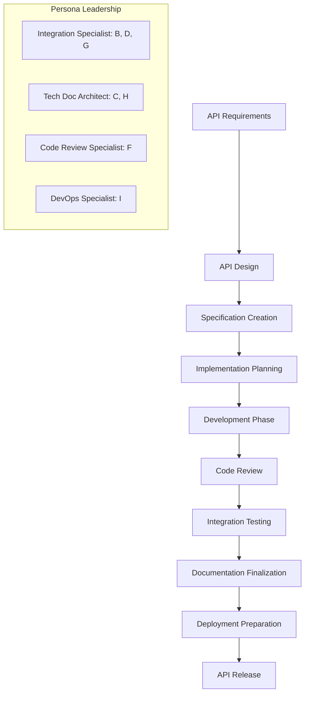
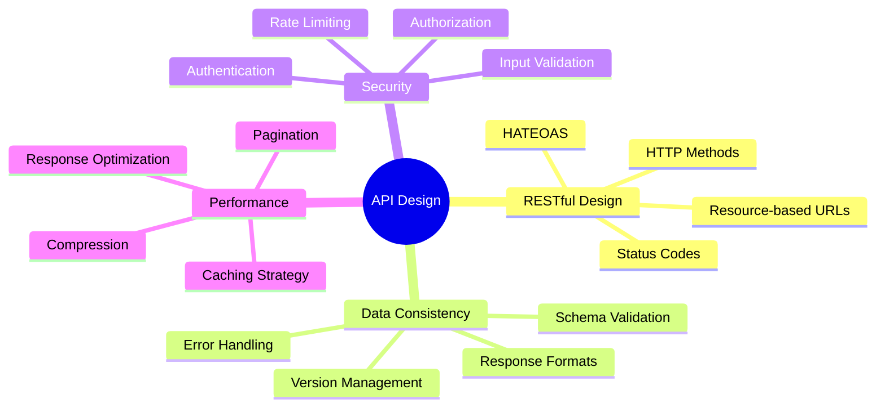
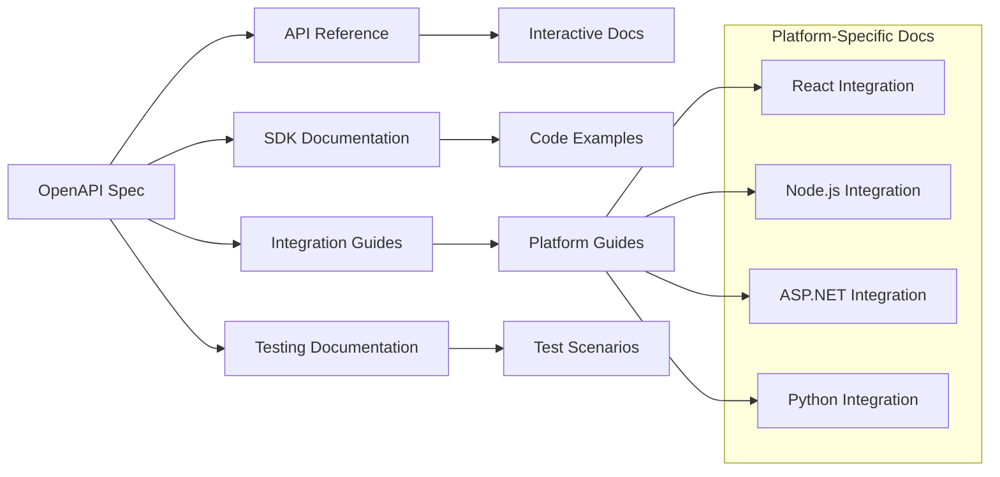
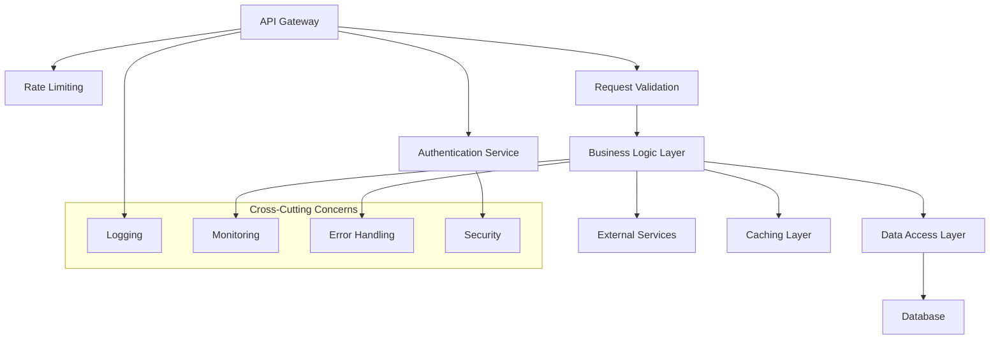
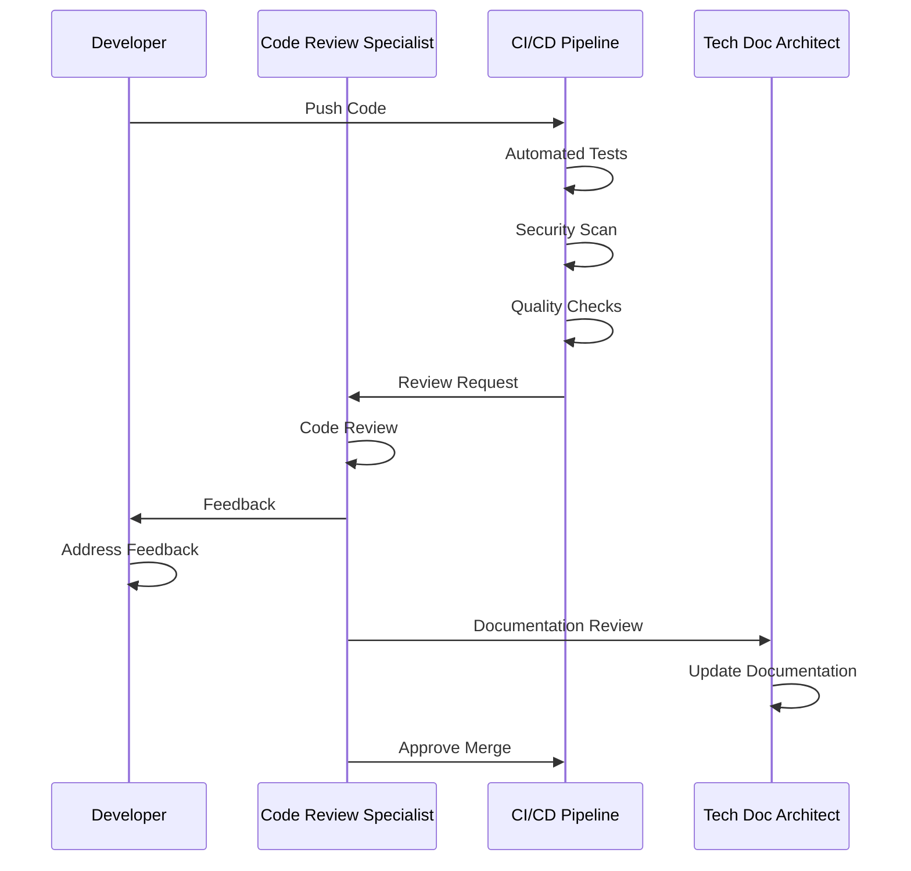
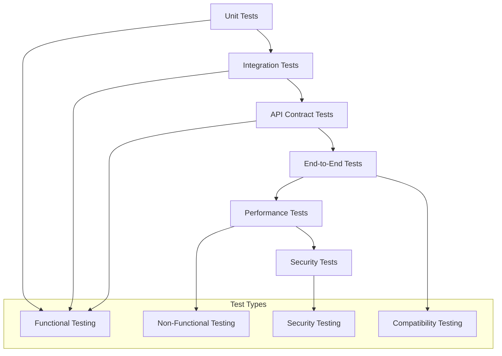
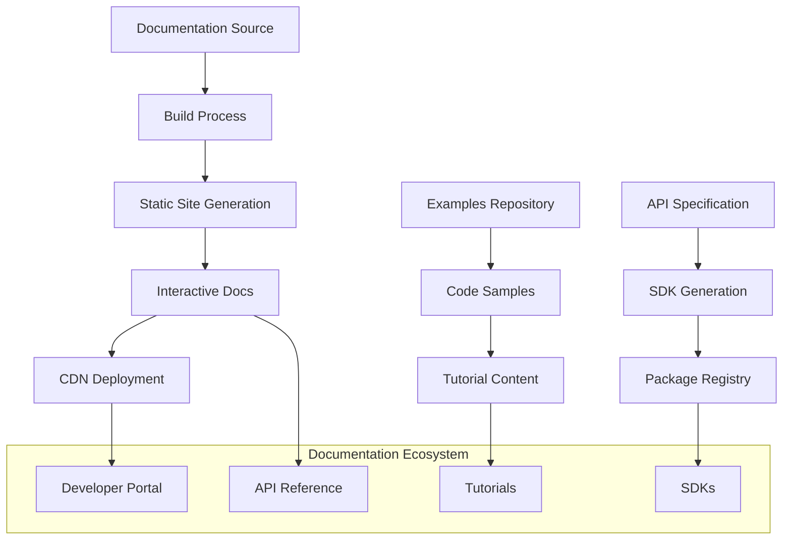

# API Development Integration Workflow

## Overview

This guide demonstrates how BMAD Method personas collaborate during API development, from initial design through implementation, testing, and documentation. This workflow ensures consistent, well-documented, and maintainable APIs across all technology platforms.

## Participants

- ** Technical Documentation Architect**: API documentation and specification
- ** Cross-Platform Integration Specialist**: API design and integration patterns
- ** Polyglot Code Review Specialist**: Code quality and implementation review
- ** DevOps Documentation Specialist**: Deployment and operational documentation

## Workflow Overview



## Phase 1: API Requirements and Design

### Duration: 4-6 hours
### Lead: Cross-Platform Integration Specialist
### Collaborators: Technical Documentation Architect

#### Activities

1. **Requirements Analysis**
   - Business requirements gathering
   - Technical constraints identification
   - Integration requirements analysis
   - Performance and scalability requirements

2. **API Design Planning**
   - Resource identification and modeling
   - Endpoint structure design
   - Data model definition
   - Authentication and authorization strategy

#### API Design Principles



#### Deliverables

- **API Requirements Document**
- **Resource Model Diagram**
- **Endpoint Structure Plan**
- **Authentication Strategy**

#### Handoff Criteria

- [ ] API requirements are complete and validated
- [ ] Resource models are well-defined and normalized
- [ ] Endpoint structure follows RESTful principles
- [ ] Security requirements are clearly specified

## Phase 2: API Specification Creation

### Duration: 6-8 hours
### Lead: Technical Documentation Architect
### Collaborators: Cross-Platform Integration Specialist

#### Activities

1. **OpenAPI Specification Development**
   - Complete API specification in OpenAPI 3.0 format
   - Request/response schema definition
   - Error response documentation
   - Authentication scheme specification

2. **API Documentation Creation**
   - Comprehensive API reference documentation
   - Usage examples and tutorials
   - Integration guides for different platforms
   - SDK and client library documentation

#### OpenAPI Specification Structure

\```yaml
openapi: 3.0.3
info:
  title: {{API_NAME}} API
  description: {{API_DESCRIPTION}}
  version: {{API_VERSION}}
  contact:
    name: {{CONTACT_NAME}}
    email: {{CONTACT_EMAIL}}

servers:
  - url: {{BASE_URL}}
    description: {{ENVIRONMENT_DESCRIPTION}}

paths:
  /{{RESOURCE_PATH}}:
    get:
      summary: {{OPERATION_SUMMARY}}
      description: {{OPERATION_DESCRIPTION}}
      parameters:
        - name: {{PARAMETER_NAME}}
          in: {{PARAMETER_LOCATION}}
          required: {{IS_REQUIRED}}
          schema:
            type: {{PARAMETER_TYPE}}
      responses:
        '200':
          description: {{SUCCESS_DESCRIPTION}}
          content:
            application/json:
              schema:
                $ref: '#/components/schemas/{{SCHEMA_NAME}}'

components:
  schemas:
    {{SCHEMA_NAME}}:
      type: object
      properties:
        {{PROPERTY_NAME}}:
          type: {{PROPERTY_TYPE}}
          description: {{PROPERTY_DESCRIPTION}}
  securitySchemes:
    {{SECURITY_SCHEME_NAME}}:
      type: {{SECURITY_TYPE}}
      scheme: {{SECURITY_SCHEME}}
```

#### Documentation Integration



#### Deliverables

- **OpenAPI 3.0 Specification** (using [API Documentation Template](../../bmad-agent/templates/cross-platform-api-documentation-template.md))
- **Interactive API Documentation**
- **Platform-Specific Integration Guides**
- **SDK Documentation and Examples**

#### Handoff Criteria

- [ ] OpenAPI specification is complete and valid
- [ ] API documentation is comprehensive and clear
- [ ] Integration guides cover all target platforms
- [ ] Examples are functional and tested

## Phase 3: Implementation Planning

### Duration: 2-4 hours
### Lead: Cross-Platform Integration Specialist
### Collaborators: Code Review Specialist, DevOps Specialist

#### Activities

1. **Implementation Strategy Development**
   - Technology stack confirmation
   - Development approach planning
   - Testing strategy definition
   - Quality assurance planning

2. **Development Standards Establishment**
   - Coding standards and conventions
   - Code review criteria and processes
   - Testing requirements and coverage
   - Documentation standards

#### Implementation Architecture



#### Quality Standards

| Quality Dimension | Requirement | Validation Method |
|-------------------|-------------|-------------------|
| **Code Coverage** |  80% | Automated testing |
| **Performance** | < 200ms response time | Load testing |
| **Security** | OWASP compliance | Security scanning |
| **Documentation** | 100% API coverage | Documentation review |
| **Error Handling** | Comprehensive error responses | Error scenario testing |

#### Deliverables

- **Implementation Strategy Document**
- **Development Standards Guide**
- **Testing Strategy and Plan**
- **Quality Assurance Framework**

#### Handoff Criteria

- [ ] Implementation approach is technically sound
- [ ] Development standards are comprehensive
- [ ] Testing strategy covers all quality dimensions
- [ ] Quality gates are clearly defined

## Phase 4: Development and Code Review

### Duration: Variable (based on API complexity)
### Lead: Development Team
### Quality Assurance: Code Review Specialist

#### Activities

1. **Iterative Development**
   - Feature-by-feature implementation
   - Continuous integration and testing
   - Regular code reviews and feedback
   - Documentation updates

2. **Quality Assurance Integration**
   - Automated code quality checks
   - Manual code review processes
   - Security vulnerability scanning
   - Performance testing and optimization

#### Code Review Workflow



#### Code Quality Checklist

**Functionality**
- [ ] All API endpoints are implemented according to specification
- [ ] Request/response handling is correct and complete
- [ ] Error handling covers all edge cases
- [ ] Business logic is properly implemented

**Code Quality**
- [ ] Code follows established coding standards
- [ ] Functions and classes are well-structured and documented
- [ ] No code duplication or unnecessary complexity
- [ ] Proper separation of concerns

**Security**
- [ ] Input validation is comprehensive and secure
- [ ] Authentication and authorization are properly implemented
- [ ] Sensitive data is properly protected
- [ ] Security best practices are followed

**Performance**
- [ ] Database queries are optimized
- [ ] Caching is implemented where appropriate
- [ ] Response times meet performance requirements
- [ ] Resource usage is efficient

#### Deliverables

- **Implemented API Code**
- **Code Review Reports** (using [Code Review Template](../../bmad-agent/templates/code-review-comprehensive-template.md))
- **Test Coverage Reports**
- **Security Scan Results**

#### Handoff Criteria

- [ ] All code reviews are completed and approved
- [ ] Test coverage meets quality standards
- [ ] Security scans pass without critical issues
- [ ] Performance requirements are met

## Phase 5: Integration Testing and Validation

### Duration: 2-4 days
### Lead: Cross-Platform Integration Specialist
### Collaborators: Code Review Specialist, Technical Documentation Architect

#### Activities

1. **Comprehensive Testing**
   - Unit testing validation
   - Integration testing execution
   - End-to-end testing scenarios
   - Performance and load testing

2. **Cross-Platform Validation**
   - Client library testing
   - Platform-specific integration testing
   - SDK validation and testing
   - Documentation accuracy verification

#### Testing Strategy



#### Platform Integration Testing

| Platform | Test Scenarios | Validation Criteria |
|----------|----------------|---------------------|
| **React** | Frontend integration, state management | UI responsiveness, data consistency |
| **Node.js** | Server-side integration, middleware | Performance, error handling |
| **ASP.NET** | Enterprise integration, security | Scalability, compliance |
| **Python** | Data processing, analytics | Accuracy, performance |

#### Deliverables

- **Test Execution Reports**
- **Integration Test Results**
- **Performance Benchmark Reports**
- **Cross-Platform Compatibility Matrix**

#### Handoff Criteria

- [ ] All tests pass successfully
- [ ] Performance benchmarks meet requirements
- [ ] Cross-platform compatibility is validated
- [ ] Documentation accuracy is confirmed

## Phase 6: Documentation Finalization and Deployment

### Duration: 1-2 days
### Lead: Technical Documentation Architect, DevOps Specialist
### Collaborators: All personas

#### Activities

1. **Documentation Completion**
   - Final documentation review and updates
   - Interactive documentation generation
   - SDK and client library documentation
   - Migration and upgrade guides

2. **Deployment Preparation**
   - Production environment setup
   - Monitoring and alerting configuration
   - Backup and recovery procedures
   - Rollback and incident response planning

#### Documentation Deployment



#### Production Deployment Checklist

**Infrastructure**
- [ ] Production environment is configured and tested
- [ ] Load balancers and scaling policies are in place
- [ ] Database connections and migrations are ready
- [ ] Monitoring and alerting systems are configured

**Security**
- [ ] SSL/TLS certificates are installed and valid
- [ ] API keys and authentication systems are configured
- [ ] Rate limiting and DDoS protection are active
- [ ] Security headers and CORS policies are set

**Documentation**
- [ ] API documentation is published and accessible
- [ ] SDK packages are published to registries
- [ ] Migration guides are available for existing users
- [ ] Support and contact information is current

#### Deliverables

- **Final API Documentation** (using [API Documentation Template](../../bmad-agent/templates/cross-platform-api-documentation-template.md))
- **Deployment Guide** (using [Deployment Guide Template](../../bmad-agent/templates/deployment-guide-comprehensive-template.md))
- **SDK Packages and Documentation**
- **Production Readiness Report**

#### Handoff Criteria

- [ ] Documentation is complete, accurate, and published
- [ ] Production deployment is successful and stable
- [ ] Monitoring and alerting are functional
- [ ] Support processes are established

## Success Metrics

### Development Metrics
- **API Completeness**: 100% of specified endpoints implemented
- **Test Coverage**:  80% code coverage across all components
- **Documentation Coverage**: 100% of API endpoints documented
- **Performance**: All endpoints respond within SLA requirements

### Quality Metrics
- **Code Review Compliance**: 100% of code reviewed and approved
- **Security Compliance**: Zero critical security vulnerabilities
- **Cross-Platform Compatibility**: All target platforms supported
- **User Satisfaction**: Positive feedback from API consumers

### Process Metrics
- **Development Velocity**: Consistent sprint delivery
- **Defect Rate**: < 5% post-release defects
- **Documentation Accuracy**: < 2% documentation issues reported
- **Integration Success**: Successful integration by all target platforms

## Common Challenges and Solutions

### Challenge: API Design Inconsistencies
**Solution**: Establish and enforce API design standards early in the process

### Challenge: Documentation Lag
**Solution**: Integrate documentation updates into the development workflow

### Challenge: Cross-Platform Compatibility Issues
**Solution**: Implement comprehensive testing across all target platforms

### Challenge: Performance Bottlenecks
**Solution**: Conduct regular performance testing and optimization

## Templates and Resources

- [API Documentation Template](../../bmad-agent/templates/cross-platform-api-documentation-template.md)
- [Code Review Template](../../bmad-agent/templates/code-review-comprehensive-template.md)
- [Deployment Guide Template](../../bmad-agent/templates/deployment-guide-comprehensive-template.md)
- [Integration Testing Checklist](../../bmad-agent/checklists/cross-platform-integration-specialist-checklist.md)

## Next Steps

After API development completion:
1. **Monitor API Usage**: Track adoption and performance metrics
2. **Gather User Feedback**: Collect feedback from API consumers
3. **Plan Iterations**: Schedule regular API improvements and updates
4. **Scale Documentation**: Expand documentation based on user needs

---

*This API development integration workflow ensures all BMAD Method personas collaborate effectively to deliver high-quality, well-documented APIs that meet business and technical requirements.*
