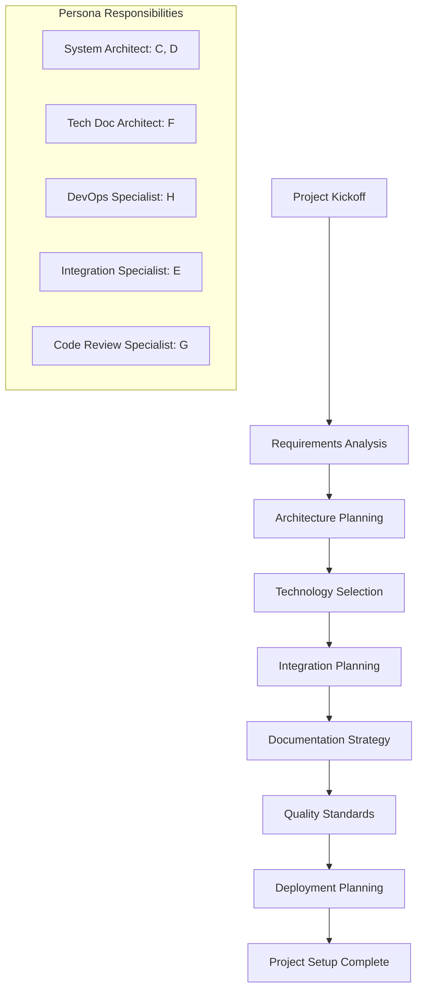
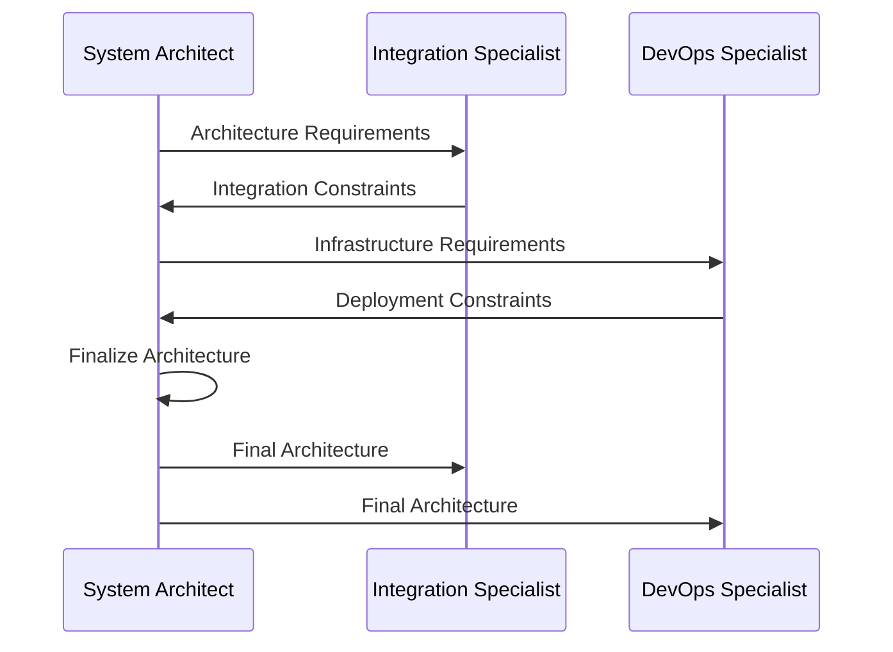
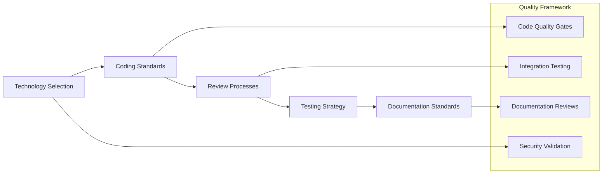
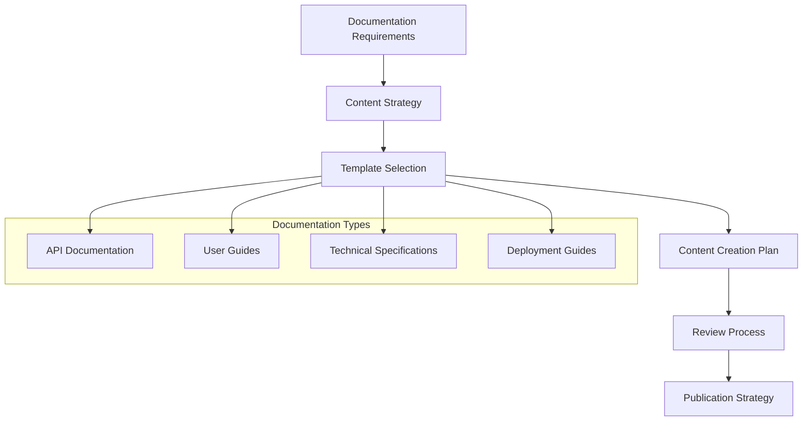
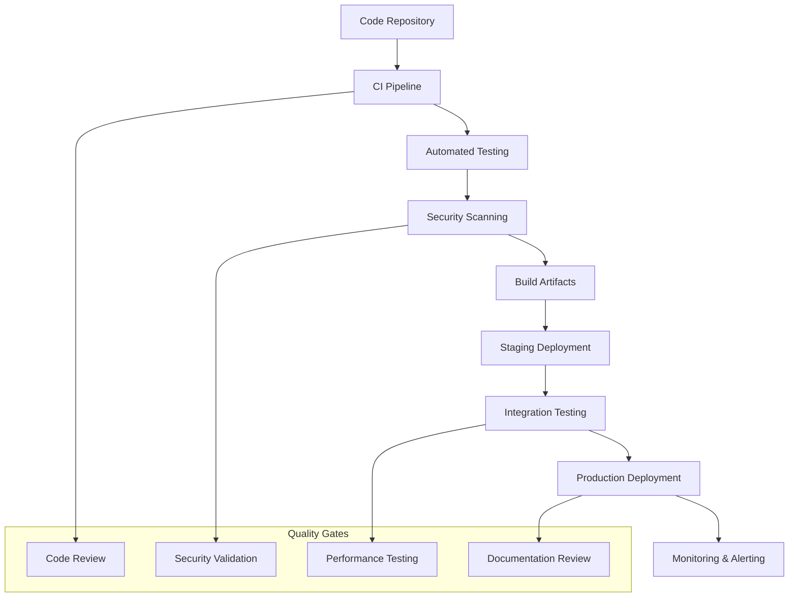
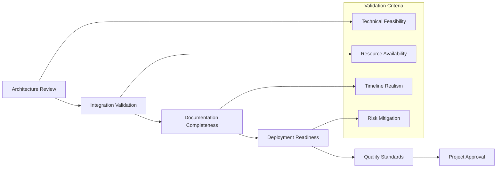

# Project Initiation Integration Workflow

## Overview

This guide demonstrates how all four core BMAD Method personas collaborate during project initiation to establish a solid foundation for successful project delivery.

## Participants

- ** System Architect**: Overall technical architecture and design decisions
- ** Technical Documentation Architect**: API documentation and technical writing
- ** DevOps Documentation Specialist**: Deployment and operational documentation
- ** Cross-Platform Integration Specialist**: Technology integration planning
- ** Polyglot Code Review Specialist**: Code quality standards and review processes

## Workflow Overview

## Phase 1: Project Kickoff and Requirements Analysis

### Duration: 2-4 hours
### Participants: All personas + stakeholders

#### Activities

1. **Stakeholder Alignment Meeting**
   - Business requirements review
   - Technical constraints identification
   - Success criteria definition
   - Timeline and resource planning

2. **Technical Requirements Gathering**
   - Functional requirements documentation
   - Non-functional requirements (performance, security, scalability)
   - Integration requirements with existing systems
   - Compliance and regulatory requirements

#### Deliverables

- **Project Brief** (using [Project Brief Template](../../bmad-agent/templates/project-brief-comprehensive-template.md))
- **Requirements Document**
- **Stakeholder Matrix**
- **Success Criteria Definition**

#### Handoff Criteria

- [ ] All stakeholders agree on project scope and objectives
- [ ] Technical requirements are clearly documented
- [ ] Success criteria are measurable and achievable
- [ ] Resource allocation is confirmed

## Phase 2: Architecture Planning

### Duration: 4-8 hours
### Lead: System Architect
### Collaborators: Integration Specialist, DevOps Specialist

#### Activities

1. **System Architecture Design**
   - High-level system architecture
   - Component identification and relationships
   - Data flow and integration patterns
   - Technology stack evaluation

2. **Integration Architecture Planning**
   - Cross-platform communication patterns
   - API design and specification
   - Data transformation requirements
   - Security and authentication strategies

#### Deliverables

- **System Architecture Document** (using [Technical Architecture Template](../../bmad-agent/templates/technical-architecture-comprehensive-template.md))
- **Integration Architecture Diagram**
- **Technology Stack Recommendation**
- **Security Architecture Overview**

#### Integration Points

#### Handoff Criteria

- [ ] System architecture is technically sound and scalable
- [ ] Integration patterns are well-defined and feasible
- [ ] Infrastructure requirements are clearly specified
- [ ] All personas approve the architectural approach

## Phase 3: Technology Selection and Standards

### Duration: 2-4 hours
### Lead: System Architect
### Collaborators: All personas

#### Activities

1. **Technology Stack Finalization**
   - Frontend technology selection
   - Backend technology selection
   - Database and storage decisions
   - Third-party service evaluation

2. **Development Standards Definition**
   - Coding standards and conventions
   - Code review processes and criteria
   - Testing strategies and frameworks
   - Documentation standards

#### Deliverables

- **Technology Selection Matrix**
- **Development Standards Document**
- **Code Review Guidelines** (using [Code Review Template](../../bmad-agent/templates/code-review-comprehensive-template.md))
- **Testing Strategy Document**

#### Quality Standards Integration

#### Handoff Criteria

- [ ] Technology stack is approved by all personas
- [ ] Development standards are comprehensive and practical
- [ ] Code review processes are clearly defined
- [ ] Testing strategy covers all quality dimensions

## Phase 4: Integration and Documentation Planning

### Duration: 3-6 hours
### Lead: Integration Specialist, Technical Documentation Architect
### Collaborators: All personas

#### Activities

1. **Integration Strategy Development**
   - API design and specification
   - Cross-platform communication protocols
   - Data synchronization strategies
   - Error handling and resilience patterns

2. **Documentation Architecture Planning**
   - Documentation structure and organization
   - API documentation strategy
   - User guide and tutorial planning
   - Maintenance and update procedures

#### Deliverables

- **Integration Strategy Document**
- **API Specification** (using [API Documentation Template](../../bmad-agent/templates/cross-platform-api-documentation-template.md))
- **Documentation Architecture Plan**
- **Content Creation Timeline**

#### Documentation Workflow

#### Handoff Criteria

- [ ] Integration strategy is comprehensive and implementable
- [ ] API specifications are complete and validated
- [ ] Documentation architecture supports all project needs
- [ ] Content creation timeline is realistic and achievable

## Phase 5: Deployment and Operations Planning

### Duration: 2-4 hours
### Lead: DevOps Documentation Specialist
### Collaborators: System Architect, Integration Specialist

#### Activities

1. **Deployment Strategy Development**
   - Environment planning (dev, staging, production)
   - CI/CD pipeline design
   - Infrastructure requirements
   - Monitoring and logging strategy

2. **Operational Procedures Documentation**
   - Deployment procedures and runbooks
   - Monitoring and alerting setup
   - Backup and recovery procedures
   - Incident response planning

#### Deliverables

- **Deployment Strategy Document** (using [Deployment Guide Template](../../bmad-agent/templates/deployment-guide-comprehensive-template.md))
- **CI/CD Pipeline Specification**
- **Operational Runbooks**
- **Monitoring and Alerting Plan**

#### Deployment Integration

#### Handoff Criteria

- [ ] Deployment strategy is automated and reliable
- [ ] Operational procedures are comprehensive and tested
- [ ] Monitoring and alerting cover all critical systems
- [ ] Incident response procedures are clearly defined

## Phase 6: Project Setup Finalization

### Duration: 1-2 hours
### Participants: All personas

#### Activities

1. **Final Integration Review**
   - Cross-persona workflow validation
   - Handoff procedure confirmation
   - Quality gate verification
   - Communication protocol establishment

2. **Project Kickoff Preparation**
   - Development environment setup
   - Tool and access provisioning
   - Initial sprint planning
   - Team onboarding preparation

#### Deliverables

- **Project Setup Checklist**
- **Team Onboarding Guide**
- **Development Environment Setup Instructions**
- **Communication and Collaboration Guidelines**

#### Final Validation

## Success Metrics

### Quantitative Metrics
- **Setup Time**: Complete project initiation in 12-24 hours
- **Documentation Coverage**: 100% of critical components documented
- **Quality Gate Compliance**: All quality checkpoints defined and validated
- **Integration Readiness**: All integration points specified and tested

### Qualitative Metrics
- **Team Alignment**: All personas understand their roles and responsibilities
- **Stakeholder Satisfaction**: Stakeholders approve project approach and timeline
- **Technical Confidence**: Technical approach is sound and implementable
- **Process Clarity**: Workflows and handoffs are clear and efficient

## Common Challenges and Solutions

### Challenge: Conflicting Technical Opinions
**Solution**: Use structured decision-making frameworks and document trade-offs

### Challenge: Incomplete Requirements
**Solution**: Implement iterative requirements gathering with regular stakeholder reviews

### Challenge: Resource Constraints
**Solution**: Prioritize critical path activities and plan for incremental delivery

### Challenge: Integration Complexity
**Solution**: Break down complex integrations into smaller, manageable components

## Templates and Checklists

- [Project Brief Template](../../bmad-agent/templates/project-brief-comprehensive-template.md)
- [Technical Architecture Template](../../bmad-agent/templates/technical-architecture-comprehensive-template.md)
- [API Documentation Template](../../bmad-agent/templates/cross-platform-api-documentation-template.md)
- [Deployment Guide Template](../../bmad-agent/templates/deployment-guide-comprehensive-template.md)
- [Code Review Template](../../bmad-agent/templates/code-review-comprehensive-template.md)

## Next Steps

After completing project initiation:
1. **Begin Feature Development**: Use [API Development Integration Guide](./api-development-integration.md)
2. **Establish Quality Processes**: Implement continuous integration and review workflows
3. **Monitor Progress**: Regular cross-persona check-ins and progress reviews
4. **Iterate and Improve**: Apply lessons learned to optimize future project initiations

---

*This project initiation workflow ensures all BMAD Method personas collaborate effectively to establish a solid foundation for successful project delivery.*
