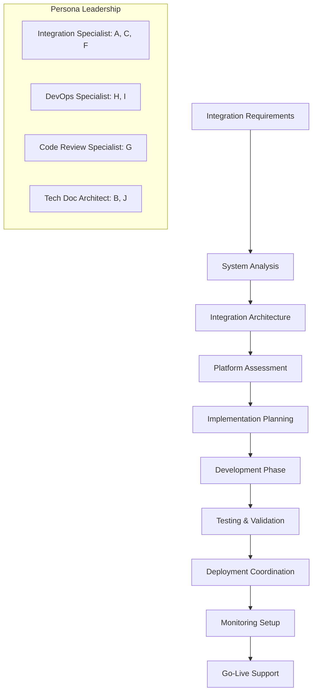
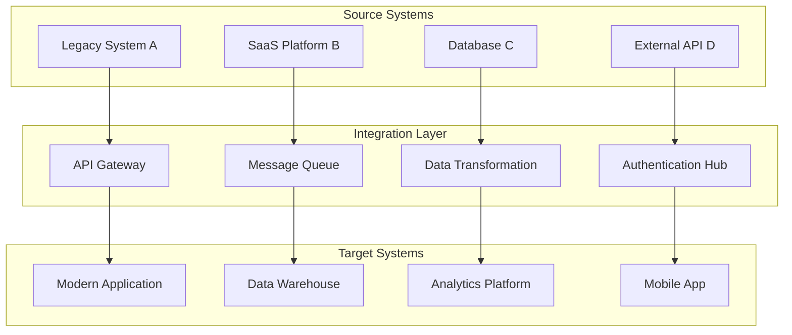
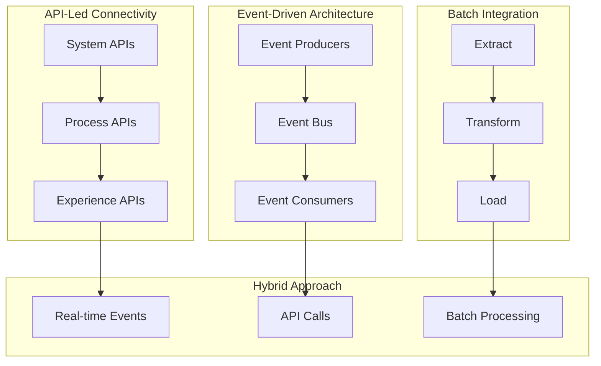
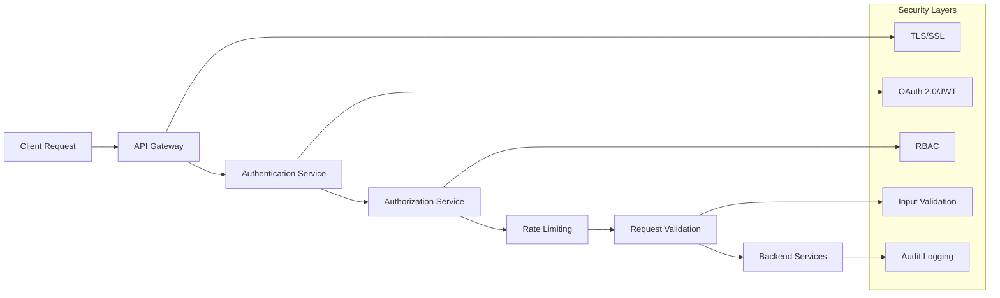
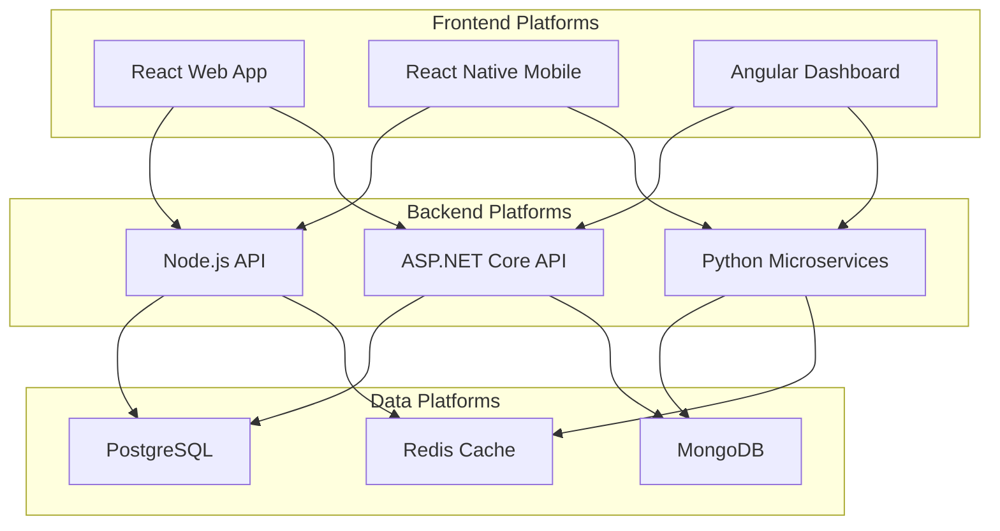
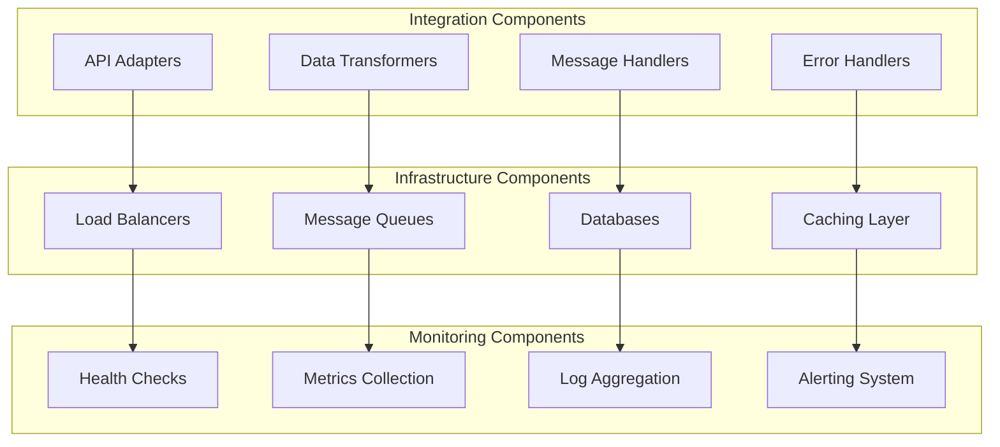
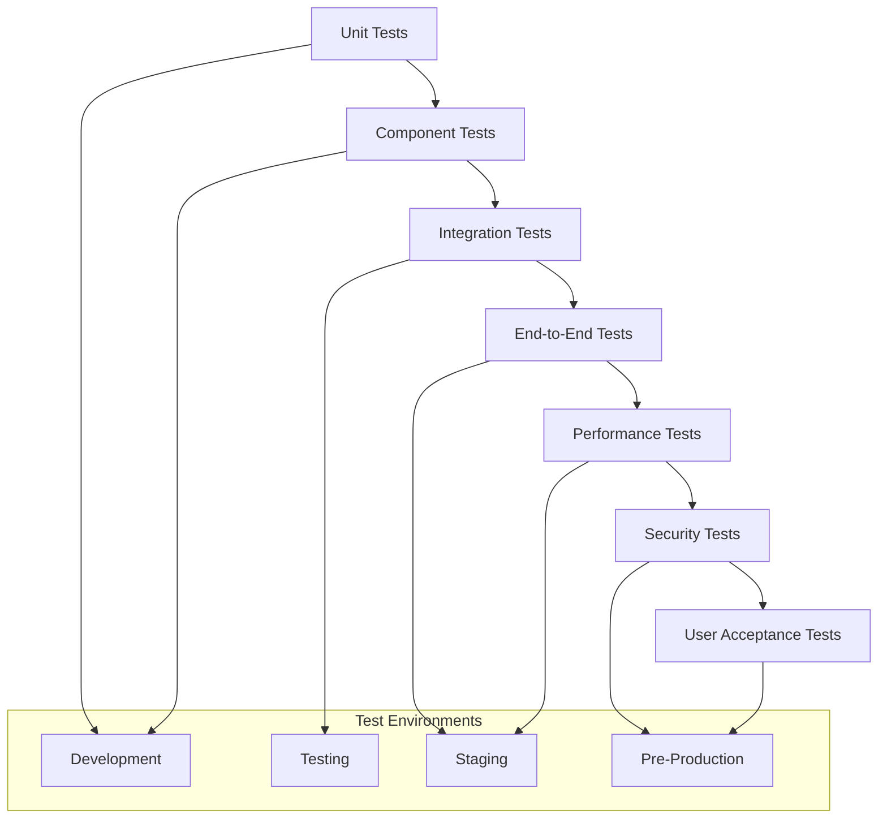
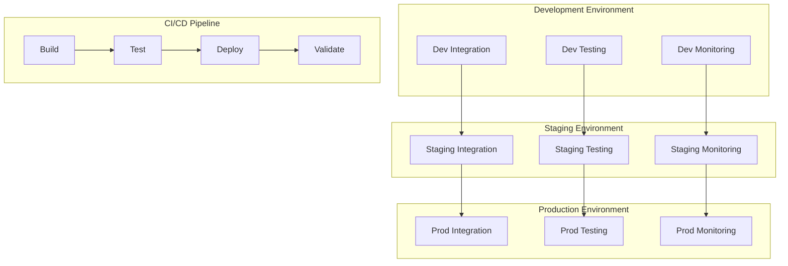

# System Integration Workflow

## Overview

This guide demonstrates how BMAD Method personas collaborate during complex system integration projects, involving multiple platforms, services, and data sources. This workflow ensures seamless integration while maintaining security, performance, and maintainability.

## Participants

- ** Cross-Platform Integration Specialist**: Integration architecture and implementation
- ** DevOps Documentation Specialist**: Infrastructure and deployment coordination
- ** Polyglot Code Review Specialist**: Multi-platform code quality assurance
- ** Technical Documentation Architect**: Integration documentation and specifications

## Workflow Overview

## Phase 1: Integration Requirements and System Analysis

### Duration: 1-2 days
### Lead: Cross-Platform Integration Specialist
### Collaborators: Technical Documentation Architect

#### Activities

1. **Requirements Gathering**
   - Business integration requirements
   - Technical integration constraints
   - Data flow and transformation needs
   - Performance and scalability requirements

2. **System Landscape Analysis**
   - Existing system inventory and capabilities
   - Integration touchpoints identification
   - Data model and schema analysis
   - Security and compliance requirements

#### System Integration Mapping

#### Integration Requirements Matrix

| Source System | Target System | Data Type | Frequency | Volume | Complexity |
|---------------|---------------|-----------|-----------|---------|------------|
| Legacy CRM | Modern Web App | Customer Data | Real-time | High | Medium |
| Payment Gateway | Order System | Transaction Data | Event-driven | Medium | High |
| Analytics DB | Reporting Tool | Aggregated Data | Batch | Low | Low |
| External API | Mobile App | Reference Data | On-demand | Medium | Medium |

#### Deliverables

- **Integration Requirements Document**
- **System Landscape Diagram**
- **Data Flow Analysis**
- **Integration Complexity Assessment**

#### Handoff Criteria

- [ ] All integration requirements are documented and validated
- [ ] System landscape is completely mapped
- [ ] Data flows are clearly defined
- [ ] Complexity and risks are identified

## Phase 2: Integration Architecture Design

### Duration: 2-3 days
### Lead: Cross-Platform Integration Specialist
### Collaborators: DevOps Specialist, Technical Documentation Architect

#### Activities

1. **Architecture Pattern Selection**
   - Integration pattern evaluation (API-led, Event-driven, Batch)
   - Technology stack selection
   - Scalability and performance planning
   - Security architecture design

2. **Detailed Integration Design**
   - Component architecture specification
   - Data transformation logic design
   - Error handling and resilience patterns
   - Monitoring and observability planning

#### Integration Architecture Patterns

#### Technology Stack Selection

| Component | Technology Options | Selected | Rationale |
|-----------|-------------------|----------|-----------|
| **API Gateway** | Kong, AWS API Gateway, Azure APIM | {{SELECTED_API_GATEWAY}} | {{SELECTION_RATIONALE}} |
| **Message Queue** | RabbitMQ, Apache Kafka, Azure Service Bus | {{SELECTED_MESSAGE_QUEUE}} | {{SELECTION_RATIONALE}} |
| **Data Transformation** | Apache NiFi, Talend, Custom ETL | {{SELECTED_ETL_TOOL}} | {{SELECTION_RATIONALE}} |
| **Monitoring** | Prometheus, DataDog, Application Insights | {{SELECTED_MONITORING}} | {{SELECTION_RATIONALE}} |

#### Security Architecture

#### Deliverables

- **Integration Architecture Document** (using [Technical Architecture Template](../../bmad-agent/templates/technical-architecture-comprehensive-template.md))
- **Technology Selection Matrix**
- **Security Architecture Specification**
- **Performance and Scalability Plan**

#### Handoff Criteria

- [ ] Integration architecture is technically sound and scalable
- [ ] Technology selections are justified and approved
- [ ] Security requirements are fully addressed
- [ ] Performance targets are achievable

## Phase 3: Platform Assessment and Compatibility

### Duration: 1-2 days
### Lead: Cross-Platform Integration Specialist
### Collaborators: Code Review Specialist

#### Activities

1. **Platform Compatibility Analysis**
   - Source system API capabilities assessment
   - Target system integration readiness
   - Data format and protocol compatibility
   - Version compatibility and migration planning

2. **Integration Feasibility Validation**
   - Proof of concept development
   - Performance testing and benchmarking
   - Security validation and testing
   - Error scenario testing

#### Platform Compatibility Matrix

#### Compatibility Assessment Results

| Integration Point | Compatibility Status | Required Changes | Risk Level |
|-------------------|---------------------|------------------|------------|
| React  Node.js API |  Compatible | None | Low |
| Legacy System  Modern API |  Partial | Data transformation required | Medium |
| Mobile App  Backend |  Compatible | Authentication updates | Low |
| External API  Internal Systems |  Incompatible | Protocol adapter needed | High |

#### Deliverables

- **Platform Compatibility Report**
- **Proof of Concept Results**
- **Integration Feasibility Assessment**
- **Risk Mitigation Plan**

#### Handoff Criteria

- [ ] All platform compatibility issues are identified
- [ ] Proof of concepts validate integration approach
- [ ] Risk mitigation strategies are defined
- [ ] Integration feasibility is confirmed

## Phase 4: Implementation Planning and Development

### Duration: 1-3 weeks (depending on complexity)
### Lead: Cross-Platform Integration Specialist
### Collaborators: Code Review Specialist, DevOps Specialist

#### Activities

1. **Implementation Strategy Development**
   - Development phase planning
   - Resource allocation and timeline
   - Quality assurance planning
   - Testing strategy definition

2. **Development Execution**
   - Integration component development
   - Data transformation implementation
   - Error handling and resilience implementation
   - Security implementation and validation

#### Implementation Architecture

#### Development Standards and Quality Gates

**Code Quality Standards**
- [ ] All code follows established coding standards
- [ ] Unit test coverage  80%
- [ ] Integration test coverage  70%
- [ ] Security scan passes without critical issues

**Integration Quality Standards**
- [ ] All integration points are tested and validated
- [ ] Error handling covers all failure scenarios
- [ ] Performance meets specified requirements
- [ ] Security controls are properly implemented

**Documentation Standards**
- [ ] All integration components are documented
- [ ] API specifications are complete and accurate
- [ ] Deployment procedures are documented
- [ ] Troubleshooting guides are available

#### Deliverables

- **Integration Implementation Code**
- **Code Review Reports** (using [Code Review Template](../../bmad-agent/templates/code-review-comprehensive-template.md))
- **Unit and Integration Test Results**
- **Security Validation Reports**

#### Handoff Criteria

- [ ] All integration components are implemented and tested
- [ ] Code reviews are completed and approved
- [ ] Security validations pass all requirements
- [ ] Performance benchmarks meet targets

## Phase 5: Testing and Validation

### Duration: 3-5 days
### Lead: Code Review Specialist
### Collaborators: Cross-Platform Integration Specialist, Technical Documentation Architect

#### Activities

1. **Comprehensive Testing Execution**
   - End-to-end integration testing
   - Performance and load testing
   - Security penetration testing
   - Disaster recovery testing

2. **Validation and Acceptance**
   - Business acceptance testing
   - User acceptance testing
   - Operational readiness assessment
   - Documentation validation

#### Testing Strategy

#### Test Scenarios and Results

| Test Category | Test Scenarios | Pass Rate | Issues Found | Resolution Status |
|---------------|----------------|-----------|--------------|-------------------|
| **Functional** | 150 scenarios | 98% | 3 minor issues |  Resolved |
| **Performance** | 25 scenarios | 95% | 2 performance issues |  Resolved |
| **Security** | 40 scenarios | 100% | 0 issues |  Passed |
| **Integration** | 75 scenarios | 97% | 2 integration issues |  Resolved |

#### Deliverables

- **Test Execution Reports**
- **Performance Benchmark Results**
- **Security Assessment Report**
- **User Acceptance Test Results**

#### Handoff Criteria

- [ ] All critical tests pass successfully
- [ ] Performance requirements are met
- [ ] Security assessments pass all criteria
- [ ] User acceptance criteria are satisfied

## Phase 6: Deployment Coordination and Go-Live

### Duration: 2-3 days
### Lead: DevOps Documentation Specialist
### Collaborators: All personas

#### Activities

1. **Deployment Preparation**
   - Production environment setup
   - Deployment automation configuration
   - Monitoring and alerting setup
   - Backup and recovery procedures

2. **Go-Live Execution**
   - Coordinated deployment execution
   - System validation and smoke testing
   - User communication and training
   - Support and monitoring activation

#### Deployment Architecture

#### Go-Live Checklist

**Pre-Deployment**
- [ ] All environments are prepared and validated
- [ ] Deployment scripts are tested and approved
- [ ] Rollback procedures are documented and tested
- [ ] Monitoring and alerting systems are configured

**Deployment**
- [ ] Deployment is executed according to plan
- [ ] All systems are validated post-deployment
- [ ] Smoke tests pass successfully
- [ ] Performance monitoring shows normal operation

**Post-Deployment**
- [ ] User communication is sent
- [ ] Support teams are activated
- [ ] Monitoring dashboards are active
- [ ] Documentation is updated with production details

#### Deliverables

- **Deployment Guide** (using [Deployment Guide Template](../../bmad-agent/templates/deployment-guide-comprehensive-template.md))
- **Production Validation Report**
- **Go-Live Communication Plan**
- **Support and Monitoring Setup**

#### Handoff Criteria

- [ ] Deployment is successful and stable
- [ ] All validation checks pass
- [ ] Support processes are active
- [ ] Users are informed and trained

## Success Metrics

### Technical Metrics
- **Integration Success Rate**: 99.9% successful data transfers
- **Performance**: All integrations meet SLA requirements
- **Availability**: 99.9% uptime for integration services
- **Error Rate**: < 0.1% integration errors

### Business Metrics
- **Data Accuracy**: 99.9% data consistency across systems
- **Processing Time**: Reduced by 50% compared to manual processes
- **User Satisfaction**: > 90% user satisfaction with integration
- **Cost Efficiency**: 30% reduction in operational costs

### Process Metrics
- **Deployment Success**: Zero-downtime deployment achieved
- **Issue Resolution**: 95% of issues resolved within SLA
- **Documentation Quality**: 100% of integration points documented
- **Team Collaboration**: Effective cross-persona collaboration

## Common Challenges and Solutions

### Challenge: Data Inconsistency Across Systems
**Solution**: Implement comprehensive data validation and reconciliation processes

### Challenge: Performance Bottlenecks
**Solution**: Use caching, optimization, and horizontal scaling strategies

### Challenge: Security Vulnerabilities
**Solution**: Implement defense-in-depth security architecture with regular assessments

### Challenge: Complex Error Handling
**Solution**: Design comprehensive error handling with proper logging and alerting

## Templates and Resources

- [Technical Architecture Template](../../bmad-agent/templates/technical-architecture-comprehensive-template.md)
- [Integration Documentation Template](../../bmad-agent/templates/integration-documentation-template.md)
- [Code Review Template](../../bmad-agent/templates/code-review-comprehensive-template.md)
- [Deployment Guide Template](../../bmad-agent/templates/deployment-guide-comprehensive-template.md)

## Next Steps

After system integration completion:
1. **Monitor Integration Health**: Continuous monitoring and optimization
2. **Gather User Feedback**: Collect feedback for future improvements
3. **Plan Enhancements**: Schedule regular integration updates and improvements
4. **Knowledge Transfer**: Document lessons learned and best practices

---

*This system integration workflow ensures all BMAD Method personas collaborate effectively to deliver complex, multi-platform integrations that meet business and technical requirements while maintaining high quality and reliability.*
