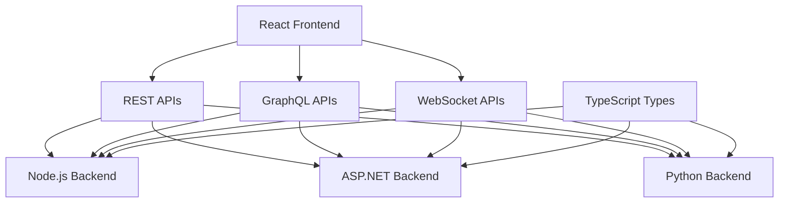
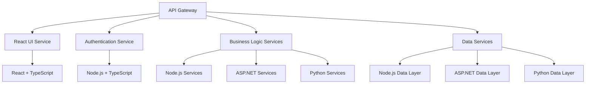

# BMAD Method Technology Navigation Map

## Overview

This map provides technology-specific navigation paths for the BMAD Method, organizing documentation and resources by technology stack while maintaining cross-platform integration guidance.

## Supported Technology Stacks

###  React

**Technology Focus**: Modern React development with hooks, context, and component patterns

**Documentation Structure**:
```
technology/react/
 README.md                    # React-specific BMAD guidance
 getting-started/             # React setup and configuration
    project-setup.md
    development-environment.md
    best-practices.md
 patterns/                    # React-specific patterns
    component-patterns.md
    state-management.md
    routing-patterns.md
    testing-patterns.md
 integration/                 # React integration guidance
    api-integration.md
    backend-communication.md
    cross-platform.md
 deployment/                  # React deployment
    build-optimization.md
    static-hosting.md
    cdn-deployment.md
 examples/                    # React examples
    basic-components.md
    complex-applications.md
    integration-examples.md
 troubleshooting/             # React-specific issues
     common-issues.md
     performance-issues.md
     debugging-guide.md
```

**Persona Integration**:
- **Technical Documentation Architect**: React component documentation
- **DevOps Specialist**: React build and deployment
- **Integration Specialist**: React API integration
- **Code Review Specialist**: React code quality standards

**Key Resources**:
- [React Component Documentation Template](../templates/react-component-docs.md)
- [React Integration Patterns](../examples/react-integrations/)
- [React Deployment Guide](../deployment/react-deployment.md)

###  TypeScript

**Technology Focus**: Type-safe development across frontend and backend

**Documentation Structure**:
```
technology/typescript/
 README.md                    # TypeScript-specific BMAD guidance
 getting-started/             # TypeScript setup
    configuration.md
    compiler-options.md
    project-structure.md
 patterns/                    # TypeScript patterns
    type-definitions.md
    generic-patterns.md
    utility-types.md
    advanced-types.md
 integration/                 # TypeScript integration
    frontend-backend.md
    api-types.md
    shared-types.md
 quality/                     # TypeScript quality
    linting-rules.md
    testing-types.md
    documentation.md
 examples/                    # TypeScript examples
    basic-types.md
    complex-applications.md
    cross-platform-types.md
 troubleshooting/             # TypeScript issues
     compiler-errors.md
     type-errors.md
     performance-issues.md
```

**Persona Integration**:
- **Technical Documentation Architect**: TypeScript API documentation
- **Integration Specialist**: Type-safe integration patterns
- **Code Review Specialist**: TypeScript code quality and type safety
- **Performance Specialist**: TypeScript compilation optimization

###  Node.js

**Technology Focus**: Server-side JavaScript development and API creation

**Documentation Structure**:
```
technology/nodejs/
 README.md                    # Node.js-specific BMAD guidance
 getting-started/             # Node.js setup
    environment-setup.md
    package-management.md
    project-structure.md
 patterns/                    # Node.js patterns
    api-patterns.md
    middleware-patterns.md
    error-handling.md
    async-patterns.md
 integration/                 # Node.js integration
    database-integration.md
    external-apis.md
    microservices.md
    frontend-integration.md
 deployment/                  # Node.js deployment
    containerization.md
    cloud-deployment.md
    monitoring.md
    scaling.md
 examples/                    # Node.js examples
    rest-apis.md
    graphql-apis.md
    websocket-servers.md
    microservices.md
 troubleshooting/             # Node.js issues
     performance-issues.md
     memory-leaks.md
     debugging-guide.md
```

**Persona Integration**:
- **Technical Documentation Architect**: Node.js API documentation
- **DevOps Specialist**: Node.js deployment and monitoring
- **Integration Specialist**: Node.js service integration
- **Performance Specialist**: Node.js performance optimization

###  ASP.NET

**Technology Focus**: Enterprise-grade .NET development and web APIs

**Documentation Structure**:
```
technology/aspnet/
 README.md                    # ASP.NET-specific BMAD guidance
 getting-started/             # ASP.NET setup
    project-setup.md
    development-environment.md
    configuration.md
 patterns/                    # ASP.NET patterns
    mvc-patterns.md
    api-patterns.md
    dependency-injection.md
    middleware-patterns.md
 integration/                 # ASP.NET integration
    database-integration.md
    external-services.md
    authentication.md
    cross-platform.md
 deployment/                  # ASP.NET deployment
    iis-deployment.md
    azure-deployment.md
    docker-deployment.md
    monitoring.md
 examples/                    # ASP.NET examples
    web-apis.md
    mvc-applications.md
    microservices.md
    integration-examples.md
 troubleshooting/             # ASP.NET issues
     performance-issues.md
     configuration-issues.md
     debugging-guide.md
```

**Persona Integration**:
- **Technical Documentation Architect**: ASP.NET API documentation
- **DevOps Specialist**: ASP.NET deployment and IIS configuration
- **Security Specialist**: ASP.NET security implementation
- **Enterprise Architect**: Enterprise ASP.NET patterns

###  Python

**Technology Focus**: Python development for APIs, data processing, and automation

**Documentation Structure**:
```
technology/python/
 README.md                    # Python-specific BMAD guidance
 getting-started/             # Python setup
    environment-setup.md
    virtual-environments.md
    package-management.md
    project-structure.md
 patterns/                    # Python patterns
    api-patterns.md
    data-processing.md
    async-patterns.md
    testing-patterns.md
 integration/                 # Python integration
    database-integration.md
    external-apis.md
    microservices.md
    cross-platform.md
 deployment/                  # Python deployment
    containerization.md
    cloud-deployment.md
    serverless.md
    monitoring.md
 examples/                    # Python examples
    flask-apis.md
    fastapi-examples.md
    django-applications.md
    data-processing.md
 troubleshooting/             # Python issues
     performance-issues.md
     dependency-issues.md
     debugging-guide.md
```

**Persona Integration**:
- **Technical Documentation Architect**: Python API documentation
- **DevOps Specialist**: Python deployment and containerization
- **Integration Specialist**: Python service integration
- **Performance Specialist**: Python performance optimization

## Cross-Technology Integration Patterns

### Frontend-Backend Integration



### Microservices Architecture



## Technology-Specific Navigation Paths

### By Development Phase

**Planning Phase**:
1. Technology selection guidance
2. Architecture patterns for each stack
3. Integration planning
4. Performance considerations

**Development Phase**:
1. Setup and configuration guides
2. Development patterns and best practices
3. Testing strategies
4. Code quality standards

**Integration Phase**:
1. Cross-platform integration patterns
2. API design and documentation
3. Data flow and communication
4. Error handling and resilience

**Deployment Phase**:
1. Build and packaging
2. Containerization strategies
3. Cloud deployment options
4. Monitoring and observability

### By Complexity Level

**Beginner**:
- Basic setup and configuration
- Simple patterns and examples
- Getting started guides
- Common troubleshooting

**Intermediate**:
- Advanced patterns and architectures
- Integration scenarios
- Performance optimization
- Security implementation

**Advanced**:
- Complex enterprise scenarios
- Custom patterns and solutions
- Advanced troubleshooting
- Architecture design

### By Use Case

**API Development**:
- REST API patterns for each technology
- GraphQL implementation
- Authentication and authorization
- Documentation and testing

**Full-Stack Development**:
- Frontend-backend integration
- State management
- Real-time communication
- End-to-end testing

**Microservices**:
- Service decomposition
- Inter-service communication
- Data consistency
- Deployment orchestration

**Enterprise Applications**:
- Scalability patterns
- Security compliance
- Integration with legacy systems
- Governance and standards

---

*This technology map provides comprehensive navigation for all supported technology stacks, ensuring developers can find relevant guidance regardless of their chosen technologies while maintaining consistency across the BMAD Method.*
