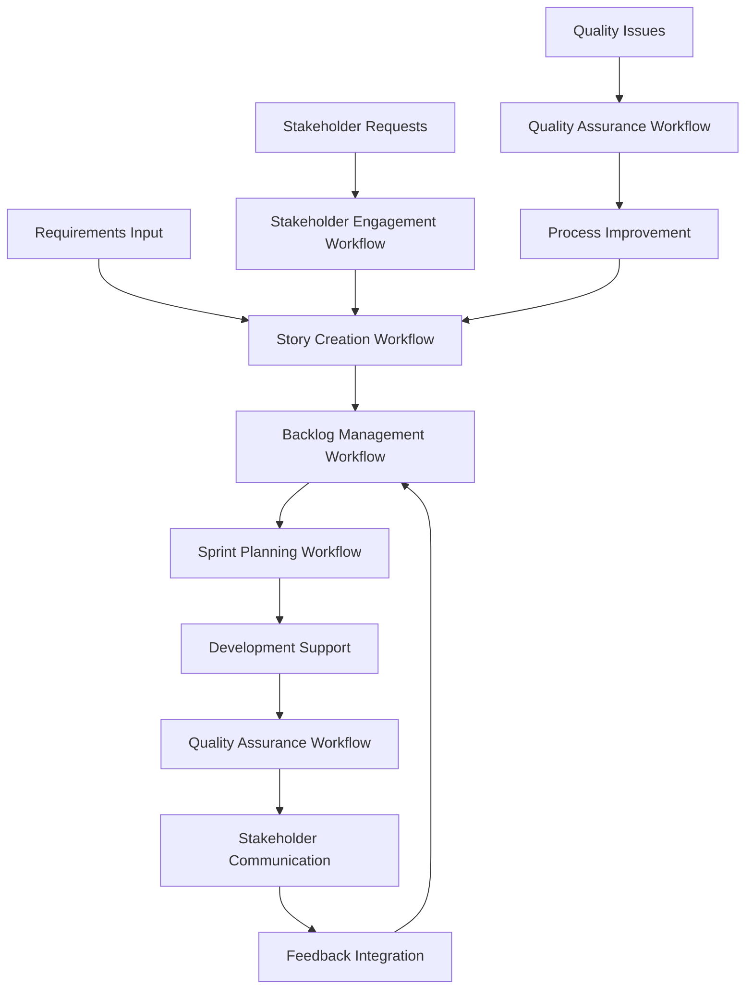
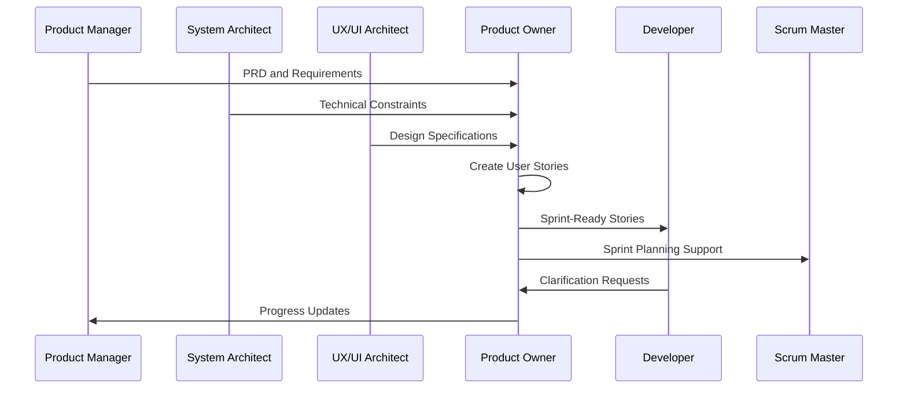
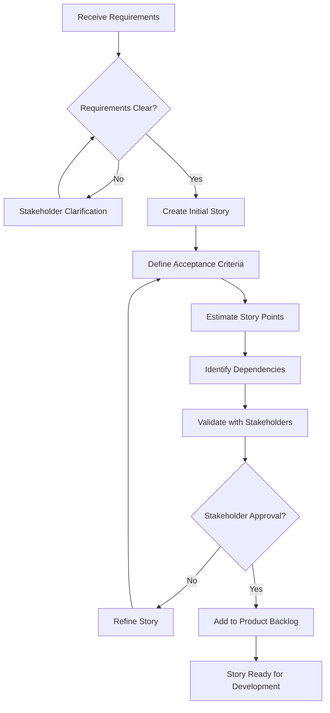
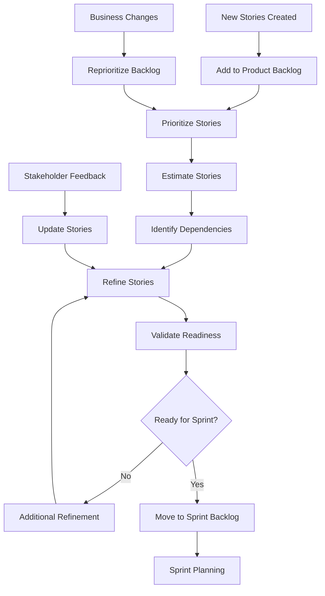
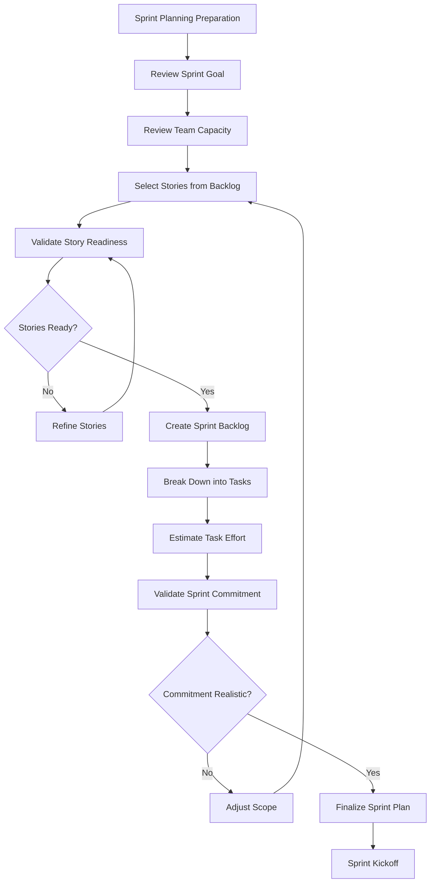
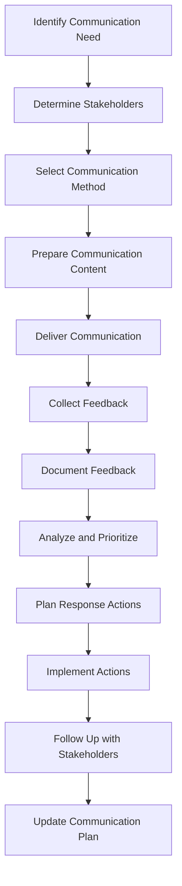
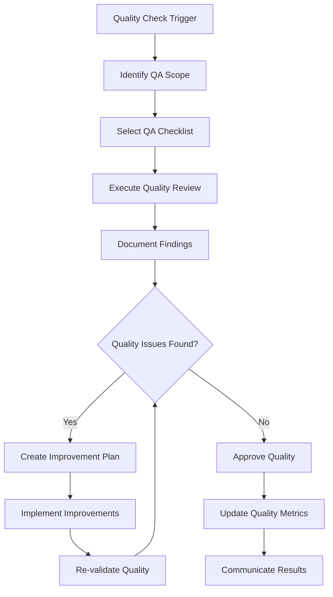
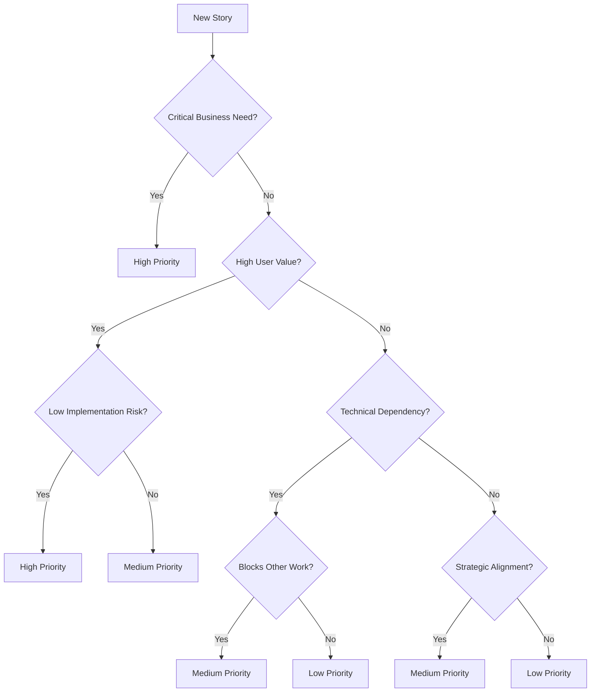
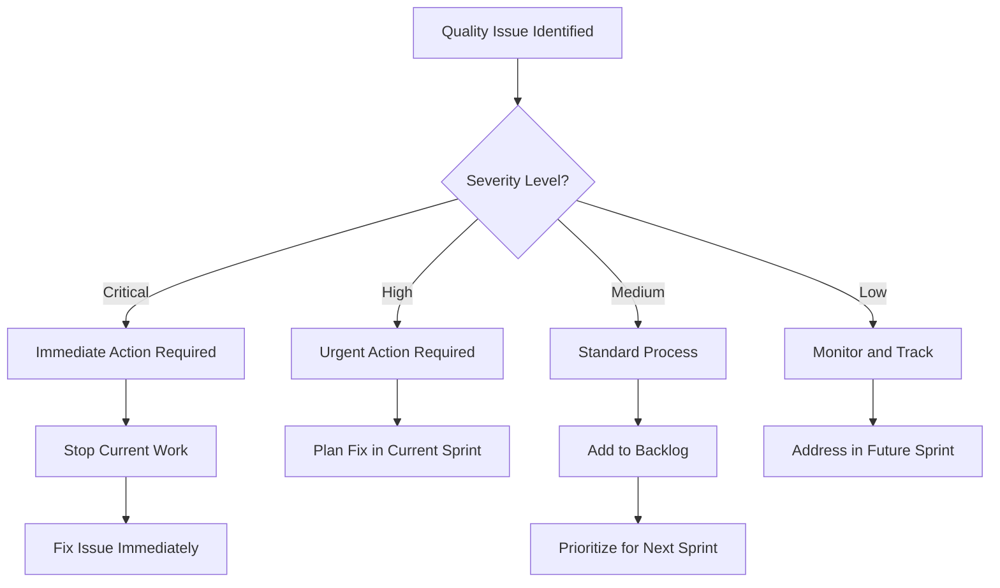
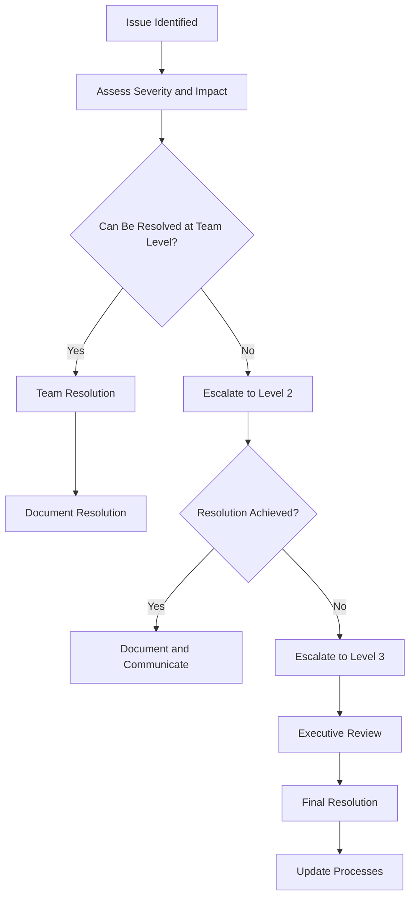

# Product Owner (Sarah) Workflow Mapping

## Overview

This document provides comprehensive workflow mapping for Product Owner activities within the BMAD Method. These workflows ensure systematic, efficient, and high-quality product ownership that drives successful project outcomes.

## Table of Contents

1. [Core Workflow Overview](#core-workflow-overview)
2. [Story Creation Workflow](#story-creation-workflow)
3. [Backlog Management Workflow](#backlog-management-workflow)
4. [Sprint Planning Workflow](#sprint-planning-workflow)
5. [Stakeholder Engagement Workflow](#stakeholder-engagement-workflow)
6. [Quality Assurance Workflow](#quality-assurance-workflow)
7. [Integration Workflows](#integration-workflows)
8. [Decision Trees](#decision-trees)
9. [Escalation Procedures](#escalation-procedures)

## Core Workflow Overview

### Primary Product Owner Workflows

### Workflow Integration Points

## Story Creation Workflow

### Story Creation Process Flow

### Detailed Story Creation Steps

#### Phase 1: Requirements Analysis (30 minutes)
1. **Receive Input**
   - Review PRD from Product Manager
   - Analyze technical constraints from System Architect
   - Review design specifications from UX/UI Architect
   - Identify stakeholder requirements

2. **Requirements Validation**
   - Verify requirements completeness
   - Identify missing information
   - Clarify ambiguous requirements
   - Validate business value proposition

3. **Initial Assessment**
   - Assess story complexity
   - Identify potential risks
   - Estimate initial effort
   - Determine story priority

#### Phase 2: Story Drafting (45 minutes)
1. **Story Structure Creation**
   - Write story title and description
   - Define user persona and role
   - Articulate desired functionality
   - Specify business value

2. **Acceptance Criteria Definition**
   - Write Given-When-Then scenarios
   - Cover happy path scenarios
   - Include edge cases and error conditions
   - Define validation criteria

3. **Story Details**
   - Add story metadata (priority, complexity)
   - Document assumptions and constraints
   - Identify dependencies and blockers
   - Add relevant notes and context

#### Phase 3: Story Validation (30 minutes)
1. **Quality Review**
   - Validate INVEST principles compliance
   - Review acceptance criteria completeness
   - Check story clarity and testability
   - Verify business value articulation

2. **Stakeholder Review**
   - Present story to key stakeholders
   - Gather feedback and suggestions
   - Address concerns and questions
   - Obtain stakeholder approval

3. **Final Preparation**
   - Incorporate stakeholder feedback
   - Finalize story details
   - Add to product backlog
   - Mark as ready for development

### Story Creation Quality Gates

#### Gate 1: Requirements Clarity
- [ ] All requirements are clearly understood
- [ ] Missing information has been identified and obtained
- [ ] Business value is clearly articulated
- [ ] Technical constraints are understood

#### Gate 2: Story Quality
- [ ] Story follows INVEST principles
- [ ] Acceptance criteria are complete and testable
- [ ] Dependencies are identified and documented
- [ ] Story is appropriately sized for sprint completion

#### Gate 3: Stakeholder Approval
- [ ] Key stakeholders have reviewed the story
- [ ] Feedback has been incorporated
- [ ] Business value is validated
- [ ] Story is approved for development

## Backlog Management Workflow

### Backlog Management Process Flow

### Backlog Prioritization Workflow

#### Prioritization Framework Application
1. **Business Value Assessment**
   - Evaluate user impact and satisfaction
   - Assess revenue and cost implications
   - Consider strategic alignment
   - Analyze competitive advantage

2. **Technical Considerations**
   - Review technical complexity
   - Assess implementation risk
   - Consider technical dependencies
   - Evaluate architectural impact

3. **Resource and Timeline Factors**
   - Assess team capacity and skills
   - Consider timeline constraints
   - Evaluate resource availability
   - Plan for dependencies

4. **Stakeholder Input Integration**
   - Gather stakeholder priorities
   - Resolve conflicting priorities
   - Communicate prioritization rationale
   - Obtain stakeholder agreement

### Backlog Refinement Workflow

#### Weekly Refinement Process (2 hours)
1. **Preparation (15 minutes)**
   - Review upcoming sprint capacity
   - Identify stories for refinement
   - Prepare refinement agenda
   - Gather stakeholder input

2. **Story Review (90 minutes)**
   - Review story details and acceptance criteria
   - Clarify requirements and expectations
   - Update estimates based on new information
   - Identify and resolve dependencies

3. **Readiness Assessment (15 minutes)**
   - Validate story readiness for development
   - Identify any remaining blockers
   - Confirm stakeholder approval
   - Mark stories as sprint-ready

## Sprint Planning Workflow

### Sprint Planning Process Flow

### Sprint Planning Preparation Workflow

#### Pre-Planning Activities (1 day before)
1. **Backlog Preparation**
   - Ensure top priority stories are refined
   - Validate acceptance criteria completeness
   - Confirm stakeholder approval
   - Identify any last-minute changes

2. **Capacity Planning**
   - Calculate team availability
   - Account for holidays and time off
   - Consider meeting and training time
   - Determine available story points

3. **Goal Setting**
   - Define clear sprint goal
   - Align goal with business objectives
   - Communicate goal to stakeholders
   - Prepare goal presentation

#### Sprint Planning Execution (4 hours)

##### Part 1: What Will Be Done (2 hours)
1. **Goal Presentation (30 minutes)**
   - Present sprint goal to team
   - Explain business context and value
   - Answer questions and clarify expectations
   - Obtain team agreement on goal

2. **Story Selection (90 minutes)**
   - Review prioritized backlog items
   - Select stories based on capacity and goal
   - Validate story readiness and clarity
   - Confirm story acceptance criteria

##### Part 2: How Work Will Be Done (2 hours)
1. **Task Breakdown (90 minutes)**
   - Break stories into development tasks
   - Identify technical approach and dependencies
   - Assign initial task ownership
   - Estimate task effort in hours

2. **Commitment Validation (30 minutes)**
   - Review total commitment vs. capacity
   - Identify risks and mitigation strategies
   - Adjust scope if necessary
   - Finalize team commitment

## Stakeholder Engagement Workflow

### Stakeholder Communication Process Flow

### Regular Stakeholder Communication Cadence

#### Weekly Stakeholder Updates
1. **Preparation (30 minutes)**
   - Gather sprint progress data
   - Identify key achievements and blockers
   - Prepare stakeholder-specific content
   - Review previous feedback and actions

2. **Communication Delivery (15 minutes)**
   - Send written update via email
   - Highlight key progress and decisions needed
   - Include relevant metrics and visuals
   - Provide clear next steps

3. **Follow-up (15 minutes)**
   - Monitor stakeholder responses
   - Schedule meetings for complex discussions
   - Document feedback and questions
   - Plan response actions

#### Sprint Review Stakeholder Engagement
1. **Pre-Review Preparation (1 hour)**
   - Prepare demonstration script
   - Gather stakeholder feedback questions
   - Set up demo environment
   - Coordinate stakeholder attendance

2. **Review Execution (2 hours)**
   - Present sprint achievements
   - Demonstrate completed functionality
   - Collect stakeholder feedback
   - Discuss upcoming priorities

3. **Post-Review Actions (30 minutes)**
   - Document feedback and decisions
   - Update backlog based on feedback
   - Communicate action items
   - Plan follow-up activities

## Quality Assurance Workflow

### Quality Assurance Process Flow

### Story Quality Assurance Workflow

#### Story QA Process (30 minutes per story)
1. **INVEST Validation (10 minutes)**
   - Independent: Story can be developed independently
   - Negotiable: Implementation details are flexible
   - Valuable: Story delivers clear business value
   - Estimable: Story can be reasonably estimated
   - Small: Story fits within a sprint
   - Testable: Story has clear acceptance criteria

2. **Content Quality Review (15 minutes)**
   - Title clarity and descriptiveness
   - Story description completeness
   - Acceptance criteria testability
   - Business value articulation
   - Dependency identification

3. **Stakeholder Validation (5 minutes)**
   - Stakeholder review completion
   - Feedback incorporation
   - Approval documentation
   - Communication of changes

### Process Quality Assurance Workflow

#### Sprint Process QA (Weekly)
1. **Planning Quality Review**
   - Sprint goal clarity and achievability
   - Story selection rationale
   - Capacity planning accuracy
   - Risk identification and mitigation

2. **Execution Quality Review**
   - Daily standup effectiveness
   - Blocker resolution speed
   - Stakeholder communication quality
   - Progress tracking accuracy

3. **Review Quality Assessment**
   - Demonstration quality and preparation
   - Stakeholder engagement effectiveness
   - Feedback collection and integration
   - Action item follow-through

## Integration Workflows

### BMAD Method Persona Integration

#### Integration with Product Manager (John)
1. **PRD Handoff Process**
   - Receive and review PRD
   - Validate requirements completeness
   - Identify clarification needs
   - Confirm business priorities

2. **Ongoing Collaboration**
   - Regular progress updates
   - Stakeholder feedback sharing
   - Priority adjustment discussions
   - Success metrics tracking

#### Integration with System Architect (Fred)
1. **Technical Constraint Integration**
   - Review technical architecture
   - Understand implementation constraints
   - Incorporate technical considerations into stories
   - Validate technical feasibility

2. **Architecture Alignment**
   - Ensure stories support architecture
   - Identify technical dependencies
   - Plan technical story sequencing
   - Coordinate technical reviews

#### Integration with UX/UI Architect (Veronica/Victor)
1. **Design Integration Process**
   - Review design specifications
   - Incorporate design requirements into stories
   - Ensure design-development alignment
   - Plan design validation activities

2. **User Experience Coordination**
   - Validate user journey completeness
   - Ensure consistent user experience
   - Coordinate usability testing
   - Integrate design feedback

#### Integration with Developer (David)
1. **Development Support Process**
   - Provide story clarification
   - Support estimation activities
   - Answer implementation questions
   - Validate completed work

2. **Quality Collaboration**
   - Review acceptance criteria validation
   - Support testing activities
   - Validate business value delivery
   - Coordinate stakeholder acceptance

#### Integration with Scrum Master (Mike)
1. **Process Collaboration**
   - Support sprint planning activities
   - Coordinate stakeholder communication
   - Align on process improvements
   - Share velocity and quality metrics

2. **Team Support**
   - Provide product context to team
   - Support conflict resolution
   - Facilitate stakeholder access
   - Coordinate external dependencies

## Decision Trees

### Story Prioritization Decision Tree

### Quality Issue Resolution Decision Tree

## Escalation Procedures

### Issue Escalation Matrix

| Issue Type | Level 1 | Level 2 | Level 3 | Timeline |
|------------|---------|---------|---------|----------|
| Story Clarification | Team Discussion | Stakeholder Meeting | Executive Review | 1-3 days |
| Priority Conflict | PO Decision | PM Consultation | Executive Decision | 2-5 days |
| Resource Constraint | Team Planning | Management Review | Executive Approval | 3-7 days |
| Quality Issue | Team Resolution | Process Review | Quality Audit | 1-14 days |
| Stakeholder Conflict | Direct Discussion | Facilitated Meeting | Executive Mediation | 2-10 days |

### Escalation Process Workflow

### Communication During Escalation

#### Escalation Communication Template
1. **Issue Description**
   - Clear description of the issue
   - Impact on project and stakeholders
   - Urgency and timeline constraints
   - Previous resolution attempts

2. **Stakeholder Notification**
   - Notify affected stakeholders
   - Provide regular status updates
   - Communicate resolution timeline
   - Document decisions and rationale

3. **Resolution Communication**
   - Communicate final resolution
   - Update affected documentation
   - Share lessons learned
   - Implement process improvements

---

These comprehensive workflow mappings ensure systematic, efficient, and high-quality product ownership within the BMAD Method. Regular application and continuous improvement of these workflows will enhance the effectiveness of product ownership practices and drive consistent project success.

## Workflow Optimization

### Continuous Workflow Improvement

#### Monthly Workflow Review Process
1. **Performance Analysis**
   - Review workflow execution metrics
   - Identify bottlenecks and inefficiencies
   - Analyze stakeholder feedback on processes
   - Assess team satisfaction with workflows

2. **Improvement Identification**
   - Gather team input on workflow challenges
   - Research industry best practices
   - Identify automation opportunities
   - Propose workflow enhancements

3. **Implementation Planning**
   - Prioritize improvement initiatives
   - Plan implementation timeline
   - Assign improvement ownership
   - Communicate changes to stakeholders

### Workflow Automation Opportunities

#### Automated Quality Checks
- Story template compliance validation
- INVEST principles automated assessment
- Acceptance criteria completeness checking
- Dependency conflict detection

#### Automated Reporting
- Sprint progress dashboards
- Stakeholder update generation
- Quality metrics compilation
- Workflow performance tracking

#### Automated Notifications
- Story readiness alerts
- Stakeholder review reminders
- Quality gate notifications
- Escalation triggers

---

This comprehensive workflow mapping guide provides Product Owners with detailed processes for effective product ownership within the BMAD Method, ensuring consistent delivery of high-quality outcomes that drive project success.
