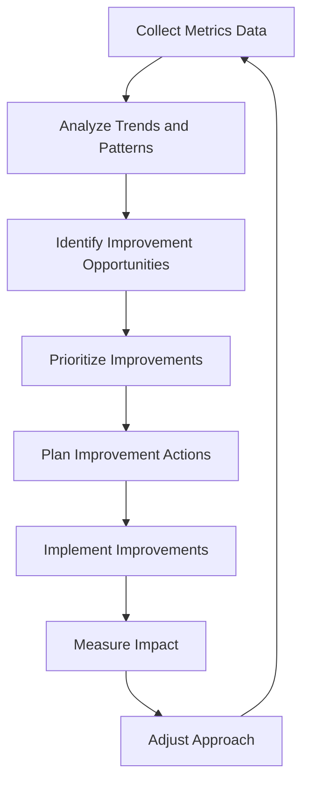

# Scrum Master (Mike) Success Metrics

## Overview

This document establishes a comprehensive framework for measuring Scrum Master effectiveness within the BMAD Method. These metrics provide objective criteria for evaluating performance, identifying improvement opportunities, and demonstrating the value of the Scrum Master role.

## Table of Contents

1. [Metrics Framework](#metrics-framework)
2. [Team Performance Metrics](#team-performance-metrics)
3. [Process Effectiveness Metrics](#process-effectiveness-metrics)
4. [Coaching Effectiveness Metrics](#coaching-effectiveness-metrics)
5. [Impediment Management Metrics](#impediment-management-metrics)
6. [Stakeholder Satisfaction Metrics](#stakeholder-satisfaction-metrics)
7. [Continuous Improvement Metrics](#continuous-improvement-metrics)
8. [Measurement Methodologies](#measurement-methodologies)
9. [Metrics Visualization and Reporting](#metrics-visualization-and-reporting)
10. [Metrics-Driven Improvement](#metrics-driven-improvement)

## Metrics Framework

### Metrics Categories

```mermaid title="Scrum Master Metrics Framework" type="diagram"
graph TD
    A["Scrum Master Success Metrics"] --> B["Team Performance Metrics"]
    A --> C["Process Effectiveness Metrics"]
    A --> D["Coaching Effectiveness Metrics"]
    A --> E["Impediment Management Metrics"]
    A --> F["Stakeholder Satisfaction Metrics"]
    A --> G["Continuous Improvement Metrics"]
    
    B --> B1["Velocity and Predictability"]
    B --> B2["Quality Metrics"]
    B --> B3["Team Health Indicators"]
    
    C --> C1["Ceremony Effectiveness"]
    C --> C2["Framework Adherence"]
    C --> C3["Process Efficiency"]
    
    D --> D1["Team Maturity Growth"]
    D --> D2["Skill Development"]
    D --> D3["Self-Organization Level"]
    
    E --> E1["Resolution Efficiency"]
    E --> E2["Prevention Effectiveness"]
    E --> E3["Impact Reduction"]
    
    F --> F1["Team Satisfaction"]
    F --> F2["Product Owner Satisfaction"]
    F --> F3["Stakeholder Feedback"]
    
    G --> G1["Improvement Implementation"]
    G --> G2["Experimentation Rate"]
    G --> G3["Learning Integration"]
```

### Metrics Principles

1. **Outcome Focus**: Metrics focus on outcomes rather than activities
2. **Balanced Perspective**: Combination of quantitative and qualitative metrics
3. **Team Empowerment**: Metrics support team self-improvement, not control
4. **Continuous Learning**: Metrics drive learning and adaptation
5. **Simplicity**: Metrics are easy to understand and collect
6. **Actionability**: Metrics lead to specific improvement actions

### Metrics Usage Guidelines

#### Appropriate Use
- **Improvement Orientation**: Use metrics to identify improvement opportunities
- **Trend Analysis**: Focus on trends rather than absolute values
- **Context Consideration**: Interpret metrics within team and project context
- **Holistic View**: Consider multiple metrics together, not in isolation

#### Inappropriate Use
- **Individual Performance**: Do not use for individual performance evaluation
- **Team Comparison**: Avoid direct comparison between different teams
- **Rigid Targets**: Do not set rigid targets without team involvement
- **Punitive Measures**: Never use metrics for punitive purposes

## Team Performance Metrics

### Velocity and Predictability Metrics

#### Velocity Stability
- **Definition**: Consistency of team velocity over time
- **Calculation**: Standard deviation of velocity over last 5 sprints
- **Target Range**: Standard deviation < 20% of average velocity
- **Measurement Frequency**: Every sprint
- **Improvement Goal**: Decreasing trend in standard deviation

#### Commitment Reliability
- **Definition**: Accuracy of sprint commitments vs. actual delivery
- **Calculation**: (Completed story points / Committed story points) × 100%
- **Target Range**: 80-100%
- **Measurement Frequency**: Every sprint
- **Improvement Goal**: Consistent achievement of 90%+ reliability

#### Forecast Accuracy
- **Definition**: Accuracy of release forecasts based on velocity
- **Calculation**: (Actual delivery date - Forecast date) in sprints
- **Target Range**: ±1 sprint
- **Measurement Frequency**: Each release
- **Improvement Goal**: Consistent achievement of ±1 sprint accuracy

### Quality Metrics

#### Defect Density
- **Definition**: Number of defects per story point delivered
- **Calculation**: Total defects / Total story points delivered
- **Target Range**: < 0.5 defects per story point
- **Measurement Frequency**: Every sprint
- **Improvement Goal**: Decreasing trend in defect density

#### Technical Debt Ratio
- **Definition**: Proportion of effort dedicated to technical debt reduction
- **Calculation**: (Technical debt story points / Total story points) × 100%
- **Target Range**: 10-20%
- **Measurement Frequency**: Every sprint
- **Improvement Goal**: Sustainable technical debt ratio within target range

#### Definition of Done Compliance
- **Definition**: Adherence to team's Definition of Done
- **Calculation**: (Stories fully meeting DoD / Total completed stories) × 100%
- **Target Range**: 95-100%
- **Measurement Frequency**: Every sprint
- **Improvement Goal**: Consistent 100% compliance

### Team Health Indicators

#### Team Morale
- **Definition**: Team's overall satisfaction and engagement
- **Calculation**: Average score from team health survey (1-5 scale)
- **Target Range**: 4.0-5.0
- **Measurement Frequency**: Every sprint
- **Improvement Goal**: Stable or improving trend above 4.0

#### Collaboration Quality
- **Definition**: Effectiveness of team collaboration
- **Calculation**: Peer assessment of collaboration quality (1-5 scale)
- **Target Range**: 4.0-5.0
- **Measurement Frequency**: Monthly
- **Improvement Goal**: Consistent improvement toward 5.0

#### Team Stability
- **Definition**: Consistency of team membership
- **Calculation**: (1 - (Team member changes / Total team size)) × 100%
- **Target Range**: 80-100%
- **Measurement Frequency**: Quarterly
- **Improvement Goal**: Maintain stability above 85%

## Process Effectiveness Metrics

### Ceremony Effectiveness Metrics

#### Sprint Planning Effectiveness
- **Definition**: Effectiveness of sprint planning sessions
- **Calculation**: Average score from planning effectiveness survey (1-5 scale)
- **Target Range**: 4.0-5.0
- **Measurement Frequency**: Every sprint
- **Improvement Goal**: Consistent achievement of 4.5+

#### Daily Scrum Efficiency
- **Definition**: Efficiency and effectiveness of daily scrums
- **Calculation**: Composite score based on:
  - Duration compliance (% within 15 minutes)
  - Impediment identification rate
  - Team satisfaction survey (1-5 scale)
- **Target Range**: 4.0-5.0
- **Measurement Frequency**: Weekly
- **Improvement Goal**: Consistent achievement of 4.5+

#### Retrospective Action Completion
- **Definition**: Implementation rate of retrospective action items
- **Calculation**: (Completed action items / Total action items) × 100%
- **Target Range**: 80-100%
- **Measurement Frequency**: Every sprint
- **Improvement Goal**: Consistent achievement of 90%+

### Framework Adherence Metrics

#### Scrum Practice Adoption
- **Definition**: Team's adoption of core Scrum practices
- **Calculation**: Assessment score based on Scrum practice checklist (%)
- **Target Range**: 80-100%
- **Measurement Frequency**: Quarterly
- **Improvement Goal**: Consistent achievement of 90%+

#### Agile Principle Alignment
- **Definition**: Team's alignment with agile principles
- **Calculation**: Assessment score based on agile principles checklist (%)
- **Target Range**: 80-100%
- **Measurement Frequency**: Quarterly
- **Improvement Goal**: Consistent achievement of 90%+

#### Process Adaptation Effectiveness
- **Definition**: Effectiveness of process adaptations
- **Calculation**: Success rate of process experiments (%)
- **Target Range**: 60-80%
- **Measurement Frequency**: Quarterly
- **Improvement Goal**: Increasing trend in success rate

### Process Efficiency Metrics

#### Cycle Time
- **Definition**: Average time from story start to completion
- **Calculation**: Average (Completion date - Start date) for all stories
- **Target Range**: Depends on story size, typically 1-5 days
- **Measurement Frequency**: Every sprint
- **Improvement Goal**: Decreasing trend in cycle time

#### Flow Efficiency
- **Definition**: Proportion of time stories are actively worked on
- **Calculation**: (Active work time / Total cycle time) × 100%
- **Target Range**: 40-70%
- **Measurement Frequency**: Every sprint
- **Improvement Goal**: Increasing trend in flow efficiency

#### Work Item Age
- **Definition**: Average age of in-progress work items
- **Calculation**: Average (Current date - Start date) for in-progress items
- **Target Range**: < 5 days
- **Measurement Frequency**: Weekly
- **Improvement Goal**: Decreasing trend in work item age

## Coaching Effectiveness Metrics

### Team Maturity Growth Metrics

#### Agile Maturity Level
- **Definition**: Team's overall agile maturity level
- **Calculation**: Assessment score based on agile maturity model (1-5 scale)
- **Target Range**: Increasing trend
- **Measurement Frequency**: Quarterly
- **Improvement Goal**: Advancement through maturity levels

#### Self-Organization Index
- **Definition**: Team's level of self-organization
- **Calculation**: Assessment score based on self-organization criteria (1-5 scale)
- **Target Range**: 3.0-5.0
- **Measurement Frequency**: Quarterly
- **Improvement Goal**: Consistent improvement toward 5.0

#### Decision-Making Autonomy
- **Definition**: Team's autonomy in decision-making
- **Calculation**: (Decisions made by team / Total decisions) × 100%
- **Target Range**: 80-95%
- **Measurement Frequency**: Monthly
- **Improvement Goal**: Increasing trend toward 95%

### Skill Development Metrics

#### Technical Skill Growth
- **Definition**: Improvement in team's technical skills
- **Calculation**: Assessment of skill growth based on defined competencies (%)
- **Target Range**: 10-20% growth annually
- **Measurement Frequency**: Semi-annually
- **Improvement Goal**: Consistent skill growth across team

#### Agile Practice Proficiency
- **Definition**: Team's proficiency in agile practices
- **Calculation**: Assessment score based on practice proficiency matrix (%)
- **Target Range**: 70-100%
- **Measurement Frequency**: Quarterly
- **Improvement Goal**: Increasing trend toward 100%

#### Cross-Functional Capability
- **Definition**: Team's cross-functional capability
- **Calculation**: (Skills covered by multiple team members / Total required skills) × 100%
- **Target Range**: 70-90%
- **Measurement Frequency**: Quarterly
- **Improvement Goal**: Increasing trend toward 90%

### Coaching Impact Metrics

#### Coaching Session Effectiveness
- **Definition**: Perceived effectiveness of coaching sessions
- **Calculation**: Average feedback score from coaching recipients (1-5 scale)
- **Target Range**: 4.0-5.0
- **Measurement Frequency**: After each formal coaching session
- **Improvement Goal**: Consistent achievement of 4.5+

#### Behavior Change Adoption
- **Definition**: Adoption rate of behaviors introduced through coaching
- **Calculation**: (Observed instances of new behavior / Opportunities for new behavior) × 100%
- **Target Range**: 60-80%
- **Measurement Frequency**: Monthly
- **Improvement Goal**: Increasing trend toward 80%

#### Coaching Request Rate
- **Definition**: Frequency of proactive coaching requests from team
- **Calculation**: Number of coaching requests per sprint
- **Target Range**: Increasing trend
- **Measurement Frequency**: Every sprint
- **Improvement Goal**: Consistent or increasing request rate

## Impediment Management Metrics

### Resolution Efficiency Metrics

#### Impediment Resolution Time
- **Definition**: Average time to resolve impediments
- **Calculation**: Average (Resolution date - Identification date) for all impediments
- **Target Range**: < 3 days
- **Measurement Frequency**: Every sprint
- **Improvement Goal**: Decreasing trend in resolution time

#### Resolution Success Rate
- **Definition**: Proportion of impediments successfully resolved
- **Calculation**: (Successfully resolved impediments / Total impediments) × 100%
- **Target Range**: 90-100%
- **Measurement Frequency**: Every sprint
- **Improvement Goal**: Consistent achievement of 95%+

#### First-Time Resolution Rate
- **Definition**: Proportion of impediments resolved without recurrence
- **Calculation**: (Impediments resolved without recurrence / Total resolved impediments) × 100%
- **Target Range**: 80-95%
- **Measurement Frequency**: Monthly
- **Improvement Goal**: Increasing trend toward 95%

### Prevention Effectiveness Metrics

#### Impediment Recurrence Rate
- **Definition**: Frequency of recurring impediment types
- **Calculation**: (Recurring impediment types / Total impediment types) × 100%
- **Target Range**: < 20%
- **Measurement Frequency**: Quarterly
- **Improvement Goal**: Decreasing trend toward 0%

#### Proactive Identification Rate
- **Definition**: Proportion of impediments identified proactively
- **Calculation**: (Proactively identified impediments / Total impediments) × 100%
- **Target Range**: 40-60%
- **Measurement Frequency**: Every sprint
- **Improvement Goal**: Increasing trend toward 60%

#### Preventive Measure Effectiveness
- **Definition**: Effectiveness of implemented preventive measures
- **Calculation**: (Prevented impediments / Total potential impediments) × 100%
- **Target Range**: 70-90%
- **Measurement Frequency**: Quarterly
- **Improvement Goal**: Increasing trend toward 90%

### Impact Reduction Metrics

#### Impediment Impact Severity
- **Definition**: Average severity of impediment impact on team
- **Calculation**: Average impact rating of impediments (1-5 scale)
- **Target Range**: < 3.0
- **Measurement Frequency**: Every sprint
- **Improvement Goal**: Decreasing trend toward 1.0

#### Blocked Time Ratio
- **Definition**: Proportion of time stories are blocked by impediments
- **Calculation**: (Total blocked time / Total cycle time) × 100%
- **Target Range**: < 20%
- **Measurement Frequency**: Every sprint
- **Improvement Goal**: Decreasing trend toward 10%

#### Escalation Effectiveness
- **Definition**: Effectiveness of impediment escalation process
- **Calculation**: (Successfully resolved escalated impediments / Total escalated impediments) × 100%
- **Target Range**: 80-100%
- **Measurement Frequency**: Quarterly
- **Improvement Goal**: Consistent achievement of 90%+

## Stakeholder Satisfaction Metrics

### Team Satisfaction Metrics

#### Team Satisfaction with Scrum Master
- **Definition**: Team's satisfaction with Scrum Master support
- **Calculation**: Average score from team satisfaction survey (1-5 scale)
- **Target Range**: 4.0-5.0
- **Measurement Frequency**: Monthly
- **Improvement Goal**: Consistent achievement of 4.5+

#### Team Support Effectiveness
- **Definition**: Perceived effectiveness of Scrum Master support
- **Calculation**: Average score from support effectiveness survey (1-5 scale)
- **Target Range**: 4.0-5.0
- **Measurement Frequency**: Monthly
- **Improvement Goal**: Consistent achievement of 4.5+

#### Team Enablement Index
- **Definition**: Extent to which team feels enabled by Scrum Master
- **Calculation**: Composite score based on enablement factors (1-5 scale)
- **Target Range**: 4.0-5.0
- **Measurement Frequency**: Quarterly
- **Improvement Goal**: Consistent achievement of 4.5+

### Product Owner Satisfaction Metrics

#### Product Owner Satisfaction
- **Definition**: Product Owner's satisfaction with Scrum Master support
- **Calculation**: Score from Product Owner satisfaction survey (1-5 scale)
- **Target Range**: 4.0-5.0
- **Measurement Frequency**: Monthly
- **Improvement Goal**: Consistent achievement of 4.5+

#### Collaboration Effectiveness
- **Definition**: Effectiveness of Scrum Master-Product Owner collaboration
- **Calculation**: Score from collaboration effectiveness assessment (1-5 scale)
- **Target Range**: 4.0-5.0
- **Measurement Frequency**: Monthly
- **Improvement Goal**: Consistent achievement of 4.5+

#### Value Delivery Support
- **Definition**: Effectiveness of Scrum Master support for value delivery
- **Calculation**: Score from value delivery support assessment (1-5 scale)
- **Target Range**: 4.0-5.0
- **Measurement Frequency**: Quarterly
- **Improvement Goal**: Consistent achievement of 4.5+

### Stakeholder Feedback Metrics

#### Stakeholder Communication Effectiveness
- **Definition**: Effectiveness of Scrum Master communication with stakeholders
- **Calculation**: Average score from stakeholder communication survey (1-5 scale)
- **Target Range**: 4.0-5.0
- **Measurement Frequency**: Quarterly
- **Improvement Goal**: Consistent achievement of 4.5+

#### Stakeholder Expectation Management
- **Definition**: Effectiveness of stakeholder expectation management
- **Calculation**: (Stakeholders with aligned expectations / Total stakeholders) × 100%
- **Target Range**: 80-100%
- **Measurement Frequency**: Quarterly
- **Improvement Goal**: Consistent achievement of 90%+

#### Organizational Impact
- **Definition**: Perceived impact of Scrum Master on organizational agility
- **Calculation**: Score from organizational impact assessment (1-5 scale)
- **Target Range**: 3.5-5.0
- **Measurement Frequency**: Semi-annually
- **Improvement Goal**: Increasing trend toward 5.0

## Continuous Improvement Metrics

### Improvement Implementation Metrics

#### Retrospective Action Implementation Rate
- **Definition**: Rate of implementing retrospective action items
- **Calculation**: (Implemented action items / Total action items) × 100%
- **Target Range**: 80-100%
- **Measurement Frequency**: Every sprint
- **Improvement Goal**: Consistent achievement of 90%+

#### Improvement Impact
- **Definition**: Impact of implemented improvements
- **Calculation**: Average impact rating of improvements (1-5 scale)
- **Target Range**: 3.5-5.0
- **Measurement Frequency**: Quarterly
- **Improvement Goal**: Increasing trend toward 5.0

#### Continuous Improvement Velocity
- **Definition**: Rate of implementing improvements over time
- **Calculation**: Number of improvements implemented per quarter
- **Target Range**: Depends on team size and maturity
- **Measurement Frequency**: Quarterly
- **Improvement Goal**: Consistent or increasing trend

### Experimentation Metrics

#### Experimentation Rate
- **Definition**: Frequency of process experiments
- **Calculation**: Number of process experiments per quarter
- **Target Range**: 2-5 experiments per quarter
- **Measurement Frequency**: Quarterly
- **Improvement Goal**: Consistent experimentation rate

#### Experiment Success Rate
- **Definition**: Success rate of process experiments
- **Calculation**: (Successful experiments / Total experiments) × 100%
- **Target Range**: 60-80%
- **Measurement Frequency**: Quarterly
- **Improvement Goal**: Increasing trend toward 80%

#### Learning Integration Rate
- **Definition**: Rate of integrating learnings from experiments
- **Calculation**: (Integrated learnings / Total learnings) × 100%
- **Target Range**: 70-90%
- **Measurement Frequency**: Quarterly
- **Improvement Goal**: Increasing trend toward 90%

### Learning Culture Metrics

#### Knowledge Sharing Frequency
- **Definition**: Frequency of knowledge sharing activities
- **Calculation**: Number of knowledge sharing activities per sprint
- **Target Range**: 2-5 activities per sprint
- **Measurement Frequency**: Every sprint
- **Improvement Goal**: Consistent or increasing frequency

#### Learning Opportunity Utilization
- **Definition**: Utilization of learning opportunities
- **Calculation**: (Utilized learning opportunities / Available opportunities) × 100%
- **Target Range**: 70-90%
- **Measurement Frequency**: Quarterly
- **Improvement Goal**: Increasing trend toward 90%

#### Continuous Learning Index
- **Definition**: Team's commitment to continuous learning
- **Calculation**: Composite score based on learning behaviors (1-5 scale)
- **Target Range**: 3.5-5.0
- **Measurement Frequency**: Quarterly
- **Improvement Goal**: Increasing trend toward 5.0

## Measurement Methodologies

### Quantitative Measurement Methods

#### Metrics Collection Process
1. **Define Metrics**: Clearly define each metric and its calculation method
2. **Establish Baseline**: Collect initial data to establish baseline
3. **Set Targets**: Set realistic targets based on baseline and context
4. **Regular Collection**: Implement regular data collection process
5. **Validation**: Validate data accuracy and consistency
6. **Analysis**: Analyze data to identify trends and patterns
7. **Reporting**: Report metrics in accessible, actionable format

#### Data Sources
- **Project Management Tools**: Sprint data, velocity, cycle time
- **Issue Tracking Systems**: Impediments, defects, resolution times
- **Version Control Systems**: Code quality, technical debt indicators
- **Continuous Integration Tools**: Build and test metrics
- **Team Surveys**: Satisfaction, health, and feedback data
- **Observation Records**: Meeting effectiveness, participation data

### Qualitative Measurement Methods

#### Survey Methodologies
1. **Survey Design**: Create focused, unbiased survey questions
2. **Response Scales**: Use consistent 5-point Likert scales
3. **Anonymity**: Ensure anonymity for honest feedback
4. **Frequency**: Balance data needs with survey fatigue
5. **Analysis**: Combine quantitative scores with qualitative comments
6. **Trends**: Focus on trends rather than absolute values
7. **Action Planning**: Use results for specific improvement actions

#### Observation Techniques
1. **Structured Observation**: Use consistent observation frameworks
2. **Behavior Tracking**: Track specific behaviors and patterns
3. **Facilitation Assessment**: Assess meeting facilitation effectiveness
4. **Interaction Analysis**: Analyze team interactions and dynamics
5. **Documentation**: Document observations systematically
6. **Feedback**: Provide constructive feedback based on observations
7. **Pattern Recognition**: Identify recurring patterns and trends

### Assessment Frameworks

#### Team Maturity Assessment
1. **Maturity Model**: Define clear agile maturity model with levels
2. **Assessment Criteria**: Establish specific criteria for each level
3. **Evidence Collection**: Collect evidence for each criterion
4. **Collaborative Assessment**: Involve team in self-assessment
5. **External Validation**: Include external perspective when possible
6. **Growth Planning**: Use results to plan specific growth actions
7. **Progress Tracking**: Track progress through maturity levels

#### Process Effectiveness Assessment
1. **Process Mapping**: Map current processes and identify key points
2. **Effectiveness Criteria**: Define criteria for process effectiveness
3. **Data Collection**: Collect data on process performance
4. **Bottleneck Analysis**: Identify process bottlenecks and constraints
5. **Waste Identification**: Identify process waste and inefficiencies
6. **Improvement Planning**: Plan specific process improvements
7. **Effectiveness Monitoring**: Monitor improvement effectiveness

## Metrics Visualization and Reporting

### Visualization Techniques

#### Dashboard Design
1. **Audience Focus**: Design dashboards for specific audiences
2. **Visual Clarity**: Use clear, intuitive visualizations
3. **Context Inclusion**: Include relevant context with metrics
4. **Trend Emphasis**: Emphasize trends over point-in-time values
5. **Threshold Indicators**: Include visual indicators for thresholds
6. **Drill-Down Capability**: Allow drill-down for deeper analysis
7. **Actionability**: Design dashboards to drive action

#### Chart Selection Guide
- **Trend Data**: Line charts for showing trends over time
- **Comparisons**: Bar charts for comparing values across categories
- **Distributions**: Histograms or box plots for showing distributions
- **Relationships**: Scatter plots for showing relationships between metrics
- **Proportions**: Pie or donut charts for showing proportions
- **Status**: Gauges or traffic lights for showing status against targets
- **Flow**: Sankey diagrams for showing process flows

### Reporting Frameworks

#### Sprint Metrics Report
- **Audience**: Team, Product Owner
- **Frequency**: Every sprint
- **Content**:
  - Sprint goal achievement
  - Velocity and commitment reliability
  - Quality metrics
  - Impediment summary
  - Retrospective action status
- **Format**: Visual dashboard with minimal text

#### Team Health Report
- **Audience**: Team, Product Owner, Management
- **Frequency**: Monthly
- **Content**:
  - Team health indicators
  - Collaboration metrics
  - Process effectiveness
  - Improvement trends
  - Risk indicators
- **Format**: Visual dashboard with summary analysis

#### Scrum Master Effectiveness Report
- **Audience**: Scrum Master, Management
- **Frequency**: Quarterly
- **Content**:
  - Stakeholder satisfaction metrics
  - Coaching effectiveness
  - Impediment management performance
  - Continuous improvement metrics
  - Growth opportunities
- **Format**: Comprehensive report with analysis and recommendations

## Metrics-Driven Improvement

### Improvement Process

### Metrics Analysis Techniques

#### Trend Analysis
1. **Data Collection**: Collect consistent data over time
2. **Visualization**: Plot data on time-series charts
3. **Pattern Identification**: Identify patterns and trends
4. **Anomaly Detection**: Identify and investigate anomalies
5. **Correlation Analysis**: Identify correlations between metrics
6. **Forecasting**: Use trends to forecast future performance
7. **Action Planning**: Develop actions based on trend analysis

#### Root Cause Analysis
1. **Problem Definition**: Clearly define the metric-indicated problem
2. **Data Gathering**: Gather relevant data and context
3. **Cause Identification**: Identify potential causes
4. **Cause Verification**: Verify actual causes with data
5. **Root Cause Determination**: Determine underlying root causes
6. **Solution Development**: Develop solutions addressing root causes
7. **Implementation Planning**: Plan solution implementation

### Continuous Improvement Integration

#### Team-Level Integration
1. **Metrics Review**: Regular team review of key metrics
2. **Collaborative Analysis**: Team analysis of metrics and trends
3. **Improvement Identification**: Team identification of improvement opportunities
4. **Action Planning**: Team development of improvement actions
5. **Implementation Ownership**: Team ownership of implementation
6. **Impact Assessment**: Team assessment of improvement impact
7. **Learning Integration**: Integration of learnings into team practices

#### Organizational Integration
1. **Cross-Team Sharing**: Sharing of metrics and learnings across teams
2. **Pattern Recognition**: Identification of organization-wide patterns
3. **Best Practice Sharing**: Sharing of effective improvement approaches
4. **Systemic Improvement**: Address systemic issues affecting multiple teams
5. **Organizational Learning**: Integration of learnings into organizational practices
6. **Standard Evolution**: Evolution of organizational standards based on metrics
7. **Continuous Adaptation**: Continuous adaptation of metrics framework

---

This comprehensive metrics framework provides Scrum Masters with the tools to measure their effectiveness, identify improvement opportunities, and demonstrate their value within the BMAD Method. By consistently tracking these metrics and using them to drive improvement, Scrum Masters can enhance team performance, process effectiveness, and overall project success.
