# Scrum Master (Mike) Workflow Mapping

## Overview

This document maps the comprehensive workflows for Scrum Masters within the BMAD Method. It provides detailed process flows, decision points, and integration touchpoints to ensure effective Scrum facilitation and team support.

## Table of Contents

1. [Core Scrum Master Workflows](#core-scrum-master-workflows)
2. [Sprint Ceremony Workflows](#sprint-ceremony-workflows)
3. [Team Coaching Workflows](#team-coaching-workflows)
4. [Impediment Management Workflows](#impediment-management-workflows)
5. [Process Improvement Workflows](#process-improvement-workflows)
6. [Stakeholder Management Workflows](#stakeholder-management-workflows)
7. [Integration Workflows](#integration-workflows)
8. [Decision Trees and Escalation Procedures](#decision-trees-and-escalation-procedures)
9. [Workflow Customization Guidelines](#workflow-customization-guidelines)

## Core Scrum Master Workflows

### Daily Scrum Master Workflow

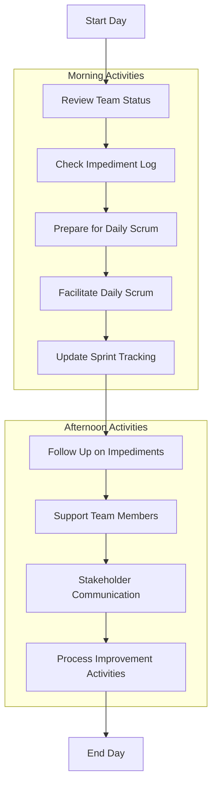

### Weekly Scrum Master Workflow

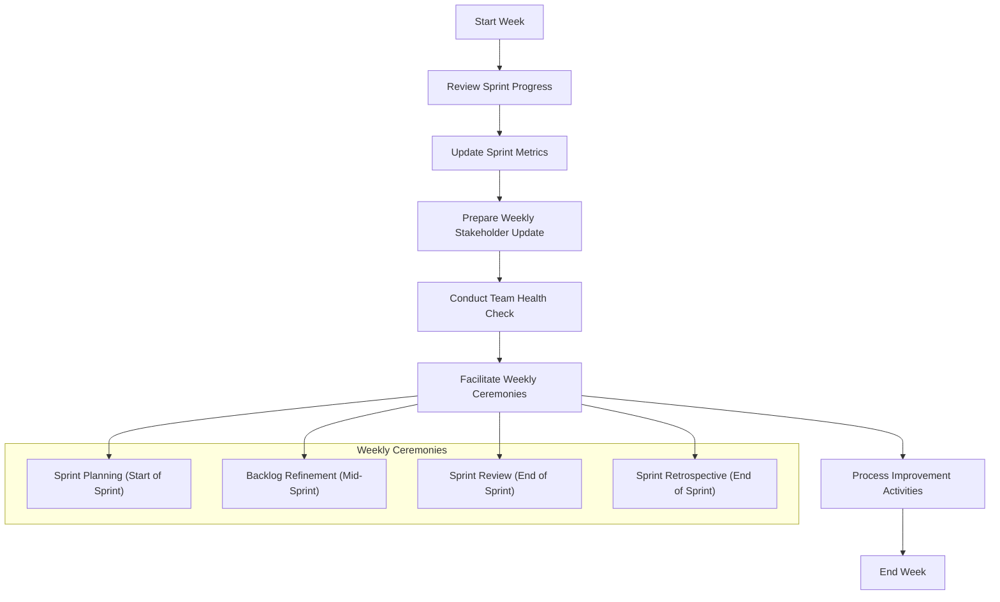

### Sprint Cycle Workflow

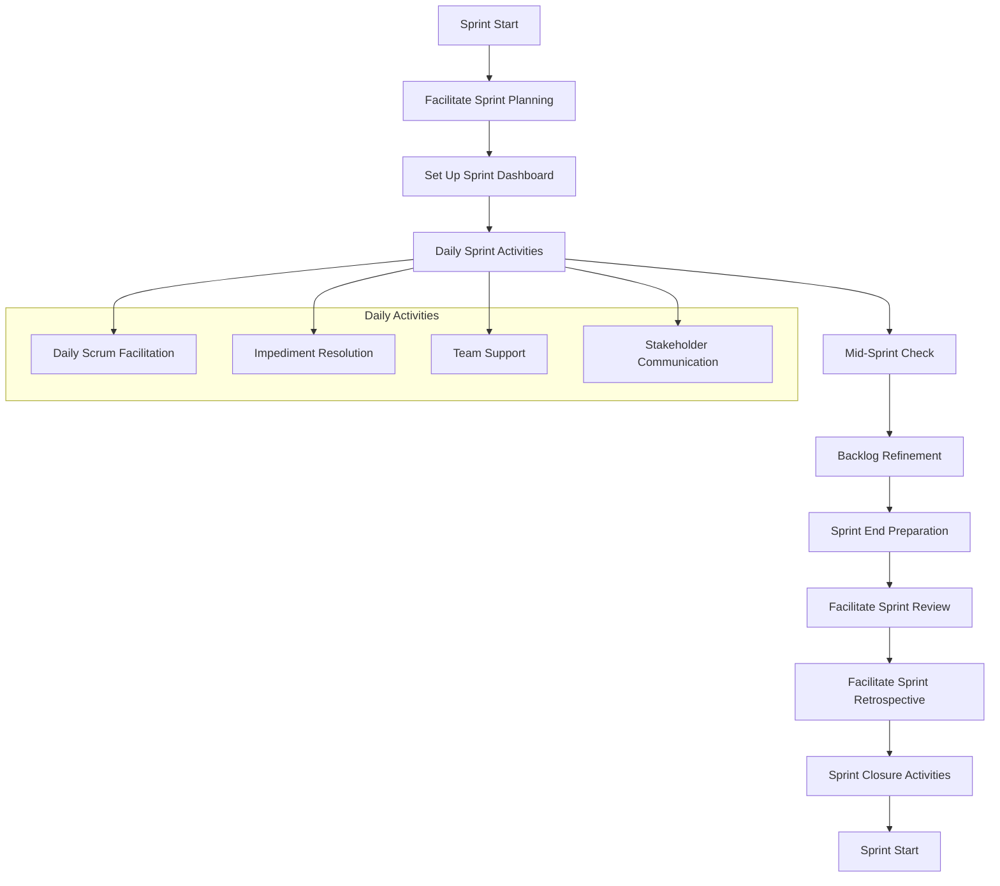

## Sprint Ceremony Workflows

### Sprint Planning Workflow

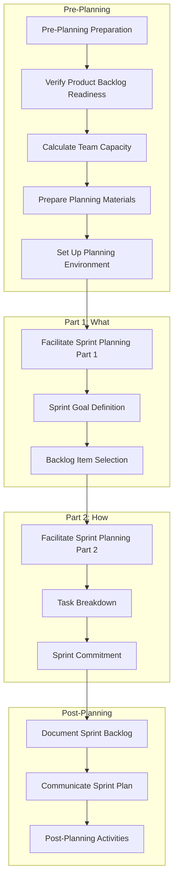

### Daily Scrum Workflow

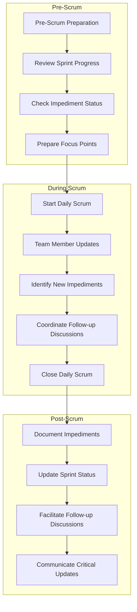

### Sprint Review Workflow

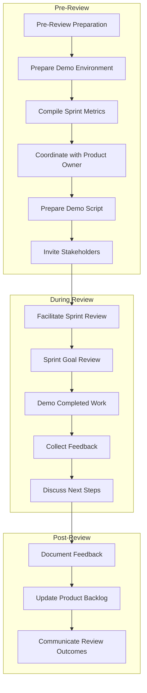

### Sprint Retrospective Workflow

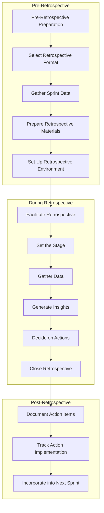

### Backlog Refinement Workflow

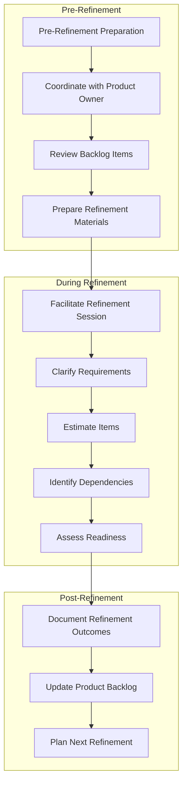

## Team Coaching Workflows

### Team Development Workflow

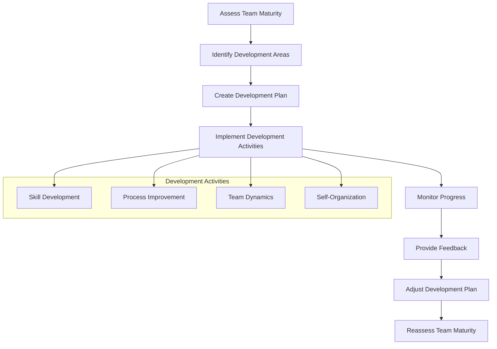

### Individual Coaching Workflow

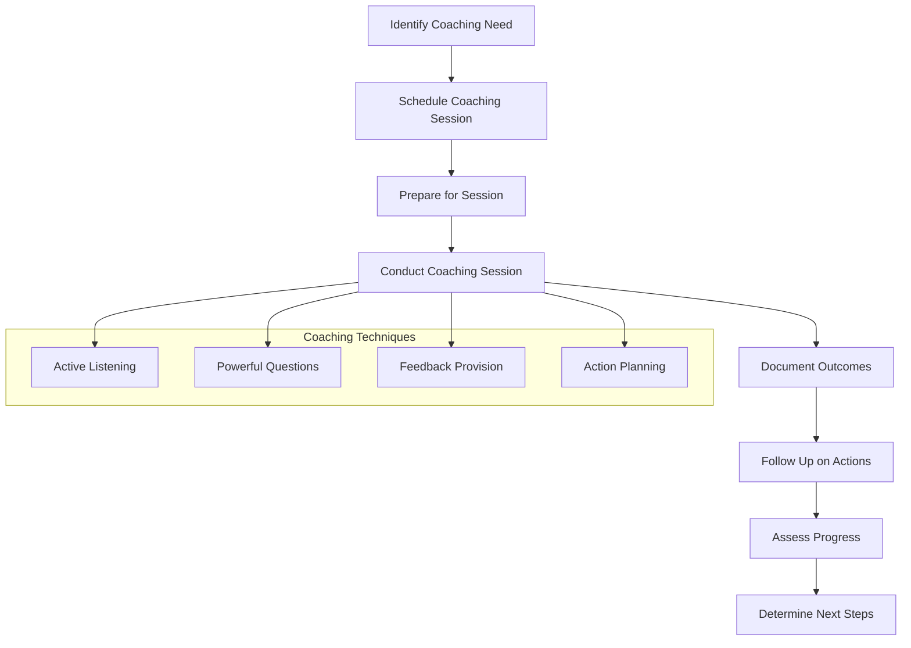

### Conflict Resolution Workflow

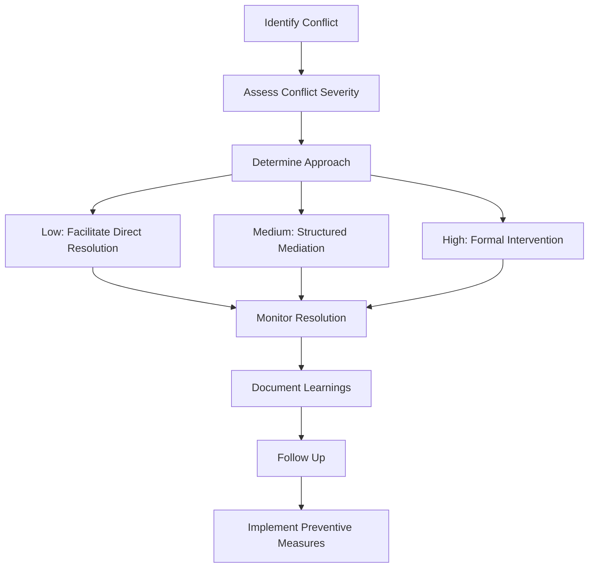

## Impediment Management Workflows

### Impediment Resolution Workflow

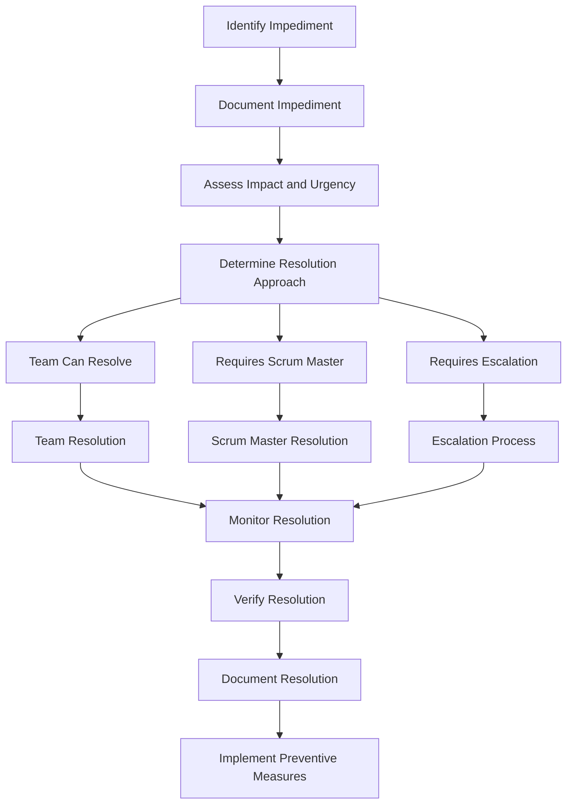

### Escalation Workflow

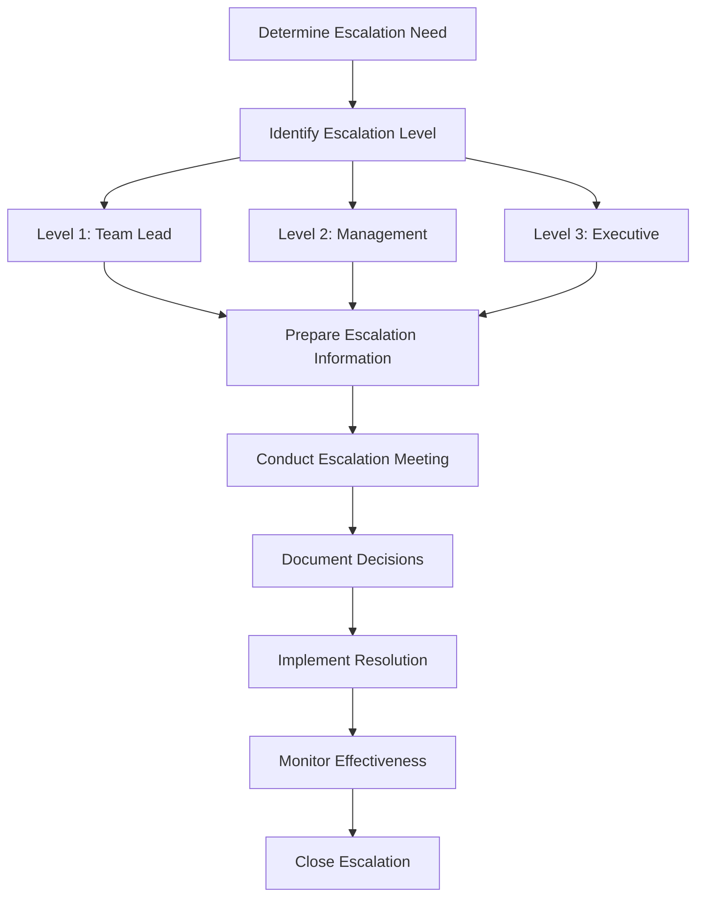

### Risk Management Workflow

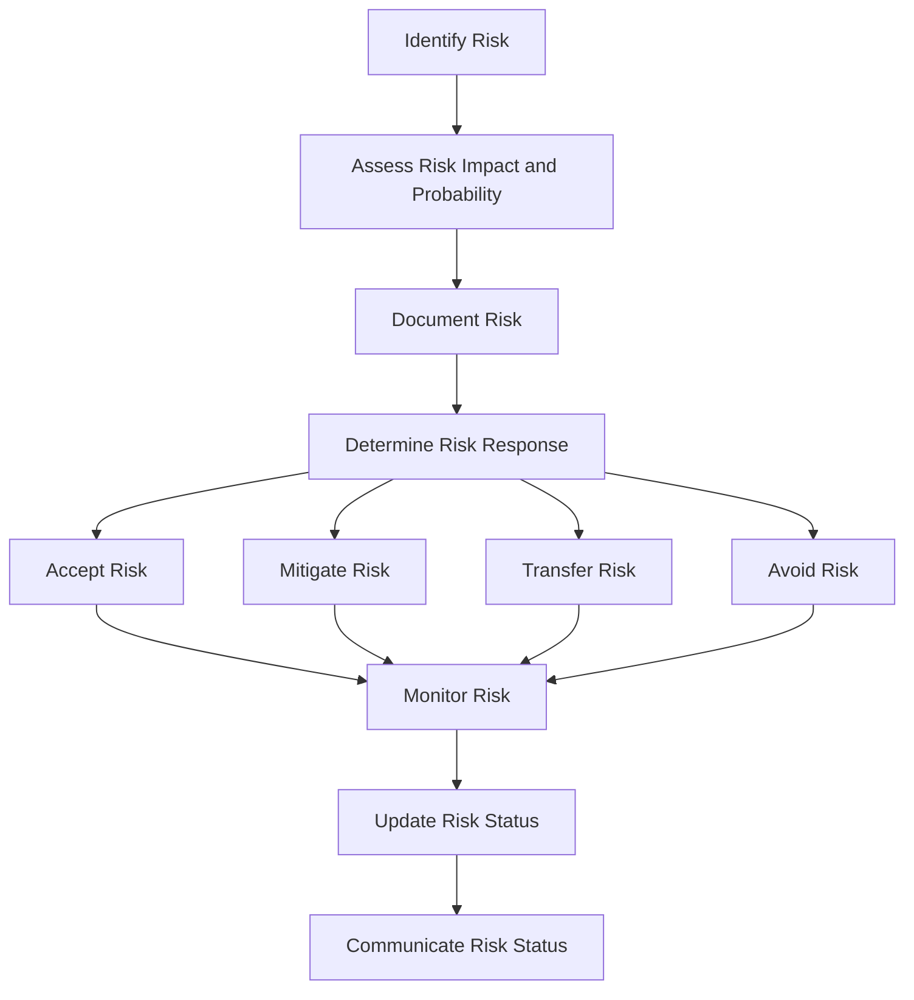

## Process Improvement Workflows

### Continuous Improvement Workflow

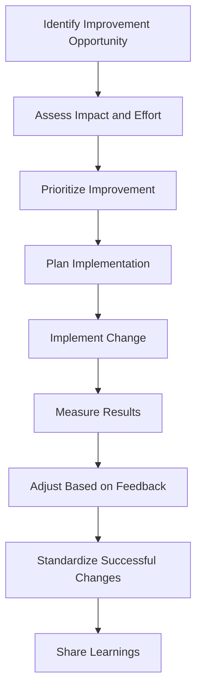

### Process Assessment Workflow

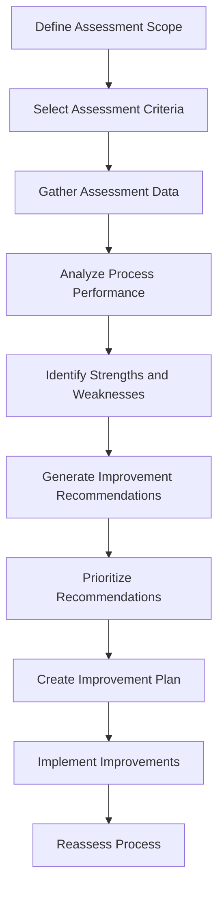

### Retrospective Action Tracking Workflow

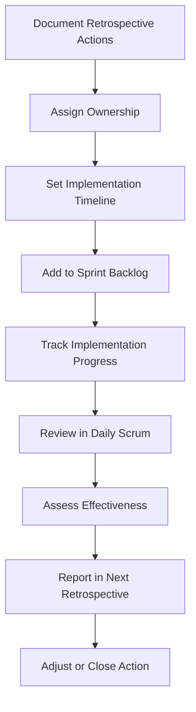

## Stakeholder Management Workflows

### Stakeholder Communication Workflow

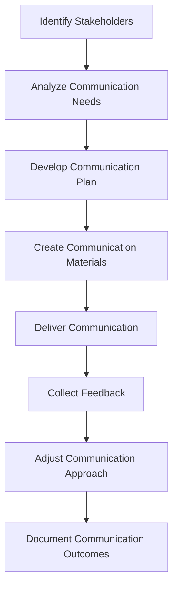

### Sprint Progress Reporting Workflow

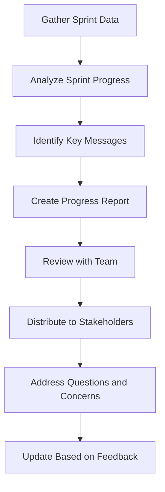

### Stakeholder Expectation Management Workflow

```mermaid title="Stakeholder Expectation Management Workflow" type="diagram"
graph TD
    A["Identify Stakeholder Expectations"] --> B["Assess Expectation Alignment"]
    B --> C["Identify Expectation Gaps"]
    C --> D["Develop Alignment Strategy"]
    D --> E["Conduct Alignment Discussions"]
    E --> F["Document Agreed Expectations"]
    F --> G["Monitor Expectation Fulfillment"]
    G --> H["Adjust as Needed"]
```

## Integration Workflows

### Product Owner Collaboration Workflow

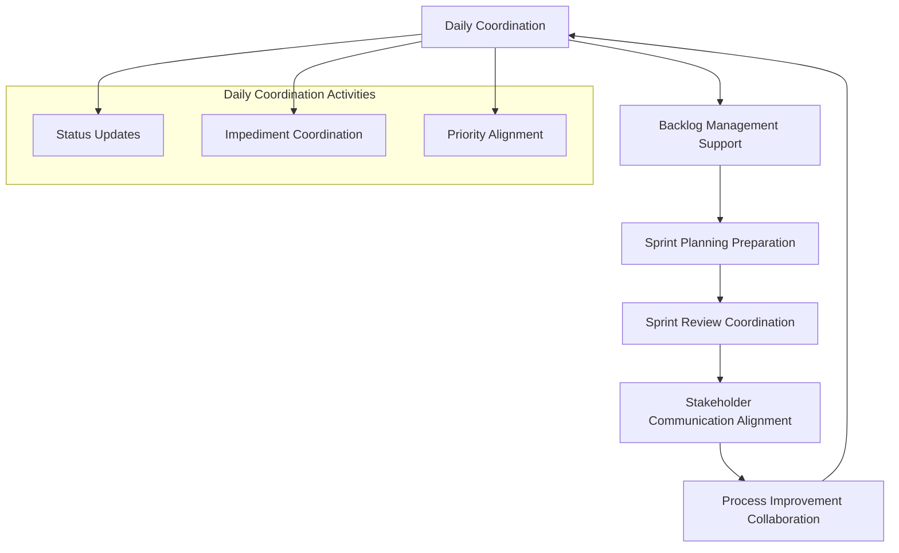

### Development Team Integration Workflow

```mermaid title="Development Team Integration Workflow" type="diagram"
graph TD
    A["Daily Support"] --> B["Impediment Resolution"]
    B --> C["Process Facilitation"]
    C --> D["Technical Practice Support"]
    D --> E["Team Dynamics Facilitation"]
    E --> F["Skill Development Support"]
    F --> A
    
    A --> A1["Daily Scrum Facilitation"]
    A --> A2["Ad-hoc Support"]
    A --> A3["Coordination Support"]
    
    subgraph "Daily Support Activities"
    A1
    A2
    A3
    end
```

### Architect Collaboration Workflow

```mermaid title="Architect Collaboration Workflow" type="diagram"
graph TD
    A["Technical Vision Alignment"] --> B["Architecture Review Support"]
    B --> C["Technical Debt Management"]
    C --> D["Technical Impediment Resolution"]
    D --> E["Technical Practice Improvement"]
    E --> A
```

### Project Manager Collaboration Workflow

```mermaid title="Project Manager Collaboration Workflow" type="diagram"
graph TD
    A["Status Reporting Coordination"] --> B["Risk Management Alignment"]
    B --> C["Resource Management Support"]
    C --> D["Timeline Coordination"]
    D --> E["Stakeholder Management Alignment"]
    E --> A
```

## Decision Trees and Escalation Procedures

### Impediment Resolution Decision Tree

```mermaid title="Impediment Resolution Decision Tree" type="diagram"
graph TD
    A["Impediment Identified"] --> B{"Can team resolve?"}
    B -->|Yes| C["Team resolves impediment"]
    B -->|No| D{"Is it technical?"}
    
    D -->|Yes| E{"Is architect input needed?"}
    D -->|No| F{"Is it process-related?"}
    
    E -->|Yes| G["Engage architect"]
    E -->|No| H["Technical team lead resolves"]
    
    F -->|Yes| I["Scrum Master resolves"]
    F -->|No| J{"Is it organizational?"}
    
    J -->|Yes| K{"What level of escalation?"}
    J -->|No| L["Scrum Master investigates further"]
    
    K -->|Level 1| M["Team lead escalation"]
    K -->|Level 2| N["Management escalation"]
    K -->|Level 3| O["Executive escalation"]
```

### Sprint Goal Risk Decision Tree

```mermaid title="Sprint Goal Risk Decision Tree" type="diagram"
graph TD
    A["Sprint Goal Risk Identified"] --> B{"Risk severity?"}
    
    B -->|Low| C["Monitor risk"]
    B -->|Medium| D["Develop mitigation plan"]
    B -->|High| E["Immediate action required"]
    
    D --> F{"Can team mitigate?"}
    E --> F
    
    F -->|Yes| G["Team implements mitigation"]
    F -->|No| H{"Scope adjustment needed?"}
    
    H -->|Yes| I["Consult Product Owner"]
    H -->|No| J["Escalate for support"]
    
    I --> K["Adjust sprint scope"]
    J --> L["Implement support plan"]
```

### Conflict Resolution Decision Tree

```mermaid title="Conflict Resolution Decision Tree" type="diagram"
graph TD
    A["Conflict Identified"] --> B{"Conflict severity?"}
    
    B -->|Low| C["Facilitate direct resolution"]
    B -->|Medium| D["Structured mediation"]
    B -->|High| E["Formal intervention"]
    
    C --> F{"Resolved?"}
    D --> F
    E --> F
    
    F -->|Yes| G["Document resolution"]
    F -->|No| H{"Escalation needed?"}
    
    H -->|Yes| I["Escalate to appropriate level"]
    H -->|No| J["Try different approach"]
    
    I --> K["Implement resolution plan"]
    J --> L["Reassess conflict"]
```

## Workflow Customization Guidelines

### Workflow Adaptation Process

```mermaid title="Workflow Adaptation Process" type="diagram"
graph TD
    A["Identify Adaptation Need"] --> B["Assess Current Workflow"]
    B --> C["Identify Adaptation Options"]
    C --> D["Evaluate Options"]
    D --> E["Select Best Approach"]
    E --> F["Plan Implementation"]
    F --> G["Implement Adaptation"]
    G --> H["Evaluate Effectiveness"]
    H --> I["Standardize or Adjust"]
```

### Workflow Integration Guidelines

#### Integration with Product Owner Workflows
1. **Backlog Management Integration**
   - Coordinate backlog refinement scheduling and preparation
   - Support Product Owner in backlog prioritization
   - Ensure backlog items meet Definition of Ready

2. **Sprint Planning Integration**
   - Collaborate on sprint goal definition
   - Support Product Owner in explaining backlog items
   - Ensure team understanding of requirements

3. **Sprint Review Integration**
   - Coordinate review preparation and stakeholder invitations
   - Support Product Owner in presenting business context
   - Facilitate feedback collection and documentation

#### Integration with Development Team Workflows
1. **Daily Work Integration**
   - Facilitate daily coordination through Daily Scrum
   - Support team in impediment resolution
   - Protect team from external disruptions

2. **Technical Practice Integration**
   - Support adoption of technical best practices
   - Facilitate technical debt discussions
   - Coordinate with technical leads on architecture concerns

3. **Quality Assurance Integration**
   - Support Definition of Done adherence
   - Facilitate quality-focused discussions
   - Coordinate testing and quality activities

#### Integration with Organizational Workflows
1. **Reporting Integration**
   - Align Scrum reporting with organizational requirements
   - Translate Scrum metrics for organizational stakeholders
   - Coordinate with Project Management Office as needed

2. **Resource Management Integration**
   - Support capacity planning and resource allocation
   - Coordinate with resource managers on team composition
   - Advocate for team stability and focus

3. **Strategic Alignment Integration**
   - Ensure team understanding of organizational goals
   - Connect sprint goals to strategic objectives
   - Communicate team contributions to organizational success

### Workflow Customization Factors

#### Team Maturity Considerations
- **New Teams**: More structured workflows with detailed guidance
- **Developing Teams**: Balanced structure with growing autonomy
- **Mature Teams**: Lightweight workflows focusing on impediments and continuous improvement

#### Project Complexity Considerations
- **Simple Projects**: Streamlined workflows with minimal overhead
- **Moderate Complexity**: Standard Scrum workflows with targeted adaptations
- **High Complexity**: Enhanced workflows with additional coordination and risk management

#### Organizational Context Considerations
- **Regulatory Requirements**: Additional compliance and documentation steps
- **Distributed Teams**: Enhanced communication and coordination workflows
- **Multiple Team Coordination**: Added integration points with other Scrum Masters

---

This workflow mapping provides Scrum Masters with comprehensive process flows for all key activities within the BMAD Method. By following these workflows, Scrum Masters can ensure effective facilitation, team support, and continuous improvement.
