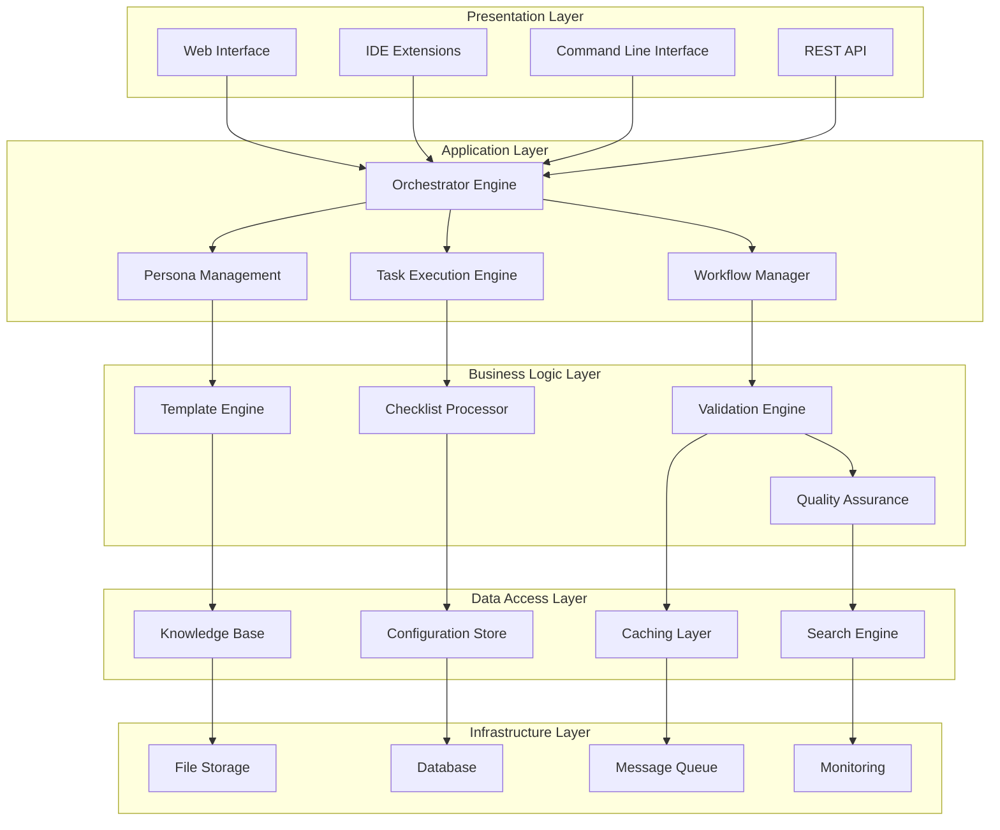

# BMAD System Architecture Documentation

This section provides comprehensive visual documentation of the BMAD system architecture, component relationships, and data flows.

## Architecture Overview

The BMAD (Business, Management, Architecture, Development) system is built on a modular, AI-driven architecture that enables seamless coordination between specialized personas through an intelligent orchestrator.

## Quick Navigation

| Document | Description | Audience |
|----------|-------------|----------|
| [System Overview](system-overview.md) | High-level system architecture | All stakeholders |
| [Component Architecture](component-architecture.md) | Detailed component breakdown | Technical teams |
| [Data Flow Diagrams](data-flow-diagrams.md) | Information flow patterns | Architects & Developers |
| [Integration Architecture](integration-architecture.md) | External system integrations | Integration teams |
| [Deployment Architecture](deployment-architecture.md) | Infrastructure and deployment | DevOps & Operations |

## Architecture Principles

### 1. Modular Design
- **Separation of Concerns**: Each component has a single, well-defined responsibility
- **Loose Coupling**: Components interact through well-defined interfaces
- **High Cohesion**: Related functionality is grouped together
- **Pluggable Architecture**: Components can be easily replaced or extended

### 2. AI-First Approach
- **Intelligent Orchestration**: AI-driven coordination between personas
- **Context-Aware Processing**: Decisions based on complete project context
- **Adaptive Behavior**: System learns and improves from interactions
- **Natural Language Interface**: Human-friendly interaction patterns

### 3. Scalability & Performance
- **Horizontal Scaling**: System can scale across multiple instances
- **Efficient Resource Usage**: Optimized for memory and processing efficiency
- **Caching Strategies**: Multi-level caching for improved performance
- **Asynchronous Processing**: Non-blocking operations where possible

### 4. Security & Reliability
- **Defense in Depth**: Multiple layers of security controls
- **Data Protection**: Encryption at rest and in transit
- **Fault Tolerance**: Graceful degradation and error recovery
- **Audit Trail**: Complete logging of all system activities

## System Architecture Layers

## Key Architectural Decisions

### 1. Orchestrator-Centric Design
**Decision**: Central orchestrator manages all persona interactions
**Rationale**: Ensures consistent coordination and context management
**Trade-offs**: Single point of coordination vs. distributed complexity

### 2. Template-Driven Output
**Decision**: All deliverables generated from standardized templates
**Rationale**: Ensures consistency and quality across all outputs
**Trade-offs**: Standardization vs. flexibility

### 3. Context-Aware Processing
**Decision**: All personas have access to complete project context
**Rationale**: Enables informed decision-making and reduces errors
**Trade-offs**: Memory usage vs. decision quality

### 4. Multi-Environment Support
**Decision**: Support both web and IDE environments
**Rationale**: Flexibility for different user preferences and workflows
**Trade-offs**: Development complexity vs. user adoption

## Performance Characteristics

### Response Time Targets
- **Simple Queries**: < 200ms
- **Template Generation**: < 2 seconds
- **Complex Analysis**: < 10 seconds
- **Bulk Operations**: < 30 seconds

### Scalability Metrics
- **Concurrent Users**: 1000+ simultaneous users
- **Request Throughput**: 10,000+ requests/minute
- **Data Volume**: 100GB+ knowledge base
- **Geographic Distribution**: Multi-region deployment

### Availability Requirements
- **Uptime Target**: 99.9% availability
- **Recovery Time**: < 5 minutes for critical failures
- **Backup Frequency**: Real-time data replication
- **Disaster Recovery**: < 1 hour full system recovery

## Security Architecture

### Authentication & Authorization
- **Multi-factor Authentication**: Required for all users
- **Role-based Access Control**: Granular permission management
- **API Key Management**: Secure external system integration
- **Session Management**: Secure session handling and timeout

### Data Protection
- **Encryption**: AES-256 encryption for data at rest
- **Transport Security**: TLS 1.3 for all communications
- **Key Management**: Hardware security module (HSM) integration
- **Data Classification**: Automated sensitive data identification

### Compliance & Auditing
- **Audit Logging**: Complete activity trail
- **Compliance Monitoring**: Automated compliance checking
- **Data Retention**: Configurable retention policies
- **Privacy Controls**: GDPR and CCPA compliance features

## Next Steps

1. **Review System Overview**: Start with [System Overview](system-overview.md)
2. **Understand Components**: Explore [Component Architecture](component-architecture.md)
3. **Analyze Data Flows**: Study [Data Flow Diagrams](data-flow-diagrams.md)
4. **Plan Integrations**: Review [Integration Architecture](integration-architecture.md)
5. **Design Deployment**: Examine [Deployment Architecture](deployment-architecture.md)

---

*This architecture documentation provides the foundation for understanding, implementing, and extending the BMAD system.*
