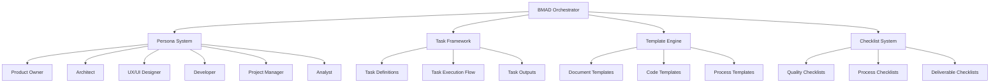
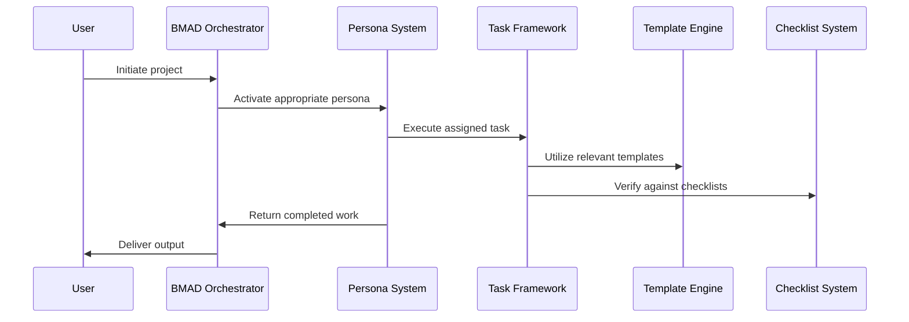

# BMAD Method Component Architecture

## Overview

The BMAD Method is a structured approach for AI-driven development that coordinates specialized personas. This document outlines the conceptual components that make up the BMAD Method ecosystem.

## Component Breakdown

The BMAD Method consists of several interconnected conceptual components that work together to facilitate AI-driven development:

## Component Descriptions

### 1. BMAD Orchestrator

The central coordination mechanism that manages the overall workflow and interactions between personas.

**Responsibilities:**
- Coordinate persona transitions
- Manage context sharing between personas
- Track project progress
- Ensure methodology adherence

### 2. Persona System

A collection of specialized AI personas, each with distinct expertise and responsibilities.

**Key Personas:**
- **Product Owner**: Defines product requirements and priorities
- **Architect**: Designs system architecture and technical approaches
- **UX/UI Designer**: Creates user experience and interface designs
- **Developer**: Implements technical solutions
- **Project Manager**: Coordinates project activities and resources
- **Analyst**: Analyzes requirements and provides insights

### 3. Task Framework

The structured approach for defining, executing, and tracking tasks within the BMAD Method.

**Components:**
- **Task Definitions**: Standardized task structures
- **Task Execution Flow**: Process for completing tasks
- **Task Outputs**: Standardized deliverables

### 4. Template Engine

A collection of standardized templates for various artifacts produced during the development process.

**Template Types:**
- **Document Templates**: For specifications, requirements, etc.
- **Code Templates**: For standardized code structures
- **Process Templates**: For workflow documentation

### 5. Checklist System

Quality assurance mechanisms to ensure completeness and consistency.

**Checklist Types:**
- **Quality Checklists**: Ensure deliverable quality
- **Process Checklists**: Verify process adherence
- **Deliverable Checklists**: Confirm deliverable completeness

## Component Interactions

The components interact through a series of defined workflows:

## Integration Points

The BMAD Method components integrate with:

1. **LLM Platforms**: The underlying AI models that power the personas
2. **IDE Environments**: Where development tasks are executed
3. **Documentation Systems**: Where artifacts are stored
4. **Project Management Tools**: For tracking progress

## Conclusion

The BMAD Method's component architecture is designed to provide a structured, repeatable approach to AI-driven development. By breaking down the methodology into these conceptual components, teams can better understand, implement, and extend the BMAD Method for their specific needs.
