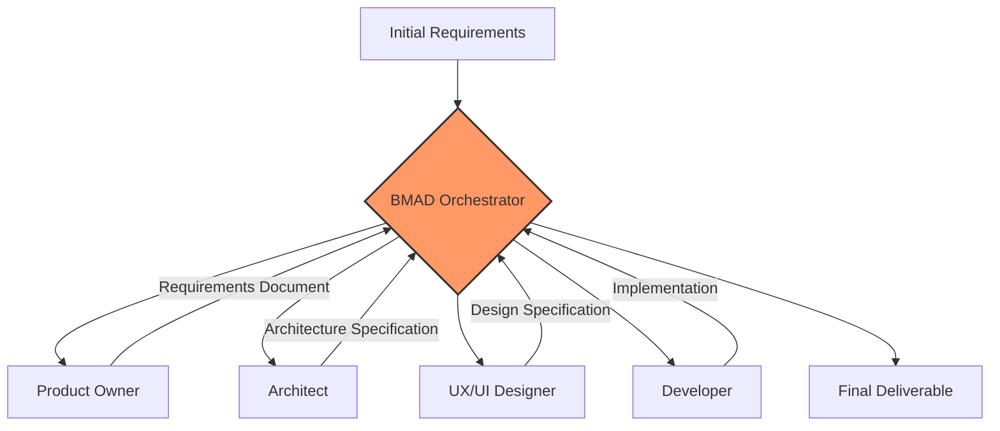
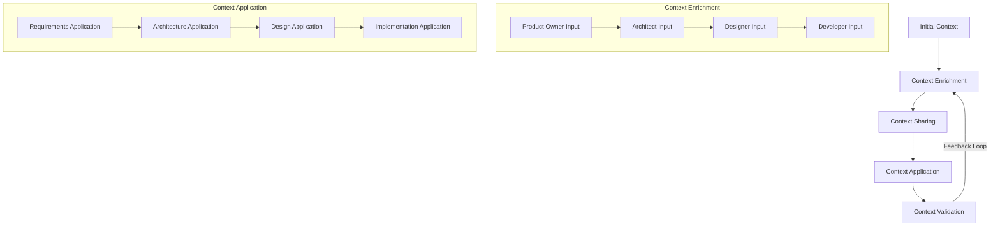
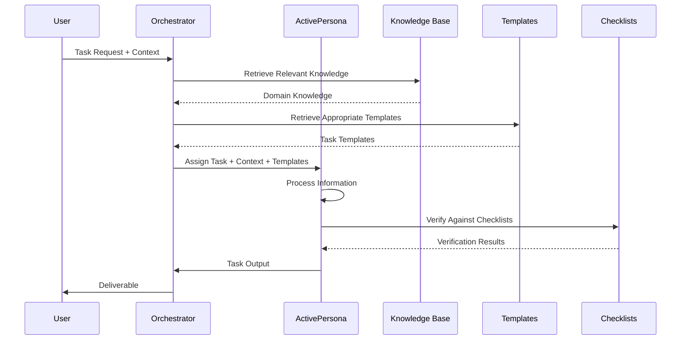
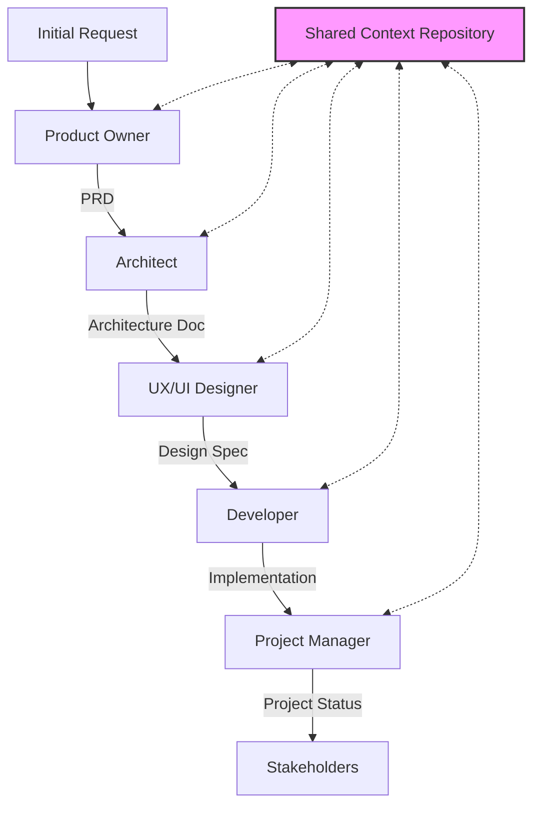
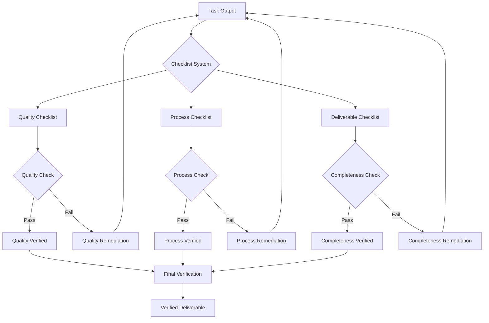
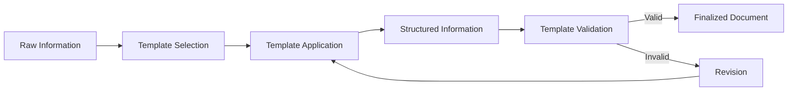

# BMAD Method Data Flow Diagrams

## Overview

This document illustrates how information flows through the BMAD Method process. Unlike traditional software systems with databases and APIs, the BMAD Method manages the flow of context, requirements, specifications, and other information between different personas and stages of the development process.

## Core Information Flow

The BMAD Method's primary information flow shows how context and requirements transform into deliverables through a series of specialized personas:

## Context Preservation Flow

One of the BMAD Method's key strengths is how it preserves and enriches context throughout the development process:

## Task Execution Flow

Information flow during task execution in the BMAD Method:

## Persona Transition Flow

How information transitions between personas in the BMAD Method:

## Checklist Verification Flow

How information flows through the checklist verification process:

## Template Application Flow

How templates are applied to structure information in the BMAD Method:

## Conclusion

The BMAD Method's information flow is designed to ensure that context is preserved, enriched, and effectively utilized throughout the development process. By structuring information flow through specialized personas and standardized processes, the BMAD Method creates a consistent, high-quality approach to AI-driven development.
