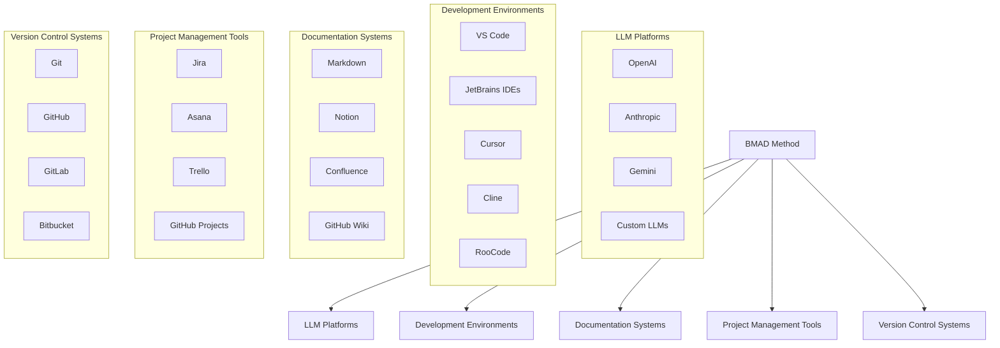
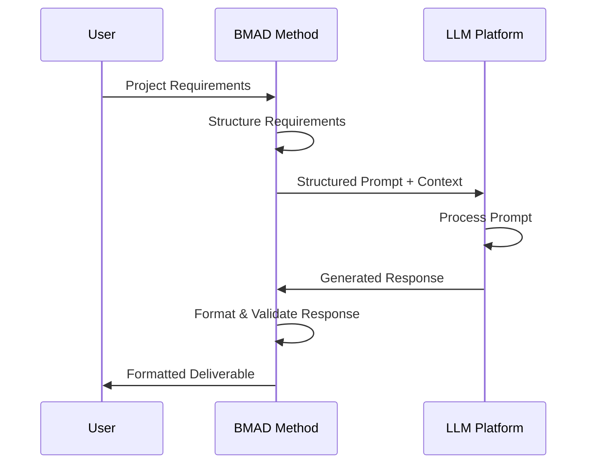
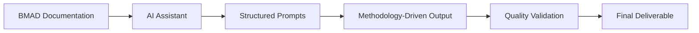
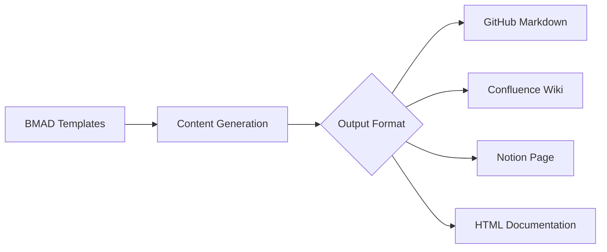
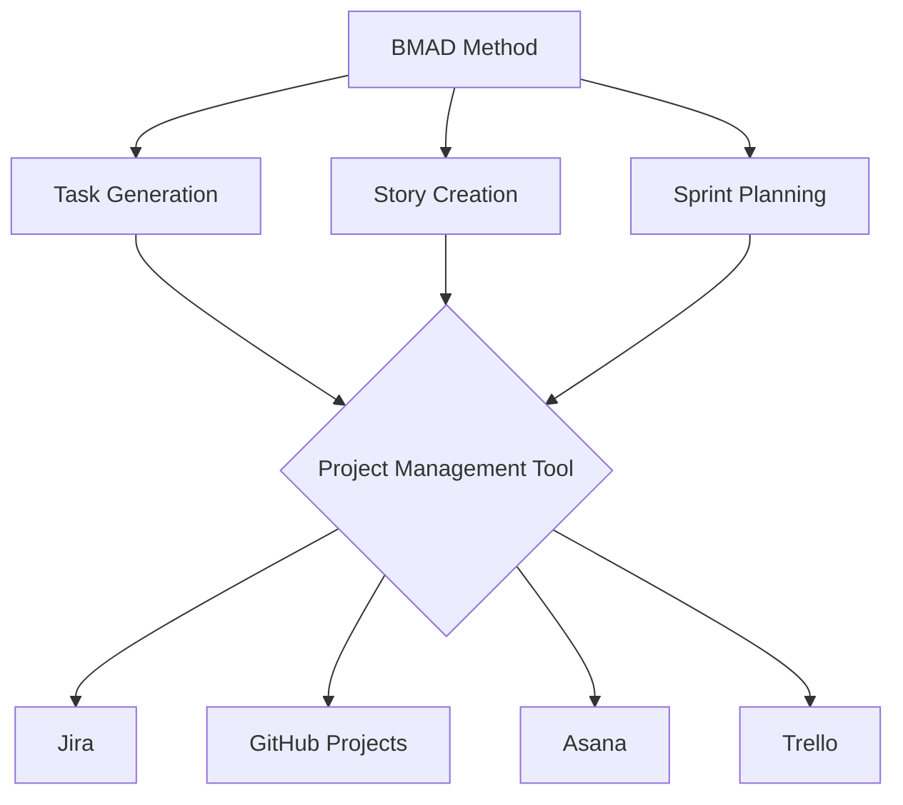
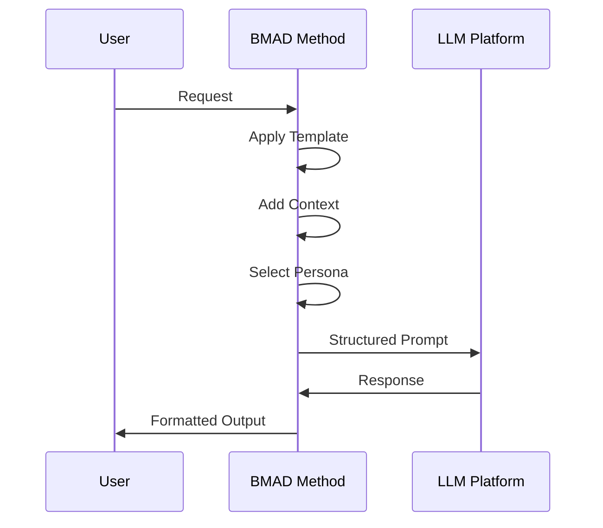
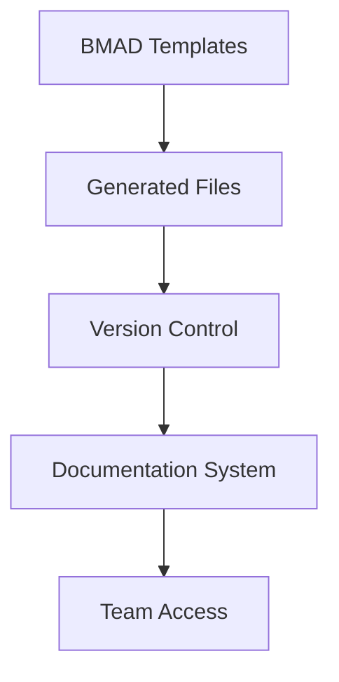
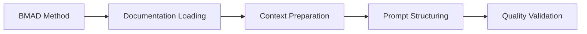

# BMAD Method Integration Architecture

## Overview

The BMAD Method is designed to integrate with various tools, platforms, and workflows rather than functioning as a standalone application. This document outlines how the BMAD Method integrates with LLMs, development environments, and existing workflows.

## Integration Landscape

## LLM Integration Architecture

The BMAD Method integrates with Large Language Models through structured prompts and context management:

## Development Environment Integration

### Methodology Integration Patterns

**IDE Integration Approach:**
- Load BMAD documentation into AI assistant context
- Structure prompts using persona frameworks
- Apply templates and checklists as guidance
- Follow methodology workflows

**Integration Flow:**

## Documentation Integration

How the BMAD Method integrates with documentation systems:

## Project Management Integration

How the BMAD Method integrates with project management tools:

## Integration Patterns

The BMAD Method employs several integration patterns:

### 1. Prompt-Based Integration

### 2. File-Based Integration

### 3. Methodology-Driven Integration

## Implementation Approaches

There are several approaches to implementing BMAD Method integrations:

### 1. Direct Methodology Application
- Manually applying BMAD Method principles to LLM interactions
- Loading persona documentation into AI assistant context
- Following structured workflows and templates

### 2. Documentation-Based Integration
- Using BMAD templates as starting points
- Referencing checklists for quality validation
- Following persona-specific guidelines

### 3. Workflow Integration
- Incorporating BMAD patterns into existing development processes
- Using BMAD personas for specific project phases
- Applying BMAD quality standards to deliverables

## Best Practices

### Context Management
- Load relevant persona documentation before starting tasks
- Maintain consistent context throughout project phases
- Reference appropriate templates and checklists

### Quality Assurance
- Use BMAD quality checklists for validation
- Follow persona-specific quality standards
- Conduct regular methodology compliance reviews

### Team Collaboration
- Share BMAD documentation across team members
- Establish common understanding of persona roles
- Maintain consistent methodology application

## Troubleshooting Common Integration Issues

### Context Loss
**Problem**: AI assistant loses BMAD context during long sessions
**Solution**: Regularly reload persona documentation and reference key templates

### Inconsistent Output
**Problem**: Generated content doesn't follow BMAD standards
**Solution**: Use specific persona prompts and reference quality checklists

### Workflow Confusion
**Problem**: Unclear which persona to use for specific tasks
**Solution**: Reference the persona selection guide and task mappings

## Conclusion

The BMAD Method's integration architecture is designed to be flexible and adaptable, allowing it to work with a wide range of tools and platforms through methodology-driven approaches. By focusing on structured prompts, standardized templates, and clear workflows, the BMAD Method can be integrated into existing development processes with minimal friction.

The key to successful integration is understanding that BMAD is a methodology framework rather than a software application, and its value comes from consistent application of its principles and patterns rather than technical installation or configuration.
