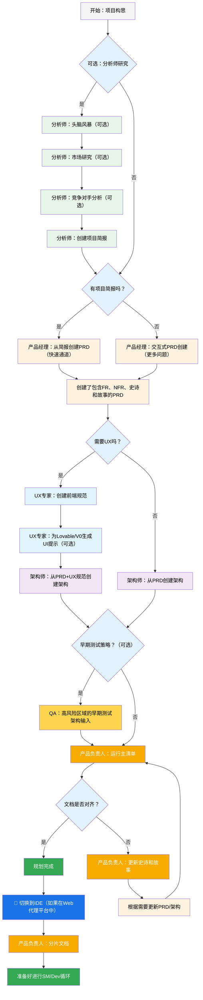
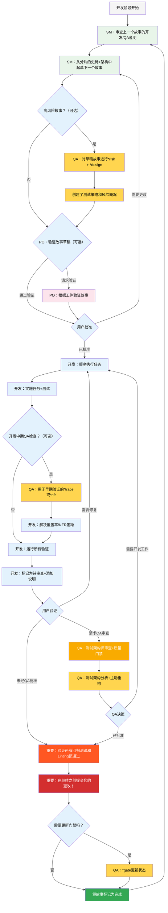

# BMad方法 — 用户指南

本指南将帮助您理解并有效使用BMad方法进行敏捷的AI驱动规划和开发。

## BMad规划与执行工作流

首先，这里是完整的标准绿地规划+执行工作流。棕地项目非常相似，但建议在处理棕地项目之前，先在一个简单的项目上理解这个绿地工作流。BMad方法需要安装到您的新项目文件夹的根目录。对于规划阶段，您可以选择使用强大的Web代理来执行，这可能会以比您自己提供API密钥或在某些代理工具中提供积分所需成本的一小部分，获得更高质量的结果。对于规划，强大的思维模型和更大的上下文——以及与代理作为合作伙伴一起工作——将获得最佳结果。

如果您打算在棕地项目（现有项目）中使用BMad方法，请查阅**[在棕地中工作](./working-in-the-brownfield.md)**。

如果下面的图表没有渲染，请将Markdown All in One以及Markdown Preview Mermaid Support插件安装到VSCode（或其某个分叉克隆版本）。安装这些插件后，如果您在打开时右键单击选项卡，应该会有一个“打开预览”选项，或查看IDE文档。

### 规划工作流（Web UI或强大的IDE代理）

在开发开始之前，BMad遵循一个结构化的规划工作流，为了成本效益，最好在Web UI中完成：



#### Web UI到IDE的转换

**关键转换点**：一旦产品负责人确认文档对齐，您必须从Web UI切换到IDE以开始开发工作流：

1.  **将文档复制到项目**：确保`docs/prd.md`和`docs/architecture.md`位于您项目的docs文件夹中（或您在安装期间可以指定的自定义位置）
2.  **切换到IDE**：在您首选的代理IDE中打开您的项目
3.  **文档分片**：使用PO代理分片PRD，然后分片架构
4.  **开始开发**：开始遵循核心开发周期

#### 规划工件（标准路径）

```text
PRD              → docs/prd.md
架构     → docs/architecture.md
分片的史诗    → docs/epics/
分片的故事  → docs/stories/
QA评估   → docs/qa/assessments/
QA门禁         → docs/qa/gates/
```

### 核心开发周期（IDE）

一旦规划完成并且文档被分片，BMad将遵循一个结构化的开发工作流：



## 先决条件

在安装BMad方法之前，请确保您有：

-   **Node.js** ≥ 18, **npm** ≥ 9
-   已安装并配置**Git**
-   **（可选）** VS Code及“Markdown All in One”+“Markdown Preview Mermaid Support”扩展

## 安装

### 可选

如果您想在Web上使用Claude（Sonnet 4或Opus）、Gemini Gem（2.5 Pro）或自定义GPT进行规划：

1.  导航到`dist/teams/`
2.  复制`team-fullstack.txt`
3.  创建新的Gemini Gem或自定义GPT
4.  上传文件并附上说明：“您的关键操作说明已附上，请按指示不要脱离角色”
5.  输入`/help`查看可用命令

### IDE项目设置

```bash
# 交互式安装（推荐）
npx bmad-method install
```

## 特殊代理

有两个BMad代理——将来它们将被合并为一个单一的BMad-Master。

### BMad-Master

除了实际的故事实施外，该代理可以执行所有其他代理可以执行的任何任务或命令。此外，该代理可以通过访问知识库并向您解释有关流程的任何内容，来帮助在Web上解释BMad方法。

如果您不想除了开发之外在不同代理之间切换，那么这个代理适合您。只需记住，随着上下文的增长，代理的性能会下降，因此指示代理压缩对话并以压缩后的对话作为初始消息开始新的对话非常重要。请经常这样做，最好在每个故事实施后都这样做。

### BMad-Orchestrator

该代理不应在IDE中使用，它是一个重量级的、特殊用途的代理，利用大量上下文，并且可以变形为任何其他代理。它仅用于促进Web包中的团队。如果您使用Web包，您将被BMad Orchestrator迎接。

### 代理如何工作

#### 依赖系统

每个代理都有一个YAML部分，定义其依赖关系：

```yaml
dependencies:
  templates:
    - prd-template.md
    - user-story-template.md
  tasks:
    - create-doc.md
    - shard-doc.md
  data:
    - bmad-kb.md
```

**要点：**

-   代理只加载它们需要的资源（精简上下文）
-   依赖项在打包过程中自动解析
-   资源在代理之间共享以保持一致性

#### 代理交互

**在IDE中：**

```bash
# 某些IDE，例如Cursor或Windsurf，使用手动规则，因此交互是通过“@”符号完成的
@pm 为任务管理应用创建一个PRD
@architect 设计系统架构
@dev 实施用户身份验证

# 某些IDE，例如Claude Code，使用斜杠命令
/pm 创建用户故事
/dev 修复登录错误
```

#### 交互模式

-   **增量模式**：逐步进行，需要用户输入
-   **YOLO模式**：快速生成，交互最少

## IDE集成

### IDE最佳实践

-   **上下文管理**：仅在上下文中保留相关文件，保持文件尽可能精简和专注
-   **代理选择**：为任务使用适当的代理
-   **迭代开发**：以小的、专注的任务进行工作
-   **文件组织**：保持干净的项目结构
-   **定期提交**：经常保存您的工作

## 测试架构师（QA代理）

### 概述

BMad中的QA代理不仅仅是一个“高级开发人员审查员”——它是一个在测试策略、质量门禁和基于风险的测试方面拥有深厚专业知识的**测试架构师**。这个名为Quinn的代理在质量问题上提供咨询权威，同时在安全的情况下积极改进代码。

#### 快速入门（基本命令）

```bash
@qa *risk {story}       # 开发前评估风险
@qa *design {story}     # 创建测试策略
@qa *trace {story}      # 开发期间验证测试覆盖率
@qa *nfr {story}        # 检查质量属性
@qa *review {story}     # 全面评估 → 写入门禁
```

#### 命令别名（测试架构师）

为了方便，文档使用简写形式。两种样式都有效：

```text
*risk    → *risk-profile
*design  → *test-design
*nfr     → *nfr-assess
*trace   → *trace-requirements（或仅*trace）
*review  → *review
*gate    → *gate
```

### 核心能力

#### 1. 风险分析 (`*risk`)

**何时：** 故事草稿后，开发开始前（最早的干预点）

识别和评估实施风险：

-   **类别**：技术、安全、性能、数据、业务、运营
-   **评分**：概率×影响分析（1-9分制）
-   **缓解**：针对每个已识别风险的具体策略
-   **门禁影响**：风险≥9触发FAIL，≥6触发CONCERNS（ authoritative rules请参见`tasks/risk-profile.md`）

#### 2. 测试设计 (`*design`)

**何时：** 故事草稿后，开发开始前（指导要编写哪些测试）

创建全面的测试策略，包括：

-   每个验收标准的测试场景
-   适当的测试级别建议（单元vs集成vs端到端）
-   基于风险的优先级（P0/P1/P2）
-   测试数据要求和模拟策略
-   CI/CD集成的执行策略

**示例输出：**

```yaml
test_summary:
  total: 24
  by_level:
    unit: 15
    integration: 7
    e2e: 2
  by_priority:
    P0: 8 # 必须有 - 与关键风险相关
    P1: 10 # 应该有 - 中等风险
    P2: 6 # 最好有 - 低风险
```

#### 3. 需求跟踪 (`*trace`)

**何时：** 开发期间（实施中期检查点）

将需求映射到测试覆盖范围：

-   记录哪些测试验证了每个验收标准
-   使用Given-When-Then以求清晰（仅文档，非BDD代码）
-   识别带有严重性评级的覆盖差距
-   为审计目的创建可追溯性矩阵

#### 4. NFR评估 (`*nfr`)

**何时：** 开发期间或早期审查（验证质量属性）

验证非功能性需求：

-   **核心四项**：安全性、性能、可靠性、可维护性
-   **基于证据**：寻找实际的实施证明
-   **门禁集成**：NFR失败直接影响质量门禁

#### 5. 全面的测试架构审查 (`*review`)

**何时：** 开发完成，故事标记为“准备审查”

当您运行`@qa *review {story}`时，Quinn会执行：

-   **需求可追溯性**：将每个验收标准映射到其验证测试
-   **测试级别分析**：确保在单元、集成和端到端级别进行适当的测试
-   **覆盖率评估**：识别差距和冗余的测试覆盖
-   **主动重构**：在安全的情况下直接提高代码质量
-   **质量门禁决策**：根据发现发布PASS/CONCERNS/FAIL状态

#### 6. 质量门禁 (`*gate`)

**何时：** 审查修复后或需要更新门禁状态时

管理质量门禁决策：

-   **确定性规则**：PASS/CONCERNS/FAIL的明确标准
-   **并行权限**：QA在`docs/qa/gates/`中拥有门禁文件
-   **咨询性质**：提供建议，而非阻塞
-   **豁免支持**：在需要时记录接受的风险

**注意：** 门禁是咨询性的；团队选择他们的质量标准。豁免需要理由、批准人和到期日期。有关模式，请参见`templates/qa-gate-tmpl.yaml`，有关门禁规则和评分，请参见`tasks/review-story.md`和`tasks/risk-profile.md`。

### 与测试架构师合作

#### 与BMad工作流集成

测试架构师在整个开发生命周期中提供价值。以下是何时以及如何利用每项功能：

| **阶段** | **命令** | **何时使用** | **价值** | **输出** |
| --- | --- | --- | --- | --- |
| **故事起草** | `*risk` | SM起草故事后 | 及早识别陷阱 | `docs/qa/assessments/{epic}.{story}-risk-{YYYYMMDD}.md` |
| | `*design` | 风险评估后 | 指导开发测试策略 | `docs/qa/assessments/{epic}.{story}-test-design-{YYYYMMDD}.md` |
| **开发** | `*trace` | 实施中期 | 验证测试覆盖率 | `docs/qa/assessments/{epic}.{story}-trace-{YYYYMMDD}.md` |
| | `*nfr` | 构建功能时 | 及早发现质量问题 | `docs/qa/assessments/{epic}.{story}-nfr-{YYYYMMDD}.md` |
| **审查** | `*review` | 故事标记为完成 | 全面质量评估 | 故事中的QA结果+门禁文件 |
| **审查后** | `*gate` | 修复问题后 | 更新质量决策 | 更新的`docs/qa/gates/{epic}.{story}-{slug}.yml` |

#### 示例命令

```bash
# 规划阶段 - 在开发开始前运行这些命令
@qa *risk {draft-story}     # 可能会出什么问题？
@qa *design {draft-story}   # 我们应该编写哪些测试？

# 开发阶段 - 在编码期间运行这些命令
@qa *trace {story}          # 我们是否测试了所有内容？
@qa *nfr {story}            # 我们是否符合质量标准？

# 审查阶段 - 开发完成后运行
@qa *review {story}         # 全面评估+重构

# 审查后 - 解决问题后运行
@qa *gate {story}           # 更新门禁状态
```

### 强制执行的质量标准

Quinn强制执行这些测试质量原则：

-   **无不稳定测试**：通过适当的异步处理确保可靠性
-   **无硬等待**：仅使用动态等待策略
-   **无状态且并行安全**：测试独立运行
-   **自清理**：测试管理自己的测试数据
-   **适当的测试级别**：单元测试用于逻辑，集成测试用于交互，E2E测试用于流程
-   **明确的断言**：将断言保留在测试中，而不是辅助函数中

### 门禁状态含义

-   **PASS**：所有关键要求均已满足，没有阻塞性问题
-   **CONCERNS**：发现非关键问题，团队应审查
-   **FAIL**：应解决的关键问题（安全风险、缺少P0测试）
-   **WAIVED**：问题已确认但团队明确豁免

### 特殊情况

**高风险故事：**

-   在开发开始前始终运行`*risk`和`*design`
-   考虑开发中期的`*trace`和`*nfr`检查点

**复杂集成：**

-   在开发期间运行`*trace`以确保所有集成点都经过测试
-   跟进`*nfr`以验证跨集成的性能

**性能关键：**

-   在开发期间尽早并经常运行`*nfr`
-   不要等到审查时才发现性能问题

**棕地/遗留代码：**

-   从`*risk`开始以识别回归危险
-   使用`*review`时要特别注意向后兼容性

### 最佳实践

-   **早期参与**：在故事起草期间运行`*design`和`*risk`
-   **基于风险的关注**：让风险评分驱动测试优先级
-   **迭代改进**：使用QA反馈来改进未来的故事
-   **门禁透明度**：与团队共享门禁决策
-   **持续学习**：QA记录模式以供团队知识共享
-   **棕地关怀**：特别注意现有系统中的回归风险

### 输出路径参考

测试架构师输出存储位置的快速参考：

```text
*risk-profile  → docs/qa/assessments/{epic}.{story}-risk-{YYYYMMDD}.md
*test-design   → docs/qa/assessments/{epic}.{story}-test-design-{YYYYMMDD}.md
*trace         → docs/qa/assessments/{epic}.{story}-trace-{YYYYMMDD}.md
*nfr-assess    → docs/qa/assessments/{epic}.{story}-nfr-{YYYYMMDD}.md
*review        → 故事中的QA结果部分+门禁文件参考
*gate          → docs/qa/gates/{epic}.{story}-{slug}.yml
```

## 技术偏好系统

BMad通过位于`.bmad-core/data/`中的`technical-preferences.md`文件包含了一个个性化系统 - 这可以帮助PM和架构师偏向于推荐您对设计模式、技术选择或您想在此处添加的任何其他内容。

### 与Web包一起使用

在创建自定义Web包或上传到AI平台时，请包含您的`technical-preferences.md`内容，以确保代理在任何对话开始时都具有您的偏好。

## 核心配置

`bmad-core/core-config.yaml`文件是一个关键配置，它使BMad能够与不同的项目结构无缝协作，将来会提供更多选项。目前最重要的是yaml中的devLoadAlwaysFiles列表部分。

### 开发人员上下文文件

定义开发代理应始终加载哪些文件：

```yaml
devLoadAlwaysFiles:
  - docs/architecture/coding-standards.md
  - docs/architecture/tech-stack.md
  - docs/architecture/project-structure.md
```

您需要验证从您的架构分片中这些文档是否存在，它们是否尽可能精简，并准确包含您希望您的开发代理始终加载到其上下文中的信息。这些是代理将遵循的规则。

随着您的项目增长并且代码开始构建一致的模式，编码标准应减少到仅包括代理仍然需要强制执行的标准。代理将查看文件中的周围代码以推断与当前任务相关的编码标准。

## 获取帮助

-   **Discord社区**：[加入Discord](https://discord.gg/gk8jAdXWmj)
-   **GitHub Issues**：[报告错误](https://github.com/bmadcode/bmad-method/issues)
-   **文档**：[浏览文档](https://github.com/bmadcode/bmad-method/docs)
-   **YouTube**：[BMadCode频道](https://www.youtube.com/@BMadCode)

## 结论

请记住：BMad旨在增强您的开发过程，而不是取代您的专业知识。将其作为加速项目同时保持对设计决策和实施细节控制的强大工具。
