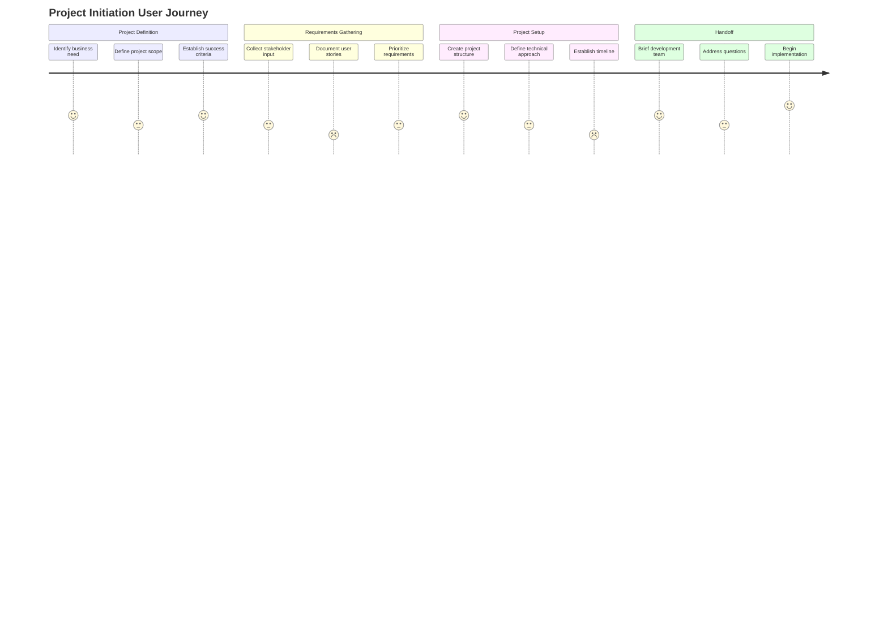
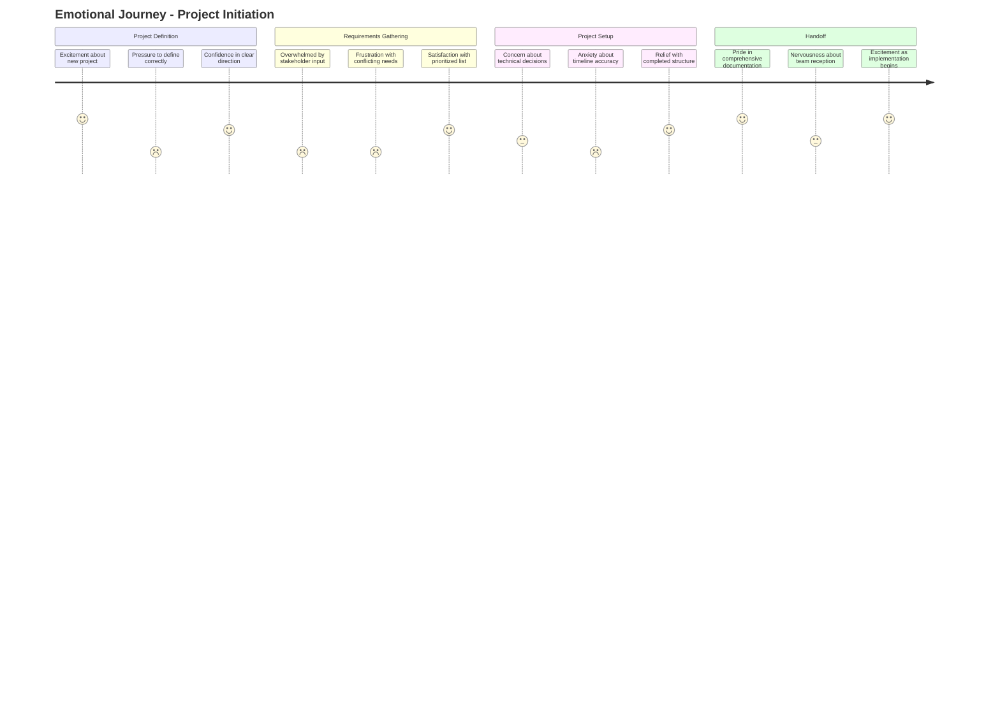

# Project Initiation Journey

This document maps the complete journey of a Product Owner initiating a new project using the BMAD Method.

## Persona Profile: Product Owner

**Name**: Patricia (Product Owner)  
**Role**: Product Owner / Product Manager  
**Experience**: 5+ years in product management  
**Goals**:
- Define clear project scope and requirements
- Create comprehensive project documentation
- Set up project structure for team success
- Establish measurable success criteria

**Pain Points**:
- Balancing detail with time constraints
- Communicating technical requirements clearly
- Ensuring alignment between business and technical teams
- Managing stakeholder expectations

## Journey Map

## Detailed Journey Stages

### 1. Project Definition Phase

#### Entry Point
- Business request for new feature/product
- Market opportunity identification
- Technical debt or system improvement need

#### Key Touchpoints
- **Project Brief Template**: Initial documentation structure
- **BMAD PO Persona**: Guidance on project definition
- **Success Criteria Framework**: Establishing measurable outcomes

#### Decision Points
- ⭐ **Project Scope Definition**: Determining boundaries and MVP
  - **Solution**: Scope definition template with examples
  - **Success Metric**: 90% of projects stay within initial scope

#### Pain Points
- 🔴 **Ambiguous Business Requirements**: Unclear objectives from stakeholders
  - **Solution**: Requirement clarification prompts and templates
  - **Success Metric**: Reduction in scope changes after initiation
- 🔴 **Success Criteria Formulation**: Difficulty defining measurable outcomes
  - **Solution**: SMART goal templates with industry-specific examples
  - **Success Metric**: 100% of projects have quantifiable success metrics

### 2. Requirements Gathering Phase

#### Key Touchpoints
- **Stakeholder Interview Guide**: Structured approach to gathering input
- **User Story Template**: Standardized format for requirements
- **Prioritization Framework**: Method for ranking requirements

#### Decision Points
- ⭐ **MVP Feature Selection**: Determining core vs. nice-to-have features
  - **Solution**: Value/effort prioritization matrix
  - **Success Metric**: MVP delivery time reduced by 30%

#### Pain Points
- 🔴 **Stakeholder Alignment**: Conflicting priorities from different departments
  - **Solution**: Stakeholder alignment workshop templates
  - **Success Metric**: Stakeholder consensus achieved before development starts
- 🔴 **Technical Feasibility**: Uncertainty about implementation possibilities
  - **Solution**: Early architect consultation workflow
  - **Success Metric**: Technical roadblocks identified before development

### 3. Project Setup Phase

#### Key Touchpoints
- **Project Structure Template**: Standardized project organization
- **Technical Approach Document**: Architecture and technology decisions
- **Timeline Generator**: Realistic schedule creation

#### Decision Points
- ⭐ **Technology Stack Selection**: Choosing appropriate technologies
  - **Solution**: Technology comparison framework with recommendations
  - **Success Metric**: 95% of projects use recommended technology patterns

#### Pain Points
- 🔴 **Timeline Estimation**: Difficulty predicting development time
  - **Solution**: Historical data-based estimation templates
  - **Success Metric**: Delivery estimates within 20% of actual time
- 🔴 **Resource Allocation**: Uncertainty about required team composition
  - **Solution**: Skill matrix and resource planning tools
  - **Success Metric**: Reduced mid-project resource adjustments

### 4. Handoff Phase

#### Key Touchpoints
- **Development Brief Template**: Comprehensive handoff documentation
- **Q&A Session Structure**: Framework for addressing team questions
- **Implementation Kickoff**: Structured start to development

#### Decision Points
- ⭐ **Development Approach**: Waterfall vs. agile implementation
  - **Solution**: Development methodology decision tree
  - **Success Metric**: 100% team alignment on approach before starting

#### Pain Points
- 🔴 **Knowledge Transfer**: Ensuring complete understanding by development team
  - **Solution**: Knowledge transfer checklist and verification
  - **Success Metric**: Zero "requirements clarification" delays
- 🔴 **Maintaining Involvement**: Balancing oversight without micromanagement
  - **Solution**: RACI matrix for ongoing product owner involvement
  - **Success Metric**: Weekly touchpoints established for all projects

## Emotional Journey

## Success Metrics

| Metric | Target | Measurement Method |
|--------|--------|-------------------|
| Time to Project Definition | < 3 days | Project timeline tracking |
| Requirement Clarity Score | > 4.5/5 | Development team survey |
| Scope Change Requests | < 15% | Change request tracking |
| Handoff Completeness | 100% checklist completion | Handoff verification |
| Development Start Delay | < 1 day after handoff | Project timeline analysis |

## Journey Optimization Opportunities

1. **Automated Stakeholder Input**: Streamline gathering and consolidating feedback
2. **AI-Enhanced Requirement Writing**: Improve clarity and testability of requirements
3. **Predictive Timeline Generation**: Use historical data to improve estimates
4. **Interactive Project Visualization**: Better communicate project structure to stakeholders
5. **Continuous Feedback Loop**: Establish mechanisms for ongoing refinement

## Next Steps in User Journey

After completing the project initiation journey, Product Owners typically proceed to:

1. [Sprint Planning Journey](sprint-planning.md) - Organizing work into manageable increments
2. [Feature Prioritization Journey](feature-prioritization.md) - Ongoing backlog management
3. [Stakeholder Communication Journey](stakeholder-communication.md) - Regular updates and expectation management

---

*The project initiation journey establishes the foundation for project success and sets expectations for all participants.*
